## 第1章 java 介绍

### 1.1 基本信息

大小写敏感：Java 是大小写敏感的，这就意味着标识符 Hello 与 hello 是不同的。

类名：对于所有的类来说，类名的首字母应该大写。如果类名由若干单词组成，那么每个单词的首字母应该大写，例如 MyFirstJavaClass 。

方法名：所有的方法名都应该以小写字母开头。如果方法名含有若干单词，则后面的每个单词首字母大写。

源文件名：源文件名必须和类名相同。当保存文件的时候，你应该使用类名作为文件名保存（切记 Java 是大小写敏感的），文件名的后缀为 .java。（如果文件名和类名不相同则会导致编译错误）。

主方法入口：所有的 Java 程序由 public static void main(String[] args) 方法开始执行。

### 1.2 标识符

所有的标识符都应该以字母（A-Z 或者 a-z）,美元符（$）、或者下划线（_）开始

首字符之后可以是字母（A-Z 或者 a-z）,美元符（$）、下划线（_）或数字的任何字符组合

关键字不能用作标识符

标识符是大小写敏感的

合法标识符举例：age、$salary、_value、__1_value

非法标识符举例：123abc、-salary

### 1.3 修饰符

访问控制修饰符 : default, public , protected, private

非访问控制修饰符 : final, abstract, static, synchronized

### 1.4 变量

局部变量

类变量（静态变量）

成员变量（非静态变量）

### 1.5 数组

数组是储存在堆上的对象，可以保存多个同类型变量。在后面的章节中，我们将会学到如何声明、构造以及初始化一个数组。

### 1.6 枚举

Java 5.0引入了枚举，枚举限制变量只能是预先设定好的值。使用枚举可以减少代码中的 bug。

### 1.7 关键字

访问控制

- private	私有的
- protected	受保护的
- public	公共的
- default	默认

类、方法和变量修饰符

- nabstract	声明抽象
- nclass	类
- nextends	扩充,继承
- nfinal	最终值,不可改变的
- nimplements	实现（接口）
- ninterface	接口
- nnative	本地，原生方法（非 Java 实现）
- new	创建
- nstatic	静态
- nstrictfp	严格,精准
- nsynchronized	线程,同步
- ntransient	短暂
- nvolatile	易失

程序控制语句

- break	跳出循环
- case	定义一个值以供 switch 选择
- continue	继续
- default	默认
- do	运行
- else	否则
- for	循环
- if	如果
- instanceof	实例
- return	返回
- switch	根据值选择执行
- while	循环

错误处理

- assert	断言表达式是否为真
- catch	捕捉异常
- finally	有没有异常都执行
- throw	抛出一个异常对象
- throws	声明一个异常可能被抛出
- try	捕获异常

包相关

- import	引入
- package	包

基本类型

- boolean	布尔型
- byte	字节型
- char	字符型
- double	双精度浮点
- float	单精度浮点
- int	整型
- long	长整型
- short	短整型

变量引用	-

- super	父类,超类
- this	本类
- void	无返回值

保留关键字-

- goto	是关键字，但不能使用
- const	是关键字，但不能使用

### 1.8 注释

单行注释  
`// 这是单行注释的示例`

多行注释  
`/* 多行注释的示例 */`

### 1.9 继承

在 Java 中，一个类可以由其他类派生。

利用继承的方法，可以重用已存在类的方法和属性，而不用重写这些代码。

被继承的类称为超类（super class），派生类称为子类（subclass）。

### 1.10 接口

在 Java 中，接口可理解为对象间相互通信的协议。接口在继承中扮演着很重要的角色。

接口只定义派生要用到的方法，但是方法的具体实现完全取决于派生类。


## 第2章 数据类型

### 2.1 内置数据类型

Java语言提供了八种基本类型。六种数字类型（四个整数型，两个浮点型），一种字符类型，还有一种布尔型。

#### (1) byte

byte 数据类型是8位、有符号的，以二进制补码表示的整数；

最小值是 -128（-2^7）；

最大值是 127（2^7-1）；

默认值是 0；

byte 类型用在大型数组中节约空间，主要代替整数，因为 byte 变量占用的空间只有 int 类型的四分之一；

例子：byte a = 100，byte b = -50。

#### (2) short

short 数据类型是 16 位、有符号的以二进制补码表示的整数

最小值是 -32768（-2^15）；

最大值是 32767（2^15 - 1）；

Short 数据类型也可以像 byte 那样节省空间。一个short变量是int型变量所占空间的二分之一；

默认值是 0；

例子：short s = 1000，short r = -20000。

#### (3) int

int 数据类型是32位、有符号的以二进制补码表示的整数；

最小值是 -2,147,483,648（-2^31）；

最大值是 2,147,483,647（2^31 - 1）；

一般地整型变量默认为 int 类型；

默认值是 0 ；

例子：int a = 100000, int b = -200000。


#### (4) long

long 数据类型是 64 位、有符号的以二进制补码表示的整数；

最小值是 -9,223,372,036,854,775,808（-2^63）；
最
大值是 9,223,372,036,854,775,807（2^63 -1）；

这种类型主要使用在需要比较大整数的系统上；

默认值是 0L；

例子： long a = 100000L，Long b = -200000L。

"L"理论上不分大小写，但是若写成"l"容易与数字"1"混淆，不容易分辩。所以最好大写。


#### (5) float

float 数据类型是单精度、32位、符合IEEE 754标准的浮点数；

float 在储存大型浮点数组的时候可节省内存空间；

默认值是 0.0f；

浮点数不能用来表示精确的值，如货币；

例子：float f1 = 234.5f。

#### (6) double

double 数据类型是双精度、64 位、符合 IEEE 754 标准的浮点数；

浮点数的默认类型为 double 类型；
d
ouble类型同样不能表示精确的值，如货币；

默认值是 0.0d；

例子： double   d1  = 7D ;


#### (7) boolean

boolean数据类型表示一位的信息；

只有两个取值：true 和 false；

默认值是 false；

例子：boolean one = true。


#### (8) char

char 类型是一个单一的 16 位 Unicode 字符；

最小值是 \u0000（十进制等效值为 0）；

最大值是 \uffff（即为 65535）；

char 数据类型可以储存任何字符；

例子：char letter = 'A';。


### 2.2 引用类型

在Java中，引用类型的变量非常类似于C/C++的指针。引用类型指向一个对象，指向对象的变量是引用变量。这些变量在声明时被指定为一个特定的类型，比如 Employee、Puppy 等。变量一旦声明后，类型就不能被改变了。

对象、数组都是引用数据类型。

所有引用类型的默认值都是null。

一个引用变量可以用来引用任何与之兼容的类型。

例子：Site site = new Site("Runoob")。


### 2.3 常量

常量在程序运行时是不能被修改的。

在 Java 中使用 final 关键字来修饰常量，声明方式和变量类似：

final double PI = 3.1415927;


### 2.4 类型转换

#### 2.4.1 自动类型转换

必须满足转换前的数据类型的位数要低于转换后的数据类型，例如: short数据类型的位数为16位，就可以自动转换位数为32的int类型，同样float数据类型的位数为32，可以自动转换为64位的double类型。


#### 2.4.2 强制类型转换

1. 条件是转换的数据类型必须是兼容的。

2. 格式：(type)value type是要强制类型转换后的数据类型 实例：

int a = 123;

byte b = (byte)a


### 2.5 变量类型

#### 2.5.1 类变量（静态变量）

类变量也称为静态变量，在类中以 static 关键字声明，但必须在方法之外。

无论一个类创建了多少个对象，类只拥有类变量的一份拷贝。

静态变量除了被声明为常量外很少使用，静态变量是指声明为 public/private，final 和 static 类型的变量。

静态变量初始化后不可改变。

静态变量储存在静态存储区。经常被声明为常量，很少单独使用 static 声明变量。

静态变量在第一次被访问时创建，在程序结束时销毁。

与实例变量具有相似的可见性。但为了对类的使用者可见，大多数静态变量声明为 public 类型 。

默认值和实例变量相似。数值型变量默认值是 0，布尔型默认值是 false，引用类型默认值是 null。

变量的值可以在声明的时候指定，也可以在构造方法中指定。此外，静态变量还可以在静态语句块中初始化。

静态变量可以通过：ClassName.VariableName的方式访问。

类变量被声明为 public static final 类型时，类变量名称一般建议使用大写字母。

如果静态变量不是 public 和 final 类型，其命名方式与实例变量以及局部变量的命名方式一致。


#### 2.5.2 实例变量

实例变量声明在一个类中，但在方法、构造方法和语句块之外；

当一个对象被实例化之后，每个实例变量的值就跟着确定；

实例变量在对象创建的时候创建，在对象被销毁的时候销毁；

实例变量的值应该至少被一个方法、构造方法或者语句块引用，使得外部能够通过这些方式获取实例变量信息；

实例变量可以声明在使用前或者使用后；

访问修饰符可以修饰实例变量；

实例变量对于类中的方法、构造方法或者语句块是可见的。一般情况下应该把实例变量设为私有。通过使用访问修饰符可以使实例变量对子类可见；

实例变量具有默认值。数值型变量的默认值是0，布尔型变量的默认值是false，引用类型变量的默认值是null。

变量的值可以在声明时指定，也可以在构造方法中指定；

实例变量可以直接通过变量名访问。但在静态方法以及其他类中，就应该使用完全限定名：ObejectReference.VariableName。


#### 2.5.3 局部变量

局部变量声明在方法、构造方法或者语句块中；

局部变量在方法、构造方法、或者语句块被执行的时候创建，当它们执行完成后，变量将会被销毁；

访问修饰符不能用于局部变量；

局部变量只在声明它的方法、构造方法或者语句块中可见；

局部变量是在栈上分配的。

局部变量没有默认值，所以局部变量被声明后，必须经过初始化，才可以使用。


### 2.6 修饰符

#### 2.6.1 访问控制修饰符

Java中，可以使用访问控制符来保护对类、变量、方法和构造方法的访问。Java 支持 4 种不同的访问权限。

default (即默认，什么也不写）: 在同一包内可见，不使用任何修饰符。使用对象：类、接口、变量、方法。

private : 在同一类内可见。使用对象：变量、方法。 注意：不能修饰类（外部类）

public : 对所有类可见。使用对象：类、接口、变量、方法

protected : 对同一包内的类和所有子类可见。使用对象：变量、方法。 注意：不能修饰类（外部类）。

| 修饰符    | 当前类 | 同一包内 | 子孙类(同一包) | 子孙类(不同包) | 其他包 |
| --------- | ------ | -------- | -------------- | -------------- | ------ |
| public    | Y      | Y        | Y              | Y              | Y      |
| protected | Y      | Y        | Y              | Y/N（说明）    | N      |
| default   | Y      | Y        | Y              | N              | N      |
| private   | Y      | N        | N              | N              | N      |


请注意以下方法继承的规则：

父类中声明为 public 的方法在子类中也必须为 public。

父类中声明为 protected 的方法在子类中要么声明为 protected，要么声明为 public，不能声明为 private。

父类中声明为 private 的方法，不能够被继承。


#### 2.6.2 非访问修饰符

static 修饰符，用来修饰类方法和类变量。

final 修饰符，用来修饰类、方法和变量，final 修饰的类不能够被继承，修饰的方法不能被继承类重新定义，修饰的变量为常量，是不可修改的。

abstract 修饰符，用来创建抽象类和抽象方法。

synchronized 和 volatile 修饰符，主要用于线程的编程。


### 2.7 运算符

#### 2.7.1 算数运算符

| 操作符 | 描述                            | 例子           |
| ------ | ------------------------------- | -------------- |
| `+`    | 加法 相加运算符两侧的值         | A + B 等于 30  |
| `-`    | 减法 左操作数减去右操作数       | A – B 等于 -10 |
| `*`    | 乘法 相乘操作符两侧的值         | A * B等于200   |
| `/`    | 除法 左操作数除以右操作数       | B / A等于2     |
| `％`   | 取余 左操作数除以右操作数的余数 | B%A等于0       |
| `++`   | 自增 操作数的值增加1            | B++ 或 ++B     |
| `--`   | 自减 操作数的值减少1            | B-- 或 --B     |


#### 2.7.2 关系运算符

| 运算符 | 描述                                                         | 例子             |
| ------ | ------------------------------------------------------------ | ---------------- |
| `==`   | 检查如果两个操作数的值是否相等，如果相等则条件为真。         | （A == B）为假。 |
| `!=`   | 检查如果两个操作数的值是否相等，如果值不相等则条件为真。     | (A != B) 为真。  |
| `>`    | 检查左操作数的值是否大于右操作数的值，如果是那么条件为真。   | （A> B）为假。   |
| `<`    | 检查左操作数的值是否小于右操作数的值，如果是那么条件为真。   | （A <B）为真。   |
| `>=`   | 检查左操作数的值是否大于或等于右操作数的值，如果是那么条件为真。 | （A> = B）为假。 |
| `<=`   | 检查左操作数的值是否小于或等于右操作数的值，如果是那么条件为真。 | （A <= B）为真。 |


#### 2.7.3 位运算符

| 操作符 | 描述                                                         | 例子                             |
| ------ | ------------------------------------------------------------ | -------------------------------- |
| `＆`   | 如果相对应位都是1，则结果为1，否则为0                        | `（A＆B）`，得到12，即0000 1100  |
| `\|`   | 如果相对应位都是 0，则结果为 0，否则为 1                     | `（A \| B）`得到61，即 0011 1101 |
| `^`    | 如果相对应位值相同，则结果为0，否则为1                       | `（A ^ B）`得到49，即 0011 0001  |
| `〜`   | 按位取反运算符翻转操作数的每一位，即0变成1，1变成0。         | `（〜A）`得到-61，即1100 0011    |
| `<<`   | 按位左移运算符。左操作数按位左移右操作数指定的位数。         | `A << 2` 得到240，即 1111 0000   |
| `>>`   | 按位右移运算符。左操作数按位右移右操作数指定的位数。         | `A >> 2` 得到15即 1111           |
| `>>>`  | 按位右移补零操作符。左操作数的值按右操作数指定的位数右移，移动得到的空位以零填充。 | `A>>>2` 得到15即0000 1111        |


#### 2.7.4 逻辑运算符

| 操作符 | 描述                                                         | 例子                  |
| ------ | ------------------------------------------------------------ | --------------------- |
| `&&`   | 称为逻辑与运算符。当且仅当两个操作数都为真，条件才为真。     | `（A && B）` 为假。   |
| `\|\|` | 称为逻辑或操作符。如果任何两个操作数任何一个为真，条件为真。 | `（A \|\| B）` 为真。 |
| `！`   | 称为逻辑非运算符。用来反转操作数的逻辑状态。如果条件为true，则逻辑非运算符将得到false。 | `！（A && B）`为真。  |


#### 2.7.5 赋值运算符

| 操作符 | 描述                                                         | 例子                                          |
| ------ | ------------------------------------------------------------ | --------------------------------------------- |
| `=`    | 简单的赋值运算符，将右操作数的值赋给左侧操作数               | `C = A + B` 将把 `A + B` 得到的值赋给 `C`     |
| `+=`   | 加和赋值操作符，它把左操作数和右操作数相加赋值给左操作数     | `C + = A` 等价于`C = C + A`                   |
| `-=`   | 减和赋值操作符，它把左操作数和右操作数相减赋值给左操作数     | `C - = A` 等价于 `C = C - A`                  |
| `*=`   | 乘和赋值操作符，它把左操作数和右操作数相乘赋值给左操作数     | `C * = A` 等价于 `C = C * A`                  |
| `/=`   | 除和赋值操作符，它把左操作数和右操作数相除赋值给左操作数     | `C / = A `，C 与 A 同类型时等价于 `C = C / A` |
| `％=`  | 取模和赋值操作符，它把左操作数和右操作数取模后赋值给左操作数 | `C％= A` 等价于 `C = C％A`                    |
| `<<=`  | 左移位赋值运算符                                             | `C << = 2` 等价于 `C = C << 2`                |
| `>>=`  | 右移位赋值运算符                                             | `C >> = 2` 等价于 `C = C >> 2`                |
| `＆=`  | 按位与赋值运算符                                             | `C＆= 2` 等价于 `C = C＆2`                    |
| `^=`   | 按位异或赋值操作符                                           | `C ^ = 2 `等价于 `C = C ^ 2`                  |
| `\|=`  | 按位或赋值操作符                                             | `C \| = 2`等价于`C = C \| 2`                  |


#### 2.7.6 其他运算符

条件运算符  
variable x = (expression) `?` value if true `:` value if false


## 第3章 流程控制

### 3.1 while 循环

```java
while( 布尔表达式 ) {
  //循环内容
}
```


### 3.2 do while 循环

```java
do {
       //代码语句
}while(布尔表达式);
```


### 3.3 for循环

```java
for(初始化; 布尔表达式; 更新) {
    //代码语句
}
```


### 3.4 增强for循环

```java
for( String a : names ) {
    //代码语句
}
```


### 3.5 break 关键字

break 主要用在循环语句或者 switch 语句中，用来跳出整个语句块。

break 跳出最里层的循环，并且继续执行该循环下面的语句。


### 3.6 continue 关键字

continue 适用于任何循环控制结构中。作用是让程序立刻跳转到下一次循环的迭代。

在 for 循环中，continue 语句使程序立即跳转到更新语句。

在 while 或者 do…while 循环中，程序立即跳转到布尔表达式的判断语句。


### 3.7 if 判断

```java
if(布尔表达式 1){
   //如果布尔表达式 1的值为true执行代码
}else if(布尔表达式 2){
   //如果布尔表达式 2的值为true执行代码
}else if(布尔表达式 3){
   //如果布尔表达式 3的值为true执行代码
}else {
   //如果以上布尔表达式都不为true执行代码
}
```


### 3.8 switch 语句

```java
switch(expression){
    case value :
       //语句
       break; //可选
    case value :
       //语句
       break; //可选
    //你可以有任意数量的case语句
    default : //可选
       //语句
}
```


## 第4章 常见的类

### 4.1 Number类

在实际开发过程中，我们经常会遇到需要使用对象，而不是内置数据类型的情形。为了解决这个问题，Java 语言为每一个内置数据类型提供了对应的包装类。

| 包装类    | 基本数据类型 |
| --------- | ------------ |
| Boolean   | boolean      |
| Byte      | byte         |
| Short     | short        |
| Integer   | int          |
| Long      | long         |
| Character | char         |
| Float     | float        |
| Double    | double       |

所有的包装类都是抽象类 Number 的子类

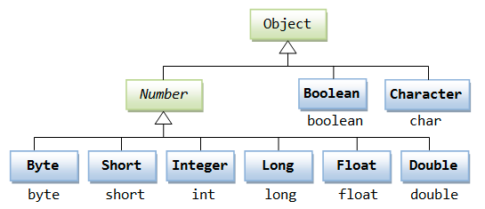


### 4.2 Math 类

Math 包含了用于执行基本数学运算的属性和方法，如初等指数、对数、平方根和三角函数。

Math 的方法都被定义为 static 形式，通过 Math 类可以在主函数中直接调用。

`Math.sin()`

求指定double类型参数的正弦值。

`Math.cos()`

求指定double类型参数的余弦值。

`Math.tan()`

求指定double类型参数的正切值。


### 4.3 Character 类

Character 类用于对单个字符进行操作。

Character 类在对象中包装一个基本类型 char 的值

| 方法           | 描述               |
| -------------- | ------------------ |
| isLetter()     | 是否是一个字母     |
| isDigit()      | 是否是一个数字字符 |
| isWhitespace() | 是否是一个空白字符 |
| isUpperCase()  | 是否是大写字母     |
| isLowerCase()  | 是否是小写字母     |
| toUpperCase()  | 指定字母的大写形式 |
| toLowerCase()  | 指定字母的小写形式 |


### 4.4 String 类

字符串广泛应用 在 Java 编程中，在 Java 中字符串属于对象，Java 提供了 String 类来创建和操作字符串。

| 方法                         | 描述                                                         | 返回值   |
| ---------------------------- | ------------------------------------------------------------ | -------- |
| charAt(int index)            | 返回指定索引处的 char 值。                                   | char     |
| compareTo(Object o)          | 把这个字符串和另一个对象比较。                               | int      |
| concat(String str)           | 将指定字符串连接到此字符串的结尾。                           | String   |
| length()                     | 返回此字符串的长度。                                         | int      |
| split(String regex)          | 根据给定正则表达式的匹配拆分此字符串。                       | String[] |
| toLowerCase()                | 使用默认语言环境的规则将此 String 中的所有字符都转换为小写。 | String   |
| toString()                   | 返回此对象本身（它已经是一个字符串！）。                     | String   |
| toUpperCase()                | 使用默认语言环境的规则将此 String 中的所有字符都转换为大写。 | String   |
| trim()                       | 返回字符串的副本，忽略前导空白和尾部空白。                   | String   |
| contains(CharSequence chars) | 判断是否包含指定的字符系列。                                 | boolean  |
| isEmpty()                    | 判断字符串是否为空。                                         | boolean  |


### 4.5 StringBuffer

当对字符串进行修改的时候，需要使用 StringBuffer 和 StringBuilder 类。

和 String 类不同的是，StringBuffer 和 StringBuilder 类的对象能够被多次的修改，并且不产生新的未使用对象。

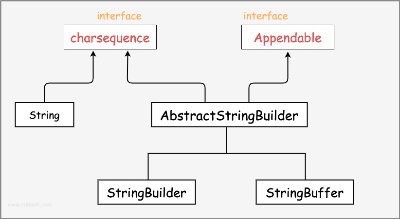


在使用 StringBuffer 类时，每次都会对 StringBuffer 对象本身进行操作，而不是生成新的对象，所以如果需要对字符串进行修改推荐使用 StringBuffer。

StringBuilder 类在 Java 5 中被提出，它和 StringBuffer 之间的最大不同在于 StringBuilder 的方法不是线程安全的（不能同步访问）。

由于 StringBuilder 相较于 StringBuffer 有速度优势，所以多数情况下建议使用 StringBuilder 类。

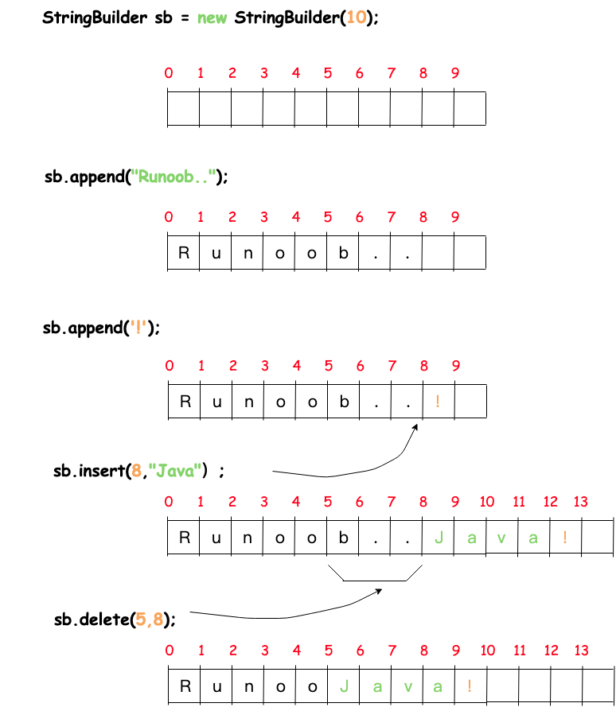


```java
public class RunoobTest{
    public static void main(String args[]){
        StringBuilder sb = new StringBuilder(10);
        sb.append("Runoob..");
        System.out.println(sb);  
        sb.append("!");
        System.out.println(sb); 
        sb.insert(8, "Java");
        System.out.println(sb); 
        sb.delete(5,8);
        System.out.println(sb);  
    }
}
```

然而在应用程序要求线程安全的情况下，则必须使用 StringBuffer 类。

```java
public class Test{
  public static void main(String args[]){
    StringBuffer sBuffer = new StringBuffer("菜鸟教程官网：");
    sBuffer.append("www");
    sBuffer.append(".runoob");
    sBuffer.append(".com");
    System.out.println(sBuffer);  
  }
}
```


### 4.6 数组

#### 4.6.1 创建数组

`double[] myList = {1.9, 2.9, 3.4, 3.5};`


#### 4.6.2 forEach 循环

```java
for (double e: myList) {
    System.out.println(element);
}
```


#### 4.6.3 多维数组

`String[][] str = new String[3][4];`


### 4.7 日期类

#### 4.7.1 Date类

java.util 包提供了 Date 类来封装当前的日期和时间。 Date 类提供两个构造函数来实例化 Date 对象。

第一个构造函数使用当前日期和时间来初始化对象。

`Date date = new Date();`

日期格式化

`SimpleDateFormat ft = new SimpleDateFormat ("yyyy-MM-dd hh:mm:ss");`

`System.out.println("当前时间为: " + ft.format(dNow));`


#### 4.7.2 Calendar类

```java
Calendar c1 = Calendar.getInstance();
// 获得年份
int year = c1.get(Calendar.YEAR);
// 获得月份
int month = c1.get(Calendar.MONTH) + 1;
// 获得日期
int date = c1.get(Calendar.DATE);
// 获得小时
int hour = c1.get(Calendar.HOUR_OF_DAY);
// 获得分钟
int minute = c1.get(Calendar.MINUTE);
// 获得秒
int second = c1.get(Calendar.SECOND);
// 获得星期几（注意（这个与Date类是不同的）：1代表星期日、2代表星期1、3代表星期二，以此类推）
int day = c1.get(Calendar.DAY_OF_WEEK);
```


### 4.8 正则

正则表达式定义了字符串的模式。

正则表达式可以用来搜索、编辑或处理文本。

正则表达式并不仅限于某一种语言，但是在每种语言中有细微的差别。


### 4.9 Scanner类

```java
import java.util.Scanner;
 
public class ScannerDemo {
    public static void main(String[] args) {
        Scanner scan = new Scanner(System.in);
        // 从键盘接收数据
 
        // nextLine方式接收字符串
        System.out.println("nextLine方式接收：");
        // 判断是否还有输入
        if (scan.hasNextLine()) {
            String str2 = scan.nextLine();
            System.out.println("输入的数据为：" + str2);
        }
        scan.close();
    }
}
```


### 4.10 File 类

#### 4.10.1 读取目录

`String dirname = "/tmp";`

`File f1 = new File(dirname);`


#### 4.10.2 删除目录

`File folder = new File("/tmp/java/");`

`deleteFolder(folder);`


#### 4.10.3 删除目录和文件

```java
public static void deleteFolder(File folder) {
        File[] files = folder.listFiles();
        if (files != null) {
            for (File f : files) {
                if (f.isDirectory()) {
                    deleteFolder(f);
                } else {
                    f.delete();
                }
            }
        }
        folder.delete();
    }
```


#### 4.10.4 文件读写流

```java
//文件名 :fileStreamTest2.java
import java.io.*;
 
public class fileStreamTest2 {
    public static void main(String[] args) throws IOException {
 
        File f = new File("a.txt");
        FileOutputStream fop = new FileOutputStream(f);
        // 构建FileOutputStream对象,文件不存在会自动新建
 
        OutputStreamWriter writer = new OutputStreamWriter(fop, "UTF-8");
        // 构建OutputStreamWriter对象,参数可以指定编码,默认为操作系统默认编码,windows上是gbk
 
        writer.append("中文输入");
        // 写入到缓冲区
 
        writer.append("\r\n");
        // 换行
 
        writer.append("English");
        // 刷新缓存冲,写入到文件,如果下面已经没有写入的内容了,直接close也会写入
 
        writer.close();
        // 关闭写入流,同时会把缓冲区内容写入文件,所以上面的注释掉
 
        fop.close();
        // 关闭输出流,释放系统资源
 
        FileInputStream fip = new FileInputStream(f);
        // 构建FileInputStream对象
 
        InputStreamReader reader = new InputStreamReader(fip, "UTF-8");
        // 构建InputStreamReader对象,编码与写入相同
 
        StringBuffer sb = new StringBuffer();
        while (reader.ready()) {
            sb.append((char) reader.read());
            // 转成char加到StringBuffer对象中
        }
        System.out.println(sb.toString());
        reader.close();
        // 关闭读取流
 
        fip.close();
        // 关闭输入流,释放系统资源
 
    }
}
```


## 第5章 面向对象

### 5.1 对象和类

对象：对象是类的一个实例（对象不是找个女朋友），有状态和行为。

类：类是一个模板，它描述一类对象的行为和状态。

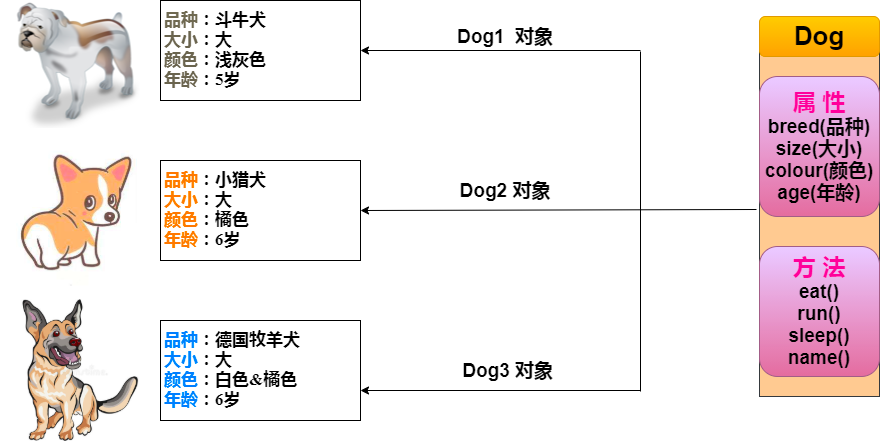

```java
public class Dog {
    String breed;
    int size;
    String colour;
    int age;
 
    void eat() {
    }
 
    void run() {
    }
 
    void sleep(){
    }
    
    void name(){
    }
    
     public Dog(){
    }
 
    public Dog(String name){
        // 这个构造器仅有一个参数：name
    }
}
```


### 5.2 方法

Java方法是语句的集合，它们在一起执行一个功能。

提高了代码的重用性。

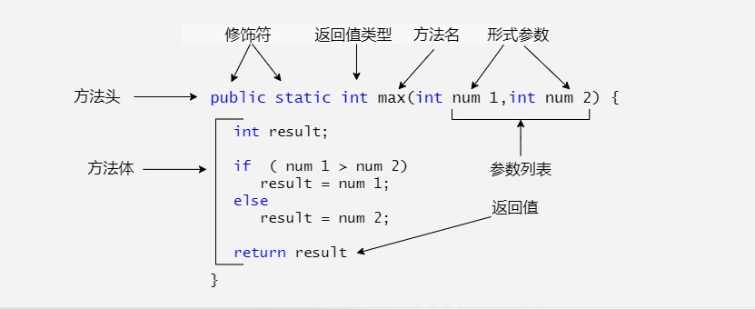

```java
public static void swap(int n1, int n2) {
    int temp = n1;
    n1 = n2;
    n2 = temp;
  }
```


### 5.3 继承

#### 5.3.1 继承的概念

继承是java面向对象编程技术的一块基石，因为它允许创建分等级层次的类。

继承就是子类继承父类的特征和行为，使得子类对象（实例）具有父类的实例域和方法，或子类从父类继承方法，使得子类具有父类相同的行为。

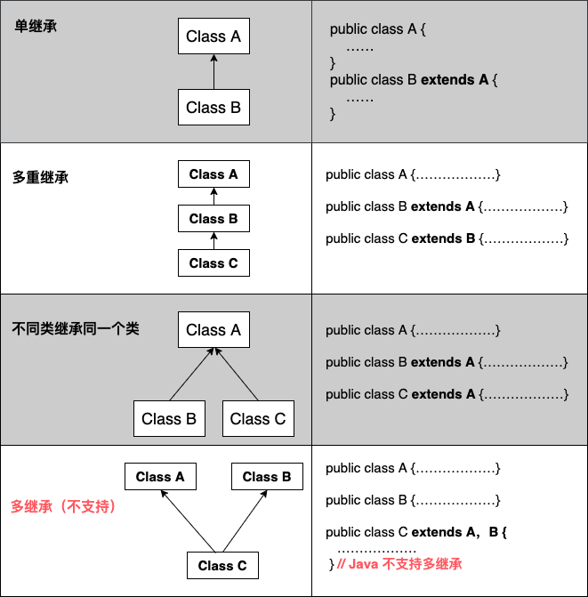

#### 5.3.2 继承的特性

子类拥有父类非 private 的属性、方法。

子类可以拥有自己的属性和方法，即子类可以对父类进行扩展。

子类可以用自己的方式实现父类的方法。

Java 的继承是单继承，但是可以多重继承，单继承就是一个子类只能继承一个父类，多重继承就是，例如 B 类继承 A 类，C 类继承 B 类，所以按照关系就是 B 类是 C 类的父类，A 类是 B 类的父类，这是 Java 继承区别于 C++ 继承的一个特性。

提高了类之间的耦合性（继承的缺点，耦合度高就会造成代码之间的联系越紧密，代码独立性越差）。

#### 5.3.3 super 与 this 关键字

`super` 关键字：我们可以通过super关键字来实现对父类成员的访问，用来引用当前对象的父类。

`this` 关键字：指向自己的引用。

#### 5.3.4 final关键字

inal 关键字声明类可以把类定义为不能继承的，即最终类；或者用于修饰方法，该方法不能被子类重写

`final class 类名 {//类体}`

#### 5.3.5 构造器

子类是不继承父类的构造器（构造方法或者构造函数）的，它只是调用（隐式或显式）。如果父类的构造器带有参数，则必须在子类的构造器中显式地通过 super 关键字调用父类的构造器并配以适当的参数列表。

如果父类构造器没有参数，则在子类的构造器中不需要使用 super 关键字调用父类构造器，系统会自动调用父类的无参构造器。


### 5.4 重写与重载

#### 5.4.1 方法的重写规则

参数列表与被重写方法的参数列表必须完全相同。

返回类型与被重写方法的返回类型可以不相同，但是必须是父类返回值的派生类（java5 及更早版本返回类型要一样，java7 及更高版本可以不同）。

访问权限不能比父类中被重写的方法的访问权限更低。例如：如果父类的一个方法被声明为 public，那么在子类中重写该方法就不能声明为 protected。

父类的成员方法只能被它的子类重写。

声明为 final 的方法不能被重写。

声明为 static 的方法不能被重写，但是能够被再次声明。

子类和父类在同一个包中，那么子类可以重写父类所有方法，除了声明为 private 和 final 的方法。

子类和父类不在同一个包中，那么子类只能够重写父类的声明为 public 和 protected 的非 final 方法。

重写的方法能够抛出任何非强制异常，无论被重写的方法是否抛出异常。但是，重写的方法不能抛出新的强制性异常，或者比被重写方法声明的更广泛的强制性异常，反之则可以。

构造方法不能被重写。

如果不能继承一个类，则不能重写该类的方法。

```java
class Animal{
   public void move(){
      System.out.println("动物可以移动");
   }
}
 
class Dog extends Animal{
   public void move(){
      System.out.println("狗可以跑和走");
   }
   public void bark(){
      System.out.println("狗可以吠叫");
   }
}
 
public class TestDog{
   public static void main(String args[]){
      Animal a = new Animal(); // Animal 对象
      Animal b = new Dog(); // Dog 对象
 
      a.move();// 执行 Animal 类的方法
      b.move();//执行 Dog 类的方法
      b.bark(); //报错, 父类没有bark方法
   }
}
```


#### 5.4.2 Super

当需要在子类中调用父类的被重写方法时，要使用 super 关键字。

```java
class Animal{
   public void move(){
      System.out.println("动物可以移动");
   }
}
 
class Dog extends Animal{
   public void move(){
      super.move(); // 应用super类的方法
      System.out.println("狗可以跑和走");
   }
}
 
public class TestDog{
   public static void main(String args[]){
 
      Animal b = new Dog(); // Dog 对象
      b.move(); //执行 Dog类的方法
 
   }
}
```


#### 5.4.3 重载

重载(overloading) 是在一个类里面，方法名字相同，而参数不同。返回类型可以相同也可以不同。

每个重载的方法（或者构造函数）都必须有一个独一无二的参数类型列表。

最常用的地方就是构造器的重载。

```java
public class Overloading {
    public int test(){
        System.out.println("test1");
        return 1;
    }
 
    public void test(int a){
        System.out.println("test2");
    }   
 
    //以下两个参数类型顺序不同
    public String test(int a,String s){
        System.out.println("test3");
        return "returntest3";
    }   
 
    public String test(String s,int a){
        System.out.println("test4");
        return "returntest4";
    }   
 
    public static void main(String[] args){
        Overloading o = new Overloading();
        System.out.println(o.test());
        o.test(1);
        System.out.println(o.test(1,"test3"));
        System.out.println(o.test("test4",1));
    }
}
```


#### 5.4.4 重载的规则

被重载的方法必须改变参数列表(参数个数或类型不一样)；

被重载的方法可以改变返回类型；

被重载的方法可以改变访问修饰符；

被重载的方法可以声明新的或更广的检查异常；

方法能够在同一个类中或者在一个子类中被重载。

无法以返回值类型作为重载函数的区分标准。


#### 5.4.5 重写与重载之间的区别

| 区别点   | 重载方法 | 重写方法                                       |
| -------- | -------- | ---------------------------------------------- |
| 参数列表 | 必须修改 | 一定不能修改                                   |
| 返回类型 | 可以修改 | 一定不能修改                                   |
| 异常     | 可以修改 | 可以减少或删除，一定不能抛出新的或者更广的异常 |
| 访问     | 可以修改 | 一定不能做更严格的限制（可以降低限制）         |


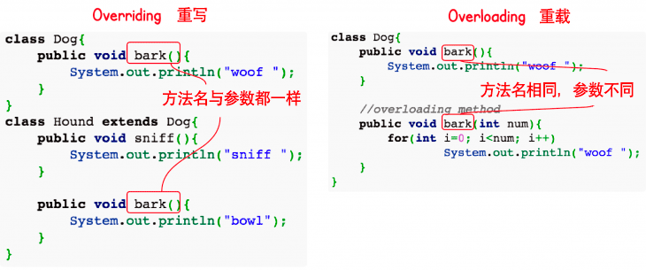


### 5.5 多态

#### 5.5.1 多态介绍

多态是同一个行为具有多个不同表现形式或形态的能力。

多态就是同一个接口，使用不同的实例而执行不同操作。

#### 5.5.2 多态的优点

- 消除类型之间的耦合关系
- 可替换性
- 可扩充性
- 接口性
- 灵活性
- 简化性


#### 5.5.3 多态存在的三个必要条件

- 继承
- 重写
- 父类引用指向子类对象：Parent p = new Child();

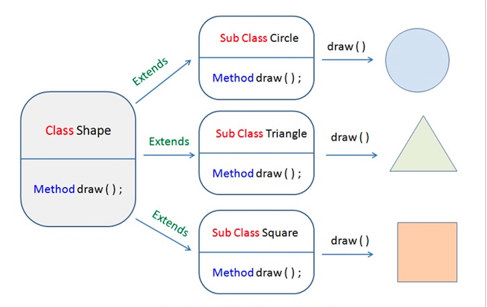

```java
class Shape {
    void draw() {}
}
 
class Circle extends Shape {
    void draw() {
        System.out.println("Circle.draw()");
    }
}
 
class Square extends Shape {
    void draw() {
        System.out.println("Square.draw()");
    }
}
 
class Triangle extends Shape {
    void draw() {
        System.out.println("Triangle.draw()");
    }
}
```


### 5.6 抽象类

在面向对象的概念中，所有的对象都是通过类来描绘的，但是反过来，并不是所有的类都是用来描绘对象的，如果一个类中没有包含足够的信息来描绘一个具体的对象，这样的类就是抽象类。

抽象类除了不能实例化对象之外，类的其它功能依然存在，成员变量、成员方法和构造方法的访问方式和普通类一样。

由于抽象类不能实例化对象，所以抽象类必须被继承，才能被使用。也是因为这个原因，通常在设计阶段决定要不要设计抽象类。

父类包含了子类集合的常见的方法，但是由于父类本身是抽象的，所以不能使用这些方法。

在 Java 中抽象类表示的是一种继承关系，一个类只能继承一个抽象类，而一个类却可以实现多个接口。

`public abstract class Employee {
// pass
}`


### 5.7 封装

在面向对象程式设计方法中，封装（英语：Encapsulation）是指一种将抽象性函式接口的实现细节部分包装、隐藏起来的方法。

封装可以被认为是一个保护屏障，防止该类的代码和数据被外部类定义的代码随机访问。

要访问该类的代码和数据，必须通过严格的接口控制。

封装最主要的功能在于我们能修改自己的实现代码，而不用修改那些调用我们代码的程序片段。

适当的封装可以让程式码更容易理解与维护，也加强了程式码的安全性。

```java
public class EncapTest{
 
   private String name;
 
   private int age;
 
   public int getAge(){
      return age;
   }
 
   public void setAge( int newAge){
      age = newAge;
   }
 
   public void setName(String newName){
      name = newName;
   }
 
   public void setIdNum( String newId){
      idNum = newId;
   }
}
```


### 5.8 接口

#### 5.8.1 接口的介绍

接口（英文：Interface），在JAVA编程语言中是一个抽象类型，是抽象方法的集合，接口通常以interface来声明。一个类通过继承接口的方式，从而来继承接口的抽象方法。

接口并不是类，编写接口的方式和类很相似，但是它们属于不同的概念。类描述对象的属性和方法。接口则包含类要实现的方法。

除非实现接口的类是抽象类，否则该类要定义接口中的所有方法。

接口无法被实例化，但是可以被实现。一个实现接口的类，必须实现接口内所描述的所有方法，否则就必须声明为抽象类。另外，在 Java 中，接口类型可用来声明一个变量，他们可以成为一个空指针，或是被绑定在一个以此接口实现的对象。


#### 5.8.2 接口与类区别

接口不能用于实例化对象。

接口没有构造方法。

接口中所有的方法必须是抽象方法，Java 8 之后 接口中可以使用 default 关键字修饰的非抽象方法。

接口不能包含成员变量，除了 static 和 final 变量。

接口不是被类继承了，而是要被类实现。

接口支持多继承。


#### 5.8.3 接口与抽象类区别

- 抽象类中的方法可以有方法体，就是能实现方法的具体功能，但是接口中的方法不行。
- 抽象类中的成员变量可以是各种类型的，而接口中的成员变量只能是 public static final 类型的。
- 接口中不能含有静态代码块以及静态方法(用 static 修饰的方法)，而抽象类是可以有静态代码块和静态方法。
- 一个类只能继承一个抽象类，而一个类却可以实现多个接口。


```java
public interface NameOfInterface
{
   //任何类型 final, static 字段
   //抽象方法
}
```


#### 5.8.4 接口特性

接口中每一个方法也是隐式抽象的,接口中的方法会被隐式的指定为 public abstract（只能是 public abstract，其他修饰符都会报错）。

接口中可以含有变量，但是接口中的变量会被隐式的指定为 public static final 变量（并且只能是 public，用 private 修饰会报编译错误）。

接口中的方法是不能在接口中实现的，只能由实现接口的类来实现接口中的方法。


注：JDK 1.8 以后，接口里可以有静态方法和方法体了。

注：JDK 1.8 以后，接口允许包含具体实现的方法，该方法称为"默认方法"，默认方法使用 default 关键字修饰。更多内容可参考 Java 8 默认方法。

注：JDK 1.9 以后，允许将方法定义为 private，使得某些复用的代码不会把方法暴露出去。更多内容可参考 Java 9 私有接口方法。


### 5.9 枚举

Java 枚举是一个特殊的类，一般表示一组常量，比如一年的 4 个季节，一个年的 12 个月份，一个星期的 7 天，方向有东南西北等。

Java 枚举类使用 enum 关键字来定义，各个常量使用逗号 , 来分割。

例如定义一个颜色的枚举类。

```java
enum Color
{
    RED, GREEN, BLUE;
}
 
public class Test
{
    // 执行输出结果
    public static void main(String[] args)
    {
        Color c1 = Color.RED;
        System.out.println(c1);
    }
}
```


### 5.10 package 包

为了更好地组织类，Java 提供了包机制，用于区别类名的命名空间。

1、把功能相似或相关的类或接口组织在同一个包中，方便类的查找和使用。

2、如同文件夹一样，包也采用了树形目录的存储方式。同一个包中的类名字是不同的，不同的包中的类的名字是可以相同的，当同时调用两个不同包中相同类名的类时，应该加上包名加以区别。因此，包可以避免名字冲突。

3、包也限定了访问权限，拥有包访问权限的类才能访问某个包中的类。


### 5.11 异常处理

#### 5.11.1 异常的简介

异常是程序中的一些错误，但并不是所有的错误都是异常，并且错误有时候是可以避免的。

比如说，你的代码少了一个分号，那么运行出来结果是提示是错误 java.lang.Error；如果你用System.out.println(11/0)，那么你是因为你用0做了除数，会抛出 java.lang.ArithmeticException 的异常。

#### 5.11.2 异常的原因

异常发生的原因有很多，通常包含以下几大类：

- 用户输入了非法数据。
- 要打开的文件不存在。
- 网络通信时连接中断，或者JVM内存溢出。

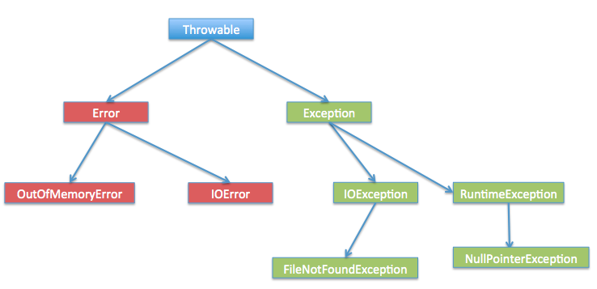

#### 5.11.3 异常的层次

- 检查性异常：最具代表的检查性异常是用户错误或问题引起的异常，这是程序员无法预见的。例如要打开一个不存在文件时，一个异常就发生了，这些异常在编译时不能被简单地忽略。
- 运行时异常： 运行时异常是可能被程序员避免的异常。与检查性异常相反，运行时异常可以在编译时被忽略。
- 错误： 错误不是异常，而是脱离程序员控制的问题。错误在代码中通常被忽略。例如，当栈溢出时，一个错误就发生了，它们在编译也检查不到的。

#### 5.11.4 try catch 捕获异常

```java
try{
  // 程序代码
}catch(异常类型1 异常的变量名1){
  // 程序代码
}catch(异常类型2 异常的变量名2){
  // 程序代码
}finally{
  // 程序代码
}
```


#### 5.11.5 throws 抛出异常

如果一个方法没有捕获到一个检查性异常，那么该方法必须使用 throws 关键字来声明。throws 关键字放在方法签名的尾部。

也可以使用 throw 关键字抛出一个异常，无论它是新实例化的还是刚捕获到的。

```java
import java.io.*;
public class className
{
   public void withdraw(double amount) throws RemoteException,
                              InsufficientFundsException
   {
       // Method implementation
   }
   //Remainder of class definition
}
```


## 第6章 数据结构

### 6.1 数据结构简介

#### 6.1.1 枚举（Enumeration）

枚举（Enumeration）接口虽然它本身不属于数据结构,但它在其他数据结构的范畴里应用很广。 枚举（The Enumeration）接口定义了一种从数据结构中取回连续元素的方式。

例如，枚举定义了一个叫nextElement 的方法，该方法用来得到一个包含多元素的数据结构的下一个元素。

#### 6.1.2 位集合（BitSet）

位集合类实现了一组可以单独设置和清除的位或标志。

该类在处理一组布尔值的时候非常有用，你只需要给每个值赋值一"位"，然后对位进行适当的设置或清除，就可以对布尔值进行操作了。

#### 6.1.3 向量（Vector）

向量（Vector）类和传统数组非常相似，但是Vector的大小能根据需要动态的变化。

和数组一样，Vector对象的元素也能通过索引访问。

使用Vector类最主要的好处就是在创建对象的时候不必给对象指定大小，它的大小会根据需要动态的变化。


#### 6.1.4 栈（Stack）

栈（Stack）实现了一个后进先出（LIFO）的数据结构。

你可以把栈理解为对象的垂直分布的栈，当你添加一个新元素时，就将新元素放在其他元素的顶部。

当你从栈中取元素的时候，就从栈顶取一个元素。换句话说，最后进栈的元素最先被取出。

#### 6.1.5 字典（Dictionary）

字典（Dictionary） 类是一个抽象类，它定义了键映射到值的数据结构。

当你想要通过特定的键而不是整数索引来访问数据的时候，这时候应该使用Dictionary。

由于Dictionary类是抽象类，所以它只提供了键映射到值的数据结构，而没有提供特定的实现。

#### 6.1.6 哈希表（Hashtable）

Hashtable类提供了一种在用户定义键结构的基础上来组织数据的手段。

例如，在地址列表的哈希表中，你可以根据邮政编码作为键来存储和排序数据，而不是通过人名。

哈希表键的具体含义完全取决于哈希表的使用情景和它包含的数据。

#### 6.1.7 属性（Properties）

Properties 继承于 Hashtable.Properties 类表示了一个持久的属性集.属性列表中每个键及其对应值都是一个字符串。

Properties 类被许多Java类使用。例如，在获取环境变量时它就作为System.getProperties()方法的返回值。


### 6.2 集合框架

集合框架是一个用来代表和操纵集合的统一架构。所有的集合框架都包含如下内容：

接口：是代表集合的抽象数据类型。例如 Collection、List、Set、Map 等。之所以定义多个接口，是为了以不同的方式操作集合对象

实现（类）：是集合接口的具体实现。从本质上讲，它们是可重复使用的数据结构，例如：ArrayList、LinkedList、HashSet、HashMap。

算法：是实现集合接口的对象里的方法执行的一些有用的计算，例如：搜索和排序。这些算法被称为多态，那是因为相同的方法可以在相似的接口上有着不同的实现。

除了集合，该框架也定义了几个 Map 接口和类。Map 里存储的是键/值对。尽管 Map 不是集合，但是它们完全整合在集合中。

集合框架体系如图所示
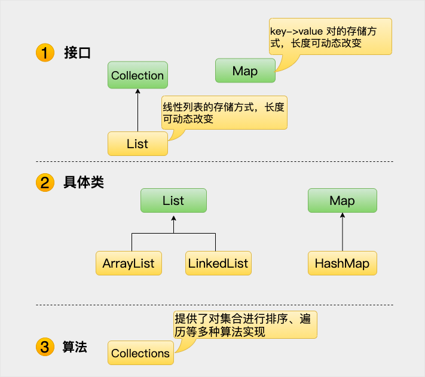


Java 集合框架提供了一套性能优良，使用方便的接口和类，java集合框架位于java.util包中， 所以当使用集合框架的时候需要进行导包。

### 6.3 动态数组

ArrayList 类是一个可以动态修改的数组，与普通数组的区别就是它是没有固定大小的限制，我们可以添加或删除元素。

```java
import java.util.ArrayList;

public class RunoobTest {
    public static void main(String[] args) {
        ArrayList<String> sites = new ArrayList<String>();
        sites.add("Google");
        sites.add("Runoob");
        sites.add("Taobao");
        sites.add("Weibo");
        System.out.println(sites.get(1));  // 访问第二个元素
    }
}
```


### 6.4 链表

链表（Linked list）是一种常见的基础数据结构，是一种线性表，但是并不会按线性的顺序存储数据，而是在每一个节点里存到下一个节点的地址。

链表可分为单向链表和双向链表。

一个单向链表包含两个值: 当前节点的值和一个指向下一个节点的链接。


一个双向链表有三个整数值: 数值、向后的节点链接、向前的节点链接。


Java LinkedList（链表） 类似于 ArrayList，是一种常用的数据容器。

与 ArrayList 相比，LinkedList 的增加和删除的操作效率更高，而查找和修改的操作效率较低。


### 6.5 HashSet

HashSet 基于 HashMap 来实现的，是一个不允许有重复元素的集合。

HashSet 允许有 null 值。

HashSet 是无序的，即不会记录插入的顺序。

HashSet 不是线程安全的， 如果多个线程尝试同时修改 HashSet，则最终结果是不确定的。 您必须在多线程访问时显式同步对 HashSet 的并发访问。

HashSet 实现了 Set 接口。

### 6.6 HashMap

HashMap 是一个散列表，它存储的内容是键值对(key-value)映射。

HashMap 实现了 Map 接口，根据键的 HashCode 值存储数据，具有很快的访问速度，最多允许一条记录的键为 null，不支持线程同步。

HashMap 是无序的，即不会记录插入的顺序。

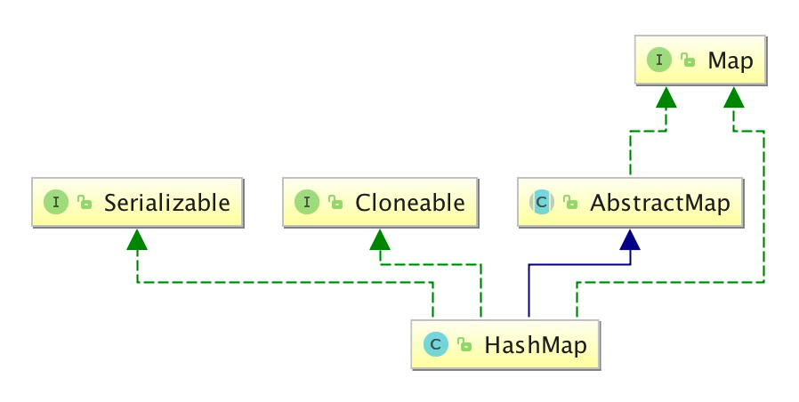

```java
 HashMap<Integer, String> Sites = new HashMap<Integer, String>();
        // 添加键值对
        Sites.put(1, "Google");
        Sites.put(2, "Runoob");
        Sites.put(3, "Taobao");
        Sites.put(4, "Zhihu");
```

### 6.7 迭代器

Java Iterator（迭代器）不是一个集合，它是一种用于访问集合的方法，可用于迭代 ArrayList 和 HashSet 等集合。

```java
import java.util.ArrayList;
import java.util.Iterator;

public class RunoobTest {
    public static void main(String[] args) {

        // 创建集合
        ArrayList<String> sites = new ArrayList<String>();
        sites.add("Google");
        sites.add("Runoob");
        sites.add("Taobao");
        sites.add("Zhihu");

        // 获取迭代器
        Iterator<String> it = sites.iterator();

        // 输出集合中的所有元素
        while(it.hasNext()) {
            System.out.println(it.next());
        }
    }
}
```

### 6.8 Object

Java Object 类是所有类的父类，也就是说 Java 的所有类都继承了 Object，子类可以使用 Object 的所有方法。

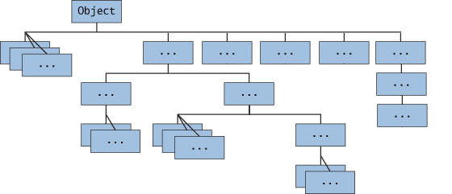

显示继承:

`public class Runoob extends Object{
}`

隐式继承:

`public class Runoob {
}`


### 6.9 泛型

Java 泛型（generics）是 JDK 5 中引入的一个新特性, 泛型提供了编译时类型安全检测机制，该机制允许程序员在编译时检测到非法的类型。

泛型的本质是参数化类型，也就是说所操作的数据类型被指定为一个参数。

```java
import java.util.*;
 
public class GenericTest {
     
    public static void main(String[] args) {
        List<String> name = new ArrayList<String>();
        List<Integer> age = new ArrayList<Integer>();
        List<Number> number = new ArrayList<Number>();
        
        name.add("icon");
        age.add(18);
        number.add(314);
 
        //getUperNumber(name);//1
        getUperNumber(age);//2
        getUperNumber(number);//3
       
   }
 
   public static void getData(List<?> data) {
      System.out.println("data :" + data.get(0));
   }
   
   public static void getUperNumber(List<? extends Number> data) {
          System.out.println("data :" + data.get(0));
       }
}
```

### 6.10 序列化

Java 提供了一种对象序列化的机制，该机制中，一个对象可以被表示为一个字节序列，该字节序列包括该对象的数据、有关对象的类型的信息和存储在对象中数据的类型。

将序列化对象写入文件之后，可以从文件中读取出来，并且对它进行反序列化，也就是说，对象的类型信息、对象的数据，还有对象中的数据类型可以用来在内存中新建对象。

整个过程都是 Java 虚拟机（JVM）独立的，也就是说，在一个平台上序列化的对象可以在另一个完全不同的平台上反序列化该对象。

```java
public class Employee implements java.io.Serializable
{
   public String name;
   public String address;
   public transient int SSN;
   public int number;
   public void mailCheck()
   {
      System.out.println("Mailing a check to " + name
                           + " " + address);
   }
}
```

### 6.11 文档注释

Java 支持三种注释方式。前两种分别是 // 和 /* */，第三种被称作说明注释，它以 /** 开始，以 */结束。

说明注释允许你在程序中嵌入关于程序的信息。你可以使用 javadoc 工具软件来生成信息，并输出到HTML文件中。

说明注释，使你更加方便的记录你的程序信息。

javadoc 工具将你 Java 程序的源代码作为输入，输出一些包含你程序注释的HTML文件。

每一个类的信息将在独自的HTML文件里。javadoc 也可以输出继承的树形结构和索引。

由于 javadoc 的实现不同，工作也可能不同，你需要检查你的 Java 开发系统的版本等细节，选择合适的 Javadoc 版本。

```java
/**
* 这个类演示了文档注释
* @author Ayan Amhed
* @version 1.2
*/
```


## 第7章 并发编程

### 7.1 多线/进程

Java 给多线程编程提供了内置的支持。 一条线程指的是进程中一个单一顺序的控制流，一个进程中可以并发多个线程，每条线程并行执行不同的任务。

多线程是多任务的一种特别的形式，但多线程使用了更小的资源开销。

这里定义和线程相关的另一个术语 - 进程：一个进程包括由操作系统分配的内存空间，包含一个或多个线程。一个线程不能独立的存在，它必须是进程的一部分。一个进程一直运行，直到所有的非守护线程都结束运行后才能结束。

多线程能满足程序员编写高效率的程序来达到充分利用 CPU 的目的。

### 7.2 线程的生命周期

线程是一个动态执行的过程，它也有一个从产生到死亡的过程。

下图显示了一个线程完整的生命周期。

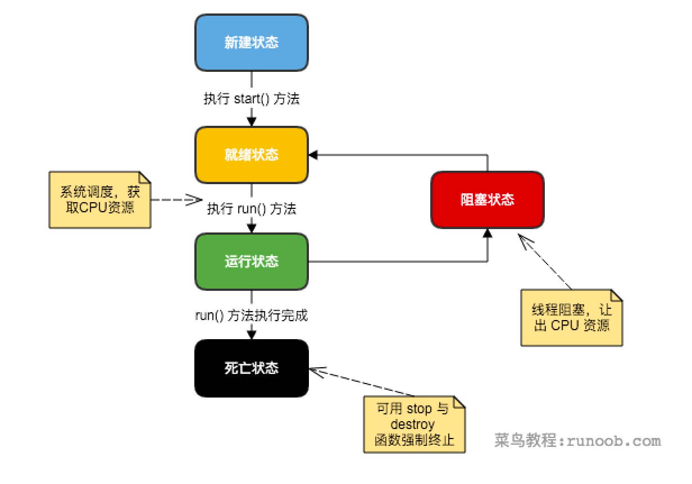

新建状态:

使用 new 关键字和 Thread 类或其子类建立一个线程对象后，该线程对象就处于新建状态。它保持这个状态直到程序 start() 这个线程。


就绪状态:

当线程对象调用了start()方法之后，该线程就进入就绪状态。就绪状态的线程处于就绪队列中，要等待JVM里线程调度器的调度。


运行状态:

如果就绪状态的线程获取 CPU 资源，就可以执行 run()，此时线程便处于运行状态。处于运行状态的线程最为复杂，它可以变为阻塞状态、就绪状态和死亡状态。


阻塞状态:

如果一个线程执行了sleep（睡眠）、suspend（挂起）等方法，失去所占用资源之后，该线程就从运行状态进入阻塞状态。在睡眠时间已到或获得设备资源后可以重新进入就绪状态。可以分为三种：


等待阻塞：运行状态中的线程执行 wait() 方法，使线程进入到等待阻塞状态。


同步阻塞：线程在获取 synchronized 同步锁失败(因为同步锁被其他线程占用)。


其他阻塞：通过调用线程的 sleep() 或 join() 发出了 I/O 请求时，线程就会进入到阻塞状态。当sleep() 状态超时，join() 等待线程终止或超时，或者 I/O 处理完毕，线程重新转入就绪状态。


死亡状态:
一个运行状态的线程完成任务或者其他终止条件发生时，该线程就切换到终止状态。