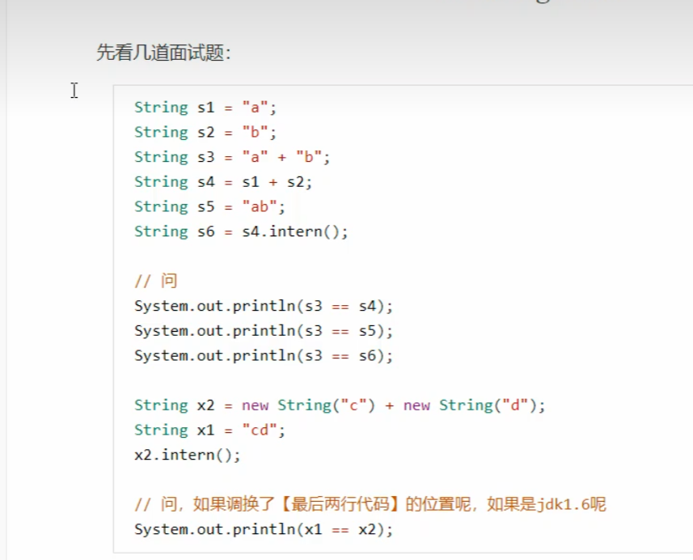
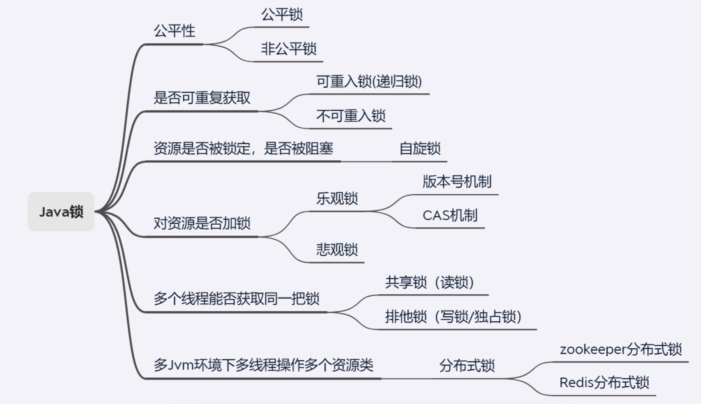

## 第1章 jvm

### 1.1 简介

jvm 是java程序的运行环境, 准确说是java二进制字节码的运行环境

-   优点

一次编写, 多平台运行

自动内存管理, 垃圾回收功能

数组下标越界检查

多态

-   缺点

只能运行在装有jdk环境的系统上

-   模块介绍

java字节码 类加载器 本地方法接口

JVM内存结构: 方法区 堆 虚拟机栈 程序计数器 本地方法栈

执行引擎: 解释器 即时编译器 垃圾回收器

### 1.2 内存结构

-   程序计数器

作用: 记住下一条jvm指令的地址

特点: 线程私有, 不会内存溢出

-   虚拟机栈

定义

每个线程运行时需要的内存, 称为虚拟机栈

每个栈由多个栈帧组成,对应每次方法调用时所占有的内存

每个线程只能有一个活动栈帧, 对应着当前正在执行的那个方法

栈的解释

垃圾回收器不管理栈内存, 只管理堆内存

栈内存不是越大越好, 相应的线程会减少

方法内局部变量没有逃离方法的作用访问是线程安全的, 但如果是局部变量引用了对象, 并逃离方法的作用方法, 需要考虑线程安全

栈内存溢出原因

1.   栈帧过多 (循环调用, 无限递归)
2.   栈帧过大 

-   本地方法栈

和系统交互的方法

-   堆 heap

(1) 特点

通过new创建对象都会使用堆

堆是线程共享的, 需要考虑线程安全

有垃圾回收机制

(2) 堆内存溢出

创建对象太多超过堆空间

(3) 诊断工具

jps 查看当前系统中有哪些java进程

jmap 查看堆内存占用情况

jconsole 监测工具

-   方法区

(1) 定义

存储类相关的代码

jdk1.8以后由系统内存管理

(2) 组成

(3) 方法区内存溢出

(4) 运行时常量池

常量池就是一张表, 虚拟机指令根据这张常量表找到要执行的类名, 方法名, 参数类型, 字面量等信息

运行时常量池是class文件中的, 当该类被加载, 他的常量池信息就会放入运行时常量池, 并把里面符号地址变为真实地址

面试题

-   直接内存

用于数据缓冲区

读写性能高

不受jvm回收管理

### 1.4 执行引擎

-   解释器

-   线程状态

6种状态 

使用getState方法获取线程状态

### 8.7 锁

=======

-   即时编译器

-   垃圾回收器

(1) 判断回收条件

引用计数法

可达性分析算法

四种引用

强引用 弱引用 虚引用 软引用 终结器引用

(2) 垃圾回收算法

(3) 分代垃圾回收

(4) 垃圾回收器

(5) 垃圾回收调优