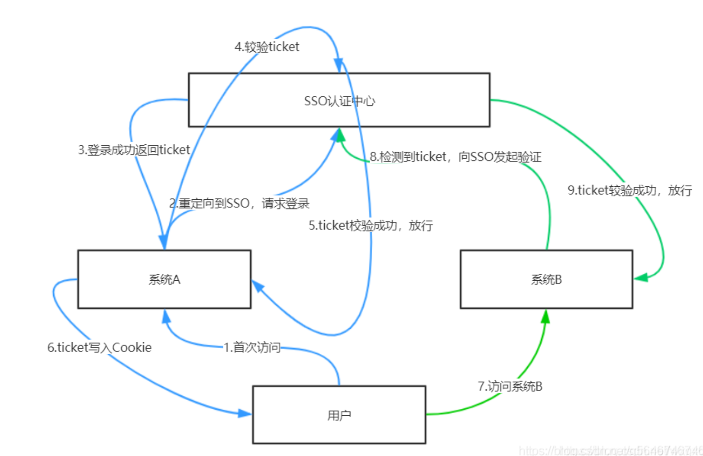

---

title: JWT教程

date: 2021-11-14 09:54:57

---

## 第1章 Jwt 入门

### 1.1 jwt 简介

JSON Web Token (JWT) 是一种开放标准 ，它定义了一种紧凑且自包含的方式，用于在各方之间作为 JSON 对象安全地传输信息。

由于此信息经过数字签名，因此可以验证和信任。JWT 可以使用秘密（使用**HMAC**算法）或使用**RSA**或**ECDSA**的公钥/私钥对进行**签名**。

虽然 JWT 可以加密以在各方之间提供保密，但我们将重点关注*签名*令牌。签名令牌可以验证其中包含的声明的*完整性*，而加密令牌则对其他方*隐藏*这些声明。

当使用公钥/私钥对对令牌进行签名时，签名还证明只有持有私钥的一方才是对其进行签名的一方。

### 1.2  jwt使用场景

以下是 JSON Web Tokens 有用的一些场景：

- **授权**：这是使用 JWT 最常见的场景。用户登录后，每个后续请求都将包含 JWT，允许用户访问该令牌允许的路由、服务和资源。单点登录是当今广泛使用 JWT 的一项功能，因为它的开销很小，并且能够轻松跨不同域使用。

  

- **信息交换**：JSON Web Tokens 是一种在各方之间安全传输信息的好方法。因为 JWT 可以被签名——例如，使用公钥/私钥对——你可以确定发件人就是他们所说的那样。此外，由于使用标头和有效负载计算签名，您还可以验证内容是否未被篡改。

### 1.3 Jwt 结构

在其紧凑形式中，JSON Web Tokens 由用点 ( `.`)分隔的三个部分组成，它们是：

- 标题
- 有效载荷
- 签名

因此，JWT 通常如下所示。

```
xxxxx.yyyyy.zzzzz
```


## 第2章 jwt 组成部分

### 2.1 标题

标头*通常*由两部分组成：令牌的类型，即 JWT，以及正在使用的签名算法，例如 HMAC SHA256 或 RSA。

```json
{
  "alg": "HS256",
  "typ": "JWT"
}
```

然后，这个 JSON 被**Base64Url**编码以形成 JWT 的第一部分。


### 2.2 有效载荷

令牌的第二部分是负载，其中包含声明。声明是关于实体（通常是用户）和附加数据的声明。共有三种类型的声明：*注册声明*、*公共*声明和*私人*声明。

一个示例有效载荷可能是：

```json
{
  "sub": "1234567890",
  "name": "John Doe",
  "admin": true
}
```

然后对有效负载进行**Base64Url**编码以形成 JSON Web 令牌的第二部分。

请注意，对于已签名的令牌，此信息虽然受到防篡改保护，但任何人都可以读取。除非加密，否则不要将机密信息放入 JWT 的负载或标头元素中。


### 2.3 签名

要创建签名部分，您必须获取编码的标头、编码的有效载荷、秘密、标头中指定的算法，并对其进行签名。

签名用于验证消息在此过程中没有更改，并且在使用私钥签名的令牌的情况下，它还可以验证 JWT 的发送者是它所说的那个人。

例如，如果要使用 HMAC SHA256 算法，则签名将通过以下方式创建：

```java
HMACSHA256(
  base64UrlEncode(header) + "." +
  base64UrlEncode(payload),
  secret)
```

输出是三个由点分隔的 Base64-URL 字符串，可以在 HTML 和 HTTP 环境中轻松传递，同时与基于 XML 的标准（如 SAML）相比更加紧凑。


## 第3章 jwt 高级

### 3.1 jwt工作流程

在身份验证中，当用户使用其凭据成功登录时，将返回一个 JSON Web Token。由于令牌是凭证，因此必须非常小心以防止出现安全问题。通常，您不应将令牌保留的时间超过所需的时间。

每当用户想要访问受保护的路由或资源时，用户代理应发送 JWT，通常在请求头的**Authorization**中。标题的内容应如下所示：

```json
Authorization:  <jwt>
```


### 3.2 jwt 的优点

由于 JSON 没有 XML 冗长，编码时它的大小也更小，这使得 JWT 比 SAML 更紧凑。这使得 JWT 成为在 HTML 和 HTTP 环境中传递的不错选择。

在安全方面，SWT 只能由使用 HMAC 算法的共享秘密对称签名。但是，JWT 和 SAML 令牌可以使用 X.509 证书形式的公钥/私钥对进行签名。与签署 JSON 的简单性相比，在不引入模糊安全漏洞的情况下使用 XML 数字签名签署 XML 是非常困难的。

JSON 解析器在大多数编程语言中都很常见，因为它们直接映射到对象。相反，XML 没有自然的文档到对象映射。这使得使用 JWT 比使用 SAML 断言更容易。

关于使用，JWT 用于互联网规模。这突出了客户端在多个平台（尤其是移动平台）上处理 JSON Web 令牌的简便性。


## 第4章 单点登录

### 4.1 跨域简介

session跨域

spring session 跨域

nginx 跨域


### 4.2 单点登录简介





## 第5章 集成springcould


