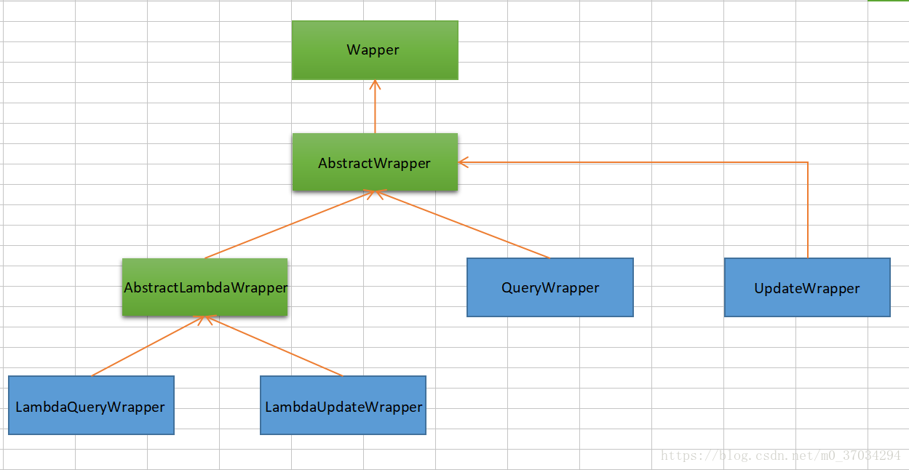
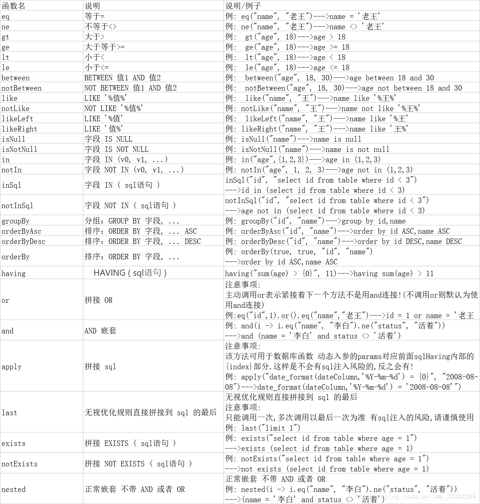

---

title: mybatisplus教程

date: 2021-11-15 21:17:52

---


## 第1章 简介

### 1.1 特性

- 无侵入

- 支持 ActiveRecord 模式
- 支持自定义全局通用操作
- 代码生成器
- 分页插件
- 内置性能分析插件
- 全局拦截插件


### 1.2 安装

```xml
<!--mybatisplus-->
<dependency>
    <groupId>com.baomidou</groupId>
    <artifactId>mybatis-plus-boot-starter</artifactId>
    <version>mybatis-plus-latest-version</version>
</dependency>

 <!--代码生成器-->


 <!--模板引擎-->


<!--jackson-->


<!--lombok-->
<dependency> 
  <groupId>org.projectlombok</groupId>
  <artifactId>lombok</artifactId> 
  <optional>true</optional> 
</dependency> 

<!--mysql-->
<dependency> 
  <groupId>mysql</groupId> 
  <artifactId>mysql-connector-java</artifactId> 
  <scope>runtime</scope> 
</dependency>
```


### 1.3 常用注解


```java
//@TableName 表名注解，标识实体类对应的表
@TableName("sys_user")
  public class User {
    private Long id;
    private String name;
    private Integer age;
    private String email;
}

//@TableId 实体类主键字段 
@TableId
private Long id;

// @TableField 对一个字段使用,该表中无真实字段,但业务中需要用到该属性
@TableField(exist=false)
private name; 

// @Version 乐观锁注解、标记在字段上

// @EnumValue 普通枚举类注解(注解在枚举字段上)

// @TableLogic 表字段逻辑处理注解（逻辑删除）

// @KeySequence 序列主键策略 `oracle`

// @InterceptorIgnore 插件see

// @OrderBy 内置 SQL 默认指定排序，优先级低于 wrapper 条件查询
```


### 1.4 配置

```yml
spring: # 配置数据源信息 
	datasource: # 配置数据源类型 
		driver-class-name: com.mysql.cj.jdbc.Driver 
		url: jdbc:mysql://localhost:3306/mybatis_plus?serverTimezone=GMT%2B8&characterEncoding=utf-8&useSSL=false #mysql8版本url
		username: root 
		password: 123456


//application.yml配置
mybatis-plus:
  ......
  configuration:
    log-impl: org.apache.ibatis.logging.stdout.StdOutImpl 
    #配置mybatis原生日志,该日志打印消息最全,有完整的sql语句,适合开发阶段
  global-config:
    ......
    db-config:
      ......
```


#### 1.4.1 mybatis-plus

configLocation

- 类型：`String`
- 默认值：`null`

MyBatis 配置文件位置，如果您有单独的 MyBatis 配置，请将其路径配置到 `configLocation` 中.MyBatis Configuration 的具体内容请参考[MyBatis 官方文档(opens new window)](https://www.mybatis.org/mybatis-3/zh/configuration.html)


mapperLocations

- 类型：`String[]`
- 默认值：`["classpath*:/mapper/**/*.xml"]`

MyBatis Mapper 所对应的 XML 文件位置，如果您在 Mapper 中有自定义方法(XML 中有自定义实现)，需要进行该配置，告诉 Mapper 所对应的 XML 文件位置

注意

Maven 多模块项目的扫描路径需以 `classpath*:` 开头 （即加载多个 jar 包下的 XML 文件）


typeAliasesPackage

- 类型：`String`
- 默认值：`null`

MyBaits 别名包扫描路径，通过该属性可以给包中的类注册别名，注册后在 Mapper 对应的 XML 文件中可以直接使用类名，而不用使用全限定的类名(即 XML 中调用的时候不用包含包名)


typeAliasesSuperType

- 类型：`Class<?>`
- 默认值：`null`

该配置请和 [typeAliasesPackage](https://baomidou.com/pages/56bac0/#typealiasespackage) 一起使用，如果配置了该属性，则仅仅会扫描路径下以该类作为父类的域对象


typeHandlersPackage

- 类型：`String`
- 默认值：`null`

TypeHandler 扫描路径，如果配置了该属性，SqlSessionFactoryBean 会把该包下面的类注册为对应的 TypeHandler

提示

TypeHandler 通常用于自定义类型转换。


typeEnumsPackage

- 类型：`String`
- 默认值：`null`

枚举类 扫描路径，如果配置了该属性，会将路径下的枚举类进行注入，让实体类字段能够简单快捷的使用枚举属性


checkConfigLocation

- 类型：`boolean`
- 默认值：`false`

启动时是否检查 MyBatis XML 文件的存在，默认不检查


executorType

- 类型：`ExecutorType`
- 默认值：`simple`

通过该属性可指定 MyBatis 的执行器，MyBatis 的执行器总共有三种：

- ExecutorType.SIMPLE：该执行器类型不做特殊的事情，为每个语句的执行创建一个新的预处理语句（PreparedStatement）
- ExecutorType.REUSE：该执行器类型会复用预处理语句（PreparedStatement）
- ExecutorType.BATCH：该执行器类型会批量执行所有的更新语句


#### 1.4.2 Configuration

本部分（Configuration）的配置大都为 MyBatis 原生支持的配置，这意味着您可以通过 MyBatis XML 配置文件的形式进行配置。


mapUnderscoreToCamelCase

- 类型：`boolean`
- 默认值：`true`

是否开启自动驼峰命名规则（camel case）映射，即从经典数据库列名 A_COLUMN（下划线命名） 到经典 Java 属性名 aColumn（驼峰命名） 的类似映射。

注意

此属性在 MyBatis 中原默认值为 false，在 MyBatis-Plus 中，此属性也将用于生成最终的 SQL 的 select body

如果您的数据库命名符合规则无需使用 `@TableField` 注解指定数据库字段名


defaultEnumTypeHandler

- 类型：`Class<? extends TypeHandler`
- 默认值：`org.apache.ibatis.type.EnumTypeHandler`

默认枚举处理类,如果配置了该属性,枚举将统一使用指定处理器进行处理

提示

- org.apache.ibatis.type.EnumTypeHandler : 存储枚举的名称
- org.apache.ibatis.type.EnumOrdinalTypeHandler : 存储枚举的索引
- com.baomidou.mybatisplus.extension.handlers.MybatisEnumTypeHandler : 枚举类需要实现 IEnum 接口或字段标记@EnumValue 注解.(3.1.2 以下版本为 EnumTypeHandler)
- com.baomidou.mybatisplus.extension.handlers.EnumAnnotationTypeHandler: 枚举类字段需要标记@EnumValue 注解


aggressiveLazyLoading

- 类型：`boolean`
- 默认值：`true`

当设置为 true 的时候，懒加载的对象可能被任何懒属性全部加载，否则，每个属性都按需加载。需要和 [lazyLoadingEnabled](https://baomidou.com/pages/56bac0/) 一起使用。


autoMappingBehavior

- 类型：`AutoMappingBehavior`
- 默认值：`partial`

MyBatis 自动映射策略，通过该配置可指定 MyBatis 是否并且如何来自动映射数据表字段与对象的属性，总共有 3 种可选值：

- AutoMappingBehavior.NONE：不启用自动映射
- AutoMappingBehavior.PARTIAL：只对非嵌套的 resultMap 进行自动映射
- AutoMappingBehavior.FULL：对所有的 resultMap 都进行自动映射


autoMappingUnknownColumnBehavior

- 类型：`AutoMappingUnknownColumnBehavior`
- 默认值：`NONE`

MyBatis 自动映射时未知列或未知属性处理策略，通过该配置可指定 MyBatis 在自动映射过程中遇到未知列或者未知属性时如何处理，总共有 3 种可选值：

- AutoMappingUnknownColumnBehavior.NONE：不做任何处理 (默认值)
- AutoMappingUnknownColumnBehavior.WARNING：以日志的形式打印相关警告信息
- AutoMappingUnknownColumnBehavior.FAILING：当作映射失败处理，并抛出异常和详细信息


localCacheScope

- 类型：`String`
- 默认值：`SESSION`

Mybatis 一级缓存，默认为 SESSION。

- SESSION session 级别缓存，同一个 session 相同查询语句不会再次查询数据库
- STATEMENT 关闭一级缓存

单服务架构中（有且仅有只有一个程序提供相同服务），一级缓存开启不会影响业务，只会提高性能。 微服务架构中需要关闭一级缓存，原因：Service1 先查询数据，若之后 Service2 修改了数据，之后 Service1 又再次以同样的查询条件查询数据，因走缓存会出现查处的数据不是最新数据


cacheEnabled

- 类型：`boolean`
- 默认值：`true`

开启 Mybatis 二级缓存，默认为 true。


callSettersOnNulls

- 类型：`boolean`
- 默认值：`false`

指定当结果集中值为 null 的时候是否调用映射对象的 Setter（Map 对象时为 put）方法，通常运用于有 Map.keySet() 依赖或 null 值初始化的情况。

通俗的讲，即 MyBatis 在使用 resultMap 来映射查询结果中的列，如果查询结果中包含空值的列，则 MyBatis 在映射的时候，不会映射这个字段，这就导致在调用到该字段的时候由于没有映射，取不到而报空指针异常。

当您遇到类似的情况，请针对该属性进行相关配置以解决以上问题。

注意

基本类型（int、boolean 等）是不能设置成 null 的。


configurationFactory

- 类型：`Class<?>`
- 默认值：`null`

指定一个提供 Configuration 实例的工厂类。该工厂生产的实例将用来加载已经被反序列化对象的懒加载属性值，其必须包含一个签名方法`static Configuration getConfiguration()`。（从 3.2.3 版本开始）

#### 1.4.3 GlobalConfig

banner

- 类型：`boolean`
- 默认值：`true`

是否控制台 print mybatis-plus 的 LOGO


enableSqlRunner

- 类型：`boolean`
- 默认值：`false`

是否初始化 SqlRunner(com.baomidou.mybatisplus.extension.toolkit.SqlRunner)


sqlInjector

- 类型：`com.baomidou.mybatisplus.core.injector.ISqlInjector`
- 默认值：`com.baomidou.mybatisplus.core.injector.DefaultSqlInjector`

SQL 注入器(starter 下支持`@bean`注入)


superMapperClass

- 类型：`Class`
- 默认值：`com.baomidou.mybatisplus.core.mapper.Mapper.class`

通用 Mapper 父类(影响 sqlInjector,只有这个的子类的 mapper 才会注入 sqlInjector 内的 method)


metaObjectHandler

- 类型：`com.baomidou.mybatisplus.core.handlers.MetaObjectHandler`
- 默认值：`null`

元对象字段填充控制器(starter 下支持`@bean`注入)


identifierGenerator(since 3.3.0)

- 类型：`com.baomidou.mybatisplus.core.incrementer.IdentifierGenerator`
- 默认值：`com.baomidou.mybatisplus.core.incrementer.DefaultIdentifierGenerator`

Id 生成器(starter 下支持`@bean`注入)


#### 1.4.4 DbConfig

idType

- 类型：`com.baomidou.mybatisplus.annotation.IdType`
- 默认值：`ASSIGN_ID`

全局默认主键类型


tablePrefix

- 类型：`String`
- 默认值：`null`

表名前缀


schema

- 类型：`String`
- 默认值：`null`

schema


columnFormat

- 类型：`String`
- 默认值：`null`

字段 format,例: `%s`,(对主键无效)


propertyFormat(since 3.3.0)

- 类型：`String`
- 默认值：`null`

entity 的字段(property)的 format,只有在 column as property 这种情况下生效例: `%s`,(对主键无效)


tableUnderline

- 类型：`boolean`
- 默认值：`true`

表名是否使用驼峰转下划线命名,只对表名生效


capitalMode

- 类型：`boolean`
- 默认值：`false`

大写命名,对表名和字段名均生效


keyGenerator

- 类型：`com.baomidou.mybatisplus.core.incrementer.IKeyGenerator`
- 默认值：`null`

表主键生成器(starter 下支持`@bean`注入)


logicDeleteField

- 类型：`String`
- 默认值：`null`

全局的 entity 的逻辑删除字段属性名,([逻辑删除](https://baomidou.com/guide/logic-delete.html)下有效)


logicDeleteValue

- 类型：`String`
- 默认值：`1`

逻辑已删除值,([逻辑删除](https://baomidou.com/guide/logic-delete.html)下有效)


logicNotDeleteValue

- 类型：`String`
- 默认值：`0`

逻辑未删除值,([逻辑删除](https://baomidou.com/guide/logic-delete.html)下有效)


insertStrategy

- 类型：`com.baomidou.mybatisplus.annotation.FieldStrategy`
- 默认值：`NOT_NULL`

字段验证策略之 insert,在 insert 的时候的字段验证策略


updateStrategy

- 类型：`com.baomidou.mybatisplus.annotation.FieldStrategy`
- 默认值：`NOT_NULL`

字段验证策略之 update,在 update 的时候的字段验证策略


whereStrategy

- 类型：`com.baomidou.mybatisplus.annotation.FieldStrategy`
- 默认值：`NOT_NULL`

字段验证策略之 select,在 select 的时候的字段验证策略既 wrapper 根据内部 entity 生成的 where 条件


### 1.5 MybatisplusConfig配置类

```java
```


## 第2章 核心功能

### 2.1 代码生成器

引入依赖

```xml
<dependency>
    <groupId>com.baomidou</groupId>
    <artifactId>mybatis-plus-generator</artifactId>
    <version>3.4.1</version>
</dependency>

<dependency>
    <groupId>org.apache.velocity</groupId>
    <artifactId>velocity-engine-core</artifactId>
    <version>latest-velocity-version</version>
</dependency>
```


### 2.2 分页插件

```java
@Configuration
@MapperScan("com.baomidou.cloud.service.*.mapper*")
public class MybatisPlusConfig {

    // 旧版
    @Bean
    public PaginationInterceptor paginationInterceptor() {
        PaginationInterceptor paginationInterceptor = new PaginationInterceptor();
        // 设置请求的页面大于最大页后操作， true调回到首页，false 继续请求  默认false
        // paginationInterceptor.setOverflow(false);
        // 设置最大单页限制数量，默认 500 条，-1 不受限制
        // paginationInterceptor.setLimit(500);
        // 开启 count 的 join 优化,只针对部分 left join
        paginationInterceptor.setCountSqlParser(new JsqlParserCountOptimize(true));
        return paginationInterceptor;
    }
    
    // 最新版
    @Bean
    public MybatisPlusInterceptor mybatisPlusInterceptor() {
        MybatisPlusInterceptor interceptor = new MybatisPlusInterceptor();
        interceptor.addInnerInterceptor(new PaginationInnerInterceptor(DbType.H2));
        return interceptor;
    }
    
}

```


### 2.3 性能分析插件


### 2.4 全局拦截插件


## 第3章 Wrapper条件构造器

Wrapper 条件构造抽象类，最顶端父类，抽象类中提供4个方法西面贴源码展示
AbstractWrapper ： 用于查询条件封装，生成 sql 的 where 条件
AbstractLambdaWrapper ： Lambda 语法使用 Wrapper统一处理解析 lambda 获取 column。
LambdaQueryWrapper ：看名称也能明白就是用于Lambda语法使用的查询Wrapper
LambdaUpdateWrapper ： Lambda 更新封装Wrapper
QueryWrapper ： Entity 对象封装操作类，不是用lambda语法
UpdateWrapper ： Update 条件封装，用于Entity对象更新操作








### 3.1 QueryWrapper

```java
   QueryWrapper<UserEntity> userWrapper = new QueryWrapper<>();
        userWrapper.and(wrapper->wrapper.eq("username", "test2").or().eq("username", "test2"))
                .or(wrapper -> wrapper.like("username", "test2").or().like("username", "test2"));

# SELECT id,username,pwd,date_u,time_u,u_num,img FROM student WHERE ( username = ? OR username = ? ) OR ( username LIKE ? OR username LIKE ? )
```


```java
  QueryWrapper<UserEntity> userWrapper = new QueryWrapper<>();
        userWrapper.and(wrapper->wrapper.eq("username", "test2").or().eq("username", "test2"))
                .and(wrapper -> wrapper.like("username", "test2").or().like("username", "test2"));
#SELECT id,username,pwd,date_u,time_u,u_num,img FROM student WHERE ( username = ? OR username = ? ) AND ( username LIKE ? OR username LIKE ? )
```


```java
 QueryWrapper userWrapper = new QueryWrapper<>();
        userWrapper.apply("select stamp_u,username,name,age from student,rel_student where student.id=rel_student.id");

#select stamp_u,username,name,age from student,rel_student where student.id=rel_student.id 
```


```java
     QueryWrapper<UserEntity> userWrapper = new QueryWrapper<>();
        userWrapper.eq("username", "test").eq("username", "test");

#select * from student WHERE username = ?  and  username = ? 
```


### 3.2 UpdateWrapper


### 3.3 lombdaQueryWrapper

```java
User user = userMapper.selectOne(new lombdaQueryWrapper().eq(User::getUsername,"wl"))
```


### 3.4 lombdaUpdateWrapper


## 第4章 BaseMapper的CURD接口


### 4.1 select


```java
    /**
     * 根据 ID 查询
     *
     * @param id 主键ID
     */
    T selectById(Serializable id);

    /**
     * 查询（根据ID 批量查询）
     *
     * @param idList 主键ID列表(不能为 null 以及 empty)
     */
    List<T> selectBatchIds(@Param(Constants.COLLECTION) Collection<? extends Serializable> idList);

    /**
     * 查询（根据 columnMap 条件）
     *
     * @param columnMap 表字段 map 对象
     */
    List<T> selectByMap(@Param(Constants.COLUMN_MAP) Map<String, Object> columnMap);

    /**
     * 根据 entity 条件，查询一条记录
     *
     * @param queryWrapper 实体对象封装操作类（可以为 null）
     */
    T selectOne(@Param(Constants.WRAPPER) Wrapper<T> queryWrapper);

    /**
     * 根据 Wrapper 条件，查询总记录数
     *
     * @param queryWrapper 实体对象封装操作类（可以为 null）
     */
    Integer selectCount(@Param(Constants.WRAPPER) Wrapper<T> queryWrapper);

    /**
     * 根据 entity 条件，查询全部记录
     *
     * @param queryWrapper 实体对象封装操作类（可以为 null）
     */
    List<T> selectList(@Param(Constants.WRAPPER) Wrapper<T> queryWrapper);

    /**
     * 根据 Wrapper 条件，查询全部记录
     *
     * @param queryWrapper 实体对象封装操作类（可以为 null）
     */
    List<Map<String, Object>> selectMaps(@Param(Constants.WRAPPER) Wrapper<T> queryWrapper);

    /**
     * 根据 Wrapper 条件，查询全部记录
     * <p>注意： 只返回第一个字段的值</p>
     *
     * @param queryWrapper 实体对象封装操作类（可以为 null）
     */
    List<Object> selectObjs(@Param(Constants.WRAPPER) Wrapper<T> queryWrapper);

    /**
     * 根据 entity 条件，查询全部记录（并翻页）
     *
     * @param page         分页查询条件（可以为 RowBounds.DEFAULT）
     * @param queryWrapper 实体对象封装操作类（可以为 null）
     */
    <E extends IPage<T>> E selectPage(E page, @Param(Constants.WRAPPER) Wrapper<T> queryWrapper);

    /**
     * 根据 Wrapper 条件，查询全部记录（并翻页）
     *
     * @param page         分页查询条件
     * @param queryWrapper 实体对象封装操作类
     */
    <E extends IPage<Map<String, Object>>> E selectMapsPage(E page, @Param(Constants.WRAPPER) Wrapper<T> queryWrapper);
}

```


### 4.2 update

```java
 /**
     * 根据 ID 修改
     *
     * @param entity 实体对象
     */
    int updateById(@Param(Constants.ENTITY) T entity);

    /**
     * 根据 whereEntity 条件，更新记录
     *
     * @param entity        实体对象 (set 条件值,可以为 null)
     * @param updateWrapper 实体对象封装操作类（可以为 null,里面的 entity 用于生成 where 语句）
     */
    int update(@Param(Constants.ENTITY) T entity, @Param(Constants.WRAPPER) Wrapper<T> updateWrapper);


```


### 4.3 insert

```java
 /**
     * 插入一条记录
     *
     * @param entity 实体对象
     */
    int insert(T entity);
```


### 4.4 delete

```java

    /**
     * 根据 ID 删除
     *
     * @param id 主键ID
     */
    int deleteById(Serializable id);

    /**
     * 根据 columnMap 条件，删除记录
     *
     * @param columnMap 表字段 map 对象
     */
    int deleteByMap(@Param(Constants.COLUMN_MAP) Map<String, Object> columnMap);

    /**
     * 根据 entity 条件，删除记录
     *
     * @param queryWrapper 实体对象封装操作类（可以为 null,里面的 entity 用于生成 where 语句）
     */
    int delete(@Param(Constants.WRAPPER) Wrapper<T> queryWrapper);

    /**
     * 删除（根据ID 批量删除）
     *
     * @param idList 主键ID列表(不能为 null 以及 empty)
     */
    int deleteBatchIds(@Param(Constants.COLLECTION) Collection<? extends Serializable> idList);

   
```


## 第5章 IService的CURD接口


## 第6章 拓展

[主键策略](https://baomidou.com/pages/e131bd/)

[自定义ID生成器](https://baomidou.com/pages/568eb2/)

[逻辑删除](https://baomidou.com/pages/6b03c5/)

[通用枚举](https://baomidou.com/pages/8390a4/)

[字段类型处理器](https://baomidou.com/pages/fd41d8/)

[自动填充功能](https://baomidou.com/pages/4c6bcf/)

[SQL注入器](https://baomidou.com/pages/42ea4a/)

[执行SQL分析打印](https://baomidou.com/pages/833fab/)

[数据安全保护](https://baomidou.com/pages/e0a5ce/)

[多数据源](https://baomidou.com/pages/a61e1b/)

[MybatisX快速开发插件](https://baomidou.com/pages/ba5b24/)

[企业高级特性](https://baomidou.com/pages/1864e1/)

[插件主体](https://baomidou.com/pages/2976a3/)

[分页插件](https://baomidou.com/pages/97710a/)

[乐观锁插件](https://baomidou.com/pages/0d93c0/)

[多租户插件](https://baomidou.com/pages/aef2f2/)

[防全表更新与删除插件](https://baomidou.com/pages/333106/)

[动态表名插件](https://baomidou.com/pages/2a45ff/)

