## 第1章 MQ介绍

### 1.1 简介


### 1.2 优缺点

- 异步提速
- 应用解耦
- 分布式事务的数据一致性
- 消息的顺序收发
- 削峰填谷
- 大规模机器的缓存同步


- 系统可用性降低（MQ死机则整个系统断裂）
- 系统复杂度提高（mq可能发生的丢失消息，重复消费）
- 一致性问题（MQ发送ABC三台服务器，AB成功，C失败）


### 1.3 使用场景


### 1.4 四种MQ对比

- RabbitMQ

erlang语言，处理速度 us 级


- RocketMQ

java语言，处理速度 ms 级


- Kafka 

scala语言实现，应用于大数据


- ActiveMQ

淘汰


#### 1.4.1 有broke

重topic : kafka  ActiveMQ  rocketMQ

依据topic进行消息中转


轻topick  rabbitMQ

topic只是一种中转模式


#### 1.4.2 无broke

zeroMQ

无broke中转站 直接使用socket 进行通信


### 1.5 工作原理

生产者Producer、消费者Consumer、经纪人Broker

Producer 发送消息给 Broker，并收到返回的接收结果

Consumer 监听 Broker，Broker 有消息了就推送给 Consumer


命名服务器NameServer

NameServer类似于注册中心，注册中心，发送心跳，负载均衡


Topic主题、Tag标题、Message消息


## 第2章 RocketMQ

### 2.1 安装配置

**下载安装包**

首先下载安装包 rocketmq-all-4.9.0-bin-release

https://rocketmq.apache.org/dowloading/releases/


**配置环境变量**

ROCKETMQ_HOME = 安装路径


**cmd启动服务**

```cmd
# 启动name-service服务器
start mqnamesrv.cmd

# 启动broke服务器
start mqbroker.cmd -n localhost:9876 autoCreateTopicEnble=true
```


**测试例子**

创建环境变量  

key : NAMESRV_ADDR 

value : localhost:9876


生产者发送消息

在bin目录下

```sh
tools.cmd org.apache.rocketmq.example.quickstart.Producer
```


消费者接收消息

在bin目录下

```sh
tools.cmd org.apache.rocketmq.example.quickstart.Consumer
```


**可视化工具**

拉取镜像

```sh
docker pull apacherocketmq/rocketmq-dashboard:latest
```


开启容器

注意 namesrv.addr 填写宿主机地址 192.168.0.109

```sh
docker run -d --name rocketmq-dashboard -e "JAVA_OPTS=-Drocketmq.namesrv.addr=192.168.0.109:9876" -p 8080:8080 -t apacherocketmq/rocketmq-dashboard:latest
```


### 2.2 在springboot项目中集成

创建maven空项目，作为父项目管理依赖，只有POM文件

```xml
<?xml version="1.0" encoding="UTF-8"?>
<project xmlns="http://maven.apache.org/POM/4.0.0"
         xmlns:xsi="http://www.w3.org/2001/XMLSchema-instance"
         xsi:schemaLocation="http://maven.apache.org/POM/4.0.0 http://maven.apache.org/xsd/maven-4.0.0.xsd">
    <modelVersion>4.0.0</modelVersion>
    <packaging>pom</packaging>
    <modules>
        <module>rocketmq-provider</module>
        <module>rocketmq-consumer1</module>
        <module>rocket-consumer2</module>
    </modules>
    <groupId>org.example</groupId>
    <artifactId>rocketmq-study</artifactId>
    <version>1.0-SNAPSHOT</version>


    <properties>
        <maven.compiler.source>8</maven.compiler.source>
        <maven.compiler.target>8</maven.compiler.target>
    </properties>
    <dependencyManagement>
        <dependencies>
            <dependency>
                <groupId>org.springframework.boot</groupId>
                <artifactId>spring-boot-dependencies</artifactId>
                <version>2.3.2.RELEASE</version>
                <type>pom</type>
                <scope>import</scope>
            </dependency>

            <dependency>
                <groupId>org.apache.rocketmq</groupId>
                <artifactId>rocketmq-spring-boot-starter</artifactId>
                <version>2.2.0</version>
            </dependency>


        </dependencies>
    </dependencyManagement>

    <build>
        <plugins>
            <plugin>
                <groupId>org.springframework.boot</groupId>
                <artifactId>spring-boot-maven-plugin</artifactId>

            </plugin>
        </plugins>
    </build>


</project>
```


新建模块，maven空项目，rocketmq-consumer

```xml
<!-- pom.xml -->

<?xml version="1.0" encoding="UTF-8"?>
<project xmlns="http://maven.apache.org/POM/4.0.0"
         xmlns:xsi="http://www.w3.org/2001/XMLSchema-instance"
         xsi:schemaLocation="http://maven.apache.org/POM/4.0.0 http://maven.apache.org/xsd/maven-4.0.0.xsd">
    <parent>
        <artifactId>rocketmq-study</artifactId>
        <groupId>org.example</groupId>
        <version>1.0-SNAPSHOT</version>
    </parent>
    <modelVersion>4.0.0</modelVersion>

    <artifactId>rocketmq-consumer</artifactId>

    <properties>
        <maven.compiler.source>8</maven.compiler.source>
        <maven.compiler.target>8</maven.compiler.target>
    </properties>

    <dependencies>
        <dependency>
            <groupId>org.springframework.boot</groupId>
            <artifactId>spring-boot-starter-web</artifactId>

        </dependency>

        <dependency>
            <groupId>org.apache.rocketmq</groupId>
            <artifactId>rocketmq-spring-boot-starter</artifactId>
        </dependency>


    </dependencies>
</project>
```


```java
//comsumer.ComsumerService

package com.example.comsumer;


import org.apache.rocketmq.spring.annotation.RocketMQMessageListener;
import org.apache.rocketmq.spring.core.RocketMQListener;
import org.springframework.stereotype.Component;

@RocketMQMessageListener(topic = "wuliu",consumerGroup = "${rocketmq.consumer.group}")
@Component
public class ComsumerService implements RocketMQListener<String> {

    @Override
    public void onMessage(String s) {
        System.out.println("收到消息内容" + s);
    }
}

```


```java
// ComsumerApplication

package com.example;

import org.springframework.boot.SpringApplication;
import org.springframework.boot.autoconfigure.SpringBootApplication;

@SpringBootApplication
public class ComsumerApplication {
    public static void main(String[] args) {
        SpringApplication.run(ComsumerApplication.class,args);
    }
}
```


```yml
# application.yml

server:
  port: 8081
  servlet:
    context-path: /


rocketmq:
  name-server: 127.0.0.1:9876
  consumer:
    group: consumer-demo1

```


新建模块，maven空项目，rocketmq-provider

```xml
<!-- pom.xml -->

<?xml version="1.0" encoding="UTF-8"?>
<project xmlns="http://maven.apache.org/POM/4.0.0"
         xmlns:xsi="http://www.w3.org/2001/XMLSchema-instance"
         xsi:schemaLocation="http://maven.apache.org/POM/4.0.0 http://maven.apache.org/xsd/maven-4.0.0.xsd">
    <parent>
        <artifactId>rocketmq-study</artifactId>
        <groupId>org.example</groupId>
        <version>1.0-SNAPSHOT</version>
    </parent>
    <modelVersion>4.0.0</modelVersion>

    <artifactId>rocketmq-provider</artifactId>

    <properties>
        <maven.compiler.source>8</maven.compiler.source>
        <maven.compiler.target>8</maven.compiler.target>
    </properties>


    <dependencies>
        <dependency>
            <groupId>org.springframework.boot</groupId>
            <artifactId>spring-boot-starter-web</artifactId>

        </dependency>

        <dependency>
            <groupId>org.apache.rocketmq</groupId>
            <artifactId>rocketmq-spring-boot-starter</artifactId>
        </dependency>


    </dependencies>
</project>
```


```java
//producer.ProducerService
    
package com.example.producer;

import org.apache.rocketmq.spring.core.RocketMQTemplate;
import org.springframework.beans.factory.annotation.Autowired;
import org.springframework.stereotype.Component;


@Component("producerService")
public class ProducerService {

    @Autowired
    private RocketMQTemplate rocketMQTemplate;

    public void sendMessage(){
        for (int i =0 ; i<10 ; i++){
            rocketMQTemplate.convertAndSend("wuliu","你大爷"+i);
        }
    }
}

```


```java
// RocketmqProviderApplication

package com.example;

import org.springframework.boot.SpringApplication;
import org.springframework.boot.autoconfigure.SpringBootApplication;
import org.springframework.context.ConfigurableApplicationContext;
import com.example.producer.ProducerService;

@SpringBootApplication
public class RocketmqProviderApplication {
    public static void main(String[] args) {
        ConfigurableApplicationContext run = SpringApplication.run(RocketmqProviderApplication.class,args);
        ProducerService producerService = (ProducerService) run.getBean("producerService");
        producerService.sendMessage();

    }

}

```


```yml
# application.yml

server:
  port: 8082
  servlet:
    context-path: /


rocketmq:
  name-server: 127.0.0.1:9876
  producer:
    group: producer-demo1

```


## 第3章 消息发送

### 3.1 发送简单消息

消息会乱序到达

```java
public void sendMessage(){
        for (int i =0 ; i<10 ; i++){
            rocketMQTemplate.convertAndSend("wuliu","你大爷"+i);
        }
}
```


### 3.2 发送同步消息

消息会按顺序到达，性能低，可靠性高，发送重要消息

第一条消息发送后，broke确定接收了，才能发送第二条

```java
public void sendSyncMessage(){
    for(int i =0;i<10;i++){
        SendResult sendResult = rocketMQTemplate.syncSend("topic","同步消息"+i);
        System.out.println(sendResult);
    }
}
```


### 3.3 发送异步消息

性能高，可靠性差，适合对响应时间要求高的场景

 ```java
 //发送异步消息
     public void sendAsyncMessage(){
         for(int i =0;i<10;i++){
             rocketMQTemplate.asyncSend("topic","同步消息"+i,new SendCallback(){
 
                 @Override
                 public void onSuccess(SendResult sendResult) {
                     System.out.println("发送成功");
                 }
 
                 @Override
                 public void onException(Throwable throwable) {
                     System.out.println("发送失败");
                 }
             });
             
         }
     }
 ```


### 3.4 发送单项消息

只发送消息啊，不记录broker是否接收成功

适合不关心结果的场景，例如日志记录

```java
 //单项消息发送
    public void sendOneWayMessage(){
        for(int i =0;i<10;i++){
            rocketMQTemplate.sendOneWay("topic","同步消息"+i);
        }
    }
```


### 3.5 发送批量消息


```java
 //批量消息发送
List<Message> msglist = new ArrayList<>();

String msg1 = "hello 1";
Message mess1 = new Message(msg1);
msglist.add(mess1);

String msg1 = "hello 2";
Message mess2 = new Message(msg2);
msglist.add(mess2);

public void sendOneWayMessage(){
    rocketMQTemplate.syncSend("topic",msglist,1000);
}
```


### 3.6 消费者广播模式和负载均衡模式


负载均衡模式是一条消息只被一个消费者消费，如物流系统内有多台服务器，只有一台服务器消费一条下单消息即可，也就是这条消息只能被消费一次

```java
//同一组内 默认为负载均衡模式，messageModel属性可省略
@RocketMQMessageListener(topic = "wuliu",consumerGroup = "${rocketmq.consumer.group}",messageModel = MessageModel.CLUSTERING)
```


广播模式是每个消费者都要消费这条消息，如物流系统，发货系统，支付系统都要消费下单消息

```java
//配置messageModel的值为MessageModel.BROADCASTING
@RocketMQMessageListener(topic = "wuliu",consumerGroup = "${rocketmq.consumer.group}",messageModel = MessageModel.BROADCASTING)
```


同一组内 默认为负载均衡模式，messageModel属性可省略

比如发送10条消息到group1组内, group1组内有两个consumer , 每个consumer消费5条消息


不同组时 默认为广播模式  

比如 group1组 和 group2组 都订阅了同一个topic , 该消息会同时发送给两个组  


若要在同一group内 实现广播模式 , 可修改消息模型为广播模型 

  

## 第4章 消息操作

### 4.1 实现顺序消息

**概念**

rocketmq 内部会有4个真实的队列，队列内有序，队列外无序


**生产者发送顺序消息**

roucketTemplate.syncSendOrderly，发送同步顺序消息

```java
//同步顺序消息
    @GetMapping("/order")
    public void sendSyncOrderlyMessage(){
        for(int i =0;i<10;i++){
            rocketMQTemplate.syncSendOrderly("wuliu","同步消息"+i,"select_queue_key");
        }
    }
```


roucketTemplate.asyncSendOrderly，发送异步顺序消息

roucketTemplate.sendOneWayOrderly，发送单向顺序消息


**开启消费者的顺序模式**

```java
@RocketMQMessageListener(topic = "wuliu",consumerGroup = "${rocketmq.consumer.group}",consumeMode = ConsumeMode.ORDERLY)
```


### 4.2 实现延迟消息

不支持自定义时间，只能用内置的延迟等级来实现


| 延迟等级 | 对应时间 |
| -------- | -------- |
| 1        | 1s       |
| 2        | 5s       |
| 3        | 10s      |
| 4        | 30s      |
| 5        | 1m       |
| 6        | 2m       |
| 7        | 3m       |
| 8        | 4m       |
| 9        | 5m       |
| 10       | 7m       |
| 11       | 8m       |
| 12       | 9m       |
| 13       | 10m      |
| 14       | 20m      |
| 15       | 30m      |
| 16       | 1h       |
| 17       | 2h       |

 

```java
//3000是3秒内发送失败报异常 
// 2代表延迟等级,对应为5秒
rocketMQTemplate.syncSend("group",MessageBuilder.withPayload("延迟5秒发送").build(),3000,2)
```


### 4.3 实现事务消息

**事物概念**

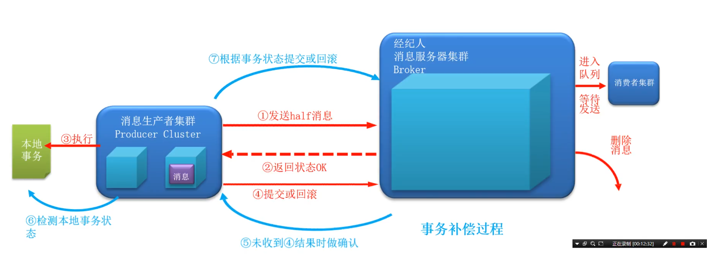


RocketMQ事务的3个状态

TransactionStatus.CommitTransaction：提交事务消息，消费者可以消费此消息

TransactionStatus.RollbackTransaction：回滚事务，它代表该消息将被删除，不允许被消费。

TransactionStatus.Unknown ：中间状态，它代表需要检查消息队列来确定状态。


RocketMQ实现事务消息主要分为两个阶段：正常事务的发送及提交、事务信息的补偿流程 


正常事务发送与提交阶段

1、生产者发送一个半消息给MQServer(半消息是指消费者暂时不能消费的消息)

2、服务端响应消息写入结果，半消息发送成功

3、开始执行本地事务

4、根据本地事务的执行状态执行Commit或者Rollback操作


事务信息的补偿流程

1、如果MQServer长时间没收到本地事务的执行状态会向生产者发起一个确认回查的操作请求

2、生产者收到确认回查请求后，检查本地事务的执行状态

3、根据检查后的结果执行Commit或者Rollback操作

补偿阶段主要是用于解决生产者在发送Commit或者Rollback操作时发生超时或失败的情况。


**事物发送**

```java
  //事物消息
    @GetMapping("/tran")
    public Object MQTtransaction() {
        //topic -- 消息要发送的地址； body -- 具体的消息
        String body = UUID.randomUUID().toString();

        org.springframework.messaging.Message<String> message = MessageBuilder.withPayload(body)
                .setHeader(RocketMQHeaders.TRANSACTION_ID, "MYKEY")
                .build();


        //创建事务
        TransactionSendResult transactionSendResult =  rocketMQTemplate.sendMessageInTransaction("wuliu", message, null);

        System.out.println(transactionSendResult);

        return transactionSendResult;
    }
```


**事物回滚和补偿**

producer / TxProducerListene.java

这是对事务消息的监听器

```java
package com.example.producer;

import org.apache.rocketmq.spring.annotation.RocketMQTransactionListener;
import org.apache.rocketmq.spring.core.RocketMQLocalTransactionListener;
import org.apache.rocketmq.spring.core.RocketMQLocalTransactionState;
import org.springframework.messaging.Message;


@RocketMQTransactionListener
public class TxProducerListene implements RocketMQLocalTransactionListener {

    //正常事务过程
    @Override
    public RocketMQLocalTransactionState executeLocalTransaction(Message message, Object o) {
        System.out.println("开始执行本地事务");


        //模拟执行结果,
        // 如果是1提交事务,
        // 如果是2回滚事务,
        // 如果是其他的则进入回查状态,
        int result = 1;


        if (result == 1) {
            //提交事务
            System.out.println("本地事务提交");
            return RocketMQLocalTransactionState.COMMIT;
        } else if (result == 2) {
            //回滚事务
            System.out.println("本地事务回滚");
            return RocketMQLocalTransactionState.ROLLBACK;
        } else {
            //等待回查事务
            System.out.println("等待回查事务中");
            return RocketMQLocalTransactionState.UNKNOWN;

        }
    }


    //事务补偿过程
    @Override
    public RocketMQLocalTransactionState checkLocalTransaction(Message message) {
        System.out.println("执行事务补偿");

        //模拟执行结果,
        // 如果是1提交事务,
        // 如果是2回滚事务,
        // 如果是其他的则进入回查状态,
        int result = 1;


        if (result == 1) {
            //提交事物 发送消息
            System.out.println("回查结果:提交半消息");
            return RocketMQLocalTransactionState.COMMIT;
        } else if (result == 2){
            //回滚事务 删除消息
            System.out.println("回查结果:回滚半消息");
            return RocketMQLocalTransactionState.ROLLBACK;
        }else{
            //回滚事务,记录日志,等待人工干预
            System.out.println("回查结果:需要人工干预");
            return RocketMQLocalTransactionState.UNKNOWN;
        }


    }
}

```


**事务消息接收**

与普通消费者相同

```java
package com.example.comsumer;


import org.apache.rocketmq.spring.annotation.MessageModel;
import org.apache.rocketmq.spring.annotation.RocketMQMessageListener;
import org.apache.rocketmq.spring.annotation.SelectorType;
import org.apache.rocketmq.spring.core.RocketMQListener;
import org.springframework.stereotype.Component;

@RocketMQMessageListener(topic = "wuliu",consumerGroup = "${rocketmq.consumer.group}")
@Component
public class ComsumerService implements RocketMQListener<String> {

    @Override
    public void onMessage(String s) {
        System.out.println("消费者1 收到消息内容: " + s);
    }
}

```


### 4.4 过滤消息

**按照 topic和group 过滤消息**

```java
@RocketMQMessageListener(topic = "wuliu",consumerGroup = "${rocketmq.consumer.group}")
@Component
public class ComsumerService implements RocketMQListener<String> {
    @Override
    public void onMessage(String s) {
        System.out.println("消费者1 收到消息内容: " + s);
    }
}

```


**按照 tag 过滤消息**

`* ` 代表任意 tag

`||` 代表某些 tag

```java
@RocketMQMessageListener(topic = "wuliu",consumerGroup = "${rocketmq.consumer.group}",selectorExpression = "tag1 || tag2")
```


**按照 属性 过滤**

开启属性过滤功能 , 追加属性 , 重启服务

conf / broker.conf

```
enablePropertyFilter=true
```


生产者设置消息属性

```java
message.putUserProperty("age","18");
message.putUserProperty("name","zhangsan");
```


消费者过滤消息

```java
@RocketMQMessageListener(topic = "wuliu",consumerGroup = "${rocketmq.consumer.group}",selectorType = SelectorType.SQL92,selectorExpression = "age > 92 and name = 'wl'")
```


## 第5章 集群环境

### 5.1 集群介绍

**单机模式**

一个broker提供服务，宕机后服务瘫痪


**集群模式**

多个 broker 提供服务

多个 master 多个 slave


**集群同步方式**

同步方式为 sync ，性能低，消息无延迟

同步方式为 async ， 性能高，数据有延迟


**集群工作流程**

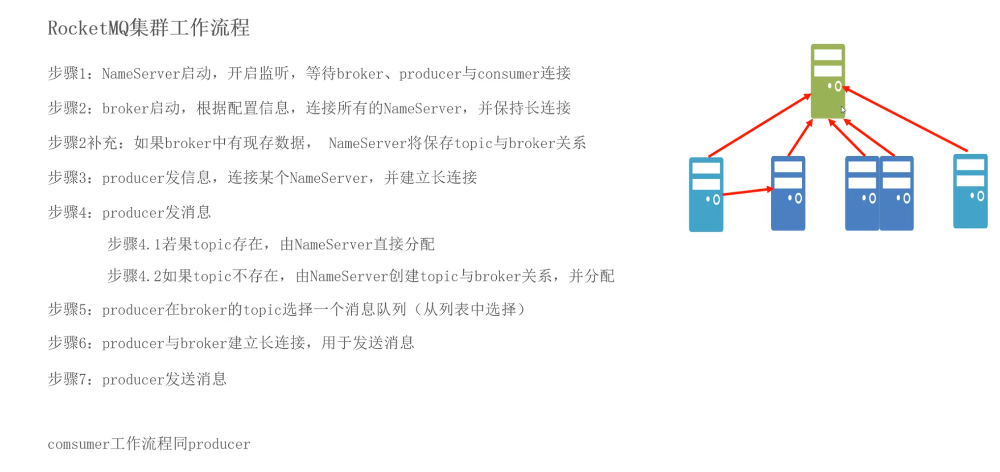


### 5.2 多主多从同步搭建

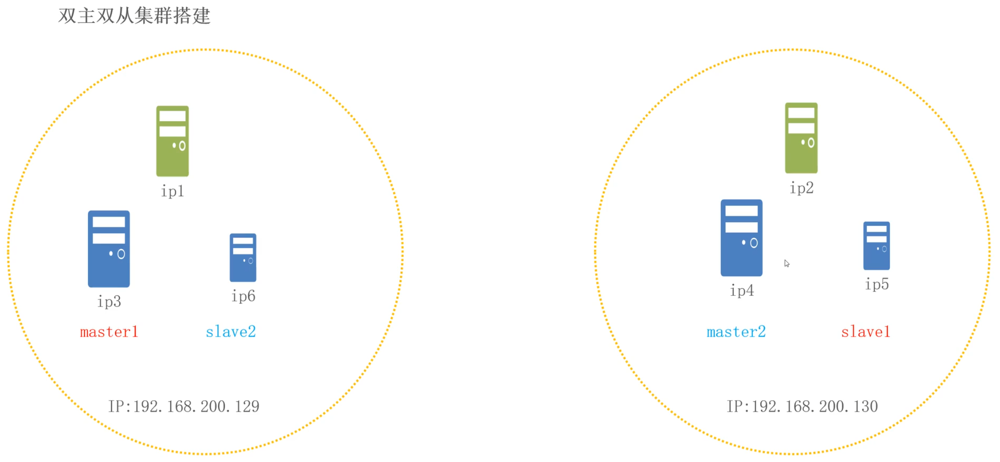


### 5.3 高级特性

**消息存储**

ActivateMQ 存到数据库 速度慢

RocketmQ 存到文件系统 速度快


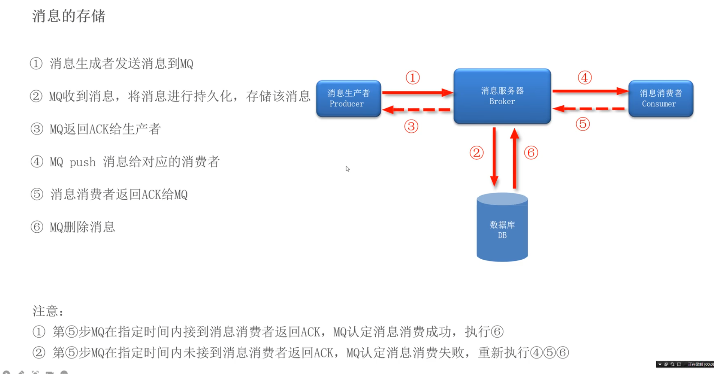


**高效读写**

预先申请空间，实现顺序读写

零拷贝技术，减少一次用户态复制过程


**物理地址**

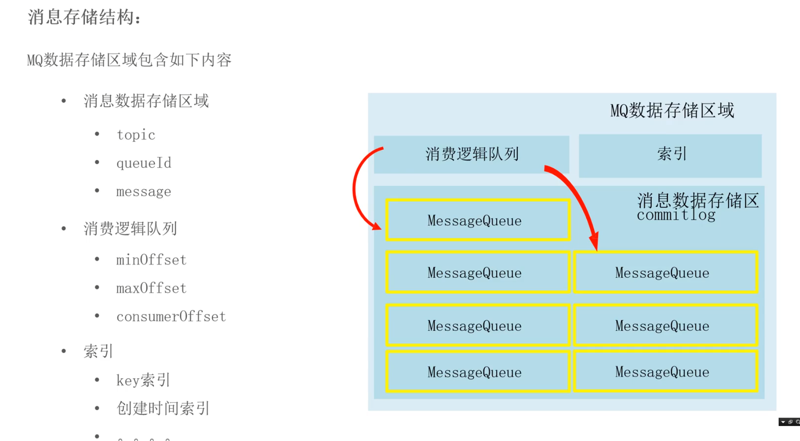


### 5.4 刷盘机制

**刷盘机制**

同步刷盘：安全性高，效率低，速度慢

异步刷盘：安全性低，效率高，速度快


**刷盘方式**

flushDiskType = SYNC_FLUSH

SYNC_FLUSH 同步刷盘

ASYNC_FLUSH 异步刷盘


**同步刷盘**

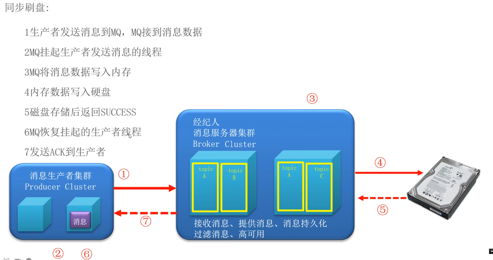


**异步刷盘**

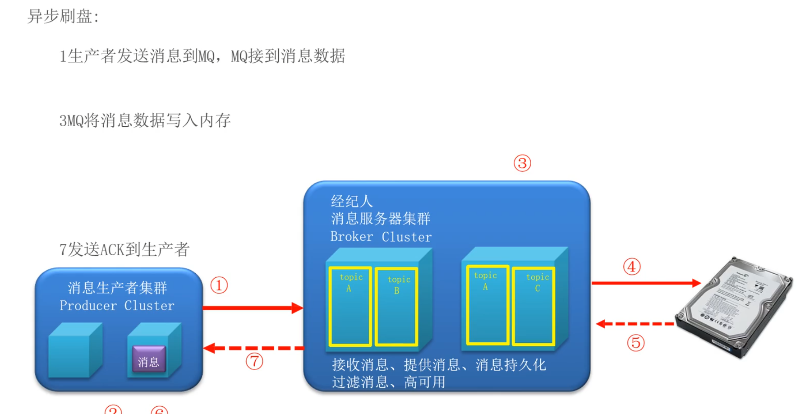


**高可用**

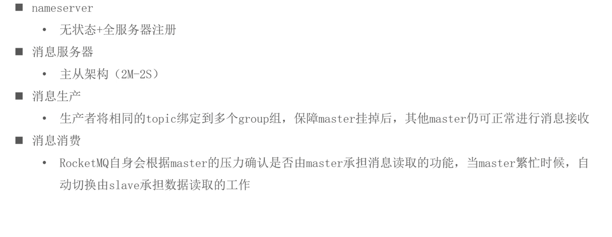


**主从复制**

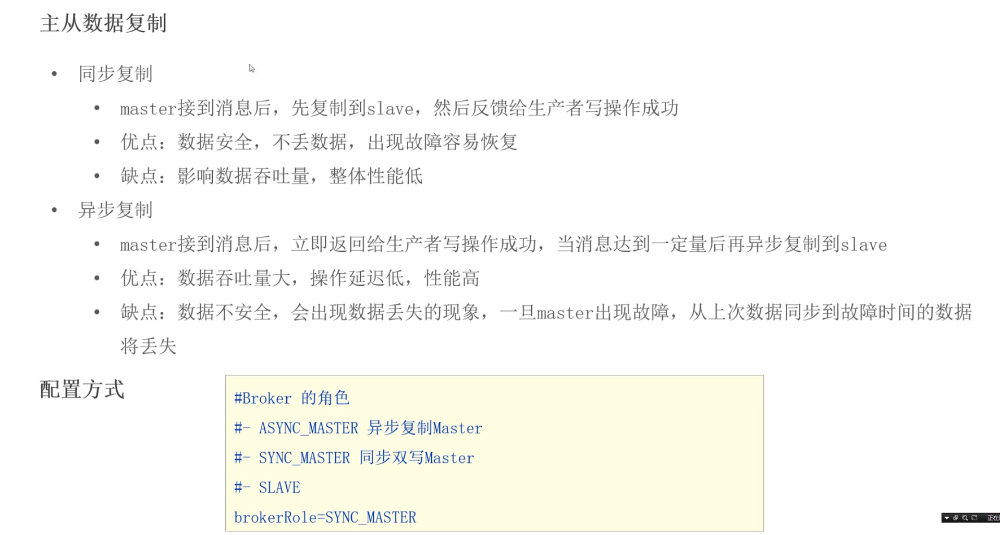


### 5.6 负载均衡

生产者负载均衡 轮训

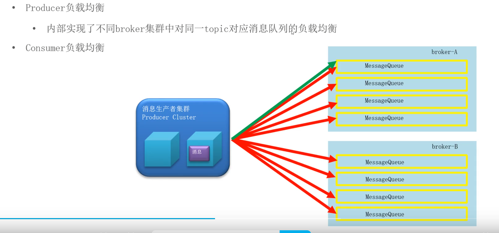


消费者负载均衡 循环平均分配

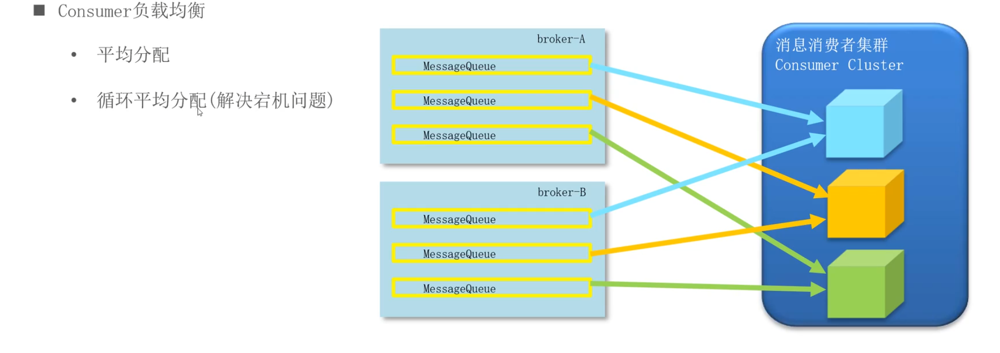


### 5.7 消息重试

**消息重试**

当信息消费后，未正常返回消费成功的信息，将启动消息重试机制


**有序消息重试**

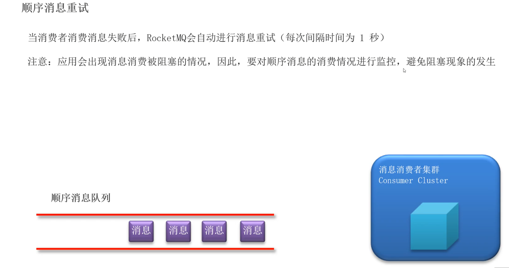


**无序消息重试**

除了有序消息其他都是无序消息

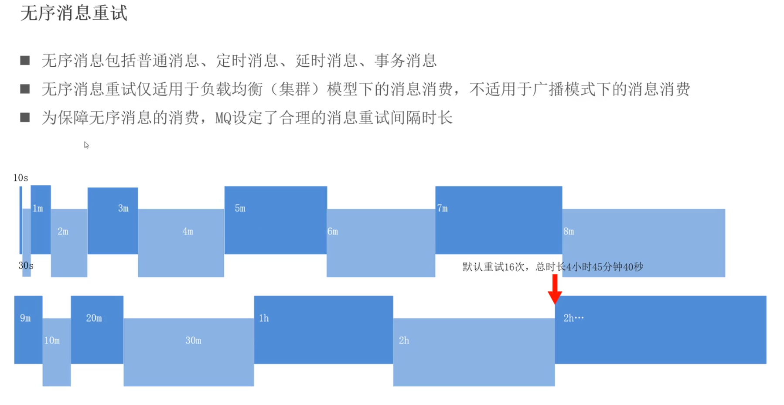


**死信队列**

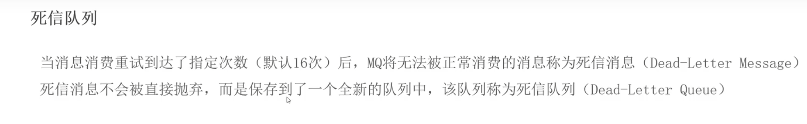


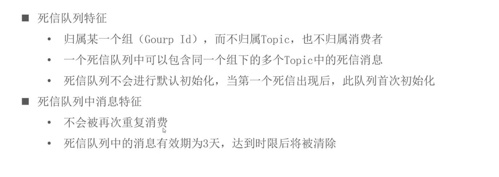

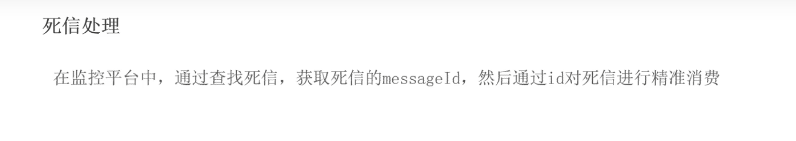


### 5.9 消息重复消费

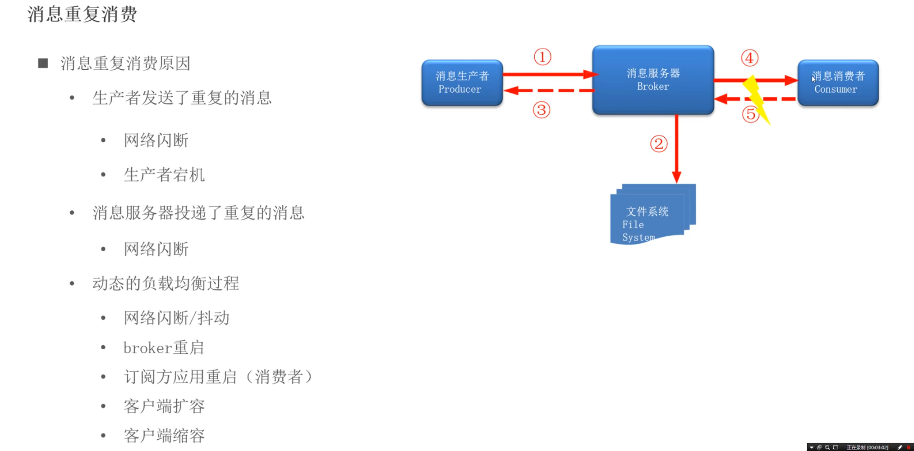


**消息幂等**

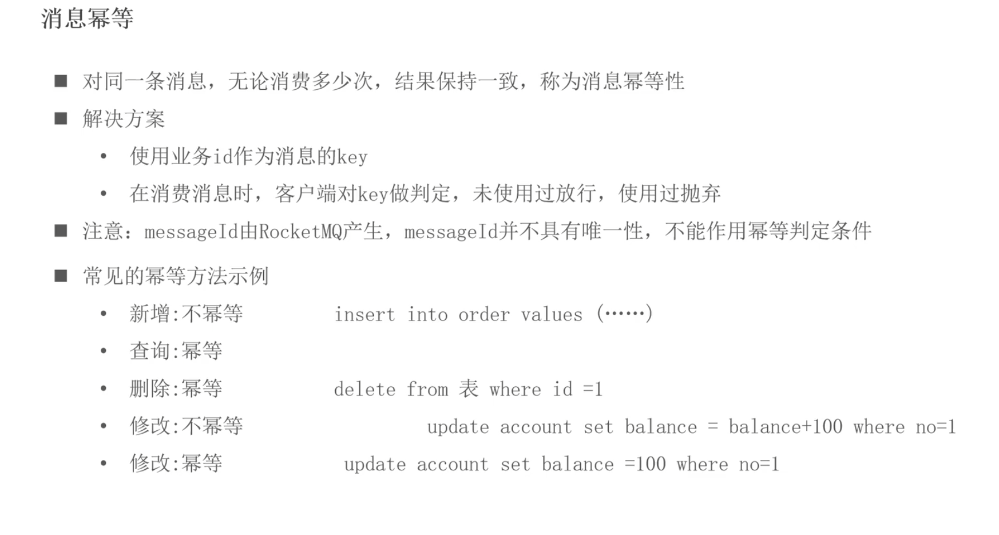


### 5.10 其他问题解决方案


**多主多从架构**

同步复制

异步刷盘


**解决消息丢失**

发送丢失

重试 


**消息丢失**

多主多从

异步刷盘加同步复制


**消费丢失**

消息重试 死信队列


**消息重复**

幂等性

去重表


**怎么确保消息有顺序**

一个主题里只放一个队列

不能使用并发

