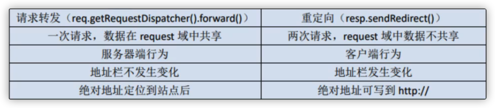

---

title: servlet教程

date: 2021-11-15 19:42:45

---

## 第1章 简介


### 1.1 服务器
开源服务器 
tomcat，jetty


### 1.2 创建servlet
```java
public class myservlet extends HttpServlet{

}
```


### 1.3 web.xml配置

```java
加载时机：
<load-on-startup>
0或正数：启动程序时创建，越小优先级越高
负数：访问时才创建
```


### 1.4 注解

@WebServlet(value="/home",loadOnStartup=0)

有注解之后就可以不用web.xml

老版本2.5以下不支持注解

注解和web.xml同时生效


## 第2章  request

### 2.1 常用方法
1. 获取请求时的完整路径
2. 获取请求时的部分路径
3. 获取请求时的参数字符串
4. 获取请求方式
5. 获取当前协议版本
6. 获取站点名


### 2.2 获取请求参数


### 2.3 解决乱码问题

`req.setCharacterEncoding("UTF-8");`


### 2.4 请求转发

特点：  

1）服务器行为  

2）地址栏不发生改变  

3）只有一次请求   

4）可以多次跳转，数据一直共享  


```java
//可以调转到servlet 或者WEB-INF目下的文件
req.getRequestDispatcher("s02").forward(req,resp);
req.getRequestDispatcher("index.html").forward(req,resp);
```


### 2.5 域对象

在01里设置内容，请求转发  

在02里接收内容  


## 第3章 reponse

### 3.1 response响应数据
不能同时使用


### 3.2 解决乱码问题


### 3.3 重定向

特点：  

1）客服端行为  

2）两次请求  

3）地址栏发生改变  

4）参数不能共享  


### 3.4 重定向和请求转发的区别




## 第4章 cookie

### 4.1 cookie简介
浏览器技术，存在客户端  

应用：记住密码，广告优化  


### 4.2 创建和发送cookie
创建cookie对象  

Cookie cookie = new Cookie("uname","zhangsan")  


发送cookie对象  

response.addCookie(cookie)  


### 4.3 获取cookie
```java
Cookie[] cookies = request.getCookies();
if(cookies !=null && cookies.length>0){
    for(Cookie e : cookies){
        System.out.printIn(e.getName())
        System.out.printIn(e.getValue())
    }
}

```


### 4.4 cookie到期时间

负整数  

不存储, 浏览器关闭就会消失  


正整数   

表示存储的秒数  


零   

表示删除该cookie  


### 4.5 注意事项

1）cookie仅保存在当前浏览器中，不能跨浏览器

2）中文问题


3）同名问题，直接覆盖原有的

4）浏览器中cookie的存放数量，有上限的，由浏览器决定，后期结合session跟踪


### 4.6 路径


## 第5章 session会话

### 5.1 session
有就显示，没有就新建一个  

session底层依赖cookie  

```java
HttpSession session = request.getsession();
String id = session.getId();
```


### 5.2 域对象

只要没有销毁，数据就一直共享，不管是转发还是重定向  

request域对象重定向后失效  

创建session
```java
HttpSession session = request.getsession();
session.setAttribute("uname","admin");
```


### 5.3 销毁

默认30分钟，可以在web.xml项目里更改，但是会影响整个项目
```xml
<session-config>
    <session-timeout>30</session-timeout>>
</session-config>
```


自定义时间  

`session.setMaxInactiveInterval(15)`


立刻销毁  

`session.invalidate()`  


关闭浏览器  

关闭浏览器会话失效  


关闭服务器

关闭服务器会话失效


## 第6章 ServletContext对象

### 6.1 context对象
每个web应用只有一个context对象，

作用：共享数据

只要服务器不关闭，context就存在


### 6.2 获取


### 6.3 常用方法


## 第7章 文件上传下载
### 7.1 文件上传
前台发送文件，后台接收保存文件
```html
<form method="post" action="upload" enctype="multipart/form-data">
    姓名： <input type="text" name="uname"> <br>
    文件： <input type="file" name="myfile"> <br>
    <button type="submit">提交</button>
</form>
```

```java
package com.example.servletstudy;

import java.io.*;
import javax.servlet.ServletException;
import javax.servlet.http.*;
import javax.servlet.annotation.*;

@WebServlet( value = {"/upload"})
@MultipartConfig   //文件上传的注解
public class upload extends HttpServlet {

    @Override
    protected void service(HttpServletRequest req, HttpServletResponse resp) throws IOException, ServletException {
        System.out.println("文件上传");

        //解决中文乱码问题
        req.setCharacterEncoding("UTF-8");

        //获取参数
        String uname = req.getParameter("uname");
        System.out.println(uname);

        //获取part对象
        Part part = req.getPart("myfile");

        //得到文件名
        String filename = part.getSubmittedFileName();
        System.out.println(filename);

        //得到文件路径
        String filepath = req.getServletContext().getRealPath("/");
        System.out.println(filepath);

        //上传到指定目录
        part.write(filepath+'/'+filename);


    }

}
```


### 7.2 文件下载（超链接）

页面放在webapp下，可以直接通过浏览器地址直接访问

放在WEB-INF文件夹下，是受保护的，无法通过地址直接访问


构建项目时，把工件设置为 /s01  项目名的意思

外部源，是项目中的一些图片视频等资源，设置成  /s01/asset


超链接会自动展示txt或图片，点击后不会自动下载

无法识别的格式如压缩文件，点击后自动下载

如果需要自动下载图片，需要在标签上加 download

```html
<!DOCTYPE html>
<html lang="en">
<head>
    <meta charset="UTF-8">
    <title>Title</title>
</head>
<body>
<!--超链接方式下载-->
    <a href="asset/ewshop.zip">压缩文件超链接方式下载</a>

<!--编程方式下载-->
    <br>
    <from action="downloadServlet">
        文件名： <input type="text" name="fileName" placeholder="请输入要下载的文件名">
        <br>
        <button type="submit">下载</button>

    </from>
</body>
</html>
```


### 7.3 文件下载（后台）

```java
//
// Source code recreated from a .class file by IntelliJ IDEA
// (powered by FernFlower decompiler)
//

package com.example.servletstudy;

import java.io.File;
import java.io.FileInputStream;
import java.io.IOException;
import java.io.InputStream;
import javax.servlet.ServletOutputStream;
import javax.servlet.annotation.WebServlet;
import javax.servlet.http.HttpServlet;
import javax.servlet.http.HttpServletRequest;
import javax.servlet.http.HttpServletResponse;

@WebServlet({"/downloadServlet"})
public class download extends HttpServlet {
    public download() {
    }

    protected void service(HttpServletRequest req, HttpServletResponse resp) throws IOException {
        System.out.println("文件下载");
        req.setCharacterEncoding("UTF-8");
        resp.setContentType("text/html;charset=UTF-8");
        System.out.println(req.getParameter("fileName"));
        String filename = req.getParameter("fileName");
        if (filename != null && !"".equals(filename.trim())) {
            String path = req.getServletContext().getRealPath("/asset/");
            File file = new File(path + filename);
            if (file.exists() && file.isFile()) {
                resp.setContentType("application/x-msdownload");
                resp.setHeader("Content-Disposition", "attachment;filename=" + filename);
                InputStream in = new FileInputStream(file);
                ServletOutputStream out = resp.getOutputStream();
                byte[] bytes = new byte[1024];
                boolean var9 = false;

                int len;
                while((len = in.read(bytes)) != -1) {
                    out.write(bytes, 0, len);
                }

                out.close();
                in.close();
            } else {
                resp.getWriter().write("文件不存在");
                resp.getWriter().close();
            }

        } else {
            resp.getWriter().write("请输入下载的文件名");
            resp.getWriter().close();
        }
    }
}
```


## 第8章 JSP模板

### 8.1 JSP基础语法

**简介**

jsp 相比 html，html只能提供静态数据，jsp能嵌套java代码，提供动态数据

jsp 相比 servlet，servlet不适合数据排版，jsp作为数据视图模板来使用

jsp 本质其实就是一个servlet的封装


**注释**

```jsp
<%-- JSP注释 --%>
```


**java**脚本

```jsp
<%
	Sring str = "hello world"
     System.out.println(str);
%>
```


### 8.2 JSP的指令标签

**静态包含**

将两个jsp文件合并到一起，只生成一个servlet，所以不能有同名变量，耦合高

```jsp
<%@include file="head.jsp" %>
```


**动态包含**

生成多个源码文件，可以传入参数

```jsp
//不传参的  两个标签之间不能有任何内容
<jsp:include page="head.jsp" ></jsp:include>

//需要传参的
<%
	String str = "hello";
%>

<jsp:include page="head.jsp" >
	<jsp:param name="uname" value="admin"/>
    <jsp:param name="msg" value="<%=str%>"/>
</jsp:include>

```


### 8.3 JSP的四大域对象

**page**

只在一个页面中保存，跳转后无效

```jsp
<%
pageContext.setAttribute("name1","zhangsan");
pageContext.getAttribute("name1")
%>
```


**request**

只在一次请求中保存，跳转后依然有效

```jsp
<%
request.setAttribute("name1","zhangsan");
request.getAttribute("name1")
%>
```


**session**

在一次会话范围中，无论何种跳转都可以使用

```jsp
<%
session.setAttribute("name1","zhangsan");
session.getAttribute("name1")
%>
```


**application**

在整个服务器上保存

```jsp
<%
application.setAttribute("name1","zhangsan");
application.getAttribute("name1")
%>
```


### 8.4 EL表达式的使用

**获取简单对象**

```jsp
//获取变量
获取局部变量: ${str}
获取域对象: ${uname}   //获取域对象从 page -> application查找

//如果有变量名冲突 可指定域对象
page范围: ${pageScope.uname}
request范围: ${requestScope.uname}
session范围: ${sessionScope.uname}
application范围: ${applicationScope.uname}
```


**获取复杂数据**

```jsp
//设置List
<%
	List<String> list = new ArrayList<>();
	list.add("aaa");
	list.add("bbb");
	request.setAttribute("list",list)
%>

//获取List
获取list的大小: ${list.size()}
获取list指定下标的值: ${list[1]}

//设置map
<%
	Map map = new HashMap();
	map.put("aaa",1);
	map.put("bbb","22");
	request.setAttribute("map",map)
%>


//获取map
${map.aaa}
${map["bbb"]}


//设置javaBean
<%
	User user = new User();
	user.setID(1);
	user.setUsername("wl");

	request.setAttribute("user",user)
%>

//获取javaBean
获取javaBean对象: ${user}
获取javaBean对象属性: ${user.username}
```


**empty**

```jsp
${empty str}
${!empty str}
```


**EL运算**

 ```
 ${a == b}
 ${a eq b}
 ${a == "cc"}
 ${a > b}
 ${a < b}
 ${a >= b}  
 
 ${a + b}
 ${a - b}
 ${a * b}
 ${a / b}
       
 ${a && b}
 ${a || b}
 ```


### 8.5 JSTL

**JSTL简介**

JSP标准标签库，定制标签类库的集合


根据JSTL标签所提供的功能，可以将其分为5个类别。

-   核心标签
-   格式化标签
-   SQL 标签
-   XML 标签
-   JSTL 函数


**标签的使用**

下载所需要的 jar包 

jstl.jar，standard.jar


WEB-INF 下创建lib目录，拷贝jar包到目录下

idea设置项目结构，点击模块，点击依赖，点击加号

新增上面创建的lib目录，勾选确定


开头引入该依赖

```jsp
<%@ taglib prefix="c" uri="http://java.sun.com/jsp/jstl/core" %>
```


页面内使用

```jsp
<c:if test="${1==1}">
    如果为真,则显示该内容
</c:if>
```


**条件动作标签**

if 标签

```jsp
//test表示判断里面写条件
//var表示将结果返回给变量
//scope表示将变量放到那个域对象中
<c:if test="${num > 0}" var="flag" scope="request">
    如果为真,则显示该内容
</c:if> 

//查看判断的结果
${flag}

//jstl中没有else功能,但可以用完全相反的结果来实现
<c:if test="${num <= 0}" var="flag" scope="request">
    如果为真,则显示该内容
</c:if> 
```


switch 标签

```jsp
<c:choose>
    //在choose中不能使用if标签,但在when中可以使用if标签
	<c:when test="score < 60">
    	<h2>你没及格</h2>
    </c:when>
    
    <c:when test="score == 60">
    	<h2>及格了</h2>
    </c:when>
    
    <c:otherwise>
    	<h2>很优秀</h2>
    </c:otherwise>
</c:choose>
```


**迭代标签**

foreach 标签

```jsp
// begin="开始数" end="结束数" step="迭代数" var="限域变量名"

<c:forEach begin="0" end="10" step="1" var="i">
    标题 ${i}
</c:forEach>

<c:forEach items="${userList}"  var="user">
    <td>${user.id}</td>
       <td>${user.name}</td>
        
</c:forEach>
```


**格式化动作标签**

format

