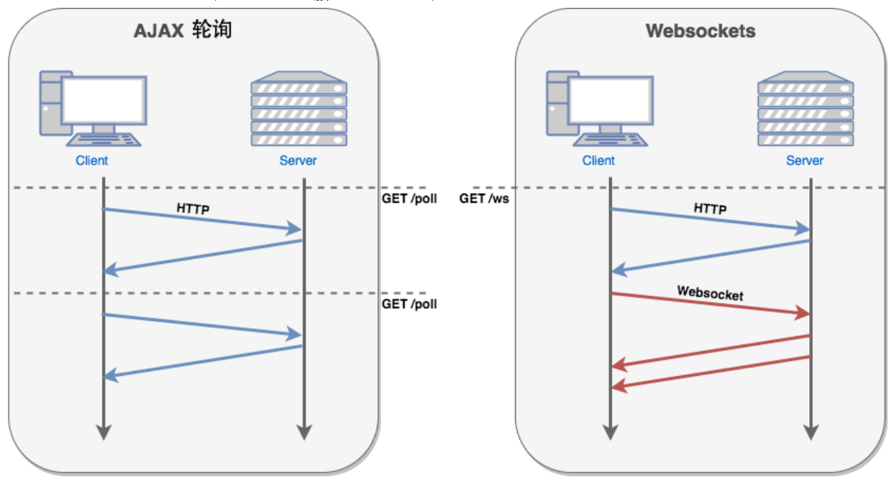
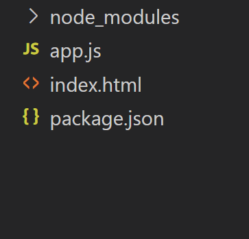
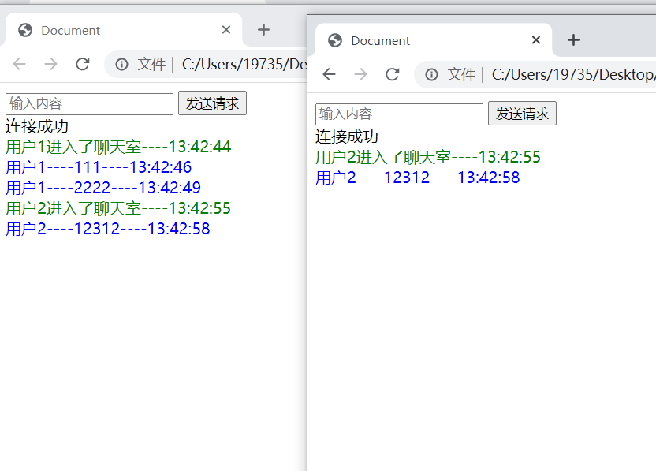

## 第1章 socket介绍

### 1.1 概念

websocket

websocket 协议是基于tcp的一种新的网络协议 , 实现了浏览器与服务器全双工通信 , 允许服务器主动发送数据给客户端


ajax轮询

只有客户端发送消息的时候, 服务端才能与客户端通信


### 1.2 原理




WebSocket 使得客户端和服务器之间的数据交换变得更加简单，允许服务端主动向客户端推送数据。在 WebSocket API 中，浏览器和服务器只需要完成一次握手，两者之间就直接可以创建持久性的连接，并进行双向数据传输。


在 WebSocket API 中，浏览器和服务器只需要做一个握手的动作，然后，浏览器和服务器之间就形成了一条快速通道。两者之间就直接可以数据互相传送。


现在，很多网站为了实现推送技术，所用的技术都是 Ajax 轮询。轮询是在特定的的时间间隔（如每1秒），由浏览器对服务器发出HTTP请求，然后由服务器返回最新的数据给客户端的浏览器。这种传统的模式带来很明显的缺点，即浏览器需要不断的向服务器发出请求，然而HTTP请求可能包含较长的头部，其中真正有效的数据可能只是很小的一部分，显然这样会浪费很多的带宽等资源。


HTML5 定义的 WebSocket 协议，能更好的节省服务器资源和带宽，并且能够更实时地进行通讯。


### 1.3 第三方库

goeay  https://www.goeasy.io/

socketio   https://socket.io


## 第2章 websocket入门

### 2.1  入门案例

项目结构



index.html

```html
<!DOCTYPE html>
<html lang="en">
<head>
    <meta charset="UTF-8">
    <meta http-equiv="X-UA-Compatible" content="IE=edge">
    <meta name="viewport" content="width=device-width, initial-scale=1.0">
    <title>Document</title>


    
</head>
<body>
    <input type="text" placeholder="输入内容">
    <button>发送请求</button>
    <div></div>
</body>
</html>

<script>
  var div = document.querySelector("div")
  var button = document.querySelector("button")
  var input = document.querySelector("input")


  const TYPE_ENTER = 0  //用户进入
  const TYPE_LEAVE = 1  //用户离开
  const TYPE_MSG = 2   //用户消息


  var socket = new WebSocket("ws://localhost:3000")

  socket.addEventListener("open",function(){
    div.innerHTML = "连接成功"
  })

  button.addEventListener("click",function(){
    var value = input.value
    socket.send(value)
    console.log(value);
    input.value = ""
  })

  socket.addEventListener("message",function(e){
    var data = JSON.parse(e.data)
    var dv = document.createElement("div")
    dv.innerHTML = data.msg + "----" + data.time

    console.log(e)

    if(data.type==TYPE_ENTER) {
      dv.style.color="green"
    }else if(data.type ===TYPE_LEAVE){
      dv.style.color="red"
    }else if(data.type==TYPE_MSG){
      dv.style.color="blue"
    }

    div.append(dv)

  })

  socket.addEventListener("close",function(){
    div.innerText = "服务断开连接"
    
  })
</script>
```


app.js

```js
const ws = require("nodejs-websocket")

const TYPE_ENTER = 0  //用户进入
const TYPE_LEAVE = 1  //用户离开
const TYPE_MSG = 2   //用户消息


let count = 0


//创建连接
const server = ws.createServer(conn => {
    console.log("新的链接");
    count++
    conn.userName = `用户${count}`

    broadcast({
        type: TYPE_ENTER,
        msg: `${conn.userName}进入了聊天室`,
        time: new Date().toLocaleTimeString()
    })


    //发送消息
    conn.on("text",data=>{
        broadcast({
            type: TYPE_MSG,
            msg: `${conn.userName}----${data}`,
            time: new Date().toLocaleTimeString()
        })
    })


    //关闭连接
    conn.on("close",data=>{
        console.log("关闭连接")
        count--
        broadcast({
            type: TYPE_LEAVE,
            msg: `${conn.userName}离开了聊天室`,
            time: new Date().toLocaleTimeString()
        })
    })

    //异常处理
    conn.on("error",data=>{
        console.log("发生异常") 
    })

})


//广播
function broadcast(msg) {
    server.connections.forEach(item=>{
        item.send(JSON.stringify(msg))
    })
}

//监听端口
server.listen(3000,()=>{
    console.log("监听3000端口")
})
```


效果




### 2.2 基本语法


## 第3章 使用 socketio库

### 3.1  入门案例

安装

```sh
cnpm install socket.io http
cnpm install -D nodemon
```


index.html

```html
<!DOCTYPE html>
<html>
  <head>
    <title>Socket.IO chat</title>
    <style>
      body { margin: 0; padding-bottom: 3rem; font-family: -apple-system, BlinkMacSystemFont, "Segoe UI", Roboto, Helvetica, Arial, sans-serif; }

      #form { background: rgba(0, 0, 0, 0.15); padding: 0.25rem; position: fixed; bottom: 0; left: 0; right: 0; display: flex; height: 3rem; box-sizing: border-box; backdrop-filter: blur(10px); }
      #input { border: none; padding: 0 1rem; flex-grow: 1; border-radius: 2rem; margin: 0.25rem; }
      #input:focus { outline: none; }
      #form > button { background: #333; border: none; padding: 0 1rem; margin: 0.25rem; border-radius: 3px; outline: none; color: #fff; }

      #messages { list-style-type: none; margin: 0; padding: 0; }
      #messages > li { padding: 0.5rem 1rem; }
      #messages > li:nth-child(odd) { background: #efefef; }
    </style>
  </head>
  <body>
    <ul id="messages"></ul>
    <form id="form" action="">
      <input id="input" autocomplete="off" /><button>Send</button>
    </form>
  </body>
</html>


<script src="/socket.io/socket.io.js"></script>
<script>
  var socket = io();

  var form = document.getElementById('form');
  var input = document.getElementById('input');

  form.addEventListener('submit', function(e) {
    e.preventDefault();
    if (input.value) {
      //发送事件
      socket.emit('chat message', input.value);
      input.value = '';
    }
  });
</script>
```


app.js

```js
const express = require('express');
const app = express();
const http = require('http');
const server = http.createServer(app);
const { Server } = require("socket.io");
const io = new Server(server);


//路由到index.html
app.get('/', (req, res) => {
    res.sendFile(__dirname + '/index.html');
});

// 创建连接
io.on('connection', (socket) => {
    console.log('a user connected');

  //接受事件
 socket.on('chat message', (msg) => {
    console.log('message: ' + msg);
  });
    
  //断开连接
    socket.on('disconnect', () => {
      console.log('user disconnected');
    });
  });


//监听端口
server.listen(3000, () => {
  console.log('listening on *:3000');
});
```


package.json

```json
{
  "scripts": {
    "start": "node app.js",
    "dev": "nodemon app.js"
  },
  "dependencies": {
    "http": "^0.0.1-security",
    "socket.io": "^4.5.3"
  },
  "devDependencies": {
    "nodemon": "^2.0.20"
  }
}

```


### 3.2 基本语法

服务端创建和断开连接

```js
// 创建连接
io.on('connection', (socket) => {
    console.log('a user connected');

    
  //断开连接
    socket.on('disconnect', () => {
      console.log('user disconnected');
    });
  });

```


客户端实例化和发送事件

```js
var socket = io();

socket.emit('chat message', input.value);
```


双端发送和接受事件

```js
//接受数据
socket.on("hehe",data => {
	console.log(data)
})

//发送数据
socket.emit("hehe",{ name:"zs" })
```


## 第4章 使用 goeasy库

### 4.1 入门案例


### 4.2 基本语法


