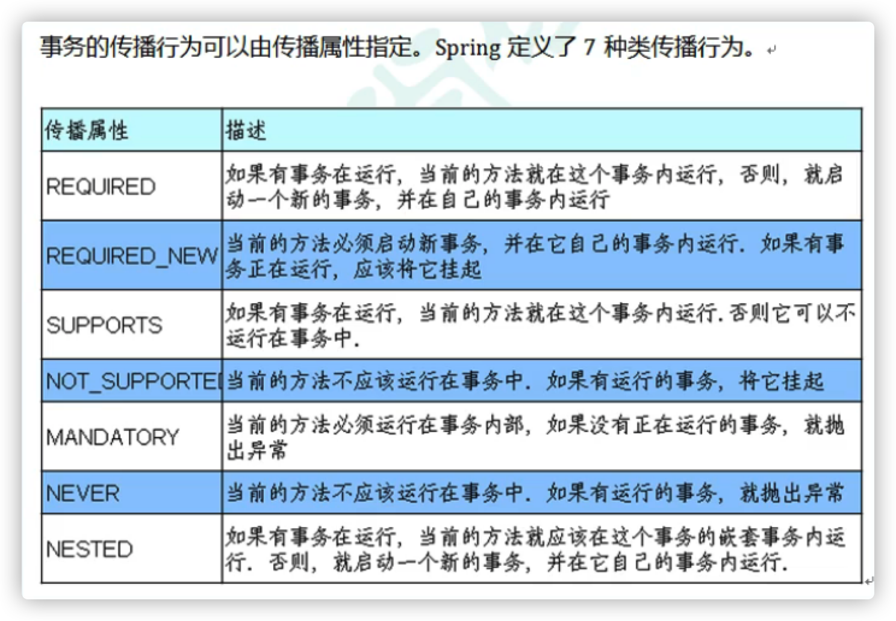

---

title: spring教程

date: 2021-11-15 21:17:21

---


## 一. spring 概念

### 1.1 框架概述

spring是轻量级的开源javaEE框架

spring可以解决企业应用开发的复杂应

spring有两个核心部分，IOC和AOP

IOC：控制反转，把创建对象过程交给spring进行管理

AOP：面向切面，不修改源代码进行功能增强


### 1.2 spring优点

方便解耦，简化开发

Aop编程的支持

方便程序的测试

方便集成各种其他框架

方便进行事物操作

降低API开发难度


## 二. spring IOC

### 2.1 IOC 概念和原理

IOC控制反转：把对象创建和对象之间的调用过程，交给spring进行管理

人话：获得依赖对象的方式反转了

目的：降低代码之间的耦合度

实现方式：DI 依赖注入，依赖查找


### 2.2 IOC 底层原理

XML解析、工厂模式、反射


### 2.3 IOC接口

ICO的思想基于IOC容器完成，IOC容器底层就是对象工厂。

接口实现类：

FileSystemXmlApplicationContext

ClassPathXmlApplicationContext


Spring提供IOC容器实现的两种方式（接口）：

（1）BeanFactory，由spring内部人员使用，不推荐开发者使用

加载配置文件的时候不会创建对象，在获取（使用）时才去创建对象


（2）ApplicationContext，继承BeanFactory，功能拓展增强，开发人员使用

加载配置文件时，就创建了对象。


测试

```java
@Test
    public void test(){
        ApplicationContext content = new ClassPathXmlApplicationContext("beans.xml")
        User user = context.getBean("user01",User.class)
    }
```


### 2.4 IOC 管理 bean

Bean管理过程：

​	1⃣spring创建对象

​	2⃣spring属性注入


Bean管理方式：

​	1⃣基于xml配置文件实现

​	2⃣基于注解方式实现


### 2.5 xml 方式 

开发不推荐 感兴趣自行查找相关资料


### 2.6 注解方式

#### 2.6.1 注解简介

注解作用在类, 方法, 属性上面

简化xml配置

例如 @Text

xml用来管理bean，注解只负责属性的注入


#### 2.6.2 spring 提供常用的注解

web注解, 下面四个注解功能完全相同

`@Component`

`@Mapper`

`@Service`

`@Controller `


配置文件

`@Configuration`

`@ComponentScan(basePackages={"com.example"})`


根据属性类型自动装配

`@Autowired`


但是如果一个接口有多个实现类就会找不到, 需要结合 `@Qualifier` 使用

```java
@Service(value="userService")

@Autowired
@Qualifier(value="userService") ，根据属性名注入
```


`@Resource` ，根据类型

`@Resource(name="userService") `  , 根据名称注入


`@Value(value="abc")` ，注入普通类型属性


### 2.7 bean 的声明周期

(1)通过构造器创建bean实例(无参数构造)

(2)为bean的属性设置值和对其他bean引用(调用set方法)

(3)调用bean的初始化的方法(需要进行配置初始化的方法)

(4)bean可以使用了(对象获取到了)

(5)当容器关闭时候,调用bean的销毁的方法(需要进行配置销毁的方法)


## 三. spring AOP

### 3.1 AOP 概念

 aop就是动态代理的规范化，把动态代理的实现步骤方式都定义好了，用统一的方式，使用动态代理。

面向切面编程，利用AOP可以对业务逻辑的各个部分进行隔离，降低耦合度。

不修改源代码，在主干功能里添加新功能。

例如：登录功能增加权限验证。


### 3.2 AOP原理

#### 3.2.1 动态代理简介

有两种情况：

有接口，使用jdk动态代理，创建实现类的代理对象

没有接口，使用cglib动态代理，创建子类的代理对象


#### 3.2.2 动态代理的作用

​    1）在目标类源代码不改变的情况下，增加业务功能

​    2）减少代码的重复，专注业务逻辑代码

​    3）解耦合，让功能分离


#### 3.2.3 切面 aspect

给你的目标类增加的功能，就是切面。

如日志，事物，统计，检查，验证等。

切面的特点，和业务无关。


切面的三个要素

​    1）切面的功能代码，切面干什么

​    2）切面的执行位置，使用切入点表示切面执行的位置

​    3）切面的执行时间，在目标方法之前，还是目标方法之后


#### 3.2.4 专业术语

`连接点`，连接业务方法和切面的位置，就是类中可以被增强的业务方法

`切入点`，指多个连接点方法的集合，类中实际被增强的连接点

`目标对象`，给哪个类的方法增加功能，这个类就是目标对象

`通知`，实际增强的逻辑部分

`切面`， 把通知应用到切入点的过程


### 3.3 aspectJ

aspectJ：专门的做AOP的框架

spring原生AOP比较笨重，一般使用sping中集成的 aspectJ 框架

   

#### 3.3.1 Advice 通知

切面的执行时间，这个执行时间叫做Advice（通知，增强）

​    在aspectJ框架中，使用注解表示，一共有5个

​    @Before  ，前置通知

​    @AfterReturning ，后置通知

​    @Around ，环绕通知 

​    @AfterThrowing ， 异常通知

​    @After ，最终通知


#### 3.3.2 切面执行的位置

使用的是切入点表达式

​    execution（ 【访问权限】【返回类型】【 类全路径】 【方法名称】【参数列表】）

  ?       表示可选参数

​    \*       表示0至任意多的字符

​    ..      用在方法参数中，表示任意多个参数

​            用在包名后，表示当前包及其子包路径

​    \+       用在类名后，表示当前类及其子类

​            用在接口后，表示当前接口及其实现类


​    举例：

​    execution（public * *（..））

​    指定切入点为：任意公共方法

​    execution（* com.dao.book.add(..））

​    指定切入点为：对该类里面的add方法增强

​    execution（* set*（..））

​    指定切入点为：任意一个以set开始的方法

​    execution（* com.xyz.service.*.*（..））

​    指定切入点为：定义在com.xyz.service包里的任意类的任意方法

​    execution（* *..service.*.*(..)）

​    指定切入点为：定义在所有包下的service子包下所有类中的所有方法为切入点

​    execution（* *.service.*.*(..)）

​    指定切入点为：定义在只有一级包下的service子包下所有类中的所有方法为切入点


切入点抽取

@Pointcut（）


设置优先级

@Order（1）


完全使用注解开发

创建AopConfig类

```java
@Configuration
@ComponentScan(basePackages={"com.example"})
@EnableAspectJAutoProxy(proxyTargetClass=true)
public class AopConfig{
  
}
```


#### 3.3.3 aspectJ使用

加入依赖，spring依赖，aspectJ依赖，junit依赖

创建目标类：被增强类，和增强类

创建切面类：在增强类的上面加上@Aspect，在类中定义方法，在方法上加上通知注解，参数指定切入点表达式

创建spring的配置文件，创建命名空间，声明aspectJ框架中的自动代理生成器标签

创建测试类，从spring容器中获取目标对象，调用方法


### 3.4 aop使用场景

1）当你要给一个系统中存在的类修改功能

2）当你要给项目中的多个类，增加一个相同的功能，使用aop

3）给业务方法增加事物，日志输出


## 四. spring 事物管理

### 4.1 事务概念

#### 4.1.1 基本概念

事务是数据库操作的最基本单元，逻辑上一组操作要么都成功，要么都失败。

例如：银行转账。

底层使用AOP原理。

一般添加到 service 层。


#### 4.1.2 事务的特性 ACID

1. 原子性
2. 一致性
3. 隔离性
4. 持久性


#### 4.1.3 事务管理的核心接口

PlatformTransactionManager 核心接口

DataSourceTransactionManager 实现类（mybatis框架）


#### 4.1.4 事物操作的两种方式

编程式：try catch （代码冗余）

声明式： 注解（推荐） ，xml


### 4.2 声明式事务管理

#### 4.2.1 事务操作过程

1. 开启事务
2. 进行业务操作
3. 没有异常，提交事务
4. 发生异常，事物回滚


#### 4.2.2 完全注解开发

在service类或方法上面，添加注解 @Transactional

添加到类上面为所有方法都开启事物

添加到方法上只为该方法开启事物


创建配置类

```java
@Configuration //配置类
@ComponentScan （basePackages = "com atguigu"）//组件扫描
@EnableTransactionManagement //开启事务
public class TxConfig {
    
  	//创建数据库连接池
    @Bean
    public DruidDataSource getDruidDataSourceO {
        DruidDataSource dataSource = new DruidDataSource(:
        dataSource. setDriverClassName("com mysql. jdbc. Driver");
        dataSource. setUrl("jdbc:mysql:///user_db");
        dataSource. setUsername("root");
        dataSource. setPassword("root");
        return dataSource;
    }
                                                         
		//创建JdbcTemplate对象
    @Bean
    public JdbcTemplate getJdbcTemplate(DataSource dataSource){
        //到ioc容器中根据类型找到dataSource
        JdbcTemplate jdbcTemplate = new JdbcTemplate();
        //注入dataSource
        jdbcTemplate. setDataSource(dataSource);
        return jdbcTemplate;
    }
                                                         
    //创建事务管理器
    @Bean
    public DataSourceTransactionManager getDataSourceTransactionManager (DataSource dataSource){
        DataSourceTransactionManager transactionManager = new DataSourceTransactionManager();
        transactionManager.setDataSource(dataSource);
        return transactionManager;
    }                                                     
                                                         
}
```


#### 4.2.3 相关参数

事物传播行为 ： propagation

前两个使用最多，需要掌握




事物隔离级别：ioslation

三种问题：脏读，不可重复读，虚读

解决：注解中设置参数，mysql默认3级


超时时间：timeout

事物需要在一定时间内进行提交，不提交就回滚

默认值为-1，以秒为单位


是否只读：readonly

查询操作可以设置只读，默认为false


回滚：rollbackfor

设置出现哪些异常进行事物回滚


不回滚：norollbackfor

设置出现哪些异常不进行事物回滚


## 五. spring5 新特性

### 5.1 整合日志框架

### 5.2 Nullable注解

### 5.3 整合Junit框架

### 5.4 WebFlux


## 第6章 模板引擎

### 6.1 jsp

### 6.2 freemarker