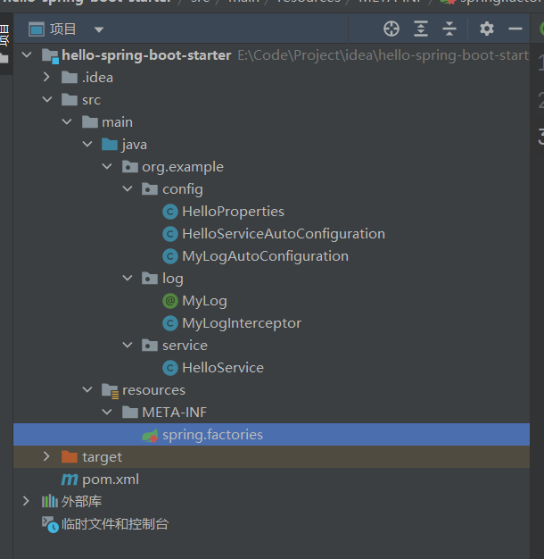
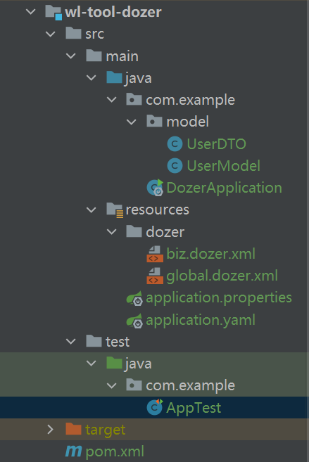

---


title: springboot教程

date: 2021-11-15 21:17:32

---


## 第1章  基础入门 

### 1.1 spring和springboot

SpringBoot优点

​	创建独立的spring应用

​	内嵌tomcat服务器

​	自动starer依赖

​	自动配置spring和第三方功能

​	生产级别的监控，健康检查及外部化配置

​	无代码生成，无需编写xml


### 1.2 基本注解

​	@RestController   代表@responsebody和@controller

​	@GetMapping("/hello")   响应get请求

​	@Configuration  注册配置类

​	@Conditional   条件装配

​	@ImportResources  导入xml配置文件

​	@Component  注册spring组件

​	@ConfigurationProperties（prefix=“user”）自动装配

​	@Value 自动装配


### 1.3 自动配置原理

基于java代码的bean配置

```
@Configuration
```


自动装配条件

```java
//必须错在该类
@ConditionalOnclass({SqlSessionFactory.class , SqlSessionFactoryBean.class})
//必须存在该bean
@ConditionalOnBean(DataSource.class)
```


bean参数获取

```java
//读取配置文件中的信息 封装到该类里
@ConfigurationProperties(prefix = "spring.datasource")
public class DataSourceProperties {
  private String username;
    ...
}
```


bean的发现

```
依赖jar包中的bean是如何被发现的 
@SpringbootApplication -> @EnableAutoConfiguration -> @Import -> getCandidateConfigurations -> loadSpringFactories方法找到META-INF/spring.factories文件 -> 执行xxxAutoConfiguration配置类
```


bean的加载

```
1. 使用@Configuration 和 @Bean 注解
2. 使用@Controller @Service @Repository @Component 
3. @Import
```


引入场景启动器

自动配置版本号，可以在pom的properties标签里修改版本号

```xml
<properties>
<mysql.version>5.1.34</mysql.verison>
</properties>
```

创建父项目，只有pom文件就可以，新建模块为子项目

子项目的parent要引用父项目的坐标

父项目的pom文件只负责管理依赖，使用 `<DepencyManagement>`


依赖排除

```xml
<dependce>
  	<g></g>
		<a></a>
  //要排除的依赖
  	<exclutions>
      <exclution>
   			<g></g>
				<a></a>
      </exclution>
  	</exclutions>
</dependce>
```


- 优点

简化开发 定义了某应用场景里所有需要的jar包 和版本号 以及相关配置

解决了jar包冲突 不用手动导包


- 原理

@SpringBootApplication注解开启了一个@EnableAutoConfiguration注解的自动配置功能, 最终会调用到 loadSpringFactories，这个方法就会读取被 @Configuration 标识的配置类下 META-INF/spring.factories文件

@Condition  是自动配置的条件, 找到该类才自动配置 


### 1.4 lombok简化开发

- `@ToString`  

自动生成 Tostring 方法


- `@Getter/@Setter`  

自动生成 get、set 方法


- `@Data`  

包含：`@ToString`, `@EqualsAndHashCode`, `@Getter`，`@Setter` ，`@RequiredArgsConstructor`  


- `@NoArgsConstructor`  `@RequiredArgsConstructor`  `@AllArgsConstructor`

生成无参的构造函数，生成带有必需参数的构造函数，生成全参的构造函数


- `@slf4j`

自动生成该类的 log 静态常量，要打日志就可以直接打，不用再手动 new log 静态常量了


- `@Builder`

将类转为建造者模式 , 创建对象的时候不用再写很多set

```
User user = User.builder().id(1).name("itcast").age(20).build();
```


- `@EqualsAndHashCode`

自动生成 equals(Object other) 和 hashcode() 方法，包括所有非静态变量和非 transient 的变量


- `@Value`

类似与@Data，但他会把所有的变量都设成 final 的 ，注意没有@setter

包含：`@Getter`，`@ToString`，`@EqualsAndHashCode`，`@RequiredArgsConstructor`


### 1.5 热部署

dev-tools 是热重启


jrebel 是热重载

破解方法

百度有~非常简单


### 1.6 spring Initailizr

web 提供mvc依赖

mysql 提供mysql驱动依赖


## 第2章  配置文件 application.yml

### 2.1 不同环境的配置文件

application.properties：主配置文件

application-dev.properties：开发环境配置文件

application-test.properties：测试环境配置文件

application-prod.properties：生产环境配置文件

`server.port=8080 `

`spring.profiles.active=prod  //激活指定的配置文件`


### 2.2 配置文件的格式

配置文件加载顺序 : properties > yml > yaml

配置按优先级覆盖 : 重叠配置按加载顺序覆盖，其余的互补

企业开发主流使用 yml 格式


### 2.3 配置文件的表示

1. 表示字符串

字符串不需要加引号

单双引号包裹的字符串内可以包含空格, 但是会触发转义如 `\t \n`等


2. yml 表示对象

```yaml
key0:
    key1: value1
    key2: value2
```


3. 数组

```yml
likes: [game,music,sleep]
```

4. 数据引用

```yml
baseUrl: c:\windows
tempUrl: ${baseUrl}\temp
```


### 2.4 配置文件内的提示功能

依赖 spring-boot-configuration-processor

如果还不显示找到 Project Structure 中的 Facets 右边的小绿叶图标 


### 2.5 控制器层读取配置文件的内容

只能一条一条读取

```java
@RestController
public class BookController{
  //使用该注解 可以读取到配置文件yml中的信息
  @Value("${country}")
  private String countryName;
  
  //读取多级属性
   @Value("${country.name}")
  private String countryName;
  
  //读取列表中第2个数据
   @Value("${country[1]}")
  private String countryName;
}
```


把所有配置封装到Environment对象里

```java
@Autowired
private Environment env;

env.getProperties("");
```


把一部分配置封装起来 , 目前主流的方式

```java
//使用spring来管理这个类
@Component
//扫描yml配置前缀为datasource的所有信息
@ConfigurationProperties(prefix = "datasource")
//lombok简化开发
@Data
public class DataSource{
  //所有属性名会一一对应 注入数据
  private String driverClassName;
  ...
}
```


## 第3章  web开发


### 3.1 配置文件

1. 静态资源目录

默认静态资源文件路径在resources目录下的  static ， public ， resources ，META-INF/resources

直接访问 / + 静态资源文件名 即可访问

请求进来，先去找controller能否处理，处理不了交给静态资源，静态资源也无法处理则报错。


2. 修改静态资源目录

```yaml
spring:
    resources:
        static-locations: [classpath:/abc/]
```

通过webjars依赖，添加的包里的静态资源，也会自动映射，可以通过/webjars/  访问


3. 静态资源访问前缀

默认为` /**`  ，可增加前缀 `res`

```yaml
spring:
    mvc:
        static-path-pattern: /res/**
```


### 3.2 欢迎页支持

1. 静态路径下的  index.html

static目录下会自动识别index.html作为欢迎页

但是加了资源前缀会失败。


2. controller 能处理 /index


### 3.3 请求参数注解使用

1. 普通参数与基本注解

注解：

@PathVariable 路径变量、

@RequestHeader 获取请求头、

@ModelAttribute 获取请求、

@RequestParam 获取请求参数、

@MatrixVariable 获取矩阵变量、

@CookieValue 获取cookie值、

@RequestBody 获取请求体


Servlet API：HttpSession、HttpMethod


2. pojo封装过程


3. 参数处理原理

### 3.4 响应数据与内容协商


### 3.5 视图解析与模板引擎


### 3.6 拦截器


### 3.7 跨域


### 3.8 文件上传


### 3.9 异常处理


### 3.10 web原生


### 3.11 嵌入式web容器 


### 3.12 定制化原理 


## 第4章 数据访问


### 4.1 数据源自动配置

注意 5版本和 8版本的mysql驱动不同, 包名加了cj, 以及时区不同

```yml
//5版本
spring:
	datasource:
		driver-class-name: com.mysql.jdbc.Driver
		url: jdbc:mysql://localhost:3306/shiro
		username: root
		password: root123
		
//8版本
		driver-class-name: com.mysql.cj.jdbc.Driver
		url: jdbc:mysql://localhost:3306/shiro?serverTimezone=UTC

```


### 4.2 整合druid

 导入druid-starter坐标

yml配置druid


### 4.3 整合mybaits

需要勾选 mybatis 和 mysql driver

配置数据源

写service层和mapper层进行测试


### 4.4 整合mybatis-plus

spring的脚手架没有mybatisplus

需要引入maven坐标

继承baseMapper类


### 4.5 整合redis


### 4.6 整合mongodb


### 4.7整合es

  

## 第5章 junit5单元测试

### 5.1 整合Junit

使用注解@SpringbootTest在类上, 使用@Test在方法上

如果测试类存在于引导类所在包或子包中无需指定引导类

如果不存在则要指定classes属性

`@SpringbootTest(classes= ...)`


## 第6章 Actutor生产指标监控

could中整合了 不用单独学


## 第7章 springboot核心原理

### 7.1 profile环境切换

命令行优先  


### 7.2 配置加载优先级


### 7.3 自定义starter

项目结构



HelloServiceAutoConfiguration

```java
package org.example.config;

import org.example.service.HelloService;
import org.springframework.beans.factory.annotation.Autowired;
import org.springframework.boot.autoconfigure.condition.ConditionalOnMissingBean;
import org.springframework.boot.context.properties.EnableConfigurationProperties;
import org.springframework.context.annotation.Bean;
import org.springframework.context.annotation.Configuration;

// 自动配置类
@Configuration
@EnableConfigurationProperties(HelloProperties.class)
public class HelloServiceAutoConfiguration {
    @Autowired
    private HelloProperties helloProperties;


    //没有的时候才创建
    @ConditionalOnMissingBean
    //加了bean才会调用
    @Bean
    public HelloService helloService() {
        return new HelloService(helloProperties.getName(),helloProperties.getAddress());
    }
}

```


HelloProperties

```java
package org.example.config;

import org.springframework.boot.context.properties.ConfigurationProperties;

//配置属性类
@ConfigurationProperties(prefix = "hello")

public class HelloProperties {
    private String name;
    private String address;

    @Override
    public String toString() {
        return "HelloProperties{" +
                "name='" + name + '\'' +
                ", address='" + address + '\'' +
                '}';
    }

    public String getName() {
        return name;
    }

    public void setName(String name) {
        this.name = name;
    }

    public String getAddress() {
        return address;
    }

    public void setAddress(String address) {
        this.address = address;
    }
}

```


HelloService

```java
package org.example.service;

public class HelloService {
    private String name;
    private String address;

    public HelloService(String name, String address) {
        this.name = name;
        this.address = address;
    }

    public String sayHello(){
        return "你好,我叫" + name + ",我来自" + address;
    }
}

```


MyLog

```java
package org.example.log;

import java.lang.annotation.ElementType;
import java.lang.annotation.Retention;
import java.lang.annotation.RetentionPolicy;
import java.lang.annotation.Target;

//自定义日志注解

//只能加载方法上
@Target(ElementType.METHOD)
@Retention(RetentionPolicy.RUNTIME)
public @interface MyLog {
    String desc() default "";
}

```


MyLogInterceptor

```java
package org.example.log;

import org.springframework.web.method.HandlerMethod;
import org.springframework.web.servlet.ModelAndView;
import org.springframework.web.servlet.handler.HandlerInterceptorAdapter;

import javax.servlet.http.HttpServletRequest;
import javax.servlet.http.HttpServletResponse;
import java.lang.reflect.Method;

public class MyLogInterceptor extends HandlerInterceptorAdapter {
    private  static final ThreadLocal<Long> startTimeThreadLocal = new ThreadLocal<>();
    public boolean preHandle(HttpServletRequest request, HttpServletResponse response, Object handler) throws Exception{
        HandlerMethod handlerMethod = (HandlerMethod) handler;

        Method method = handlerMethod.getMethod();

        MyLog annotation = method.getAnnotation(MyLog.class);

        if (annotation != null) {
            long startTime = System.currentTimeMillis();
            startTimeThreadLocal.set(startTime);
        }
        return true;
    }


    public void postHandle(HttpServletRequest request, HttpServletResponse response, Object handler, ModelAndView modelAndView) throws Exception {

        HandlerMethod handlerMethod = (HandlerMethod) handler;

        Method method = handlerMethod.getMethod();

        MyLog annotation = method.getAnnotation(MyLog.class);

        if (annotation != null){
            Long startTime = startTimeThreadLocal.get();
            long endTime = System.currentTimeMillis();
            long duration = endTime - startTime;

            String mothodName= method.getDeclaringClass().getName()+"."+method.getName();

            System.out.println("请求url" + request.getRequestURI());
            System.out.println("请求方法名" + mothodName);
            System.out.println("方法描述"+ annotation.desc());
            System.out.println("执行时间" + duration );


        }

        super.postHandle(request, response, handler, modelAndView);

    }


}

```


MyLogAutoConfiguration

```java
package org.example.config;

import org.example.log.MyLogInterceptor;
import org.springframework.context.annotation.Configuration;
import org.springframework.web.servlet.config.annotation.InterceptorRegistry;
import org.springframework.web.servlet.config.annotation.WebMvcConfigurer;

@Configuration
public class MyLogAutoConfiguration implements WebMvcConfigurer {

    public void addInterceptors(InterceptorRegistry registry) {
        registry.addInterceptor(new MyLogInterceptor());
    }
}

```


resources / META-INF / spring.factories

```properties
org.springframework.boot.autoconfigure.EnableAutoConfiguration=\
org.example.config.HelloServiceAutoConfiguration,\
org.example.config.MyLogAutoConfiguration
```


安装到仓库

install插件


推送到私服

deploy插件


开始使用

```java
//pom依赖
<dependency>
      <groupId>org.example</groupId>
      <artifactId>hello-spring-boot-starter</artifactId>
      <version>1.0-SNAPSHOT</version>
    </dependency>
    
    
 //yaml配置文件
 hello:
  name: wl
  address: beijing
  

// 配置controller
package org.example.controller;

import org.example.service.HelloService;
import org.springframework.beans.factory.annotation.Autowired;
import org.springframework.web.bind.annotation.GetMapping;
import org.springframework.web.bind.annotation.RequestMapping;
import org.springframework.web.bind.annotation.RestController;

@RestController
@RequestMapping("/hello")
public class HelloController {
    @Autowired
    private HelloService  helloService;

    @GetMapping("/say")
    @MyLog("sayhello方法")
    public String  say() {
        return helloService.sayHello();
    }
}

```


## 第8章 常用工具集


### 8.1 日志 slf4j

安装

```
集成在lombok里 不需要单独引入
使用注解@slf4j在类上
```


用法

```java
//传入参数
log.info("数据:{},成功{}",Activity_list,num);

//不同级别
log.info("----------------打印info日志----------------------");
log.debug("----------------打印debug日志----------------------");
log.warn("----------------打印warn日志----------------------");
log.error("----------------打印error日志----------------------");
```


配置

```yml
logging:
  file:
    path: ./log/${server.port}
    pattern:
      file: '%d{yyyy/MM/dd HH:mm:ss.SSS} %clr(%-5level) [%magenta(%thread)] %cyan(%logger{15}) : %msg%n'
      console: '%d{yyyy/MM/dd HH:mm:ss.SSS} %clr(%-5level) [%magenta(%thread)] %cyan(%logger{15}) : %msg%n'
```


### 8.2 接口文档 openapi

springboot2.6 以后, 不支持swagger2

```xml
  <!-- openapi -->
     <dependency>
            <groupId>org.springdoc</groupId>
            <artifactId>springdoc-openapi-ui</artifactId>
            <version>1.6.6</version>
        </dependency>

 <!--配合Swagger2 形成一个knife4j页面 -->  
   <dependency>
            <groupId>com.github.xiaoymin</groupId>
            <artifactId>knife4j-spring-boot-starter</artifactId>
            <version>2.0.4</version>
   </dependency>
```


开启

```yml
springdoc:
  api-docs:
    enabled: true   # 默认就是开启
```


基本注解

```java
//标注控制器
@Tag

//标注接口  
@Operation

//隐藏
@Hidden
```


标注控制器

```java
@Tag(name = "活动控制器")
public class ActivityController {
  
  @Operation(summary = "摘要", 
           description = "详细描述",
            parameters = {
                    @Parameter(name = "auth", 
                               description = "请求头", 
                               in = ParameterIn.HEADER),
                    @Parameter(name = "id", 
                               description = "id", 
                               in = ParameterIn.PATH),
                    @Parameter(name = "param", 
                               description = "参数"),},
            responses = {
              @ApiResponse(responseCode = "400", 
                           description = "400错误")},
            security = @SecurityRequirement(name = "需要认证"))
   public ResultTemplate allActivity(){
     
   }
}
```


参数解析

```java
@Parameter(name = "param", 
           description = "参数"),}
```


访问页面

```java
http://localhost:8080/swagger-ui/index.html
```


### 8.3 mockito 测试


### 8.4 hutool 工具集


### 8.5 阿里oss 对象文件


### 8.6 websocket 聊天


### 8.7 dozer  对象拷贝

目录结构



pom依赖

```xml
 		<dependency>
            <groupId>junit</groupId>
            <artifactId>junit</artifactId>
            <version>4.13.2</version>
            <scope>test</scope>
        </dependency>


        <dependency>
            <groupId>com.github.dozermapper</groupId>
            <artifactId>dozer-spring-boot-starter</artifactId>
            <version>6.5.0</version>
        </dependency>

        <dependency>
            <groupId>org.projectlombok</groupId>
            <artifactId>lombok</artifactId>
        </dependency>
```


application.yaml

```yaml
dozer:
  mapping-files:  # 指定映射文件路径
    - classpath:dozer/global.dozer.xml
    - classpath:dozer/biz.dozer.xml
```


biz.dozer.xml

```xml
<?xml version="1.0" encoding="UTF-8"?>
<mappings
        xmlns:xsi="http://www.w3.org/2001/XMLSchema-instance"
        xmlns="http://dozermapper.github.io/schema/bean-mapping"
        xsi:schemaLocation="http://dozermapper.github.io/schema/bean-mapping
                            http://dozermapper.github.io/schema/bean-mapping.xsd"
>
    <mapping date-format="yyyy-MM-dd" map-id="user">
        <class-a>com.example.model.UserModel</class-a>
        <class-b>com.example.model.UserDTO</class-b>
        <field>
            <a>id</a>
            <b>userId</b>
        </field>

        <field>
            <a>name</a>
            <b>userName</b>
        </field>

        <field>
            <a>age</a>
            <b>userAge</b>
        </field>
        <field>
            <a>address</a>
            <b>address</b>
        </field>

        <field>
            <a>birthday</a>
            <b>birthday</b>
        </field>
    </mapping>

</mappings>
```


global.dozer.xml

```xml
<?xml version="1.0" encoding="UTF-8"?>
<mappings
        xmlns:xsi="http://www.w3.org/2001/XMLSchema-instance"
        xmlns="http://dozermapper.github.io/schema/bean-mapping"
        xsi:schemaLocation="http://dozermapper.github.io/schema/bean-mapping
                            http://dozermapper.github.io/schema/bean-mapping.xsd"
>
    <configuration>
        <date-format>yyyy-MM-dd</date-format>
    </configuration>

</mappings>
```


UserDTO.java

```java
package com.example.model;

import lombok.Data;
@Data
public class UserDTO {
    private String userId;
    private String userName;
    private int userAge;
    private String address;
    private String birthday;
}

```


UserModel.java

```java
package com.example.model;

import lombok.Data;
import java.util.Date;

@Data
public class UserModel {
    private String id;
    private String name;
    private int age;
    private String address;
    private Date birthday;
}

```


AppTest

```java
package com.example;

import static org.junit.Assert.assertTrue;

import com.example.model.UserDTO;
import com.example.model.UserModel;
import com.github.dozermapper.core.Mapper;
import lombok.extern.slf4j.Slf4j;
import org.junit.Test;
import org.junit.runner.RunWith;
import org.springframework.beans.factory.annotation.Autowired;
import org.springframework.boot.test.context.SpringBootTest;
import org.springframework.test.context.junit4.SpringRunner;

/**
 * Unit test for simple App.
 */
@SpringBootTest(classes = DozerApplication.class)
@RunWith(SpringRunner.class)
@Slf4j
public class AppTest 
{
    //注入dozer的mapper对象
    @Autowired
    private Mapper mapper;

	//测试1 有dto对象, 通过反射创建user空对象, 进行赋值
    @Test
    public void test()
    {
        UserDTO userDTO = new UserDTO();
        userDTO.setUserId("100");
        userDTO.setUserName("John");
        userDTO.setUserAge(20);
        userDTO.setAddress("beijing");
        userDTO.setBirthday("2022-2-30");

		// mapper.map方()法用来拷贝 
        //参数 第1个是数据, 赋值到第2个对象上,第3个参数是,指定xml里的map-id
        UserModel user = mapper.map(userDTO,UserModel.class,"user");
        System.out.println(user);
    }


    //测试2 有dto和现有user对象, 进行赋值后,user原有的值也被改变
    @Test
    public void test1()
    {
        UserDTO userDTO = new UserDTO();
        userDTO.setUserId("100");
        userDTO.setUserName("John");
        userDTO.setUserAge(20);
        userDTO.setAddress("beijing");
        userDTO.setBirthday("2022-2-30");

        UserModel user = new UserModel();
        user.setId("50");
        log.info("复制前: {}",user);

        mapper.map(userDTO,user,"user");
        log.info("复制后: {}",user);
    }
}
```


### 8.8 validator 校验

项目结构


依赖

```
```


常用注解

``` sh
@AssertTrue  # 只能为true
@AssertFalse  # 只能为false
@CreditCardNumber  # 形式验证信用卡号
@DecimalMax()  # 只能小于等于该值
@DecimaMin()  # 只能大于等于该值
@Email  # 形式验证邮箱
@Future # 只能是将来日期
@Length(min=,max=)  # 字符串长度
@Max  # 数字只能小于等于该值
@Min()  # 数字只能大于等于该值
@NotNull  # 不能为null
@NotBlank # 不能为空 忽略空格
@NotEmpty  # 不能为空字符串
@Pattern(regex=)  # 必须符合该正则表达式
@URL(protocol=,host,port)  # 检测是否为url
```


## 第9章 freemarker视图模板

### 9.1 概述

Freemarker是一款模板引擎，是一种基于模版生成静态文件的通用工具，它是使用纯java编写的，一般用来生成HTML页面。


注释

```ftl
<#-- freemarker中的注释  -->
```


### 9.2 数据类型

布尔

日期

数值

字符串

sequence

hash


### 9.3 常见指令

assign 自定义变量指令

```jsp
<#assign name> 
  capture this 
</#assign> 
```


if 逻辑判断指令  

```jsp
<#assign age=23>
<#if (age>60)>老年人
<#elseif (age>40)>中年人
<#elseif (age>20)>青年人
<#else> 少年人
</#if>
```


list 遍历指令

```jsp
<#list nameList as names>    
  ${names}   
</#list>
```


switch 开关

```jsp
<#switch x>  
  <#case 1>  
         1  
      <#break>  
  <#case 2>  
         2  
      <#break>  
  <#default>  
         d  
      <#break>  
</#switch>
```


marco 自定义指令

```jsp
<#macro test foo bar="Bar" baaz=-1>
测试和参数：${foo}, ${bar}, ${baaz}
</#宏>
<@test foo="a" bar="b" baaz=5*5-2/>
<@test foo="a" bar="b"/>
<@test foo="a" baaz=5*5-2/>
<@test foo="a"/>
```


import 导入指令

```jsp
<#import "lib/my_test.ftl" as com>
```


include 包含指令

```jsp
<#include "/inc/top.ftl"/>  
```


### 9.4 页面静态化

**概念**

对于数据长期不需要改变的动态页面静态化，让用户访问该页面时不用请求数据库，而是直接请求该静态html即可，减轻对数据库的压力


**定义模板**


**加载模板**


**生成对应的html文件**


### 9.5 运算符

**算数**

**逻辑**

**比较**

**空值**

