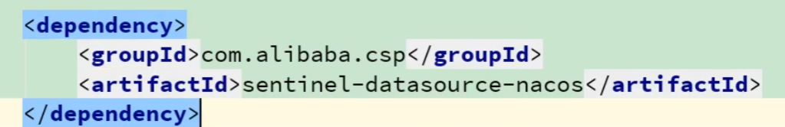
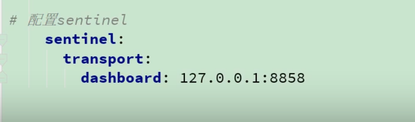
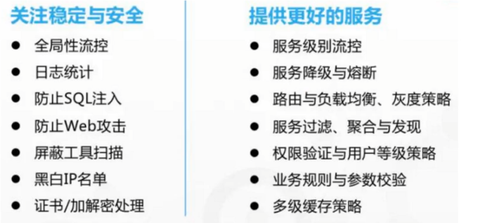
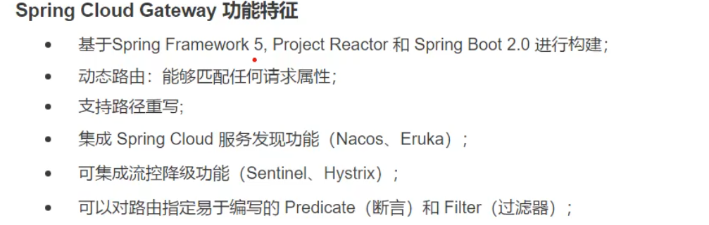

---

title: springcould教程

date: 2021-11-15 15:27:44

---


## 一 . Spring could - 简介

### 1.1 微服务概念

简而言之，就是将一个大型的单机应用系统拆分成若干个小的服务，这些小的服务独立部署，服务与服务之间采用rpc/http轻量协议传输数据，服务间不具有强耦合性，从而实现了单个服务的高内聚，服务与服务之间低耦合的效果。这些一个一个细分的小服务就称之为微服务。


### 1.2 版本对应

毕业版本

[https://github.com/spring-cloud-incubator/spring-cloud-alibaba/wiki/%E7%89%88%E6%9C%AC%E8%AF%B4%E6%98%8E]


**我自己使用的版本**

| Spring Cloud Alibaba Version | Spring Cloud Version    | Spring Boot Version |
| ---------------------------- | ----------------------- | ------------------- |
| 2.2.6.RELEASE                | Spring Cloud Hoxton.SR9 | 2.3.2.RELEASE       |


| Spring Cloud Alibaba Version | Sentinel Version | Nacos Version | RocketMQ Version | Dubbo Version | Seata Version |
| ---------------------------- | ---------------- | ------------- | ---------------- | ------------- | ------------- |
| 2.2.6.RELEASE                | 1.8.1            | 1.4.2         | 4.4.0            | 2.7.8         | 1.3.0         |


**官网推荐的**

组件版本关系

| Spring Cloud Alibaba Version                              | Sentinel Version | Nacos Version | RocketMQ Version | Dubbo Version | Seata Version |
| --------------------------------------------------------- | ---------------- | ------------- | ---------------- | ------------- | ------------- |
| 2021.0.1.0*                                               | 1.8.3            | 1.4.2         | 4.9.2            | 2.7.15        | 1.4.2         |
| 2.2.7.RELEASE                                             | 1.8.1            | 2.0.3         | 4.6.1            | 2.7.13        | 1.3.0         |
| 2.2.6.RELEASE                                             | 1.8.1            | 1.4.2         | 4.4.0            | 2.7.8         | 1.3.0         |
| 2021.1 or 2.2.5.RELEASE or 2.1.4.RELEASE or 2.0.4.RELEASE | 1.8.0            | 1.4.1         | 4.4.0            | 2.7.8         | 1.3.0         |
| 2.2.3.RELEASE or 2.1.3.RELEASE or 2.0.3.RELEASE           | 1.8.0            | 1.3.3         | 4.4.0            | 2.7.8         | 1.3.0         |
| 2.2.1.RELEASE or 2.1.2.RELEASE or 2.0.2.RELEASE           | 1.7.1            | 1.2.1         | 4.4.0            | 2.7.6         | 1.2.0         |
| 2.2.0.RELEASE                                             | 1.7.1            | 1.1.4         | 4.4.0            | 2.7.4.1       | 1.0.0         |
| 2.1.1.RELEASE or 2.0.1.RELEASE or 1.5.1.RELEASE           | 1.7.0            | 1.1.4         | 4.4.0            | 2.7.3         | 0.9.0         |
| 2.1.0.RELEASE or 2.0.0.RELEASE or 1.5.0.RELEASE           | 1.6.3            | 1.1.1         | 4.4.0            | 2.7.3         | 0.7.1         |


毕业版本依赖关系

| Spring Cloud Alibaba Version      | Spring Cloud Version        | Spring Boot Version |
| --------------------------------- | --------------------------- | ------------------- |
| 2021.0.1.0                        | Spring Cloud 2021.0.1       | 2.6.3               |
| 2.2.7.RELEASE                     | Spring Cloud Hoxton.SR12    | 2.3.12.RELEASE      |
| 2021.1                            | Spring Cloud 2020.0.1       | 2.4.2               |
| 2.2.6.RELEASE                     | Spring Cloud Hoxton.SR9     | 2.3.2.RELEASE       |
| 2.1.4.RELEASE                     | Spring Cloud Greenwich.SR6  | 2.1.13.RELEASE      |
| 2.2.1.RELEASE                     | Spring Cloud Hoxton.SR3     | 2.2.5.RELEASE       |
| 2.2.0.RELEASE                     | Spring Cloud Hoxton.RELEASE | 2.2.X.RELEASE       |
| 2.1.2.RELEASE                     | Spring Cloud Greenwich      | 2.1.X.RELEASE       |
| 2.0.4.RELEASE(停止维护，建议升级) | Spring Cloud Finchley       | 2.0.X.RELEASE       |
| 1.5.1.RELEASE(停止维护，建议升级) | Spring Cloud Edgware        | 1.5.X.RELEASE       |


## 二. 阿里nacos - 服务注册与发现

相关技术（eureka停更，consul，zookeeper）


### 2.1 nacos 快速入门


### 2.2 nacos 服务端配置

#### 2.2.1 nacos单机模式部署

startup.cmd

```
set MODE="standalone"
```


#### 2.2.2 nacos集群模式部署

 

1. 下载 nacos 

需要jdk环境

apt install openjdk-8-jre-headless


2. 修改nacos/bin/

```bash
export MODE="cluster"
export JAVA_HOME="/usr/lib/jvm/java-1.8.0-openjdk-amd64"
JAVA_OPT="${JAVA_OPT} -server -Xms64m -Xmx64m -Xmn32m -XX:MetaspaceSize=128m -XX:MaxMetaspaceSize=320m"
```


3. 修改nacos/conf/cluster.conf

```bash	
39.107.251.205:8849
39.107.251.205:8850
```


4. 修改nacos/conf/application.properties

```bash
server.port=8849
spring.datasource.platform=mysql
db.num=1
db.url.0=jdbc:mysql://127.0.0.1:3306/nacos?characterEncoding=utf8&connectTimeout=1000&socketTimeout=3000&autoReconnect=true&serverTimezone=UTC
db.user.0=root
db.password.0=root
```


5. 登录http://ip:port/nacos 

账号 nacos    密码 nacos


### 2.3 客户端配置

网卡配置

端口配置

宕机后是否删除


### 2.4 Ribbon 负载均衡

相关技术 ( spring could loadbalance 功能不全 )

nacos 默认集成 ribbon


#### 2.4.1 客户端使用负载均衡

Ribbon	

默认使用轮训算法


#### 2.4.2 服务端使用负载均衡

nginx

默认使用轮训算法


#### 2.4.3 常见负载均衡算法

随机 RandomRule

轮训 RoundRobinRule

重试 RetryRule

加权轮训 

地址hash 

最小连接数 BestAvailableRile


#### 2.4.4 更改默认的策略

创建配置类方法

创建一个IRule的Bean

要放到不能扫描的地方 或与启动类同级包下

```java
package com.example.ribbon;


//注意这个配置文件不能放在springApplication能自动扫描到的地方

import com.netflix.loadbalancer.IRule;
import com.netflix.loadbalancer.RoundRobinRule;
import org.springframework.context.annotation.Bean;
import org.springframework.context.annotation.Configuration;

@Configuration
public class RibbonConfig {
    @Bean
    public IRule iRule(){
        // 默认负载均衡策略 轮询
        return new RoundRobinRule();
    }

}

```


在启动类上注解

为某个服务开启自定义的ribbon

```java
@RibbonClients(value={@RibbonClient(name="stock-service",configuration = RibbonConfig.class)})
```


#### 2.4.5 自定义策略


#### 2.4.6 使用 spring loadbalancer替换 ribbon

暂时不用替换 


## 三. openFeign - 服务调用

相关技术（Feign停更 , RestTemplate繁琐）


### 3.1  openFeign 的介绍

集成了 spring could netflix Ribbon

替代 RestTemplate , 使用注解的方式调用 Htpp API

支持 spring mvc 注解


### 3.2 openFeign 的使用

maven依赖

```xml
<denpendency>
		<gourpId>org.springframework.could</gourpId>
  	<artifactId>spring-could-starter-openfeign</artifactId>
</denpendency>
```


创建接口

```java
package com.example.order.feign;


import org.springframework.cloud.openfeign.FeignClient;
import org.springframework.web.bind.annotation.RequestMapping;

@FeignClient(name="stock-service",path="/stock")
public interface StockFeignServoce {
    @RequestMapping("/reduce")
    String reduce();
}
```


在控制器内注入 调用

```java
 @Autowired
    StockFeignServoce stockFeignServoce;


String msg = stockFeignServoce.reduce();
```


### 3.3 日志配置

#### 3.3.1 日志级别 

NONE   默认 

BASIC

HEADERS

FULL


#### 3.3.2 日志配置

conifg.OpenFeignConfig

```java
package com.example.order.config;

import feign.Logger;
import org.springframework.context.annotation.Bean;
import org.springframework.context.annotation.Configuration;

//添加@Configuration注解表示全局启用,不加则局部启用
@Configuration
public class OpenFeignConfig {

    @Bean
    public Logger.Level openfeignLoggerLevel() {
        //日志级别
        return Logger.Level.FULL;

    }
}
```


创建一个feign接口

```java
package com.example.order.feign;

@FeignClient(name="product-service",path="/product")
public interface ProductFeignService {
    @RequestMapping("/{id}")
    String get(@PathVariable("id") Integer id);
}
```


在控制器类里调用

```java
@Autowired
    ProductFeignService productFeignService;

String msg2 = productFeignService.get(1);
```


修改主配置yml文件

```yml
# feign的默认级别是debug,spring默认是info,所以不会输出
#单独为feign开启debug级别日志
logging:
  level:
    com.example.order.feign: debug
```


### 3.4 契约配置

将适配springmvc的注解模式 修改为feign原生注解的模式

在配置类里增加一个bean


```java
@Bean
public COntract feignContract(){
  return new Contract.Default();
}
```


### 3.5 超时配置

在配置里增加一个bean

```java
@Bean
public Request.Options options() {
    return new Request.Options(5000,10000);
}
```


### 3.6 自定义拦截器


```java
public class CustomFeignInterceptor implements RequestInterceptor{
  
  @Override
  public void apply(RequestTemplate requestTemplate)
    
}
```


## 四. 阿里 nacos - 服务配置

相关技术（springcould config停更）


为配置文件生成md5  , 每隔几毫秒与上一次md5做对比 , 不同则拉取新配置


### 4.1 快速入门

**引入依赖**

```xml
<!--        nacos 配置中心-->
<dependency>
    <groupId>com.alibaba.cloud</groupId>
    <artifactId>spring-cloud-starter-alibaba-nacos-config</artifactId>
</dependency>
```


**在nacos网页内新增配置**


**开启nacos服务端的权限**

nacos安装目录下的 application.properties  (注意不是springboot的配置文件)

nacos.core.auth.enabled=true


**在程序内新增一个bootstrap.yml文件**

```yml
spring:
  application:
    name: nacos-config-service
  cloud:
    nacos:
      server-addr: 127.0.0.1:8848
      username: nacos
      password: nacos
      config:
        namespace: public
        file-extension: yaml

```


主配置文件application.yml

```yml
server:
  port: 8050

spring:
  application:
    name: nacos-config-service
  cloud:
    nacos:
      server-addr: 127.0.0.1:8848
      cluster-name: DEFAULT_GROUP
      discovery:
        username: nacos
        password: nacos
        namespace: public

```


启动类里感受config自动拉去配置文件

```java
package com.example.stock;

import org.springframework.boot.SpringApplication;
import org.springframework.boot.autoconfigure.SpringBootApplication;
import org.springframework.context.ConfigurableApplicationContext;

import java.util.Date;
import java.util.concurrent.TimeUnit;


@SpringBootApplication
public class ConfigApplication {
    public static void main(String[] args) throws InterruptedException {

        ConfigurableApplicationContext applicationContext = SpringApplication.run(ConfigApplication.class, args);


        //感受nacos配置中心的自动拉取配置文件
        while(true){
            /**
             * 获取nacos配置中心的文件
             * **/

            //从默认配置中读取user.name
            String username = applicationContext.getEnvironment().getProperty("user.name");

            //从默认配置中读取user.age
            String userage = applicationContext.getEnvironment().getProperty("user.age");

            //从shared-configs配置中读取user.config
            String config = applicationContext.getEnvironment().getProperty("user.config");

            //从extension-configs配置中读取user.config
            String ex_config = applicationContext.getEnvironment().getProperty("user.config");

            //从extension-configs配置中读取user.grade
            String ex_grade = applicationContext.getEnvironment().getProperty("user.grade");


            System.out.println(new Date());
            System.out.println(username);
            System.out.println(userage);
            System.out.println(config);
            System.out.println(ex_config);
            System.out.println(ex_grade);
            //每3秒读取一次文件
            TimeUnit.SECONDS.sleep(3);
        }


    }


}
```


### 4.2 其他拓展配置

默认配置(与服务名相同的那个配置文件)和 profile配置


不同的配置项互补 , 相同配置项按优先级覆盖


优先级 : profile > 默认配置 > extension-configs > shared-configs


### 4.3 读取自定义DataID公共配置文件

bootstrap.yml

 ```yaml
 # nacos-config 专用配置文件
 spring:
   application:
     name: nacos-config-service # 默认配置文件与服务名相同
   cloud:
     nacos:
       server-addr: 127.0.0.1:8848
       username: nacos
       password: nacos
       config:
         namespace: public
         file-extension: yaml  # 只针对默认配置文件
 
         # 公共配置
         shared-configs:
           - data-id: com.example.config.properties
             refresh: true
 
         # 拓展配置
         extension-configs:
           - data-id: com.example.extension.yaml
             refresh: true
 
           - data-id: com.example.extension1.yaml
             refresh: true
 
 ```


### 4.4 动态获取配置的值

在项目中读取配置中心的值

使用 `@Value` 注解不能动态感知

要在类上添加注解 `@RefreshScope`

```java
package com.example.stock.controller;


import lombok.extern.slf4j.Slf4j;
import org.springframework.beans.factory.annotation.Value;
import org.springframework.cloud.context.config.annotation.RefreshScope;
import org.springframework.web.bind.annotation.GetMapping;
import org.springframework.web.bind.annotation.RequestMapping;
import org.springframework.web.bind.annotation.RestController;

@Slf4j
@RestController
@RefreshScope
@RequestMapping("/config")
public class ConfigController {

    @Value("${user.name}")
    public String username;

    @GetMapping("/show")
    public String show(){
        log.info("username: {}",username);
        return "自动获取获取username: "+username;
    }

}
```


## 五.  阿里 sentinel - 服务熔断

相关技术（Hystrix停更）


### 5.1 介绍

**Sentinel概念**

阿里巴巴开源的，面向分布式服务架构的高可用防护组件


**Sentinel 对比 Hystrix**


**服务器可用性问题**

负载不均，流量激增，线程池满，缺乏高可用防护，容错机制 ，单点故障，缓存击穿，DB超时，第三方服务卡顿

 

**服务雪崩**

某个小的服务例如积分服务挂了，导致某条链请求异常，而依赖了这条上的某个服务的另一条链也造成了瘫痪，最终因为一个小服务整个项目挂了


**容错机制**

请求限流，服务降级，过载直接拒绝请求，线程隔离，熔断，热点防护，整形


### 5.2 入门

**pom.xml 引入依赖**

```xml
<!--        sentinel 场景-->
        <dependency>
            <groupId>com.alibaba.cloud</groupId>
            <artifactId>spring-cloud-starter-alibaba-sentinel</artifactId>
        </dependency>
```


**application.yml**

```yml
server:
  port: 8020

spring:
  application:
    name: order-sentinel
  cloud:
    sentinel:
      transport:
        dashboard: 127.0.0.1:8858
```


#### 5.2.2 启动本地服务端

```bash
java -Dserver.port=8858 -jar sentinel-dashboard-1.8.1.jar
```


访问端口后即可在网页控制台看到信息

```text
http://127.0.0.1:8858/   # 用户名 sentinel 密码 sentinel
```


### 5.3 流程控制

服务提供端


#### 5.3.1 阈值类型

QPS流控  每秒访问次数


线程流控  并发线程数


#### 5.3.2 流控模式

**直接**

只影响本资源


**关联**

只影响设置关联的资源

当前有两个资源，一个生成订单，一个查询订单，当生成订单访问量大的时候，限流查询订单，以保证生成订单能占用到大量资源，查询订单和生成订单相比，生成订单更加重要。

具体操作，点击查询订单资源的流控按钮，资源为查询订单（对谁流控资源就是谁），关联资源为生成订单（关联的资源压力大的时候，限制当前资源的访问）。


```java
package com.example.order.controller;


import org.springframework.web.bind.annotation.GetMapping;
import org.springframework.web.bind.annotation.RequestMapping;
import org.springframework.web.bind.annotation.RestController;


@RestController
@RequestMapping("/order")
public class OrderController {


    //生成订单
    @GetMapping("/add")
    public String add(){
        System.out.println("生成订单");

        return "生成订单";
    }

    //查询订单
    @GetMapping("/get")
    public String get(){
        System.out.println("查询订单");

        return "查询订单";
    }
}

```


**链路**

影响入口资源

当前有个资源叫 `getUser方法`，有两个接口`test1` `test2`里调用了该方法，当getUser方法调用次数过多时，限制test1接口，不限制test2接口。

具体操作，在getUser方法上声明为Sentinel资源，点击该资源的流控按钮，设置入口资源为test1接口。

需要在application.yml中关闭链路收敛

```yml
```


#### 5.3.3 流控效果

`快速失败` 直接拒绝


`warm up`  预热时间 

预热时长 5s 

适合洪峰流量

在5秒内，从预热因子默认为3，慢慢增长到指定的阈值


`排队等待` 超时时间

超时时间 5s 

适合脉冲流量


#### 5.3.4 全局异常和自定义异常处理

自定义异常处理

```java
@SentinelResource(value="getUser",blockHandler="blockHandlerGerUser")
public String getUser(){
    return "查询用户";
}

//自定义异常处理方法
public String blockHandlerGerUser(BlockException e){
    return "查询用户";
}
```


### 5.4 降级规则

只能对弱依赖降级 针对服务消费端的


#### 5.4.1 过程解析

请求按比例进来 比如10个中有1个是慢调用就进入熔断


在熔断时间过后 进入半开状态 

半开状态只要有一次出现慢调用再次熔断


#### 5.4.2 熔断策略

慢调用比例


异常比例


异常数


### 5.5 热点规则


### 5.6 系统规则


### 5.7 规则持久化

sentinel 默认配置保存在内存中 重启服务后丢失


pull 拉模式


push 推模式 结合 nacos配置中心



只能从nacos中拉 , 在sentinel中修改配置后无法推送给nacos , 需要寻找其他方法


### 5.8 整合openfeign


### 5.9 整合getway

依赖

```xml
<!--        sentinel 整合gateway-->
<dependency>
    <groupId>com.alibaba.cloud</groupId>
    <artifactId>spring-cloud-alibaba-sentinel-gateway</artifactId>
</dependency>
```




## 六. 阿里 seata - 事物

相关技术（）

分布式事务解决方案

一般来说 分布式事物不用seata , 除非某些纯金融类应用 如支付宝

普通项目用 消息队列控制事物


### 6.1 事物概念

**本地事物**

Transactional


**事物特性**

原子性，一致性，隔离性，持久性


**分布式事物**

**事务模式**

AT (seata)  TCC(MQ)   SAGA   XA 


**事务协议**

两阶段 (2PC)   三阶段 (3PC)


### 6.2 AT模式

**Seata概念**

采用二阶段 , 无侵入式分布式事物解决方案


**Seata三个角色**

TC 事务协调者 驱动全局事务提交或回滚

TM 事务管理器 定义全局事务的范围, 开始全局事务, 提交或回滚全局事务

RM 资源管理器 管理分支事务处理的资源


 **一阶段** 

劫持sql 解析sql语义 保存快照`before image`

执行sql 保存新快照`after image` 生成行锁

提交业务sql  `undo log`  `redo log` 


**二阶段 回滚**

校验脏写 : 对比 `after image` 和 `数据库数据`

还原数据 : `before image` `逆向sql` `数据还原`

删除中间数据 : 删除 `before image`  删除 `after image`  删除 `行锁`


**二阶段 提交**

删除中间数据 : 删除 `before image`  删除 `after image`  删除 `行锁`


### 6.3 TCC模式

**TCC**

侵入式比较强 , 需要自己实现相关业务逻辑

没有锁的概念 , 性能更强

使用 MQ 保证可靠消息最终一致性方案


**Try阶段** 

```java
public void Try() {
	sendMQ
}
```


**Confirm**

```java
public void Confirm() {
    try{
       sendCommit();
    }catch(){
        Cancel()
    }
}
```


**Cancel**

```java
public void Cancel() {
    deleteMQ()
}
```


### 6.4 AT入门案例

开启注解

`@GlobalTransacational`


下载 TC 服务端

https://github.com/seata/seata/releases


seata / conf / file.conf

 ```
 mode = "file"   // 还以 mysqlDB  和 redis 
 ```


## 七. spring Cloud gateway - 服务网关

相关技术（zuul停更，zuul2停更）


### 7.1 简介

无网关的架构的问题

每个业务都需要鉴权 , 限流 , 跨域 等逻辑

多个微服务域名不同 , 存在数百个不同的域名


采用网关的架构的优点






### 7.2 入门案例

**依赖**

```xml
<!-- 不能加入springmvc依赖-->

<!--        网关 场景-->
<dependency>
      <groupId>org.springframework.cloud</groupId>
      <artifactId>spring-cloud-starter-gateway</artifactId>
</dependency>
```


 **application.yml配置**

```yml
server:
  port: 8088

spring:
  application:
    name: api-gateway
  cloud:
    nacos:
      server-addr: 127.0.0.1:8848
      cluster-name: DEFAULT_GROUP
      discovery:
        username: nacos
        password: nacos
        namespace: public
    gateway:
      discovery:
        locator:
          enabled: true # 自动匹配服务名
          
#      手动配置方式     
#      routers:
#        - id: order_router  # 路由唯一表示
#          url: lb://order-service  # 转发后的地址
#          predicates:
#            - Path=/order-serv/**
#          filters:
#            - StripPrefix=1

```


### 7.3 断言 

**作用**

当请求 gateway 的时候，使用断言请求进行匹配，如果匹配成功就路由转发，如果匹配失败就返回404


**类型**

内置


#### 基于Datatime类型的断言工厂

#### 基于远程地址的断言工厂

#### 基于Cookie的断言工厂

#### 基于Header的断言工厂

#### 基于Host的断言工厂

#### 基于Method请求方法的断言工厂

#### 基于Query请求参数的断言工厂

#### 基于路由权重的断言工厂

#### 自定义路由断言工厂


### 7.4 过滤器

官网31个局部过滤器


全局滤过器


### 7.5 网关配置跨域

config / CorsConfig.java

```java
package com.example.stock.config;

import org.springframework.context.annotation.Bean;
import org.springframework.context.annotation.Configuration;
import org.springframework.web.cors.CorsConfiguration;
import org.springframework.web.cors.reactive.CorsWebFilter;
import org.springframework.web.cors.reactive.UrlBasedCorsConfigurationSource;

// 该跨域配置与springmvc完全不同
@Configuration
public class CorsConfig {

    @Bean
    public CorsWebFilter corsFilter() {
        CorsConfiguration config = new CorsConfiguration();
        config.addAllowedMethod("*");
        config.addAllowedHeader("*");
        config.addAllowedOrigin("*");
        
        //注意引入包的时候最后有 .reactive
        UrlBasedCorsConfigurationSource source = new UrlBasedCorsConfigurationSource();
        source.registerCorsConfiguration("/**", config);
        return new CorsWebFilter(source);
        
                
    }
}
```


### 7.6 集成 Sentinel

添加依赖

```xml
   <!--        sentinel 场景-->
        <dependency>
            <groupId>com.alibaba.cloud</groupId>
            <artifactId>spring-cloud-starter-alibaba-sentinel</artifactId>
        </dependency>


        <!--        sentinel_网关 场景-->
        <dependency>
            <groupId>com.alibaba.cloud</groupId>
            <artifactId>spring-cloud-alibaba-sentinel-gateway</artifactId>
        </dependency>
```


配置

```yml
spring.could.sentinel.transport.dashboard: 127.0.0.1:8858
```


## 八. Apache SkyWalking - 服务跟踪

相关技术spring could sleuth


### 8.1 简介

**微服务架构的问题**


**SkyWalking**

包括了分布式追踪 , 性能指标分析 , 应用和服务依赖分析等功能


**主要功能**


### 8.2 入门案例

**下载程序** 

推荐版本 8.5.0 for mysql 版本

https://archive.apache.org/dist/skywalking/8.5.0/apache-skywalking-apm-es7-8.5.0.tar.gz


**配置端口**

webapp / webapp.yml  

控制台界面端口 8868

收集监控数据的端口 11800

接受前端请求的端口 12800 


**网关插件**

默认不支持gateway

将 agent \ optional-plugins \ apm-spring-cloud-gateway-2.1.x-plugin-8.5.0.jar 

复制到文件夹下 agent \ plugins 


**开启服务**

bin / startup.bat


**配置vm启动参数**

```sh
-javaagent:D:\Environment\apache-skywalking-apm-bin-es7\agent\skywalking-agent.jar
-DSW_AGENT_NAME=api-gateway
-DSW_AGENT_COLLECTOR_BACKEND_SERVICES=127.0.0.1:11800
```


### 8.3 mysql持久化

**配置数据库**

config / application.yml

```
storage:
	selector: mysql
	mysql:
		properties:
			jdbc: 127.0.0.1:3306/swtest
			user: root	
			password: wangle2018
	
```


将mysql连接驱动放到 oap-libs 文件夹里


### 8.4 自定义链路追踪

依赖

```xml
 <!--        skywalking工具类-->
<dependency>
      <groupId>org.apache.skywalking</groupId>
      <artifactId>apm-toolkit-trace</artifactId>
      <version>8.5.0</version>
</dependency>
```


```java
//将业务方法加入链路追踪
@Trace


//为链路追踪增加其他额外信息,比如记录参数和返回信息
@Tags(  //key一般为方法名
    {@Tag(key="getAll",value="returnedObj"),  //记录返回值 value固定写法
     @Tag(key="getAll",value="arg[0]")   //记录参数
    }
)
```


### 8.5 日志 


### 8.6 告警
