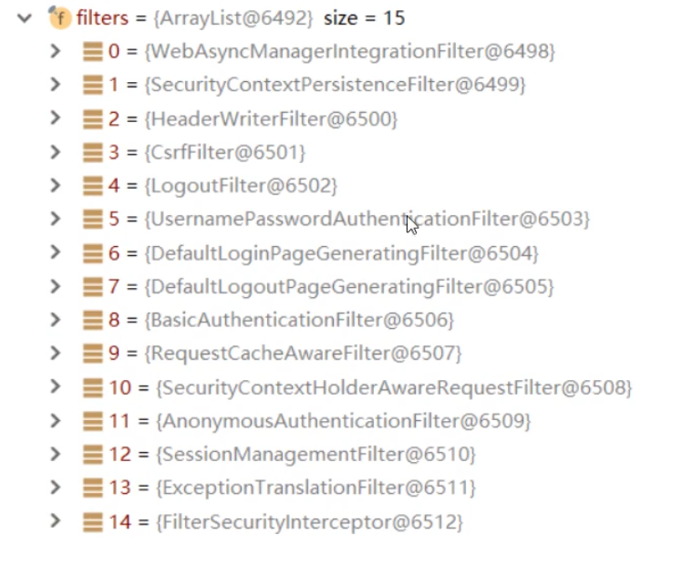
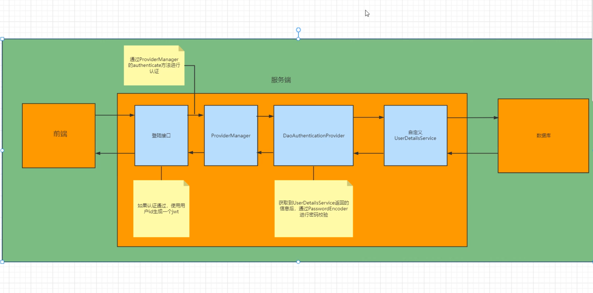
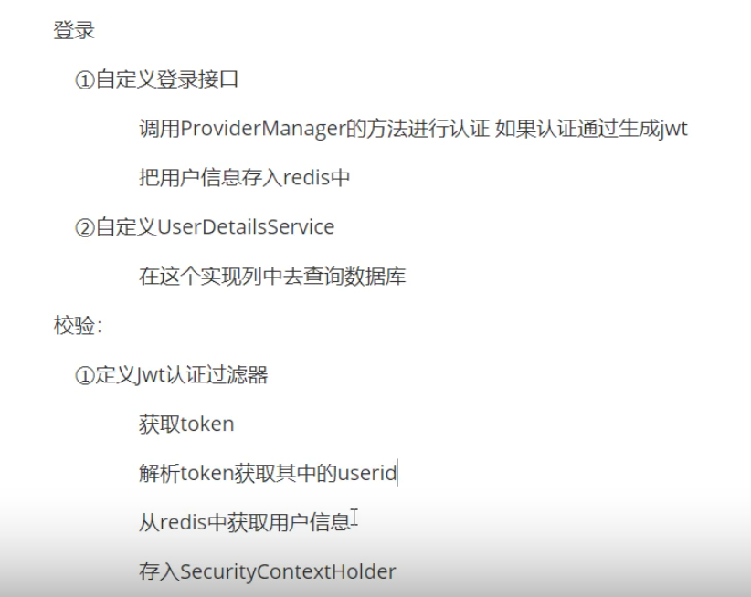

title: springsecurity教程

date: 2021-11-15 21:18:53


## 第1章 简介

### 1.1   简介

Spring Security是为基于Spring的应用程序提供声明式安全保护的安全性框架。

它提供了完整的安全性解决方案，能够在web请求级别和方法调用级别处理身份证验证和授权。

因为基于Spring框架，所以Spring Security充分利用了依赖注入和面向切面的技术。


### 1.2 全部过滤器




其中重要的过滤器有

UsernamePasswordAuthenticationFilter 用户名密码认证过滤器

ExceptionTranslationFilter  异常过滤器

FilterSecurityInterceptor  授权过滤器


### 1.3 内部加载流程


### 1.4 权限判断原理


### 1.5 登录验证原理








```
// 查询用户数据库
UserDetailsService

//数据加密接口
PasswordEncoder
```


## 第2章 登录

### 2.1  入门案例

添加依赖

```xml
<dependency>
     <groupId>org.springframework.boot</groupId>
     <artifactId>spring-boot-starter-security</artifactId>
</dependency>
```


创建Spring Security的配置类

```java

package com.spring.security.springsecurity.config;
 
import org.springframework.context.annotation.Configuration;
import org.springframework.security.config.annotation.authentication.builders.AuthenticationManagerBuilder;
import org.springframework.security.config.annotation.web.builders.HttpSecurity;
import org.springframework.security.config.annotation.web.configuration.EnableWebSecurity;
import org.springframework.security.config.annotation.web.configuration.WebSecurityConfigurerAdapter;
import org.springframework.security.crypto.bcrypt.BCryptPasswordEncoder;
 
@Configuration
@EnableWebSecurity  //启用Web安全功能
public class SecurityConfig extends WebSecurityConfigurerAdapter {
   
  
  @Override
    protected void configure(HttpSecurity http) throws Exception {
        http
                .authorizeRequests()
                //访问"/"和"/home"路径的请求都允许
                .antMatchers("/", "/home","/staff","/staff/*")
                .permitAll()
                //而其他的请求都需要认证
                .anyRequest()
                .authenticated()
                .and()
                //修改Spring Security默认的登陆界面
                .formLogin()
                .loginPage("/login")
                .permitAll()
                .and()
                .logout()
                .permitAll();
    }
  
  
 //1.通过配置类来定义用户信息 configure
    @Override
    protected void configure(AuthenticationManagerBuilder auth) throws Exception{
        //基于内存来存储用户信息
        auth.inMemoryAuthentication().passwordEncoder(new BCryptPasswordEncoder())
                .withUser("user").password(new BCryptPasswordEncoder().encode("123")).roles("USER").and()
                .withUser("admin").password(new BCryptPasswordEncoder().encode("456")).roles("USER","ADMIN");
    }
 
  
  //2.通过数据库方式实现登录
    @Bean
    public UserDetailsService users() {
        UserDetails user = User.builder()
                .username("user")
                .password("{bcrypt}$2a$10$GRLdNijSQMUvl/au9ofL.eDwmoohzzS7.rmNSJZ.0FxO/BTk76klW")
                .roles("USER")
                .build();
        UserDetails admin = User.builder()
                .username("admin")
                .password("{bcrypt}$2a$10$GRLdNijSQMUvl/au9ofL.eDwmoohzzS7.rmNSJZ.0FxO/BTk76klW")
                .roles("USER", "ADMIN")
                .build();
        return new InMemoryUserDetailsManager(user, admin);
    }

  
    @Bean
    public PasswordEncoder passwordEncoder() {
        return new BCryptPasswordEncoder();
    }
  
  
  
}
```


 Controller层

```java

package com.spring.security.springsecurity.controller;
 
import org.springframework.stereotype.Controller;
import org.springframework.web.bind.annotation.GetMapping;
 
@Controller
public class SecurityController {
 
    @GetMapping(value = {"/home","/"})
    public String home(){
        return "home";
    }
 
    @GetMapping(value = "/hello")
    public String hello(){
        return "hello";
    }
 
    @GetMapping(value = "/login")
    public String login(){
        return "login";
    }
}

```


注册页


登录页


首页(权限页面)


退出


记住我功能


csrf配置


## 第3章 授权

###  3.1 在配置类中定义授权规则

授权

```java
     http.authorizeRequests()
                //登录,注册,错误页面不需要权限
                .antMatchers("/login.html").permitAll()
                .antMatchers("/error.html").permitAll()
                .antMatchers("/all.html").permitAll()
                .antMatchers("/register").permitAll()


                //权限匹配, 必须拥有某个指定的权限, 也就是说如果用户的权限表里有多个权限,使用该方法无法匹配
                .antMatchers("/vip.html").hasAuthority("admin")
                //权限匹配,拥有以下任意一种权限即可访问,适合某个用户有多种权限时
                .antMatchers("/vip.html").hasAnyAuthority("admin","admin2")


//               角色匹配 , 声明的时候要加ROLE_, 在这里写不能加,点开源码看到自动添加前缀
                .antMatchers("/vip.html").hasRole("abc")
                .antMatchers("/vip.html").hasAnyRole("abc","123")


//                IP地址匹配
                .antMatchers("/vip.html").hasIpAddress("127.0.0.1")


//                放行静态资源
                .antMatchers("/js/**","/css/**","/images/**").permitAll()

//                其他所有请求都要认证
                .anyRequest().authenticated();
```


### 3.2 在注解使用授权规则

开启注解

```java
@EnableGlobalMethodSecurity(securedEnabled = true)
```


在控制器上

```java
//判断用户是否有某种角色
# 注意需要手动加上前缀 ROLE_
@Secured("ROLE_abc")  
@Secured({"ROLE_abc","ROLE_管理员"})  
  
//在方法执行之前判断 用户是否有某种角色  
@PreAuthorize("hasRole('abc')")

//在方法执行之后判断 
  @PostAuthorize("hasRole('abc')")
  
// 参数验证
@PreFilter
  
// 返回值过滤
@PostFilter
```


## 第4章 微服务

