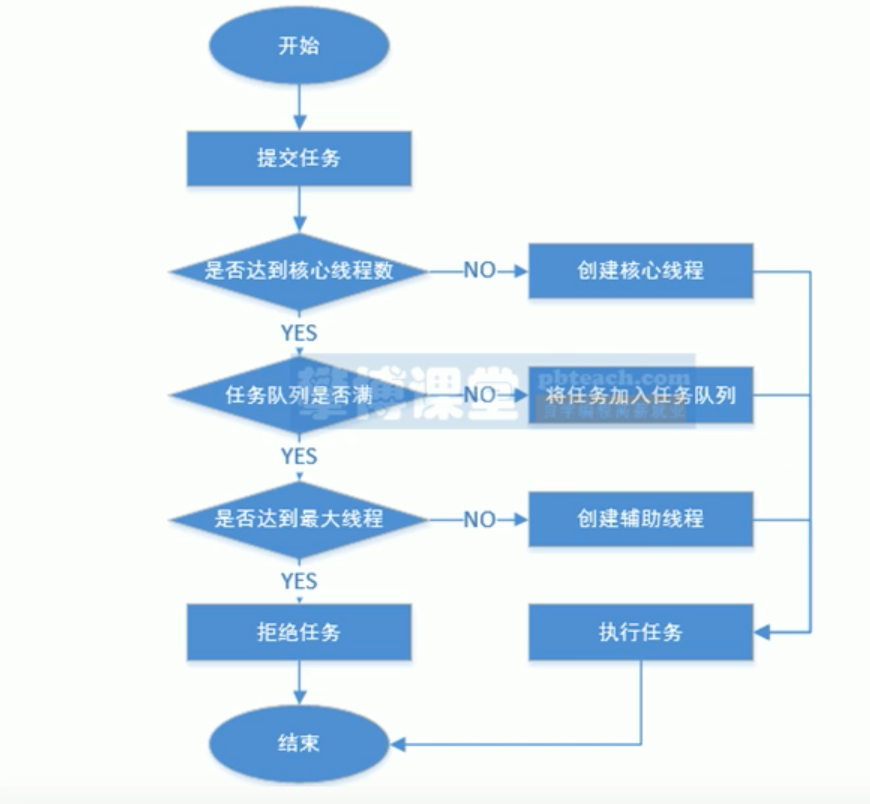

## 第1章 线程入门

### 1.1 多线/进程

-   并行

利用多核CPU , 每个线程分配独立运行的CPU核心去运算 , 多个线程在同一时刻同时运行


-   并发

多线程在交替使用CPU的现象叫并发


-   线程

指的是进程中一个单一顺序的控制流，一个进程中可以并发多个线程，每条线程并行执行不同的任务。


-   多线程

是多任务的一种特别的形式，但多线程使用了更小的资源开销。多线程能满足程序员编写高效率的程序来达到充分利用 CPU 的目的。


-   进程

一个进程包括由操作系统分配的内存空间，包含一个或多个线程。一个线程不能独立的存在，它必须是进程的一部分。一个进程一直运行，直到所有的非守护线程都结束运行后才能结束。


-   start方法和run方法的区别

run不会新建线程, start会新建线程


### 1.2 线程的生命周期

线程是一个动态执行的过程，它也有一个从产生到死亡的过程。

下图显示了一个线程完整的生命周期。


新建状态:

使用 new 关键字和 Thread 类或其子类建立一个线程对象后，该线程对象就处于新建状态。它保持这个状态直到程序 start() 这个线程。


就绪状态:

当线程对象调用了start()方法之后，该线程就进入就绪状态。就绪状态的线程处于就绪队列中，要等待JVM里线程调度器的调度。


运行状态:

如果就绪状态的线程获取 CPU 资源，就可以执行 run()，此时线程便处于运行状态。处于运行状态的线程最为复杂，它可以变为阻塞状态、就绪状态和死亡状态。


阻塞状态:

如果一个线程执行了sleep（睡眠）、suspend（挂起）等方法，失去所占用资源之后，该线程就从运行状态进入阻塞状态。在睡眠时间已到或获得设备资源后可以重新进入就绪状态。可以分为三种：


等待阻塞：运行状态中的线程执行 wait() 方法，使线程进入到等待阻塞状态。


同步阻塞：线程在获取 synchronized 同步锁失败(因为同步锁被其他线程占用)。


其他阻塞：通过调用线程的 sleep() 或 join() 发出了 I/O 请求时，线程就会进入到阻塞状态。当sleep() 状态超时，join() 等待线程终止或超时，或者 I/O 处理完毕，线程重新转入就绪状态。


死亡状态:
一个运行状态的线程完成任务或者其他终止条件发生时，该线程就切换到终止状态。


### 1.3 创建线程的方式

-   方法1 实现Runnable接口


-   方法2 lambad表达式


-   方法3 继承Thread类


-   方法4 内部类


```java
package com.company.one_thread;

import com.company.config.Logger;

import java.util.random.RandomGenerator;

public class one_thread {
//    private static Logger logger = Logger.getLogger(one_thread.class);


    public static void main(String[] args) {
//        logger.info("测试");


        //测试单线程
//        test1();

        //测试多线程
//        test2();


        //线程的四种创建方法
//        t1_create();
//        t2_create();
//        t3_create();
        t4_create();

    }


    // 测试单线程
    public static void test1(){
        RandomT randomT = new RandomT();
        Thread thread = new Thread(randomT);
        thread.start();
    }


    //测试多线程
    public static void test2(){
        RandomT randomT = new RandomT();
        Thread t1 = new Thread(randomT);
        Thread t2 = new Thread(randomT);
        Thread t3 = new Thread(randomT);
        Thread t4 = new Thread(randomT);

        // run方法不能启动新线程 start方法可以启动新线程
        t1.start();
        t2.start();
        t3.start();
        t4.start();

//        t1.run();
//        t2.run();
//        t3.run();
//        t4.run();

    }


    //创建线程方法1
    static class Task1 implements Runnable{

        @Override
        public void run() {
            System.out.println('['+ Thread.currentThread().getName() + ']' + "创建线程第1个方法");
        }
    }


    public static void t1_create() {
        //第2个参数可选,可以指定线程名称
        new Thread (new Task1(),"wl1").start();
    }


    //创建线程方法2 推荐!
    public static void t2_create() {
        //第2个参数可选,可以指定线程名称

        new Thread (() -> {
            System.out.println('['+ Thread.currentThread().getName() + ']' + "创建线程第2个方法");
        },"wl2").start();
    }

    //创建线程方法3 继承thread类
    static class Task3 extends Thread {
        @Override
        public void run(){
            System.out.println('['+ Thread.currentThread().getName() + ']' + "创建线程第3个方法");
        }
    }

    public static void t3_create() {
        new Thread (new Task3(),"wl3").start();
    }


    //创建线程方法4 内部类

    public static void t4_create() {

        new Thread (
                new Thread(){
                    @Override
                    public void run(){
                        System.out.println('['+ Thread.currentThread().getName() + ']' + "创建线程第4个方法");
                    }
                },"wl4"
        ).start();
    }
}

```


### 1.4 线程休眠

```java
th.sleep(30000) //方法1 只能用毫秒
TimeUtil.SECOND.sleep(30)  //方法2 能指定单位 推荐
```


```java
package com.company.one_thread;

import java.util.concurrent.TimeUnit;

//线程休眠
public class Tsleep {

    public static void main(String[] args) {
        //测试主线程休眠
//        test_sleep();

        //测试多线程休眠
        test_sleep2();
    }


    //主线程休眠
    public static void test_sleep(){
        System.out.println("开始执行");
        try {
            System.out.println("开始休眠2秒");
            Thread.sleep(2000);
        } catch (InterruptedException e) {
            e.printStackTrace();
        }

        System.out.println("结束执行");
    }


    //多线程分别休眠
    public static void test_sleep2(){
        //先启动子线程
        new Thread (() -> {

            System.out.println("新线程开启");
            try {
                System.out.println("新线程休眠5秒");

//                Thread.sleep(5000);
                TimeUnit.SECONDS.sleep(5);

            } catch (InterruptedException e) {
                e.printStackTrace();
            }

            System.out.println("新线程结束");
        }).start();

        System.out.println("主线程开始执行");
        try {
            System.out.println("主线程开始休眠2秒");
//            Thread.sleep(2000);
            // 使用更明显的api进行休眠
            TimeUnit.SECONDS.sleep(2);
        } catch (InterruptedException e) {
            e.printStackTrace();
        }
        System.out.println("主线程结束执行");
    }

}

```


### 1.5 线程中断

```java
package com.company.one_thread;

import java.util.concurrent.TimeUnit;

//线程中断
// 线程休眠时可以发起中断
public class Tstop {


    public static void main(String[] args) {
        //实例方法 isInterrupted 判断标记但不清除标记
//        test1();

        //静态方法 interrupted 判断并清除标记
//        test2();

        // 线程休眠时被中断, 做一些善后工作
        test3();
    }

    public static void test1() {
        //
        Thread t1 = new Thread(() -> {
            while(true) {
                if(Thread.currentThread().isInterrupted()){
                    System.out.println("收到中断请求,退出");
                    break;
                }
            }

            System.out.println("新线程执行结束");

        });

        t1.start();

        //休眠2秒
        try {
            System.out.println("休眠2秒");
            TimeUnit.SECONDS.sleep(2);
        } catch (InterruptedException e) {
            e.printStackTrace();
        }

        System.out.println("主线程发起中断请求");
        //主线程发起中断请求
        t1.interrupt();

    }

    public static void test2() {
        //
        Thread t1 = new Thread(() -> {
            while(true) {
                if(Thread.currentThread().interrupted()){
                    System.out.println("收到中断请求,退出");
//                    break;
                }
            }

//            System.out.println("新线程执行结束");

        });

        t1.start();

        //休眠2秒
        try {
            System.out.println("休眠2秒");
            TimeUnit.SECONDS.sleep(2);
        } catch (InterruptedException e) {
            e.printStackTrace();
        }

        System.out.println("主线程发起中断请求");
        //主线程发起中断请求
        t1.interrupt();

    }

    public static void test3() {
        //
        Thread t1 = new Thread(() -> {
            while(true) {
                if(Thread.currentThread().interrupted()){
                    System.out.println("收到中断请求,退出");
                    break;
                }

                //休眠2秒
                try {
                    System.out.println("休眠2秒");
                    TimeUnit.SECONDS.sleep(2);
                } catch (InterruptedException e) {
                    e.printStackTrace();

                    //在这里会清除标记,所以需要再调用一次中断请求
                    Thread.currentThread().interrupt(); //
                }
            }

//            System.out.println("新线程执行结束");

        });

        t1.start();


        System.out.println("主线程发起中断请求");
        //主线程发起中断请求
        t1.interrupt();

    }
}

```


### 1.6 线程执行顺序

-   执行顺序的需求

子线程采集完成后 主线程汇总同步


-   线程的优先级和让步

线程的优先级 setPriority( )  等级有1-10 10最高  但不保证能优先执行

 线程让步 yield( ) 方法 不保证能优先执行


-   线程等待

```java
package com.company.线程等待;


import java.util.concurrent.TimeUnit;

public class ThreadAwait {
    public static void main(String[] args) {
        test();
    }

    public static void test() {
        //线程1 统计1月份数据
        Thread t1 = new Thread(()-> {
            System.out.println("开始统计一月份数据");
            try {
                TimeUnit.SECONDS.sleep(2);

            } catch (InterruptedException e) {
                e.printStackTrace();
            }
            System.out.println("统计一月份数据结束");
        });

        //线程2 统计2月份数据
        Thread t2 = new Thread(()-> {
            System.out.println("开始统计二月份数据");
            try {
                TimeUnit.SECONDS.sleep(2);

            } catch (InterruptedException e) {
                e.printStackTrace();
            }
            System.out.println("统计二月份数据结束");
        });


        //运行两个线程
        t1.start();
        t2.start();

        //线程等待
        try {
            t1.join(); // 阻塞等待t1线程死亡
            t2.join(); // 阻塞等待t2线程死亡
        } catch (InterruptedException e) {
            e.printStackTrace();
        }


        //主线程汇总
        System.out.println("汇总两个月份数据");

    }

}

```


### 1.7 线程状态

NEW 新建状态

RUNNABLE 可运行状态

BLOCKED 阻塞状态

WAITING 等待状态

TIMED_WAITING 有时间的等待状态

TERMINATED 终止状态


### 1.8 守护线程

java中有两种线程, 用户线程和守护线程

用户线程不会随着其他用户线程的结束而结束

所有守护线程会随着最后一个用户线程的结束而结束

所有用户线程结束了JVM进程也就结束了, 所以所有守护线程也就结束了

一个守护线程中启动一个线程默认还是守护线程, 除非手动设置setDaemon(false)


```java
package com.company.守护线程;

import java.util.Scanner;
import java.util.concurrent.TimeUnit;


public class ThreadDaemon {
    public static void main(String[] args) {
        // 测试守护进程
//        test();

        //模拟采集案例
        test1();
    }

    private static void test1() {
        Thread t1 = new Thread(()->{
           //标记
            int a =1 ;

            while(true){
               if(a%2 == 0) {
                   //暂停
                   try {
                       TimeUnit.SECONDS.sleep(300000);
                   } catch (InterruptedException e) {
                       e.printStackTrace();
                       a++;
                   }
               }

               //模拟采集
                System.out.println("线程1执行采集");
                try {
                    TimeUnit.SECONDS.sleep(1);
                } catch (InterruptedException e) {
                    e.printStackTrace();
                    a++;
                }

                if(Thread.interrupted()) {
                    a++;
                }


            }
        });
        Thread t2 = new Thread(()->{
            //标记
            int a =1 ;

            while(true){
                if(a%2 == 0) {
                    //暂停
                    try {
                        TimeUnit.SECONDS.sleep(300000);
                    } catch (InterruptedException e) {
                        e.printStackTrace();
                        a++;
                    }
                }

                //模拟采集
                System.out.println("线程2执行采集");
                try {
                    TimeUnit.SECONDS.sleep(1);
                } catch (InterruptedException e) {
                    e.printStackTrace();
                    a++;
                }

                if(Thread.interrupted()) {
                    a++;
                }


            }
        });

        t1.setDaemon(true);
        t2.setDaemon(true);
        t1.start();
        t2.start();

        Scanner scanner = new Scanner(System.in);

        while(true) {
            //接收键盘
            System.out.println("请输入线程编号1,2或者0退出");
            int num = scanner.nextInt();
            switch(num){
                case 1:
                    t1.interrupt();
                    break;
                case 2:
                    t2.interrupt();
                    break;
                default:
                    break;

            }

            if (num == 0) {
                break;
            }
            //退出
        }


    }


    private static void test() {
        System.out.println("开启一个用户线程");
        new Thread (()->{
           while (true) {
               try {
                   TimeUnit.SECONDS.sleep(3);
               } catch (InterruptedException e) {
                   e.printStackTrace();
               }

               break;
           }

            System.out.println("用户线程结束");
        }).start();

        //开启一个守护线程
        Thread t1 = new Thread(()-> {
            while (true) {
                System.out.println("守护进程1");
                try {
                    TimeUnit.SECONDS.sleep(1);
                } catch (InterruptedException e) {
                    e.printStackTrace();
                }
            }
        });

        t1.setDaemon(true);
        t1.start();


        //开启一个守护线程
        Thread t2 = new Thread(()-> {
            while (true) {
                System.out.println("守护进程2");
                try {
                    TimeUnit.SECONDS.sleep(1);
                } catch (InterruptedException e) {
                    e.printStackTrace();
                }
            }
        });

        t2.setDaemon(true);
        t2.start();


        System.out.println("主线程结束");

    }

}

```


## 第2章 线程池

### 2.1 线程池简介

-   线程池的作用

不需要手动创建线程 直接调用线程池的接口即可


-   创建线程池

Executors类 推荐测试中使用

ThreadPoolExecutor类 配置更多 推荐在生产中使用


-   线程池可以重复利用


-   线程池状态

RUNNING 运行中 接收新任务

SHUTDOWN 关闭 处理队列中的任务 不接收新任务

STOP 停止 不处理任何任务 不接收任何任务

TIDYING 整理中 

TERMINATED 终止


-   线程池作用

控制创建线程的数量,避免资源耗尽

实现线程重复利用, 提高效率

使用任务缓冲队列, 提高吞吐量


-   线程池关键参数

corePoolSize核心线程数  maximumPoolSize最大线程数


-   线程池工作流程




### 2.2 线程池创建

```java
package com.company.第3章线程池.第01课;

import java.util.concurrent.*;

// 测试线程池

public class ExcutorsTest {
    public static void main(String[] args) {
        //测试Executor类
//        test_pool();


        //测试 ThreadPoolExecutor类
        test_ThreadPool();

    }

    private static void test_ThreadPool() {
        ThreadPoolExecutor threadPoolExecutor = new ThreadPoolExecutor(2,5, 20, TimeUnit.SECONDS, new ArrayBlockingQueue<>(3),Executors.defaultThreadFactory(), new ThreadPoolExecutor.AbortPolicy());

        for (int i = 0; i < 10; i++) {
            int n = 1;
            threadPoolExecutor.execute(() -> {
                System.out.println(Thread.currentThread().getName() + "任务执行" + n);

            });


            // 休眠
//            try {
//                TimeUnit.SECONDS.sleep(1);
//            } catch (InterruptedException e) {
//                e.printStackTrace();
//            }
        }


    }

    public static void test_pool() {

        //创建一个线程池
        ExecutorService threadpool = Executors.newCachedThreadPool();

        //提交任务
        for (int i = 0; i < 3; i++) {
            threadpool.execute(()->{
                System.out.println(Thread.currentThread().getName()+ "执行任务");
                }

            );

            // 测试可重复利用线程
            try {
                TimeUnit.SECONDS.sleep(2);
            } catch (InterruptedException e) {
                e.printStackTrace();
            }
        }

    }
}

```


### 2.3 阻塞与非阻塞

阻塞不能立即返回结果, 非阻塞可以立即返回结果

poll是非阻塞方法  take是阻塞方法


### 2.4 线程工厂

作用: 创建线程

默认方法 Executors.defaultThreadFactory()


自定义 可以创建守护线程

```java
Executors.newFixedThreadPool(1,new ThreadFactory(){
  @Override
  public Thread newThread(Runnable r){
    Thread thread = new Thread(r);
    thread.setDaemon(true);
    return thread;
  }
})
```


### 2.5 拒绝策略

```java
// RejectedExecutionHandler接口 有四种拒绝策略

ThreadPoolExecutor.AbortPolicy()  //阻止策略 抛出异常
ThreadPoolExecutor.DiscardPolicy() //丢弃策略 不抛出异常
ThreadPoolExecutor.DiscardOldestPolicy() //丢弃一个最旧的任务, 再放入一个新任务
ThreadPoolExecutor.CallerRunsPolicy() //线程池拒绝 交给其他用户线程执行任务
```


### 2.6 监控

```
threadPoolExecutor.getActiveCount(); //正在执行任务
threadPoolExecutor.getCorePoolSize(); //核心线程数
threadPoolExecutor.getPoolSize();  //当前线程数
threadPoolExecutor.getLargestPoolSize();  //同时最大线程数
threadPoolExecutor.getTaskCount();  //任务总数
threadPoolExecutor.getCompletedTaskCount();  //完成任务总数
```


### 2.7 关闭线程池

shutdown() 方法 不再接收新任务, 会继续完成已有的任务

shutdownNow() 方法 不再接收新任务, 终止正在执行的任务, 没执行的任务不再执行


## 第3章 线程安全

### 3.1 线程安全简介

-   不安全原因

多线程向共享变量存在并发写操作, 该现象称为竞态条件


-   消除竞态条件

不访问共享资源

异步操作改为同步操作


-   临界区

存在竞态条件的代码叫做临界区


### 3.2 同步锁

-   同步锁 synchronized

如果是同一个锁对象代表争抢的是同一把锁, 可以线程安全, 如果争抢的是两把锁, 那么依然会产生并发写

```java
package com.company.one_thread;


import java.util.concurrent.ExecutorService;
import java.util.concurrent.Executors;

//线程锁
public class Tlock {


    public static void main(String[] args) {
        test();
    }

    static int sum = 0;


    public static void test() {

        ExecutorService threadpool = Executors.newCachedThreadPool();
        Object lock  = new Object();

        for (int i = 0 ; i<1000 ; i++) {
            threadpool.execute(()->{
                //synchronized包裹临界区代码 同步执行
                synchronized (lock){
                    sum++;
                }

                System.out.println(sum);
            });
        }


    }
}

```


-   同步代码块

用 synchronized 关键字包裹的临界区的代码块称为同步代码块

静态代码块使用的锁都是当前类的类对象

方法代码块使用的锁是实例对象

类的同一个对象的所有被上锁的方法 是同步的

上锁的静态方法和上锁的实例方法不会同步执行, 静态和静态同步, 实例和实例同步


-   优化同步代码块

能不加锁就不加

尽量缩小临界范围

能不共用同一个锁对象就不要共用一个


-   锁的可重入性

线程在外层获取到某个锁 在内层又遇到了该锁 可以直接获取 不会自己等待自己


-   sleep方法不会释放锁


### 3.3 锁优化

偏向锁

轻量级锁

重量级锁


## 第4章 重入锁

### 4.1 重入锁介绍

-   sync 锁的不足

获取锁释放锁 由jvm控制, 程序员无法控制

线程阻塞状态无法人为介入改变


-   reentrantlock锁的优点

灵活控制锁的获取和释放

等待锁的过程可被打断

尝试获取锁

支持公平锁

支持多个条件变量 


-   创建语法

```java
package com.company.重入锁;

import java.util.concurrent.ExecutorService;
import java.util.concurrent.Executors;
import java.util.concurrent.locks.ReentrantLock;


//线程锁
public class RTest {


    public static void main(String[] args) {
        test();
    }

    static int sum = 0;


    public static void test() {

        ExecutorService threadpool = Executors.newCachedThreadPool();
        ReentrantLock lock  = new ReentrantLock();

        for (int i = 0 ; i<1000 ; i++) {
            threadpool.execute(()->{
                lock.lock();
                try {
                    sum++;
                }finally {
                    lock.unlock();

                }

                System.out.println(sum);
            });
        }


    }
}

```


-   获取锁中断

```java
try {
	lock.lockInterruptibly() //获取锁
  try {
    //临界区
		  	
  } finally {
  	lock.unlock();
  }
	
}catch (InterruptedException e){
  e.printStackTrace();
}

```


-   尝试获取锁

```java
boolean b = false;
try {
  b = lock.tryLock(2, TimeUnit.SECONDS);
}catch (InterruptedException e) {
  e.printStackTrace();
}

if(!b){
	System.out.println("获取锁失败");
  return ;
}
try {
  //临界区
}finally {
  //释放锁
  lock.unlock();
}
```


### 4.2 公平锁与非公平锁

-   公平锁 

ReentrantLock(true) 

阻塞队列中线程按先进先出的规则获取锁

并发性能不高


-   非公平锁

ReentrantLock(false) 

谁抢到是谁的

并发性能高 但可能造成线程饥饿


### 4.3 死锁

-   定义

两个线程竞争一个锁, 有锁的永远不解锁, 另一个线程永远在等待, 形成了死锁


-   原因

交叉式锁

内存不足

cpu占用率过高


### 4.4 线程饥饿

-   原因

有些线程在长期阻塞


-   解决

使用Reentrantlock锁对象的 trylock() 可以非阻塞获取锁


## 第5章 jmm

### 5.1 jmm简介

-   jmm 内存模型

有工作内存和共享内存


-   jmm特性

原子性: 一个操作在执行过程中不会中断不会出现多线程交替执行

有序性: 代码的执行顺序和书写顺序是一致的

可见性: 一个线程修改共享变量对其他线程可见


-   使用volatile关键字 可以保证可见性 有序性

-   单线程下会发生指令重排序但不影响, 多线程下会产生影响


### 5.2 双重检查锁

-   隐藏问题 

一个线程进入后判断不为空 new了一个对象 但还没执行构造方法

另一个线程进来 判断对象不为空 直接返回了该对象 可能造成对象为null


-   使用volatile解决

```java
public class SingletonDcl{
  private SingletonDcl(){};
	private volatile static SingletonDcl singleton = null;
	public static SingletonDcl getInstance(){
  	if(singleton == null ){
    	synchronized(SingletonDcl.class){
      	if(singleton == null){
        	singleton = new SingletonDcl();
      	}
    	}
  	}
	}
}

```


### 5.3 ThreadLocal

-   作用

保证线程数据私有 不被多线程共享


```java
package com.company.重入锁;


import java.util.concurrent.ExecutorService;
import java.util.concurrent.Executors;

// 测试本地线程
public class TLTest {

    static ThreadLocal<User> userThreadLocal= new  ThreadLocal<User>();

    static class User {
        private String username;
        public User(String username) {
            this.username = username;
        }
        public String getUsername() {
            return username;
        }
    }


    //业务类
    static class UserService {
        public void study(){
            User user = userThreadLocal.get();
            System.out.println(Thread.currentThread()+ user.getUsername()+ "正在学习");

            UserDao userDao = new UserDao();
            userDao.saveHistory();
        }
    }

    //数据存储
    static class UserDao{
        public  void saveHistory(){
            User user = userThreadLocal.get();
            System.out.println(Thread.currentThread()+user.getUsername()+ "存储记录");
        }
    }


    //入门程序
    public static void test_first(){
        ExecutorService threadpool = Executors.newCachedThreadPool();

        //线程1
        threadpool.execute(()->{
            userThreadLocal.set(new User("小张"));
            UserService userService = new UserService();
            userService.study();

        });


        //线程2
        threadpool.execute(()->{
            userThreadLocal.set(new User("小李"));
            UserService userService = new UserService();
            userService.study();
        });
    }


    public static void main(String[] args) {
        test_first();
    }

}

```


-   内存泄露

动态分配的堆内存无法释放


## 第6章 cas乐观锁

### 6.1 乐观锁介绍

synchronized同步锁也被称为悲观锁


```java
package com.company.重入锁;

import java.util.concurrent.ExecutorService;
import java.util.concurrent.Executors;
import java.util.concurrent.TimeUnit;
import java.util.concurrent.atomic.AtomicInteger;

public class CASTest {
    public static void main(String[] args) {
        test_cas();
    }

    static int sum;
    //原子类对象
    static AtomicInteger atomicInteger = new AtomicInteger(sum);

    //
    public static void test_cas() {
        ExecutorService threadpool = Executors.newCachedThreadPool();
        for (int i = 0; i < 100; i++) {
            threadpool.execute(()->{
                while(true) {
                    //取出期望值
                    int expectValue =atomicInteger.get();

                    //计算目标值
                    int updateValue = expectValue + 1;


                    //调用cas
                    boolean b = atomicInteger.compareAndSet(expectValue, updateValue);
                    if(b) {
                        break;
                    }

                }

            });
        }

        //结束线程池
        shutdown(threadpool);
        sum= atomicInteger.get();
        System.out.println("sum=" + sum);
    }


    //结束线程池
    private static void shutdown(ExecutorService threadpool){
        threadpool.shutdown();
        while(!threadpool.isTerminated()) {
            try {
                TimeUnit.SECONDS.sleep(1);

            }catch(InterruptedException e) {
                e.printStackTrace();
            }
        }
    }

}

```


### 6.2 ABA问题

仅仅通过值是否相同来判断是否发生变化某些场景下是不正确的

