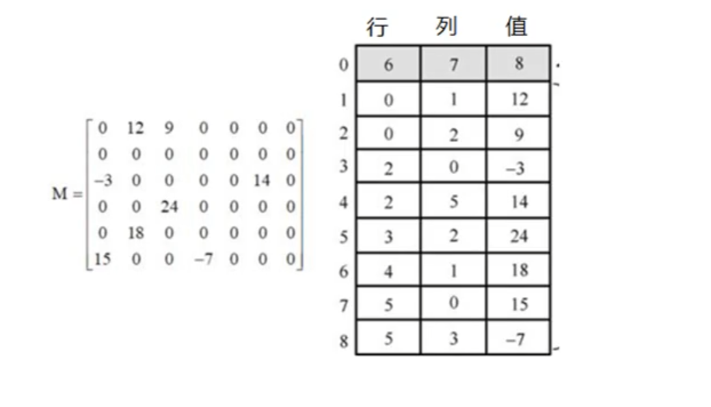
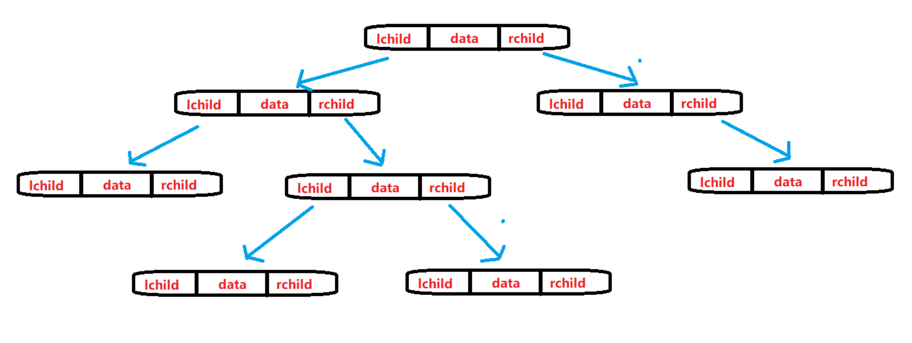
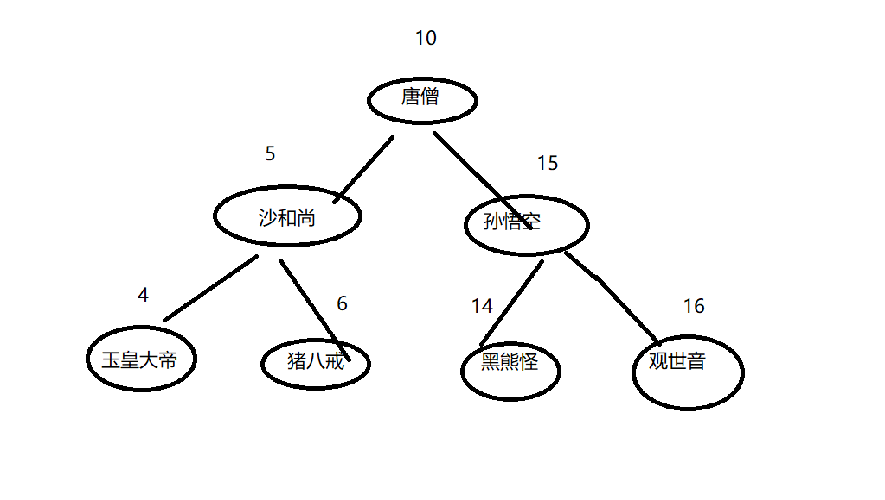

## 第1章 简介

### 1.1 数据结构介绍


### 1.2 数据结构和算法的关系

程序 = 数据结构 + 算法

数据结构是算法的基础。


### 1.3 线性结构和非线性结构

线性结构

数组, 队列, 链表, 栈


非线性结构

二维数组, 多维数组,广义表,树结构,图结构


## 第2章 数组与链表

### 2.1 数组

在内存中，数组是一块连续的区域。 

数组需要预留空间，在使用前要先申请占内存的大小，可能会浪费内存空间。 

插入数据和删除数据效率低，插入数据时，这个位置后面的数据在内存中都要向后移。删除数据时，这个数据后面的数据都要往前移动。

随机读取效率很高。因为数组是连续的，知道每一个数据的内存地址，可以直接找到给地址的数据。

并且不利于扩展，数组定义的空间不够时要重新定义数组。


### 2.2 稀松数组

稀疏数组(sparse array)是一种只为数组中的非零元素分配内存的特殊类型数组，内存中存储了数组中非零元素的下标和值。

稀疏数组可以简单的看作为是压缩。比如将数据序列化到磁盘上，减少数据量，在IO过程中提高效率等等。




### 2.3 链表介绍


在内存中可以存在任何地方，不要求连续。 在电影院几个人可以随便坐。

每一个数据都保存了下一个数据的内存地址，通过这个地址找到下一个数据。 

增加数据和删除数据很容易。 

查找数据时效率低，因为不具有随机访问性，所以访问某个位置的数据都要从第一个数据开始访问，然后根据第一个数据保存的下一个数据的地址找到第二个数据，以此类推。

不指定大小，扩展方便。链表大小不用定义，数据随意增删。


### 2.4 单链表


### 2.5 双链表


### 2.6 循环链表 ( 单项环形链表 )


### 2.7 链表和数组的对比

- 数组静态分配内存，链表动态分配内存；
- 数组在内存中连续，链表不一定连续；
- 数组元素在栈区，链表元素在堆区；
- 数组利用下标定位，时间复杂度为O(1)，链表定位元素时间复杂度O(n)；
- 数组插入或删除元素的时间复杂度O(n)，链表的时间复杂度O(1)


## 第3章 栈与队列

### 3.1 栈的

链表实现动态栈

栈的另外一种实现方式是采用链表，链表是一种递归的数据结构，它或者为空，或者指向一个结点的引用，该结点含有一个泛型的元素和一个指向另一条链表的引用。


可变长数组实现静态栈

要用数组实现栈，可以声明一个int型的标记，这个标记指向的位置即为栈顶，push操作时，将值放在数据中标记的位置，同时将标记+1，pop时，返回数组在标记位置的值，同时标记-1。

但java中的数组在声明的时候其长度就已经固定了，所以栈使用的空间只能是这个数组最大容量的一部分。为了能容纳更多的数据而声明一个特别大的数组会非常浪费空间，那如何解决这个问题，达到既不会浪费数组空间也不会超出数组范围呢？

可以采用动态调整数组大小的方式，在push操作导致栈已满时，重新创建一个数组，其容量为原数组的两倍。同理在pop操作使数组的闲置空间达到一定程度时，重新创建一个容量更小的数组。但闲置的判断标准不能为一半1/2，否则会造成在1/2的临界点处push和pop操作时发生“抖动”，即频繁地进行数组扩容、缩容操作，这会极大地降低栈的性能。所以通常的做法是在减少到数组容量的1/4时缩容为1/2。


数组实现代码

```java
public class ArrayStack {
    // 栈的大小
    private int maxStack;
    //数组模拟栈
    private char[] stack;
    //栈顶指针  -1为空栈
    private int top = -1;
    //构造
    public ArrayStack (int maxStack){
        this.maxStack = maxStack;
        stack = new char[maxStack];
    }
    //压栈
    public void pushStack(char val){
        if(isFull()){
            throw new RuntimeException("该栈已满");
        }
        top++;
        stack[top] = val;
    }
    //出栈
    public int popStack(){
        if(isEmpty()){
            throw new RuntimeException("该栈为空");
        }
        char value = stack[top];
        top--;
        return value;

    }
    //判断空栈
    public boolean isEmpty (){
        return this.top == -1;
    }
    //判断满栈
    public boolean isFull (){
        return this.top == this.maxStack-1;
    }
    //查看所有元素
    public void listStack(){
        if(isEmpty()){
            throw new RuntimeException("该栈为空");
        }
        for (int i = 0; i < stack.length; i++) {
            System.out.printf("stack[%d]=%c\n",i,stack[i]);
        }
    }
}
```


回文案例

```java
public class Test {
    //测试案例 判断回文数据
    public static void main(String[] args) {
        //创建栈
        ArrayStack arrayStack = new ArrayStack(10);
        //回文字符串
//        String val = "ababa";
        String val = "abcd";
        System.out.println(val.length());
        //入栈
        for (int i = 0; i < val.length(); i++) {
//            System.out.println(val.charAt(i));
            arrayStack.pushStack(val.charAt(i));
        }
        arrayStack.listStack();
        //出栈
        String newval = "";
        int length = val.length();
        for (int i = 0; i < length; i++) {
//            System.out.println(val.charAt(i));
            newval = newval + (char)arrayStack.popStack();
            System.out.println(newval);
        }
        System.out.println(newval);
        //判断
        if (val.equals(newval)) {
            System.out.println("该数据是回文数据");
        }else {
            System.out.println("该数据不是回文数据");
        }
    }
}
```


### 3.2 队列

队列是一种特殊的线性表，他只允许在表的前端进行删除操作，在表的后端进行插入操作，后端称为队尾，前端称为队头。

队列就像高速路，进来后就不许逆行，只能从下一站出口出去。


链表实现队列

先进先出队列（简称队列）是一种基于先进先出(FIFO)策略的集合类型。这里只关注队列的链表实现。与链表实现的栈类似，用结点包含泛型的item变量和next变量，前者存放数据，后者用来指向下一个结点。不同之处在于链表的头部、尾部都会被操作，从链表的一端入队(enqueue)，从另一端出队(dequeue) 


数组实现队列


顺序队列 

溢出问题


循环队列 


## 第4章 堆

存储的是数组和对象（其实数组就是对象），凡是new建立的都是在堆中，堆中存放的都是实体（对象），实体用于封装数据，而且是封装多个（实体的多个属性），如果一个数据消失，这个实体也没有消失，还可以用，所以堆是不会随时释放的，但是栈不一样，栈里存放的都是单个变量，变量被释放了，那就没有了。堆里的实体虽然不会被释放，但是会被当成垃圾，Java有垃圾回收机制不定时的收取。


## 第5章 树

### 5.1 树的概念

线性表是一对一的关系，而树是一对多的关系。

树的结点：包含一个数据元素及若干指向子树的分支；

孩子结点：结点的子树的根称为该结点的孩子；

双亲结点：B 结点是A 结点的孩子，则A结点是B 结点的双亲；

兄弟结点：同一双亲的孩子结点； 堂兄结点：同一层上结点；

祖先结点: 从根到该结点的所经分支上的所有结点

子孙结点：以某结点为根的子树中任一结点都称为该结点的子孙

结点层：根结点的层定义为1；根的孩子为第二层结点，依此类推；

树的深度：树中最大的结点层

结点的度：结点子树的个数

树的度： 树中最大的结点度。

叶子结点：也叫终端结点，是度为 0 的结点；

分枝结点：度不为0的结点；

无序树：树中任意节点的子节点之间没有顺序关系，这种树称为无序树，也称为自由树；

有序树：树中任意节点的子节点之间有顺序关系，这种树称为有序树；

 

### 5.2 二叉树的概念

二叉树

二叉树是每个结点最多有两个子树的树结构。通常子树被称作“左子树”和“右子树”。

　

完全二叉树

对于一颗二叉树，假设其深度为d（d>1）。除了第d层外，其它各层的节点数目均已达最大值，且第d层所有节点从左向右连续地紧密排列，这样的二叉树被称为完全二叉树； 

　　

满二叉树

所有叶节点都在最底层的完全二叉树； 　

　

平衡二叉树（AVL树）

当且仅当任何节点的两棵子树的高度差不大于1的二叉树； 　　


排序二叉树

(二叉查找树（英语：Binary Search Tree))：也称二叉搜索树、有序二叉树； 　


霍夫曼树

带权路径最短的二叉树称为哈夫曼树或最优二叉树； 


### 5.3 二叉树的遍历方式

先序遍历

先访问根节点，先序遍历左子树，先序遍历右子树


中序遍历

中序遍历左子树，访问根节点，中序遍历右子树


后序遍历

后序遍历左子树，后序遍历右子树，访问根节点


层次遍历

即按照层次访问，通常用队列来做。访问根，访问子女，再访问子女的子女


### 5.4 二叉树的存储方式

顺序存储
用一组连续的存储单元存放二叉树的数据元素。结点在数组中的相对位置蕴含着结点之间的关系。比较浪费空间，基本不用。


链式存储

链式存储结构的每个结点由数据域、左指针域和右指针域组成。左指针和右指针分别指向下一层的二叉树。




### 5.5 二叉树的实现




Node.java

```java

// 节点
public class Node {

    //编号
    private int no;

    //标识符
    private String name;
    //左节点
    private Node left;

    //右节点
    private Node right;


    // get set
    public int getNo() {
        return no;
    }

    public void setNo(int no) {
        this.no = no;
    }

    public String getName() {
        return name;
    }

    public void setName(String name) {
        this.name = name;
    }

    public Node getLeft() {
        return left;
    }

    public void setLeft(Node left) {
        this.left = left;
    }

    public Node getRight() {
        return right;
    }

    public void setRight(Node right) {
        this.right = right;
    }


    // 构造方法
    public Node(int no, String name){
        this.no = no;
        this.name = name;
    }

    @Override
    public String toString() {
        return "Node{" +
                "no=" + no +
                ", name='" + name + '\'' +
                ", left=" + left +
                ", right=" + right +
                '}';
    }


    // 前遍历  父节点在前
    public void preSelect() {
        System.out.println(this);
        if(this.left!=null){
            this.left.preSelect();
        }
        if(this.right!=null){
            this.right.preSelect();
        }

    }

    // 中遍历 父节点在中
    public void infixSelect() {

        if(this.left!=null){
            this.left.infixSelect();
        }
        System.out.println(this);
        if(this.right!=null){
            this.right.infixSelect();
        }

    }

    // 后遍历 父节点在后
    public void postSelect() {

        if(this.left!=null){
            this.left.postSelect();
        }
        if(this.right!=null){
            this.right.postSelect();
        }
        System.out.println(this);

    }


    //前序查找
    public Node preSearch(int no) {

        //判断是否为当前节点
        if(this.no == no){
            return this;
        }

        //查询左子节点
        Node leftNode = null;
        if (this.left != null) {
            leftNode = this.left.preSearch(no);
        }

        //找到了
        if (leftNode != null){
            return leftNode;
        }


        //查询右子节点
        if (this.right != null) {
            leftNode = this.right.preSearch(no);
        }

        //找到了
        return leftNode;


    }


    // 删除
    // 不能直接删除节点,因为会删除该节点的整个子树, 要找他的父节点让该子节点为空, 达到删除
    public void delNode (int no){

        //先判断当前节点的左节点是否为要删的对象
        if(this.left !=null && this.left.no == no) {
            this.left = null;
            return;
        }

        //再判断当前节点的右节点是否为要删的对象
        if(this.right !=null && this.right.no == no) {
            this.right = null;
            return;
        }


        //循环递归左节点
        if (this.left != null){
            this.left.delNode(no);
        }

        //循环递归右节点
        if (this.right != null){
            this.left.delNode(no);
        }

    }


    // 新增
    public void insertNode(Node node) {
        //判断要插入的节点和当前节点的no值 如果小于当前节点
        if(node.getNo() < this.getNo()) {
            // 如果左侧节点为空,则插入新节点
            if(this.left == null){
                this.left = node;
                return;
            }else {

                //如果左节点不为空,则遍历左节点
                this.left.insertNode(node);

            }

        }else if(node.getNo() > this.getNo()) {
            ////判断要插入的节点和当前节点的no值 如果大于当前节点
            // 如果右侧节点为空,则插入新节点
            if(this.right == null){
                this.right = node;
                return;
            }else {

                //如果左节点不为空,则遍历左节点
                this.right.insertNode(node);
            }


        }


        System.out.println("节点的值已经存在");


    }

}

```


BinaryTree.java

```java


// 二叉树
public class BinaryTree {
    private Node root;

    //设置根
    public void setRoot(Node node){
        this.root = node;
    }

    //前序遍历
    public void preSelect() {
        if(this.root != null){
            this.root.preSelect();
        }else {
            System.out.println("二叉树为空");
        }
    }

    //中序遍历
    public void infixSelect() {
        if(this.root != null){
            this.root.infixSelect();
        }else {
            System.out.println("二叉树为空");
        }
    }

    //前序遍历
    public void postSelect() {
        if(this.root != null){
            this.root.postSelect();
        }else {
            System.out.println("二叉树为空");
        }
    }


    //前序查询
    public Node preNode(int no){
        if(root != null){
            return root.preSearch(no);
        }else {
            System.out.println("空二叉树");
            return null;
        }
    }


    //删除节点
    public void delNode (int no){
        //判断root不为空
        if(root!=null){

            //如果要删除的是root节点
            if(root.getNo() == no) {
                root = null;
            }else {
                root.delNode(no);
            }

        }else {
            System.out.println("空二叉树");
        }

    }


    //新增节点
    public void insertNode (Node node){
        //如果root不为空
        if(root!=null){
            root.insertNode(node);
        }else {
            //如果root为空,则把当前node设置为root节点
            //不能用root.insertNode方法, 空指针异常
            root = node;
        }


    }


}

```


Text.java

```java
public class Test {
    public static void main(String[] args) {
        //创建对象
        BinaryTree binaryTree = new BinaryTree();
        Node root = new Node(10,"唐僧");
        Node node1 = new Node(5,"沙和尚");
        Node node2 = new Node(15,"孙悟空");
        Node node3 = new Node(4,"玉皇大帝");
        Node node4 = new Node(6,"猪八戒");
        Node node5 = new Node(14,"黑熊怪");
        Node node6 = new Node(16,"观世音");

        //创建二叉树结构
        binaryTree.setRoot(root);
        root.setLeft(node1);
        root.setRight(node2);
        node1.setLeft(node3);
        node1.setRight(node4);
        node2.setLeft(node5);
        node2.setRight(node6);


        //遍历二叉树
//        binaryTree.preSelect();
//        System.out.println("------------------------------------");
//        binaryTree.infixSelect();
//        System.out.println("------------------------------------");
//        binaryTree.postSelect();
//        System.out.println("------------------------------------");


        // 前序查找
//        Node node = binaryTree.preNode(5);
//        if (node != null) {
//            System.out.println(node);
//        }else {
//            System.out.println("没找到节点");
//        }

        // 删除 6号猪八戒
        binaryTree.delNode(6);
        binaryTree.preSelect();
        System.out.println("------------------------------------");

        // 新增 6号 猪八戒
        Node nodeNew = new Node(6,"猪八戒");
        binaryTree.insertNode(nodeNew);
        binaryTree.preSelect();
        System.out.println("------------------------------------");
    }
}

```


### 5.6 红黑树


### 5.7 B-树

B树：一种对读写操作进行优化的自平衡的二叉查找树，能够保持数据有序，拥有多于两个子树。


### 5.8 森林


### 5.9 树的线索化


### 5.10 赫夫曼树


### 5.11 赫夫曼编码


## 第6章 图

### 6.1 图的基本概念

线性表和树两类数据结构，线性表中的元素是“一对一”的关系，树中的元素是“一对多”的关系，本章所述的图结构中的元素则是“多对多”的关系。

图（Graph）是一种复杂的非线性结构，在图结构中，每个元素都可以有零个或多个前驱，也可以有零个或多个后继，也就是说，元素之间的关系是任意的。


### 6.2 无向图

无向图是由顶点和边构成。


### 6.3 有向图

有向图是由顶点和有向边构成。


### 6.4 完全图

如果任意两个顶点之间都存在边叫完全图，有向的边叫有向完全图。如果无重复的边或者顶点到自身的边叫简单图。


## 第7章 散列

### 7.1 散列简介

它基于数组，通过把关键字映射到数组的某个下标来加快查找速度，但是又和数组、链表、树等数据结构不同，在这些数据结构中查找某个关键字，通常要遍历整个数据结构，也就是O(N)的时间级，但是对于哈希表来说，只是O(1)的时间级。

散列也叫作散列表，是一种非线性的数据结构，可以用来快速的查找和插入数据。在 JavaScript 中，通常使用数组来实现散列。

散列的核心是一个计算特征值的方法，该方法将原始数据进行转换，返回一个索引，随后将值保存在数组对应的索引中。此外，该方法还可以用来进行高效的查找。

由于不同的特征值计算出的索引不尽相同，因此散列在保存数据时不是按顺序保存的，其是基于列表这样一个线性结构上的“非线性”结构，因此被称为散列。

通常，我们会将数组的长度设置为一个质数，因为质数的公约数最少，可以有效的防止碰撞。


### 7.2 散列原理


### 7.3 散列应用


### 7.4 散列碰撞

散列碰撞概念

不同的value经过散列函数后，得到的key值相同


拉链法

将所有关键字为同义字的记录存储在一个单链表中 


开放地址法

这种方法也称再散列法，其基本思想是：当关键字key的哈希地址p=H（key）出现冲突时，以p为基础，产生另一个哈希地址p1，如果p1仍然冲突，再以p为基础，产生另一个哈希地址p2，…，直到找出一个不冲突的哈希地址pi ，将相应元素存入其中。

就是说当发生冲突时，就去寻找下一个空的地址把数据存入其中，只要哈希表足够大，就总能找到这样一个空的地址。


再哈希法

在发生冲突的时候再用另外一个哈希函数算出哈希值，直到算出的哈希值不同为止。


建立公共溢出区

在创建哈希表的同时，再额外创建一个公共溢出区，专门用来存放发生哈希冲突的元素。查找时，先从哈希表查，查不到再去公共溢出区查。


## 第8章 高级数据结构

### 9.1 优先队列

优先队列 (Priority Queue)


### 9.2 图

图(Graph)


### 9.3 前缀树

前缀树(Trie)


### 9.4 线段树

线段树(Segment Tree)


### 9.5 树状数组

树状数组(Fenwick Tree/Binary Indexed Tree)
