## 第1章 jenkins简介


### 1.1 持续集成与交付概念

CI(Continuous integration，中文意思是持续集成)是一种软件开发时间。持续集成强调开发人员提交了新代码之后，立刻进行构建、（单元）测试。根据测试结果，我们可以确定新代码和原有代码能否正确地集成在一起。借用网络图片对CI加以理解。


 CD(Continuous Delivery， 中文意思持续交付)是在持续集成的基础上，将集成后的代码部署到更贴近真实运行环境(类生产环境)中。比如，我们完成单元测试后，可以把代码部署到连接数据库的Staging环境中更多的测试。如果代码没有问题，可以继续手动部署到生产环境。下图反应的是CI/CD 的大概工作模式。


### 1.2 jenkins 介绍

一个开源的、提供友好操作界面的持续集成(CI)工具，主要用于持续、自动的构建/测试软件项目、监控外部任务的运行。


### 1.3 jenkins 安装

-   安装jdk11 

```sh
# 搜索软件
yum search java|grep jdk

# 安装jdk
yum install java-11-openjdk -y

# 默认目录
/usr/lib/jvm/java-11-openjdk-11.0.11.0.9-1.el7_9.x86_64
cd /usr/lib/jvm
mv java-11-openjdk-11.0.11.0.9-1.el7_9.x86_64 java-11-openjdk-11

# 编辑环境配置文件
vim /etc/profile
JAVA_HOME=/usr/lib/jvm/java-11-openjdk-11
JRE_HOME=$JAVA_HOME/jre
JAVA_BIN=$JAVA_HOME/bin
CLASSPATH=.:$JAVA_HOME/lib/dt.jar:$JAVA_HOME/lib/tools.jar:$JRE_HOME/lib
PATH=$PATH:$JAVA_HOME/bin:$JRE_HOME/bin
export JAVA_HOME JRE_HOME PATH CLASSPATH

# 使修改生效
source /etc/profile

# 验证
java -version
```


-   yum安装jenkins

```sh
# 添加仓库
sudo wget -O /etc/yum.repos.d/jenkins.repo https://pkg.jenkins.io/redhat-stable/jenkins.repo
sudo rpm --import https://pkg.jenkins.io/redhat-stable/jenkins.io.key

yum install jenkins -y

systemctl start jenkins
systemctl status jenkins

# 关闭防火墙
systemctl stop firewalld
systemctl disable firewalld

# 修改默认端口
vim /etc/sysconfig/jenkins
JENKINS_PORT="8080"


# 查看密码
cat /var/lib/jenkins/secrets/initialAdminPassword

# 登录后使用admin账号 并修改密码为admin


# 卸载
rpm -e jenkins
rm -rf /usr/local/jenkins_home/
rm -rf /root/.jenkins/
```


- yum 安装 git

```sh
yun install git -y
```


### 1.4 构建spring项目

服务器安装maven

```sh
yum install maven -y
```


jenkins安装maven插件

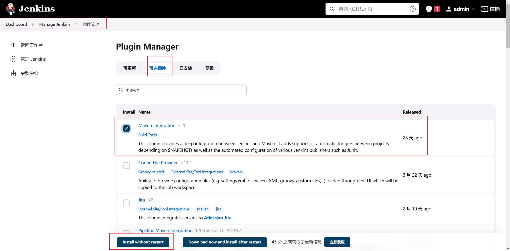


jenkins全局配置maven的路径

yum安装默认路径为  /usr/share/maven

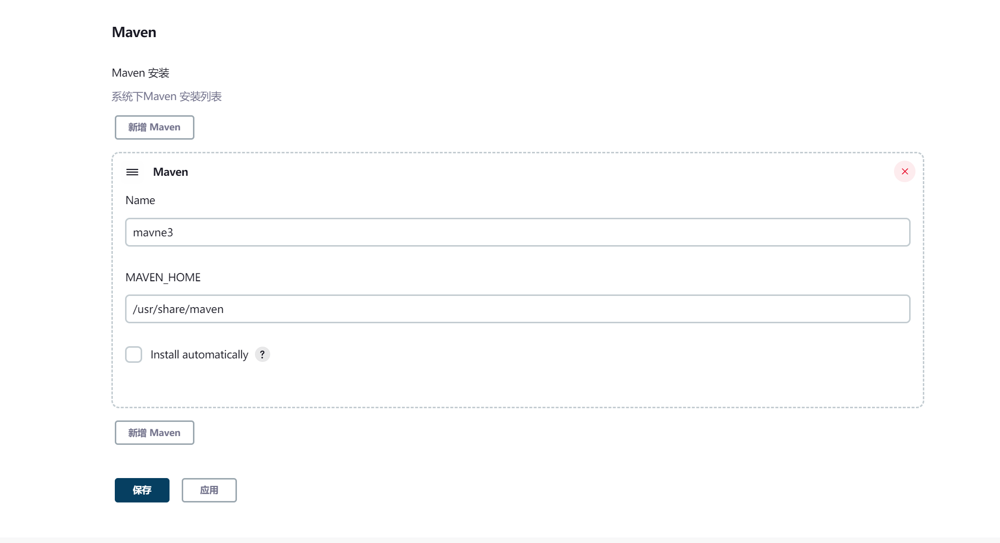


jenkins新建项目

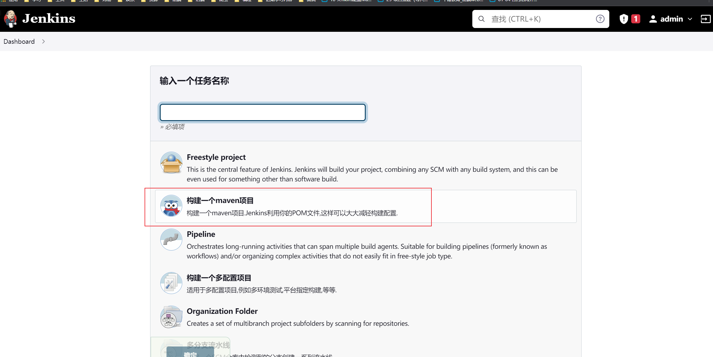


配置 github项目

填写浏览器里网页的url

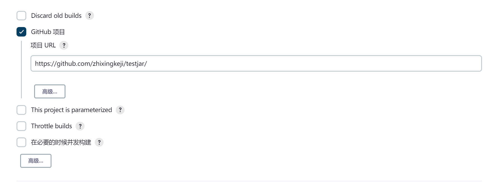


配置 源码管理 使用git 

填写仓库地址  https://github.com/zhixingkeji/testjar.git

修改分支名为 */main

配置身份


安装插件 publish over ssh

系统配置 添加 ssh服务器

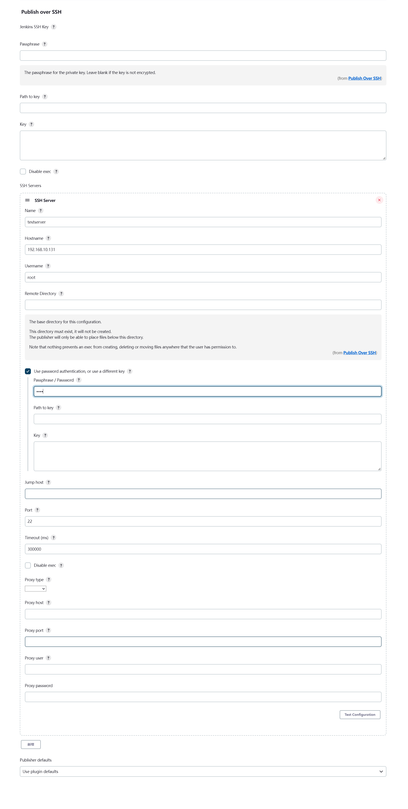


项目配置

Post Steps 配置

构建完成后 通过 ssh插件发送jar包到测试服务器上

Exec Command 执行命令 自动运行jar包

```
nohup java -jar /root/test1/target/test.jar.jar >mylog.log 2>&1 &
```


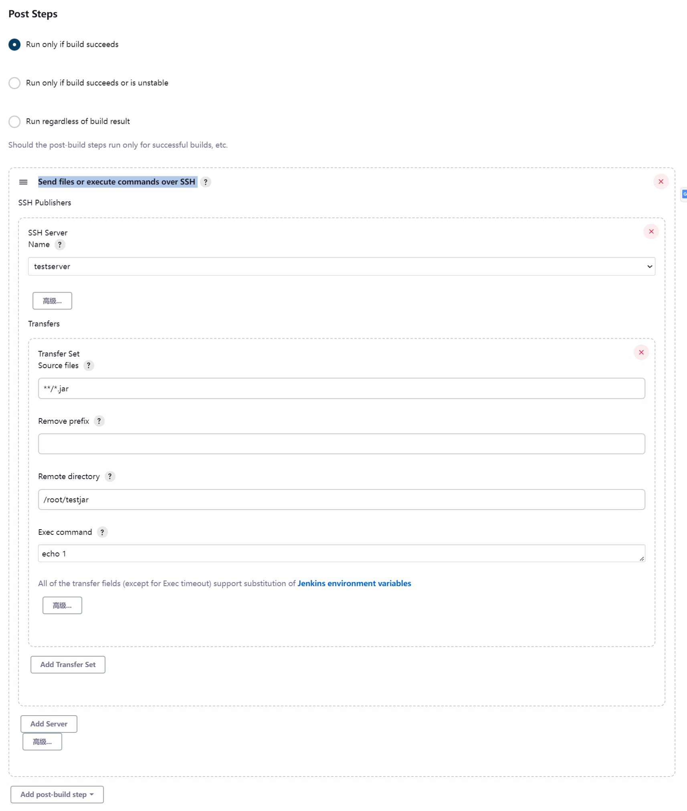


Post Steps 配置

自动清理文件夹和端口

./x.sh test 

```sh
#!/bin/bash

# 删除历史
rm -rf test1


# 获取命令行传来的第一个参数
echo "arg:$1"
appname=$1

# 获取pid  awk $2是获取第二列的数据
pid=`ps -ef | grep $1 | grep 'java -jar' awk '{printf $2}'`
echo $pid

# 空值判断 否则报错 -z代表判断是否为空
if [ -z $pid];
	then 
		echo "$appname not started"
	else 
		kill -9 $pid
		echo "$appname stoped"
fi		
```


jps查看jar包是否运行


api 访问接口

```
http://ip:8090/test/s
```


### 1.5 构建vue项目


-   jenkins安装node


-   配置github令牌和钩子


-   jenkins新建项目


## 第2章 jenkins基础

### 2.1 流程简介

本地代码编写完成 提交到github仓库

github触发webhook 向jenkins服务器发送post请求

jenkins服务器接受到该请求 触发该项目的工作

拉取代码到工作空间后 

执行构建前工作

执行构建项目 shell脚本

执行构建后操作 通过ssh插件 发送打包内容到其他服务器 并执行命令

将结果发送到邮箱


### 2.2 构建触发器

-   快照依赖构建

当依赖的快照被构建时执行job


-   触发远程构建

远程调用本job的restapi时执行job


-   job依赖构建

当依赖的job被构建时执行本job


-   每日定时自动构建

使用cron表达式定时构建job


-   向github提交代码自动构建

github-webhook触发时构建本job 

适合小型个人项目, 如果是多人项目是手动job, 不可能谁提交一下就构建一次


-   定期检查代码变更构建

使用cron表达式定时检查代码变更, 变更后构建本job


### 2.3 插件

Folders

 

OWASP Markup Formatter

 

Build Timeout

 

Credentials Binding

 

Timestamper

 

Workspace Cleanup

 

Ant

 

Gradle

 

Pipeline

 

GitHub Branch Source

 

Pipeline: GitHub Groovy Libraries

 

Pipeline: Stage View

 

Git

 

SSH Build Agents

 

Matrix Authorization Strategy

 

PAM Authentication

 

LDAP

 

Email Extension

 

Mailer

 

Localization: Chinese (Simplified)


### 2.4 全局配置


### 2.5 邮箱通知

1.开启163邮箱的smtp功能 并记录秘钥

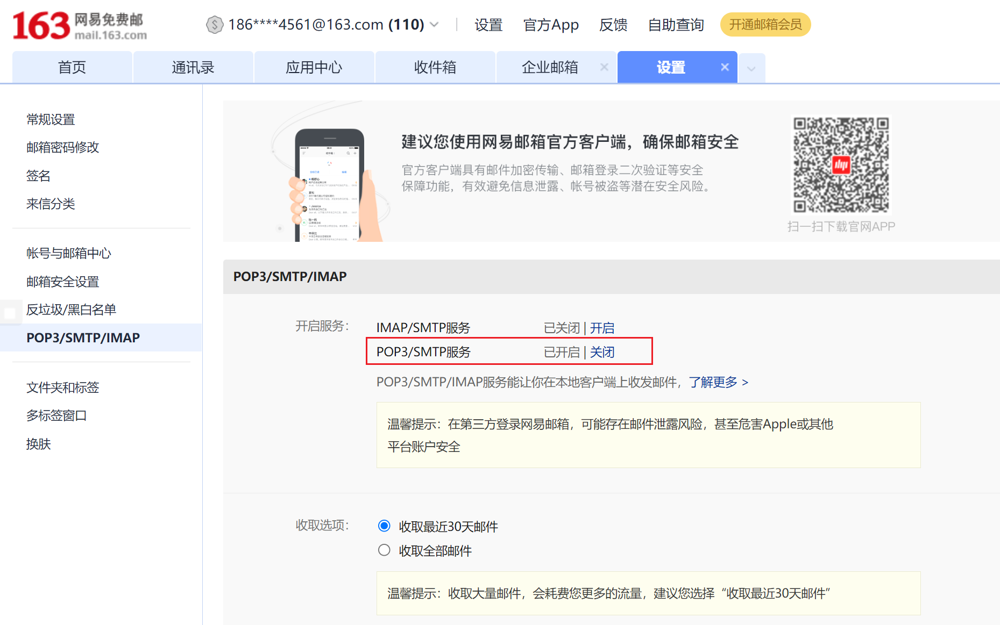

2.配置jenkins的管理员邮箱为发件邮箱

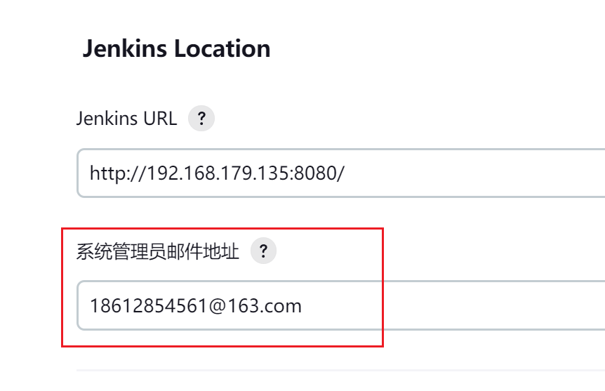

3.配置jenkins邮箱插件

身份验证 用户名为163邮箱的账号 密码为开启smtp时的秘钥

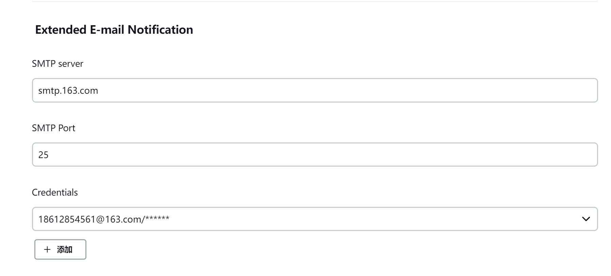

4.配置jenkins邮件通知

勾选测试 发件成功的例子

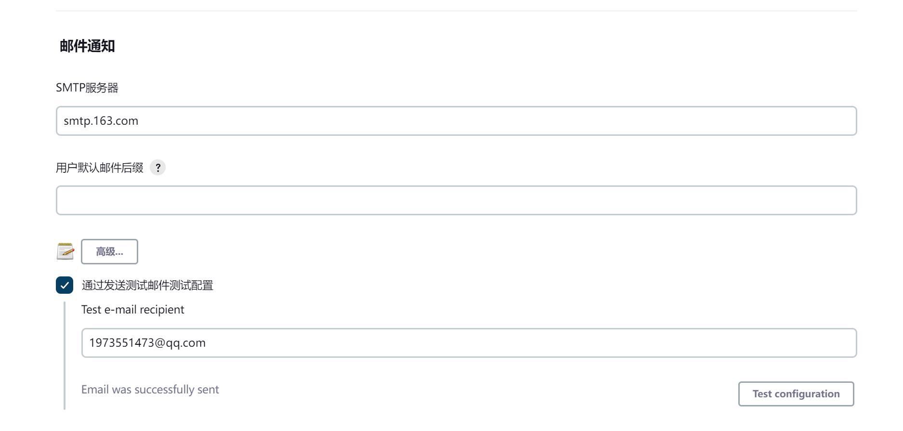


### 2.6 优化细节

解决端口冲突 清理目录 

```sh
#!/bin/bash

# 删除历史
rm -rf filename


# 获取命令行传来的第一个参数
echo "arg:$1"
appname=$1

# 获取pid  awk $2是获取第二列的数据
pid=`ps -ef | grep $1 | grep 'java -jar' awk '{printf $2}'`
echo $pid

# 空值判断 否则报错 -z代表判断是否为空
if [ -z $pid];
	then 
		echo "$appname not started"
	else 
		kill -9 $pid
		echo "$appname stoped"
fi		
```


超时配置

考虑到项目构建的时间, 设置超时时间, 不然超时就会有报错


shell权限配置

```sh
# 进入文件 修改权限
sudo visudo

# 追加内容 给jenkins权限
jenkins ALL=(ALL) NOPASSWD: ALL

# 构建执行的shell前面加上sudo即可
sudo touch index.html
```


### 2.7 cron表达式


## 第3章 容器化构建 docker

### 3.1 环境安装

1.   安装 vmware虚拟机 centos9 操作系统

2.   安装 docker 和 openssh-server

3.   安装 finalshell软件


安装jenkins

```
docker run \
  -u root \
  --rm \
  -d \
  -p 8080:8080 \
  -p 50000:50000 \
  -v jenkins-data:/var/jenkins_home \
  -v /var/run/docker.sock:/var/run/docker.sock \
  jenkinsci/blueocean
```

查看jenkins密码

```
docker ps
docker container exec -it <docker-container-name> bash
cat /var/jenkins_home/secrets/initialAdminPassword
用户名 admin
```


DockerFile

```sh
# 拉取jdk
FROM openjdk:11
# 暴露端口
EXPOSE 8080
# 基本目录
WORKDIR /root
# 参数1是相对基本目录的文件 参数2是绝对路径 可以重命名
ADD test1/target/test.jar.jar /root/app.jar
# 执行命令
ENTRYPOINT ["java","-jar","/root/app.jar"]
```


前置钩子

```
rm -rf *
docker rm -f demo
docker rmi demo
```


后置钩子

```
docker build -t demo .
docker run -d --name demo -p 8090:8090 demo
```


## 第4章  容器化构建 k8s

### 4.1 环境安装


## 第5章 jenkins集群 / 并发构建

### 5.1 新增节点


### 5.2 配置 job

配置 限制项目的运行节点

勾选 在必要的时候并发构建


## 第6章 流水线

### 6.1 流水线 pipeline

流水线类似于dockerfile


安装插件 blue ocean 功能更多的流水线UI管理界面

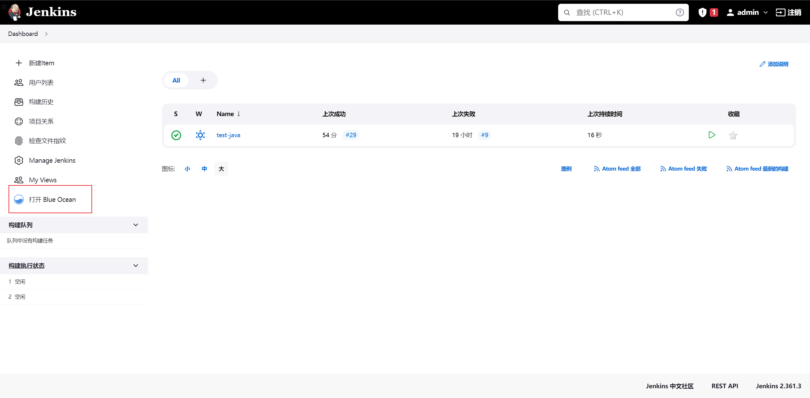


创建 item 选择 pipeline

```sh
pipeline {
	# 指定执行器
    agent any
	# 所有阶段
    stages {
    	# 某一个阶段
        stage('Hello1') {
        	# 每个步骤
            steps {
                echo 'Hello World'
            }
        }
        
        # 某一个阶段
        stage('Hello2') {
        	# 每个步骤
            steps {
                echo 'Hello World'
            }
        }
    }
}
```


### 6.2 pipeline打包镜像

```sh
pipeline {
    agent any
    tools {
    	maven "maven3"
    }
    stages {
        stage('拉取代码') {
            steps {
                git branch: "main",credentialsId: "github",url:"http://xxxx/xxx.git"
                echo "拉取成功"
            }
        }
        stage('执行构建') {
            steps {
            	sh """
            	cd demo -1
            	mvn clean package
            	"""
                echo '构建完成'
            }
        }
        
        stage('发送jar包') {
            steps {
                echo 'jar包发送完成'
            }
        }
    }
}

```


### 6.3 多分支流水线

```
```

