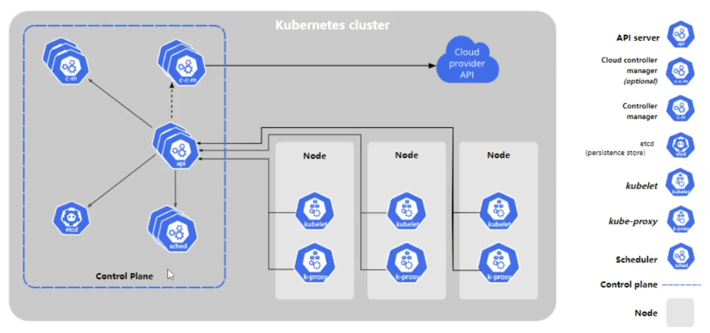
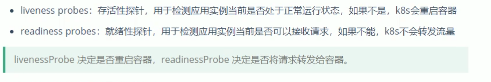
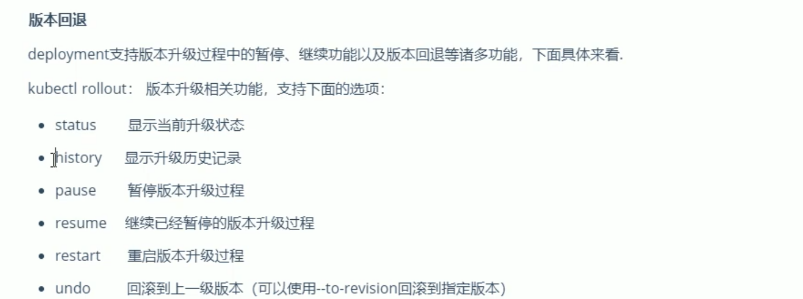
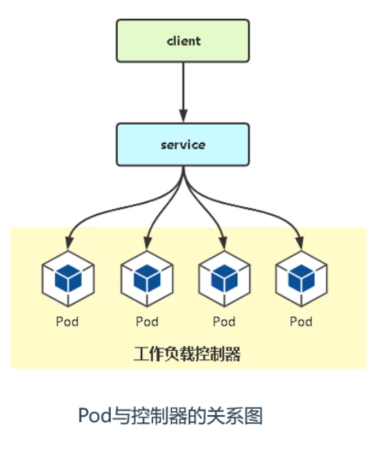
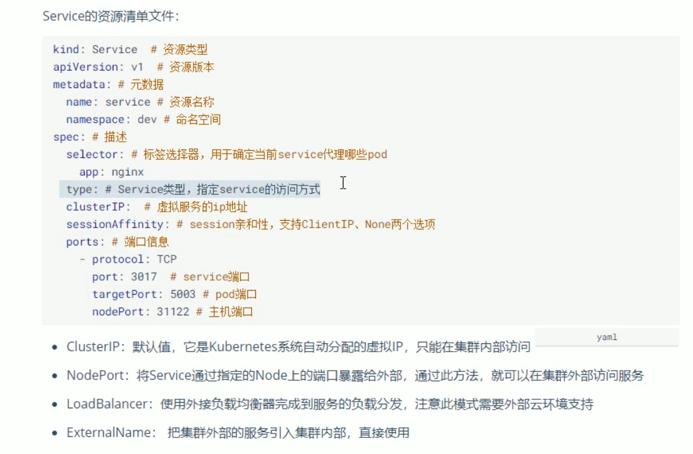

## 第1章  k8s 介绍

Kubernetes是Google 2014年创建管理的，是Google 10多年大规模容器管理技术Borg的开源版本。

它是容器集群管理系统，是一个开源的平台，可以实现容器集群的自动化部署、自动扩缩容、维护等功能。


### 1.1 功能特点

-   负载均衡
-   服务发现
-   存储编排
-   自动回滚部署
-   自动完成装箱计算
-   自我修复
-   密钥和配置管理


### 1.2 历史发展

1.   物理机部署
2.   虚拟机部署
3.   容器化部署


### 1.3 架构和组件




-   Control Plane master

主节点，控制面板 ，不需要很高性能，不跑任务，通常一个就行了，也可以开多个主节点来提高集群可用度。


-   Controller manager 

负责维护集群的状态，比如故障检测、自动扩展、滚动更新等


-   etcd

数据库, 保存了整个集群的状态


-   api server

提供资源操作的唯一入口API


-   scheduler

负责资源调度，按照预定的调度策略将 Pod 调度到相应的机器上；

 

-   kubectl

命令行交互指令 , 类似于 docker....


-   kubelet 

负责维护容器的生命周期，同时也负责 Volume（CSI）和网络（CNI）的管理


-   kube-proxy

负责为 service 提供 集群内部的服务发现和负载均衡


-   kubeadmin

k8s集群简化搭建的脚手架 


-   pod

Pod是kubernetes中最小的资源管理组件，Pod也是最小化运行容器化应用的资源对象，在一个Pod中同时运行一个或多个容器。


-   node

工作节点，可以是虚拟机或物理计算机，任务都在这里跑，机器性能需要好点；通常都有很多个，可以不断加机器扩大集群；每个工作节点由主节点管理


-   deployments

最常见的控制器，用于部署和管理 pod


-   service

为一组pod 提供负载均衡，对外提供访问入口


-   job


-   volume


-   namespace

命令空间，将资源对象从逻辑上隔离，从而形成多个虚拟集群


-   label

标签，附加到某个资源上，用于关联对象


### 1.4 minikube部署k8s集群

minikube官网 https://minikube.sigs.k8s.io/docs/start/


下载安装包 https://storage.googleapis.com/minikube/releases/latest/minikube-installer.exe


或者用 powershell

```sh
New-Item -Path 'c:\' -Name 'minikube' -ItemType Directory -Force
Invoke-WebRequest -OutFile 'c:\minikube\minikube.exe' -Uri 'https://github.com/kubernetes/minikube/releases/latest/download/minikube-windows-amd64.exe' -UseBasicParsing

```


```sh
$oldPath = [Environment]::GetEnvironmentVariable('Path', [EnvironmentVariableTarget]::Machine)
if ($oldPath.Split(';') -inotcontains 'C:\minikube'){ `
  [Environment]::SetEnvironmentVariable('Path', $('{0};C:\minikube' -f $oldPath), [EnvironmentVariableTarget]::Machine) `
}

```


相关操作

```shell
# 启动集群
minikube start
# 查看节点。kubectl 是一个用来跟 K8S 集群进行交互的命令行工具
kubectl get node
# 停止集群
minikube stop
# 清空集群
minikube delete --all
# 安装集群可视化 Web UI 控制台
minikube dashboard
```


### 1.5 kubeadm部署k8s集群


### 1.6 rancher部署k8s集群

在linux云服务器上安装 rancher

```
docker run --privileged -d --restart=unless-stopped -p 80:80 -p 443:443 rancher/rancher:stable
```


查看密码

```
docker ps #查看容器id
docker logs 容器id  2>&1 | grep "Bootstrap Password:"
```


登录服务器

http://ip


### 1.7 kubectl指令


查看node

kubectl get node


查看namespace

kubectl get namespace


查看job

kubectl get job


查看日志

kubectl logs name -f


创建yaml文件

 kubectl apply -f xxx.yaml	


删除ymal文件

kubectl delete -f xxx.yaml	


删除deployment 

kubectl delete deployment  [name]


## 第2章 k8s基础

### 2.1 namespace 命名空间

-   命名空间简介

实现多套环境的资源隔离。

默认情况下集群所有pod都可以互相访问，如果使其不能互相访问，就可以使用命名空间隔离。


-   系统默认创建的

default                Active   17d
kube-node-lease        Active   17d
kube-public            Active   17d
kube-system            Active   17d
kubernetes-dashboard   Active   17d


查看命名空间

kubectl get ns


创建命名空间

kubectl create namespace [name]


删除命名空间

kubectl delete namespace [name]


查看命名空间下的资源

kubectl get pods -n wlm


### 2.2 pod 容器

-   pod概念

pod是k8s的最小单元，一个pod由一个或多个容器组成。

pod始终部署在node上。

创建pod时候，会默认创建一个根容器，用于判断健康状态和共享ip。


-   接口文档

```css
kubectl get pods  # 查看所有pods
kubectl get pod [name] # 查看某个pod
kubectl get pod [name] -o yaml # 查看某个pod的yaml
kubectl delete pod [name] # 删除某个pod
kubectl describe pod [name] # 查看pod的详情
```


-   创建容器

```
kebectl run nginx --image=nginx --port=80
```


-   删除容器

使用上面命令行创建的pod，无法通过 `delete pod` 直接删除pod，因为控制器发现pod死亡后会马上重新拉起一个新的pod，需要删除该pod的控制器才能彻底删除pod

```
kebectl delete deployment nginx
```


-   资源清单

```yaml
apiVersion: v1 #必选,版本号,例如v1
kind: Pod # 必选,资源类型,例如Pod
metadata: #必选,元数据
  name: string # 必选,Pod名称
  namespace: default # Pod所属的命名空间,默认为"default"
  labels: # 自定义标签列表
   - name: string
spec: # 必选,Pod中容器的详细定义
  containers: #必选,Pod中容器列表
  - name: string # 必选,容器名称
    image: string # 必选,容器的镜像名称
    imagePullPolicy: [Always |Never|IfNotPresent】
    # 获取镜像的策略
    command: [string]
    #容器的启动命令列表,如不指定,使用打包时使用的启动命令
	args: [string] #容器的启动命令参数列表
	workingDir: string #容器的工作目录
	volumeMounts: # 挂载到容器内部的存储卷配置
	- name: string
	#引用pod定义的共享存储卷的名称,需用volumes[]部分定义的的卷名
	  mountPath: string
	  # 存储卷在容器内mount的绝对路径,应少于512字符		      
	  read0nly: boolean #是否为只读模式
	ports: #需要暴露的端口库号列表
	- name: string # 端口的名称
	  containerPort: int # 容器需要监听的端口号
	  hostPort: int 
	  #容器所在主机需要监听的端口号,默认与Container相同
	  protocol: string #端口协议,支持TCP和UDP,默认TCP
	env: #容器运行前需设置的环境变量列表
	- name: string #环境变量名称
	  value: string #环境变量的值
	resources: # 资源限制和自愿请求的设置

status: # 状态 
```


#### 2.2.1 pod配置

-   基本配置

pod-base.yaml

```yaml

apiVersion: v1
kind: Pod
metadata: 
  name: pod-base
  namespace: dev
  labels:
    user: heima
spec: 
  containers:
  - name: nginx
  	image: nginx:1.17.1
  - name: busybox
    image: busybox:1.30
```


创建容器

```
kubectl apply -f pod-base.yaml
```


-   镜像拉取策略

```
imagePullPolicy: Always # 永远从远程拉取
imagePullPolicy: Never # 永远从本地拉取
imagePullPolicy: IfNotPresent # 本地有则用本地,没有则远程拉取

在指定镜像版本号后,默认值为IfNotPresent
在使用镜像版本为laster时,默认值为Always
```


-   启动命令

```
command: ["/bin/sh","-c","torch /tmp/hello.txt;while true;do /bin/echo $(data) +%t >> /tem/hello.txt;sleep 3;done;"]
```


-   环境变量

```
env:
  - name: "username"
  value: "admin"
  - name: "password"
  value: "12323"
```


-   端口设置

```
ports: 
  - name: nginx-port 
    containerPort: 80
    protocol: TCP
```


-   资源配额

```yaml
resources: #
  limits: # 上限
    cpu: "2" #cpu核心限制2核
    memory: "10G" #内存限制
  requests: # 下限
    cpu: "1" #cpu核心限制1核
    memory: "10M" #内存限制
        
```


 

#### 2.2.2 pod生命周期

-   创建和终止


-   初始化容器


-   钩子函数

```yaml
lifecycle:
  postStart: # 启动后
    exec:
      command:
      - cat
      - /tmp/healthy
      
  preStop: # 停止前
    exec: 
      command: ["/usr/sbin/nginx","-s","quit"]
```


-   容器探测

```
 livenessProbe:
   tcpSocket:
     port: 8080 #尝试访问8080端口
```




三种方式

```
tcpSocket
httpGet
exec
```


五种选项

```
#容器启动后等待多少秒执行第一次探测
initialDelaySeconds <integer> 

#探测超时时间。默认1秒,最小1秒
timeoutSeconds <integer>

#执行探测的频率。默认是1秒,最小1秒
periodSeconds <integer>

#连续探测失败多少次才被认定为失败。默认是3。最小值是1
failureThreshold <integer>

#连续探测成功多少次才被认定为成功。默认是1
successThreshold <integer>
```


-   重启策略

```
restartPolicy: Always  # 默认值 永远自动重启
restartPolicy: OnFailure # 容器终于运行且退出码不为0时重启
restartPolicy: Never # 永不重启
```


#### 2.2.3 pod调度

-   自动调度

通过 scheduler 组件自动计算和调度，无法人工干预


-   定向调度

强制调度到指定节点上，不管节点是否存在

```
spec:
  # 方式1 nodeName
  nodeName: node1 # 指定node1节点
```


```
spec:
  # 方式2 nodeSelector
  nodeSelector: 
    nodeenv: pro # 指定调度到具有该标签的节点上
```


-   亲和性调度

优先调度到该节点，如果不存在则自动调度到其他节点上


pod 亲和性 有指定的pod则跟他在一起

```
affinity: #亲和性设置
  podAffinity: # 设置node亲和性
    requiredDuringSchedulingIgnoredDuringExecution: #硬限制
    - labelSelector:
	    matchExpressions: #匹配env的值在["xxx","yyy"]中的标签   
	    - key:nodeenv
		  operator: In
  		  values: ["xxx","yyy"]
```


node 亲和性 有指定的node则跟他在一起

```
affinity: #亲和性设置
  nodeAffinity: # 设置node亲和性
    requiredDuringSchedulingIgnoredDuringExecution: #硬限制
      nodeSelectorTerms:
	  - matchExpressions: #匹配env的值在["xxx","yyy"]中的标签   
	    - key:nodeenv
		  operator: In
  		  values: ["xxx","yyy"]
```


pod 反亲和性  有指定的某个pod则不跟他在一起

```
affinity: #亲和性设置
  podAntiAffinity: # 设置node亲和性
    requiredDuringSchedulingIgnoredDuringExecution: #硬限制
    - labelSelector:
	    matchExpressions: #匹配env的值在["xxx","yyy"]中的标签   
	    - key:nodeenv
		  operator: In
  		  values: ["xxx","yyy"]
```


-   污点

污点的格式为:key=value:effect,key和value是污点的标签,effect描述污点的作用,支持如下三个选项:


·PreferNoSchedule

kubernetes 将尽量避免把Pod调度到具有该污点的Node上,除非没有其他节点可调度


·NoSchedule

kubernetes 将不会把Pod调度到具有该污点的Node上,但不会影响当前Node上已存在的Pod，master节点上默认采用该污点


NoExecute

kubernetes 将不会把Pod调度到具有该污点的Node上,同时也会将Node上已存在的Pod驱离


```
# 设置污点
kubectl taint nodes node1 key=value:[effect]

# 去除污点
kubectl taint nodes node1 key:[effect]-

# 去除所有污点
kubectl taint nodes node1 key-
```


-   容忍

污点就是拒绝,容忍就是忽略,Nod通过污点拒绝pod调度上去,Pod通过容忍忽略拒绝

```
sepc:
  tolerations:
  - key: "tag"  # 要容忍的污点key
  operator: "Equal" # 操作符
  value: "heima" # 污点的value
  effect: "NoExecute" # 容忍污点的规则
```


### 2.3 Label 标签

-   label简介

作用是在资源上添加标识，用来对它们区分和选择。

标签由一个键值对组成。

一个资源可以添加多个标签，一个标签也可以添加到多个pod上。

可以在资源创建前定义标签，也可以在创建后修改标签。


-   对比

label和namespace相比较，不同namespace内的容器不能互相通信，label可以互相通信


-   常见标签

版本标签：version ：release、stable

环境标签：environment：dev、test、pro

架构标签：tier：frontend、backend


-   标签选择器

基于等式的 name = slave ， key为name的标签，值为slave的标签

基于集合的 name in （master，slave），key为name，值为master或slave的标签

标签选择器可以混合使用。


-   接口文档

kubectl get pod --show-labels  # 展示标签

kubectl label pod name  version=1.0 # 打标签

kubectl label pod name  version=2.0 --overwrite # 修改标签

kubectl label pod -l version=2.0 --show-labels  # 筛选标签

kubectl label pod name version- # 删除标签


### 2.4 controller 控制器

-   控制器种类

Deployment 通过控制ReplicaSet来控制pod,并支持滚动升级、版本回退

 Horizental Pod Autoscaler:可以根据集群负载自动调整Pod的数量

 DaemonSet 在集群中的指定Node上都运行一个副本,用于守护进程

job 它创建出来的p0d只要完成任务就立即退出,用于执行一次性任务

Cronjob 它创建的pod会周期性的执行,用于执行周期性任务

StatefulSet 管理有状态应用


-   作用

用于管理pod，k8s中通常不直接管理pod，而是用控制器来管理pod。


-   主要功能

管理pod，上线部署，副本设定，滚动升级，回滚等


#### 2.4.1 deployment 控制器

-   yaml部署

kubectl apply -f web.yaml

```yaml
# web.yaml
apiVersion: apps/v1 # 项目名名和版本号
kind: Deployment # 控制器类型
metadata: # 元数据
	name: web #应用名
	namespace: default # 命名空间
spec:
	replicas: 3 # 副本数量
	selector:
		matchLabels:
			app: web # 匹配标签
	template:
		metadata:
			labels:
				app: web # 副本标签
		spec:
			containers:
			- name: web
				image: nginx

```


-   命令行部署

kubectl create deployment web --image=nginx --replicas=3


-   镜像更新策略

重建更新和滚动更新

```
strategy:
  type: Recreate/RollingUpdate
```


-   版本回退




-   删除

kubectl delete deploy nginx


-   deployment与pod关系图




#### 2.4.2 HPA 控制器


#### 2.4.3 DaemonSet 控制器

每个节点运行时 都添加一个pod副本，适合日志监控类


#### 2.4.4 job 控制器

执行一次任务后就退出


#### 2.4.5 Cronjob 控制器

循环执行任务


### 2.5 service 服务

-   解决的问题

pod 重建后ip不固定

集群内部可访问，外部不能访问


-   简介

service 实现了服务发现和负载均衡。


-   接口

kubectl get svc  # 查看服务

kubectl delete svc [name] # 删除服务

kubectl expose deploy nginx --name=svc-nginx1 --type=NodePort --port=80 --target-port=80  # 暴露访问地址

kubectl create -f svc-nginx.yaml


-   资源清单文件




-   Ingress


## 第3章 资源管理

### 3.1 资源管理方式

直接命令

```
kubectl run nginx-pod --image=nginx --port=80
```


命令式

```
kubectl create -f nginx-pod.yaml
kubectl patch -f nginx-pod.yaml
```


声明式 (推荐方式)

```
kubectl apply -f nginx-pod.yaml
```


### 3.2 创建资源实例

启动minikube  

minikube start


创建文件 nginx-dep.yml

```yaml
apiVersion: apps/v1
kind: Deployment
metadata:
  name: nginx-deployment
spec:
  selector:
    matchLabels:
      app: nginx
  replicas: 3
  template:
    metadata:
      labels:
        app: nginx
    spec:
      containers:
      - name: nginx
        image: nginx:alpine
        ports:
        - containerPort: 80
```


创建deployments

kubectl apply -f nginx-dep.yml


创建文件

```yaml
apiVersion: v1
kind: Service
metadata:
  name: nginx-service
spec:
  selector:
    app: nginx
  ports:
  - protocol: TCP
    port: 80
    targetPort: 80
    nodePort: 30080
  type: NodePort
```


创建 service

kubectl apply -f nginx-svc.yml


查看pods 

kubectl get pods


转发url minikube

kubectl port-forward nginx-deployment-7d9d7464fb-mrc4h 30001:80


浏览器访问

http://127.0.0.1:30001


## 第4章 数据存储

### 4.1 基本存储

-   emptydir 

临时空间，共享数据 pod销毁则销毁 


-   hostpath 

node目录挂载到pod中


-   nfs

网络文件存储系统


### 4.2 高级存储

pv


pvc


生命周期


### 4.3 配置存储


## 第5章 安全认证

### 5.1 概念

Kubernetes作为一个分布式集群的管理工具,保证集群的安全性是其一个重要的任务。所谓的安全性其实就是保证对Kubernetes的各种客户端进行认证和鉴权操作。


### 5.2 认证

用户名密码

token

ca证书


### 5.3 授权

rbac


### 5.4 准入


## 第6章 kubusphere


## 第7章 rancher


## 第8章 微服务集成


## 第9章 边缘化

