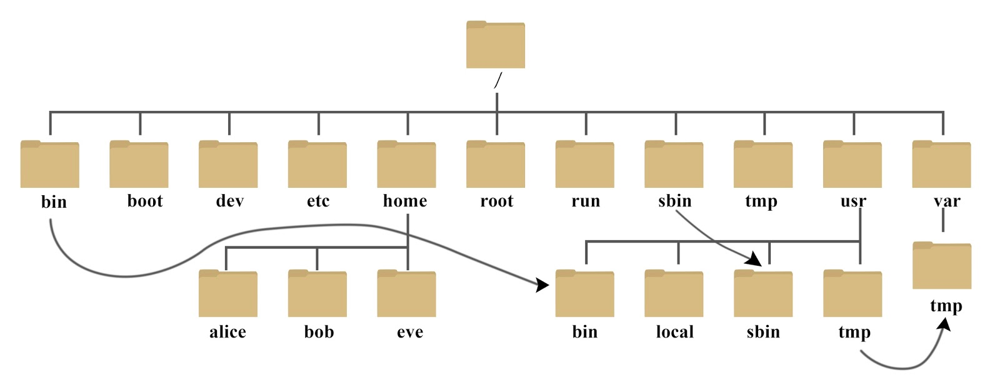

## 第1章 linux 简介

### 1. 1 Linux 系统目录结构




/bin 二进制指令

/boot 系统启动核心文件

/dev 外部设备

/etc 配置文件

/home 用户主目录

/lib 共享库

/opt 安装额外软件 如mysql

/usr/local 安装的软件

/var 日志


### 1.2 基本指令

`ls`  查看目录

`history`  查看历史记录

`shutdown -h now`  立即关机

`shutdown -r now`  立即重启

`reboot`  重启

`cal`  查看当月日历

`cal 2020`  查看2020年的日历

`data` 当前时间


### 1.3  远程登录服务器

软件

xshell  xftp  filezilla finalshell  electerm


## 第2章 文件管理

### 2.1 创建文件

vim text.txt 创建文本

touch 文件名 // 创建空文件

touch ok.txt yes.txt papap.txt  // 创建多个空文件

mkdir  /home/dog    // 创建文件夹

mkdir -p /home/animals/tiger    // 创建多级文件夹


### 2.2 删除文件

rm 文件  //删除文件

rm -f 文件  //强制删除文件

rmdir  /home/dog   //删除空目录

rm -rf  /home/dog   //强制递归删除非空目录


重名文，移动文件

mv pig.txt cat.txt       //重命名pig为cat

mv pig.txt /home/animal/       //移动pig到新文件夹

cat 文件              // 以只读方式查看文件

cat -n 文件              // 显示行号

cat -n /etc/profile | more          // 分页显示


### 2.3 查看文件

more指令

ctrl+b 返回上一页

enter 下一行

space 下一页

less指令 //  按需加载，查看大型文件

space  下一页

pagedown 下一页

pageup 上一页


ls      // 查看目录和文件

ls -l      // 以列表方式显示目录和文件

ls -a       // 查看目录和文件包括隐藏


pwd  // 显示当前工作目录的绝对路径


cd  // 切换目录

cd ..   // 返回上级目录

cd ~  // 返回用户的家目录


### 2.4  剪贴复制粘贴文件

cp  a.txt b/      //把文件复制到某个目录下

cp  -r a/ b/       //把文件夹递归复制到某个目录下

\cp  -r a/ b/       // 强制覆盖


## 第3章 系统相关

### 3.1 自定义指令别名

vim ~/.bashrc

添加如下行

alias ll='ls -alF'

alias la='ls -A'

alias vi='vim'

alias sub='sublime-text-dev'


:wq存盘退出

退出后执行命令

source ~/.bashrc


### 3.2 查看Linux系统信息

arch   #显示机器的处理器架构(1)

uname -m #显示机器的处理器架构(2)

uname -r #显示正在使用的内核版本

dmidecode -q      #显示硬件系统部件 - (SMBIOS / DMI)

hdparm -i /dev/hda   #罗列一个磁盘的架构特性

hdparm -tT /dev/sda  #在磁盘上执行测试性读取操作

cat /proc/cpuinfo    #显示CPU info的信息

cat /proc/interrupts #显示中断

cat /proc/meminfo   #校验内存使用

cat /proc/swaps    #显示哪些swap被使用

cat /proc/version   #显示内核的版本

cat /proc/net/dev   #显示网络适配器及统计

cat /proc/mounts   #显示已加载的文件系统

lspci -tv  #罗列PCI设备

lsusb -tv  #显示USB设备


### 3.3 显示系统日期

cal 2007        #显示2007年的日历表

date 041217002007.00  #设置日期和时间 - 月日时分年.秒

clock -w       #将时间修改保存到 BIOS


### 3.4 关机(关机、重启、登出 )

shutdown -h now   #关闭系统(1)

init 0      #关闭系统(2)

telinit 0     #关闭系统(3)

shutdown -h hours:minutes &  #按预定时间关闭系统

shutdown -c    #取消按预定时间关闭系统

shutdown -r now  #重启(1)

reboot  #重启(2)

logout  #注销


### 3.5 网络

ifconfig eth0  #显示一个以太网卡的配置

ifup eth0    #启用一个 'eth0' 网络设备

ifdown eth0   #禁用一个 'eth0' 网络设备

ifconfig eth0 192.168.1.1 netmask 255.255.255.0   #控制IP地址

ifconfig eth0 promisc   #设置 'eth0' 成混杂模式以嗅探数据包 (sniffing)

dhclient eth0      #以dhcp模式启用 'eth0'

route -n  #查看路由表

route add -net 0/0 gw IP_Gateway  #配置默认网关

route add -net 192.168.0.0 netmask 255.255.0.0 gw 192.168.1.1
\#配置静态路由到达网络'192.168.0.0/16'

route del 0/0 gw IP_gateway    #删除静态路由

hostname #查看机器名

host www.example.com    #把一个主机名解析到一个网际地址或把一个网际地址解析到一个主机名。

nslookup www.example.com  #用于查询DNS的记录，查看域名解析是否正常，在网络故障的时候用来诊断网络问题。

ip link show      #查看网卡信息

mii-tool        #用于查看、管理介质的网络接口的状态

ethtool         #用于查询和设置网卡配置

netstat -tupl      #用于显示TCP/UDP的状态信息

tcpdump tcp port 80   #显示所有http协议的流量


### 3.6 打包和压缩文件

bunzip2 file1.bz2  #解压一个叫做 'file1.bz2'的文件

bzip2 file1     #压缩一个叫做 'file1' 的文件

gunzip file1.gz   #解压一个叫做 'file1.gz'的文件

gzip file1     #压缩一个叫做 'file1'的文件

gzip -9 file1    #最大程度压缩

rar a file1.rar test_file     #创建一个叫做 'file1.rar' 的包

rar a file1.rar file1 file2 dir1  #同时压缩 'file1', 'file2' 以及目录 'dir1'

rar x file1.rar   #解压rar包

unrar x file1.rar  #解压rar包

tar -cvf archive.tar file1  #创建一个非压缩的 tarball

tar -cvf archive.tar file1 file2 dir1 #创建一个包含了 'file1', 'file2' 以及 'dir1'的档案文件
tar -tf archive.tar  #显示一个包中的内容

tar -xvf archive.tar  #释放一个包

tar -xvf archive.tar -C /tmp   #将压缩包释放到 /tmp目录下

tar -cvfj archive.tar.bz2 dir1  #创建一个bzip2格式的压缩包

tar -jxvf archive.tar.bz2    #解压一个bzip2格式的压缩包

tar -cvfz archive.tar.gz dir1  #创建一个gzip格式的压缩包

tar -zxvf archive.tar.gz     #解压一个gzip格式的压缩包

zip file1.zip file1  #创建一个zip格式的压缩包

zip -r file1.zip file1 file2 dir1  #将几个文件和目录同时压缩成一个zip格式的压缩包

unzip file1.zip  #解压一个zip格式压缩包


### 3.7 软件包安装

#### 3.7.1 RPM包 Fedora, Redhat及类似系统

rpm -ivh package.rpm  #安装一个rpm包

rpm -ivh --nodeeps package.rpm  #安装一个rpm包而忽略依赖关系警告

rpm -U package.rpm    #更新一个rpm包但不改变其配置文件

rpm -F package.rpm    #更新一个确定已经安装的rpm包

rpm -e package_name.rpm  #删除一个rpm包

rpm -qa   #显示系统中所有已经安装的rpm包

rpm -qa | grep httpd  #显示所有名称中包含 "httpd" 字样的rpm包

rpm -qi package_name  #获取一个已安装包的特殊信息

rpm -qg "System Environment/Daemons"   #显示一个组件的rpm包

rpm -ql package_name    #显示一个已经安装的rpm包提供的文件列表

rpm -qc package_name    #显示一个已经安装的rpm包提供的配置文件列表

rpm -q package_name --whatrequires   #显示与一个rpm包存在依赖关系的列表

rpm -q package_name --whatprovides  #显示一个rpm包所占的体积

rpm -q package_name --scripts     #显示在安装/删除期间所执行的脚本l

rpm -q package_name --changelog    #显示一个rpm包的修改历史

rpm -qf /etc/httpd/conf/httpd.conf  #确认所给的文件由哪个rpm包所提供

rpm -qp package.rpm -l  #显示由一个尚未安装的rpm包提供的文件列表

rpm --import /media/cdrom/RPM-GPG-KEY  #导入公钥数字证书

rpm --checksig package.rpm   #确认一个rpm包的完整性

rpm -qa gpg-pubkey   #确认已安装的所有rpm包的完整性

rpm -V package_name   #检查文件尺寸、 许可、类型、所有者、群组、MD5检查以及最后修改时间

rpm -Va         #检查系统中所有已安装的rpm包- 小心使用

rpm -Vp package.rpm   #确认一个rpm包还未安装

rpm2cpio package.rpm | cpio --extract --make-directories *bin*  #从一个rpm包运行可执行文件

rpm -ivh /usr/src/redhat/RPMS/`arch`/package.rpm  #从一个rpm源码安装一个构建好的包

rpmbuild --rebuild package_name.src.rpm    #从一个rpm源码构建一个 rpm 包


#### 3.7.2 DEB包 (Debian, Ubuntu及类似系统)

dpkg -i package.deb   #安装/更新一个 deb 包

dpkg -r package_name  #从系统删除一个 deb 包

dpkg -l         #显示系统中所有已经安装的 deb 包

dpkg -l | grep httpd  #显示所有名称中包含 "httpd" 字样的deb包

dpkg -s package_name  #获得已经安装在系统中一个特殊包的信息

dpkg -L package_name  #显示系统中已经安装的一个deb包所提供的文件列表

dpkg --contents package.deb  #显示尚未安装的一个包所提供的文件列表

dpkg -S /bin/ping       #确认所给的文件由哪个deb包提供


#### 3.7.3 APT软件工具 (Debian, Ubuntu及类似系统)

apt-get install package_name   #安装/更新一个 deb 包

apt-cdrom install package_name  #从光盘安装/更新一个 deb 包

apt-get update   #升级列表中的软件包

apt-get upgrade   #升级所有已安装的软件

apt-get remove package_name   #从系统删除一个deb包

apt-get check   #确认依赖的软件仓库正确

apt-get clean   #从下载的软件包中清理缓存

apt-cache search searched-package  #返回包含所要搜索字符串的软件包名称


## 第4章 文本处理

### 4.1 VIM使用

#### 4.1.1 vim命令行模式

i  进入插入模式

/abc   # 查找关键字 abc


#### 4.1.2 插入模式

ESC   #  退出插入模式

yy   #  复制当前行

p   #  粘贴

dd   #  删除当前行

：set nu  #  显示行号

：set nonu   # 不显示行号

u   # 撤销

ZZ   # 保存退出vim


## 第5章 预留


## 第6章 用户权限

### 6.1  用户

一般不会使用root权限开发，而是普通账户

useradd xxx   // 添加用户，默认同时放入到与其同名的组内

useradd -d  目录 xx  // 将xx的家目录放到指定的目录下，不能事先创建

passwd xx  // 更改xx的密码

userdel xx  // 删除xx用户，保留家目录

userdel -r xx  // 删除xx用户，删除家目录

id xxx // 查询用户信息

su - xxx // 切换用户

exit  // 返回到原来的用户

whoami  // 查看我是谁


### 6.2 组

一个用户可以有多个组

groupadd 组名   // 添加组

groupdel  组名   // 删除组

useradd -g 用户组  用户名  //创建用户直接上组

usermod -g 组名 用户名  // 将用户改为新的组


### 6.3 文件

查看文件所有者

groupadd police  //创建警察组

useradd -g police tom  //创建tom归属于警察组

passwd tom  // 创建tom的密码

touch ok.txt   //创建文件

ls -ahl   //查看文件的所有者


修改文件所有者

touch apple.txt   // 使用root 创建txt文件

chown tom apple.txt   //把txt文件的所有者改为tom

chown -R tom kkk/   //把kkk目录下的所有内容的所有者改为tom


修改文件所在组

chgrp police 文件名         //把文件的所在组改为police组

chgrp -R police kkk/       //把kkk目录下所有内容的所在组改为police组


### 6.4 权限管理

`ls -l`

第一位：  - 普通文件     d目录   l 软连接   c 字符设备  b 块文件/硬盘

后三位：  rw-    用户所有者的权限   读写

再三位：   r--     文件所在组的权限      只读

再三位：   r--      文件其他组的权限      只读

后数字：  文件的硬链接的数量，或文件夹中子文件夹的数量

后字符：文件的所有者

后字符：文件的所在组

后数据：文件的大小，或目录固定为4096

后日期：文件最后的修改时间

最后字符：文件名


rwx权限

文件          r 代表读    w代表写     x代表可执行

文件夹      r 代表读    w代表写     x代表进入


chmod 修改权限

u：所有者，g：所在组，o：其他人，a：所有人（u+g+o）

chmod u=rwx, g=rx, o=x  文件目录名

对于文件目录，设置u为rwx，g为rx，o为x权限

chmod o+w 文件目录名

对于文件目录，给o增加w权限

chmod a-x 文件目录名

对于文件目录，给a撤销x权限

chomd 640 文件目录名

第一位所有者，第二位所在组，第三位其他人

r=4 ，w=2 ， x=1，r+w=6，r+x=5，wx=3，r+w+x=7


## 第7章 ubuntu

### 7.1 云服务器连接

1.创建密码

阿里云控制台 远程连接 使用密码连接 设置密码 Wangle2018. 

重启服务器


2.允许root远程登录

sudo vi /etc/ssh/sshd_config ，找到  PermitRootLogin 这项 将其改为 yes

保存退出并重启ssh服务既可，sudo service ssh restart


###  7.2 软件和服务指令

```sh
# 软件更新
apt-get update

# 卸载软件
apt-get autoremove --purge nginx

# 查看所有服务
service --status-all

# 查看某个服务
service --status-all | grep nginx

# 开启某个服务
service nginx start

# 重启某个服务
service nginx restart

# 查看当前服务状态
service nginx status

```


## 第8章 centos

