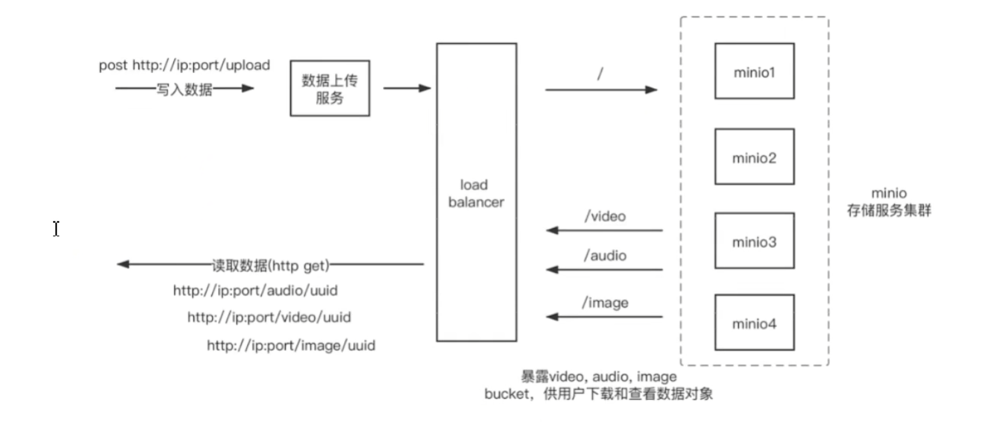

## 第1章 minio简介

### 1.1 分布式文件系统

适用于互联网海量非结构化数据的存储需求

例如电商网站海量图片, 视频网站海量视频, 网盘海量文件等

解决了传统方式的单点故障问题


### 1.2 minio介绍

Minio 是个基于 Golang 编写的开源对象存储套件，基于Apache License v2.0开源协议，虽然轻量，却拥有着不错的性能。它兼容亚马逊S3云存储服务接口。可以很简单的和其他应用结合使用，例如 NodeJS、Redis、MySQL等。


优点

高性能 可扩展 云原生 容器化 图形化界面 支持纠删码

 

### 1.3 基本概念

object : 存储到minio的基本对象

bucket : 逻辑空间, 每个bucket互相隔离 , 相当于文件夹

drive : 存储数据的磁盘

set : 一组drive的集合


### 1.4 纠删码

纠删码是一种恢复丢失和损坏数据的数学算法，目前，纠删码技术在分布式存储系统中的应用主要有三类，阵列纠删码（Array Code: RAID5、RAID6等）、RS(Reed-Solomon)里德-所罗门类纠删码和LDPC(LowDensity Parity Check Code)低密度奇偶校验纠删码。Erasure Code是一种编码技术，它可以将n份原始数据，增加m份数据，并能通过n+m份中的任意n份数据，还原为原始数据。即如果有任意小于等于m份的数据失效，仍然能通过剩下的数据还原出来。

Minio采用Reed-Solomon code将对象拆分成N/2数据和N/2 奇偶校验块。 这就意味着如果是12块盘，一个对象会被分成6个数据块、6个奇偶校验块，可以丢失任意6块盘（不管其是存放的数据块还是奇偶校验块），仍可以从剩下的盘中的数据进行恢复。


### 1.5 存储机制




### 1.6 对比其他同类软件

阿里oss 无需维护部署, 速度快 安全、高可靠 但是后期费用昂贵 

minio 支持容器化部署 读写速度快 支持云原生 文档丰富 有ui界面 社区活跃 支持javasdk 纠删码技术  受限服务器带宽

fastdfs 运维复杂 速度慢 项目无人维护 没有官方文档 缺乏文件安全性

hdfs 适合大数据场景


## 第2章 minio入门

### 2.1 单机部署

基于源文件部署

```sh
./minio server --console-address ":50000" /mnt/data
```


基于docker部署

``` sh
docker run -d -p 9000:9000 -p 50000:50000 --name minio --restart=always -e "MINIO_ROOT_USER=admin" -e "MINIO_ROOT_PASSWORD=admin123" -v /home/minio/data:/data -v /home/minio/config:/root/.minio minio/minio server /data --console-address ":50000" -address ":9000"


# 命令解析
docker run -d -p 9000:9000 -p 50000:50000 --name minio \   # 开启两个端口 一个api 一个ui
-e "MINIO_ROOT_USER=admin"\  -e "MINIO_ROOT_PASSWORD=admin123"\  # 设置用户名密码
-v /mnt/data:/data \  -v /mnt/config:/root/.minio \  # 挂载数据目录和配置文件
minio/minio server --console-address ":50000"  # 把ui固定到50000端口,不然是动态端口
/data  # 指定 drive路径
```


 

### 2.2 纠删码方式部署

```sh
docker run -d -p 9000:9000 -p 50000:50000 --name minio -e "MINIO_ROOT_USER=admin" -e "MINIO_ROOT_PASSWORD=admin123" -v /home/minio/data1:/data1 -v /home/minio/data2:/data2 -v /home/minio/data3:/data3 -v /home/minio/data4:/data4 -v /home/minio/data5:/data5 -v /home/minio/data6:/data6 -v /home/minio/data7:/data7 -v /home/minio/data8:/data8 minio/minio server /data{1...8} --console-address ":50000"

# 最少四个磁盘, 依然存在单点故障
```


### 2.3 分布式集群部署

nginx

```conf
upstream minioConsole{
    server  172.21.0.2:9001;
    server  172.21.0.3:9001;
    server  172.21.0.4:9001;
    server  172.21.0.5:9001;
}

server {
    listen       9001;
    listen  [::]:9001;
    server_name  localhost;
 
    gzip on;
    gzip_min_length 1k;
    gzip_comp_level 9;
    gzip_types text/plain application/javascript application/x-javascript text/css application/xml text/javascript application/x-httpd-php image/jpeg image/gif image/png;
    gzip_vary on;
    gzip_disable "MSIE [1-6]\.";
 
    location / {
       proxy_pass http://minioConsole;
        proxy_set_header        Host $http_host;
        proxy_set_header        X-Real-IP $remote_addr;
        proxy_set_header        X-Forwarded-For $proxy_add_x_forwarded_for;
        client_max_body_size    10m;
        client_body_buffer_size 128k;
        proxy_connect_timeout   300;
        proxy_send_timeout      300;
        proxy_read_timeout      300;
        proxy_buffer_size       4k;
        proxy_buffers           4 32k;
        proxy_busy_buffers_size 64k;
        proxy_temp_file_write_size 64k;
        add_header Access-Control-Allow-Origin *;
        rewrite ^/$ /wlsweb; 
        root   /usr/share/nginx/html;
    }
 
}

upstream minioAPI{
    server  172.21.0.2:9000;
    server  172.21.0.3:9000;
    server  172.21.0.4:9000;
    server  172.21.0.5:9000;
}

server {
    listen       9000;
    listen  [::]:9000;
    server_name  localhost;
 
    gzip on;
    gzip_min_length 1k;
    gzip_comp_level 9;
    gzip_types text/plain application/javascript application/x-javascript text/css application/xml text/javascript application/x-httpd-php image/jpeg image/gif image/png;
    gzip_vary on;
    gzip_disable "MSIE [1-6]\.";
 
    location / {
       proxy_pass http://minioAPI;
        proxy_set_header        Host $http_host;
        proxy_set_header        X-Real-IP $remote_addr;
        proxy_set_header        X-Forwarded-For $proxy_add_x_forwarded_for;
        client_max_body_size    10m;
        client_body_buffer_size 128k;
        proxy_connect_timeout   300;
        proxy_send_timeout      300;
        proxy_read_timeout      300;
        proxy_buffer_size       4k;
        proxy_buffers           4 32k;
        proxy_busy_buffers_size 64k;
        proxy_temp_file_write_size 64k;
        add_header Access-Control-Allow-Origin *;
        rewrite ^/$ /wlsweb; 
        root   /usr/share/nginx/html;
    }
 
}
```


docker-compose

```yaml
version: '3.7'

# Settings and configurations that are common for all containers
x-minio-common: &minio-common
  image: minio/minio
  command: server --console-address ":9001" http://minio{1...4}/data{1...2}
  expose:
    - "9000"
    - "9001"
  environment:
    MINIO_ROOT_USER: minio
    MINIO_ROOT_PASSWORD: minio123
  healthcheck:
    test: ["CMD", "curl", "-f", "http://localhost:9000/minio/health/live"]
    interval: 30s
    timeout: 20s
    retries: 3

# starts 4 docker containers running minio server instances.
# using nginx reverse proxy, load balancing, you can access
# it through port 9000.
services:
  minio1:
    <<: *minio-common
    hostname: minio1
    volumes:
      - data1-1:/data1
      - data1-2:/data2

  minio2:
    <<: *minio-common
    hostname: minio2
    volumes:
      - data2-1:/data1
      - data2-2:/data2

  minio3:
    <<: *minio-common
    hostname: minio3
    volumes:
      - data3-1:/data1
      - data3-2:/data2

  minio4:
    <<: *minio-common
    hostname: minio4
    volumes:
      - data4-1:/data1
      - data4-2:/data2

  nginx:
    image: nginx:1.19.2-alpine
    hostname: nginx
    volumes:
      - ./nginx.conf:/etc/nginx/nginx.conf:ro
    ports:
      - "9000:9000"
      - "9001:9001"
    depends_on:
      - minio1
      - minio2
      - minio3
      - minio4

## By default this config uses default local driver,
## For custom volumes replace with volume driver configuration.
volumes:
  data1-1:
  data1-2:
  data2-1:
  data2-2:
  data3-1:
  data3-2:
  data4-1:
  data4-2:

```


命令

```sh
# 运行docker-compose 
docker-compose pull
docker-compose up -d 


# 进入nginx容器实例
docker exec -it data_nginx_1 bash  # data_nginx_1 可能不同
# 删除容器实例中/etc/nginx/conf.d/default.conf 文件
rm -rf /etc/nginx/conf.d/default.conf   
# 也可重命名作为备份 
mv /etc/nginx/conf.d/default.conf /etc/nginx/conf.d/default.conf.bak
# 退出容器
exit
# 复制上述 default.conf文件到nginx容器实例/etc/nginx/conf.d/下
docker cp default.conf data_nginx_1:/etc/nginx/conf.d/
# 重启nginx容器实例
docker restart data_nginx_1  # data_nginx_1 一般使用容器实例id，不使用容器名称
```


### 2.4 分布式拓展集群

```sh
export MINIO_ROOT_USER=minio
export MINIO_ROOT_PASSWORD=minio123
minio server http://host{1..32}/export{1...32} http://host{33...64}/export{1...32}
```


### 2.5 mc命令使用


### 2.6 仪表盘使用


## 第3章 整合java

### 3.1 整合springboot

官方样例

https://github.com/minio/minio-java


依赖

```xml
<dependency>
	<groupId>com.squareup.okhttp3</groupId>
    <artifactId>okhttp</artifactId>
    <versuib>4.8.1</versuib>
</dependency>
<dependency>
	<groupId>io.minio</groupId>
    <artifactId>minio</artifactId>
    <versuib>8.3.0</versuib>
</dependency>
<dependency>
	<groupId>me.tongfei</groupId>
    <artifactId>progressbar</artifactId>
    <versuib>0.5.3</versuib>
</dependency>
```


yaml

```yaml
minio:
	endpoint: http://192.16.3.14:9000
	accesskey: admin
	secretKey: 12345678
	bucketName: bucket03
	
spring:
	thymeleaf:
		cache: false
	servlet:
		multipart:
			max-request-size: 100MB
			max-file-size: 100MB
```


配置类

```java
package com.iot.zmtestboot.minio;

import io.minio.MinioClient;
import io.minio.ObjectStat;
import io.minio.PutObjectOptions;
import io.minio.Result;
import io.minio.messages.Bucket;
import io.minio.messages.Item;
import lombok.RequiredArgsConstructor;
import lombok.SneakyThrows;
import org.springframework.beans.factory.InitializingBean;
import org.springframework.beans.factory.annotation.Value;
import org.springframework.stereotype.Component;
import org.springframework.util.Assert;

import java.io.InputStream;
import java.util.ArrayList;
import java.util.Iterator;
import java.util.List;
import java.util.Optional;

@Component
@RequiredArgsConstructor
public class MinioTemplate implements InitializingBean {
    /**
     * minio地址+端口号
     */
    @Value("${minio.url}")
    private  String url;
    /**
     * minio用户名
     */
    @Value("${minio.accessKey}")
    private  String accessKey;
    /**
     * minio密码
     */
    @Value("${minio.secretKey}")
    private  String secretKey;
    /**
     * 文件桶的名称
     */
    @Value("${minio.bucketName}")
    private String bucketName;

    private MinioClient minioClient;

    @Override
    public void afterPropertiesSet() throws Exception {
        Assert.hasText(url, "Minio url 为空");
        Assert.hasText(accessKey, "Minio accessKey为空");
        Assert.hasText(secretKey, "Minio secretKey为空");
        this.minioClient = new MinioClient(url, accessKey, secretKey);
    }

    /**
     * 创建bucket
     *
     * @param bucketName bucket名称
     */
    @SneakyThrows
    public void createBucket(String bucketName) {
        if (!minioClient.bucketExists(bucketName)) {
            minioClient.makeBucket(bucketName);
        }
    }

    /**
     * 获取全部bucket
     * <p>
     * https://docs.minio.io/cn/java-client-api-reference.html#listBuckets
     */
    @SneakyThrows
    public List<Bucket> getAllBuckets() {
        return minioClient.listBuckets();
    }

    /**
     * 根据bucketName获取信息
     *
     * @param bucketName bucket名称
     */
    @SneakyThrows
    public Optional<Bucket> getBucket(String bucketName) {
        return minioClient.listBuckets().stream().filter(b -> b.name().equals(bucketName)).findFirst();
    }

    /**
     * 根据bucketName删除信息
     *
     * @param bucketName bucket名称
     */
    @SneakyThrows
    public void removeBucket(String bucketName) {
        minioClient.removeBucket(bucketName);
    }

    /**
     * 根据文件前置查询文件
     *
     * @param bucketName bucket名称
     * @param prefix     前缀
     * @param recursive  是否递归查询
     * @return MinioItem 列表
     */
    @SneakyThrows
    public List getAllObjectsByPrefix(String bucketName, String prefix, boolean recursive) {
        List<Item> list = new ArrayList<>();
        Iterable<Result<Item>> objectsIterator = minioClient.listObjects(bucketName, prefix, recursive);
        if (objectsIterator != null) {
            Iterator<Result<Item>> iterator = objectsIterator.iterator();
            if (iterator != null) {
                while (iterator.hasNext()) {
                    Result<Item> result = iterator.next();
                    Item item = result.get();
                    list.add(item);
                }
            }
        }

        return list;
    }

    /**
     * 获取文件外链
     *
     * @param bucketName bucket名称
     * @param objectName 文件名称
     * @param expires    过期时间 <=7
     * @return url
     */
    @SneakyThrows
    public String getObjectURL(String bucketName, String objectName, Integer expires) {
        if (bucketName.equals("")) {
            bucketName = this.bucketName;
        }
        return minioClient.presignedGetObject(bucketName, objectName, expires);
//        return minioClient.presignedGetObject(bucketName, objectName);
    }

//    /**
//     * 获取文件路径
//     * @param bucketName
//     * @param fileName
//     * @return
//     */
//    @SneakyThrows
//    public String getObjectLocal(String bucketName, String fileName) {
//        if (bucketName!="") {
//            bucketName = this.bucketName;
//        }
//        return minioClient.getObjectUrl(bucketName, fileName);
//    }


    /**
     * 获取文件
     *
     * @param bucketName bucket名称
     * @param objectName 文件名称
     * @return 二进制流
     */
    @SneakyThrows
    public InputStream getObject(String bucketName, String objectName) {
        if (bucketName.equals("")) {
            bucketName = this.bucketName;
        }
        return minioClient.getObject(bucketName, objectName);
    }

    /**
     * 获取文件
     * @param bucketName
     * @param objectName
     * @return
     */
    @SneakyThrows
    public ObjectStat statObject(String bucketName, String objectName) {
        if (bucketName.equals("")) {
            bucketName = this.bucketName;
        }
        return minioClient.statObject(bucketName, objectName);
    }

    /**
     * 上传文件
     *
     * @param bucketName bucket名称
     * @param objectName 文件名称
     * @param stream     文件流
     * @throws Exception https://docs.minio.io/cn/java-client-api-reference.html#putObject
     */
    public void putObject(String bucketName, String objectName,InputStream stream,int length,String suffix) throws Exception {
        String contentType="application/octet-stream";
        if (bucketName.equals("")) {
            bucketName = this.bucketName;
        }
        //判断桶是否存在
        boolean isExist = minioClient.bucketExists(bucketName);
        if(isExist) {
            System.out.println("Bucket already exists.");
        } else {
            // 创建一个名为asiatrip的存储桶，用于存储照片的zip文件。
            createBucket(bucketName);
        }
        if(suffix.equals("jpg") || suffix.equals("JPG")){
            contentType="image/jpg";
        }
        else if(suffix.equals("png") || suffix.equals("PNG")){
            contentType="image/png";
        }
        else if(suffix.equals("jpeg") || suffix.equals("JPEG")){
            contentType="image/jpeg";
        }
        else if(suffix.equals("svg") || suffix.equals("SVG")){
            contentType="image/svg";
        }
        else if(suffix.equals("gif") || suffix.equals("GIF")){
            contentType="image/gif";
        }
        PutObjectOptions filePutObjectOptions= new PutObjectOptions(stream.available(), length);
        filePutObjectOptions.setContentType(contentType);
        minioClient.putObject(bucketName, objectName, stream, filePutObjectOptions);
    }

    /**
     * 获取文件信息, 如果抛出异常则说明文件不存在
     *
     * @param bucketName bucket名称
     * @param objectName 文件名称
     * @throws Exception https://docs.minio.io/cn/java-client-api-reference.html#statObject
     */
    public ObjectStat getObjectInfo(String bucketName, String objectName) throws Exception {
        if (bucketName.equals("")) {
            bucketName = this.bucketName;
        }
        return minioClient.statObject(bucketName, objectName);
    }

    /**
     * 删除文件
     *
     * @param bucketName bucket名称
     * @param objectName 文件名称
     * @throws Exception https://docs.minio.io/cn/java-client-api-reference.html#removeObject
     */
    public void removeObject(String bucketName, String objectName) throws Exception {
        if (bucketName.equals("")) {
            bucketName = this.bucketName;
        }
        minioClient.removeObject(bucketName, objectName);
    }
}
```


控制器

```java
package com.iot.zmtestboot.controller;

import com.google.common.io.CharStreams;
import com.iot.zmtestboot.minio.MinioTemplate;
import io.swagger.annotations.ApiOperation;
import lombok.SneakyThrows;
import org.apache.tomcat.util.http.fileupload.IOUtils;
import org.springframework.beans.factory.annotation.Autowired;
import org.springframework.web.bind.annotation.*;
import org.springframework.web.multipart.MultipartFile;

import java.io.*;

@RestController
@CrossOrigin
@RequestMapping("/iot")
public class MinioController {
    @Autowired
    private MinioTemplate minioTemplate;

    @ApiOperation(value = "上传文件")
    @PostMapping(value = "/upload")
    public String upload(@RequestParam("file") MultipartFile file) throws Exception {
        System.out.println("上传文件");
        if (file.isEmpty()) {
            return "上传文件不能为空";
        } else {
            // 得到文件流
            InputStream is = file.getInputStream();
            // 文件名
            String fileName = file.getOriginalFilename();
            String suffix = fileName.substring(fileName.lastIndexOf(".") + 1);
            // 把文件放到minio的boots桶里面
            minioTemplate.putObject("",fileName,is,-1,suffix);
            // 关闭输入流
            is.close();
            return "上传成功！";
        }
    }

    @ApiOperation(value = "删除文件")
    @DeleteMapping(value = "/delete")
    @SneakyThrows(Exception.class)
    public String delete(@RequestParam("fileName") String fileName) {
        minioTemplate.removeObject("",fileName);
        return "删除成功";
    }

    @ApiOperation(value = "获取文件url预览")
    @GetMapping(value = "/getFileUrl")
    public String getFileUrl(String objectName){
        return minioTemplate.getObjectURL("",objectName,60 * 60 * 24);
    }


    @ApiOperation(value = "获取文件流")
    @GetMapping(value = "/uploadFile")
    public byte[] uploadFile(String objectName) throws IOException {
        InputStream uploadFile=minioTemplate.getObject("",objectName);
        //流转字节码数组
        //byte[] bytes = uploadFile.readAllBytes();\
        //return bytes;
        ByteArrayOutputStream buffer = new ByteArrayOutputStream();
        int nRead;
        byte[] data = new byte[16384];
        while ((nRead = uploadFile.read(data, 0, data.length)) != -1) {
            buffer.write(data, 0, nRead);
        }
        return buffer.toByteArray();

    }
}
```


如果有文件需要在线预览，需要设置contentType

```
{
  ".*": "application/octet-stream",
  ".001": "application/x-001",
  ".301": "application/x-301",
  ".323": "text/h323",
  ".906": "application/x-906",
  ".907": "drawing/907",
  ".a11": "application/x-a11",
  ".acp": "audio/x-mei-aac",
  ".ai": "application/postscript",
  ".aif": "audio/aiff",
  ".aifc": "audio/aiff",
  ".aiff": "audio/aiff",
  ".anv": "application/x-anv",
  ".asa": "text/asa",
  ".asf": "video/x-ms-asf",
  ".asp": "text/asp",
  ".asx": "video/x-ms-asf",
  ".au": "audio/basic",
  ".avi": "video/avi",
  ".awf": "application/vnd.adobe.workflow",
  ".biz": "text/xml",
  ".bmp": "application/x-bmp",
  ".bot": "application/x-bot",
  ".c4t": "application/x-c4t",
  ".c90": "application/x-c90",
  ".cal": "application/x-cals",
  ".cat": "application/s-pki.seccat",
  ".cdf": "application/x-netcdf",
  ".cdr": "application/x-cdr",
  ".cel": "application/x-cel",
  ".cer": "application/x-x509-ca-cert",
  ".cg4": "application/x-g4",
  ".cgm": "application/x-cgm",
  ".cit": "application/x-cit",
  ".class": "java/*",
  ".cml": "text/xml",
  ".cmp": "application/x-cmp",
  ".cmx": "application/x-cmx",
  ".cot": "application/x-cot",
  ".crl": "application/pkix-crl",
  ".crt": "application/x-x509-ca-cert",
  ".csi": "application/x-csi",
  ".css": "text/css",
  ".cut": "application/x-cut",
  ".dbf": "application/x-dbf",
  ".dbm": "application/x-dbm",
  ".dbx": "application/x-dbx",
  ".dcd": "text/xml",
  ".dcx": "application/x-dcx",
  ".der": "application/x-x509-ca-cert",
  ".dgn": "application/x-dgn",
  ".dib": "application/x-dib",
  ".dll": "application/x-msdownload",
  ".doc": "application/msword",
  ".dot": "application/msword",
  ".drw": "application/x-drw",
  ".dtd": "text/xml",
  ".dwf": "Model/vnd.dwf",
  ".dwg": "application/x-dwg",
  ".dxb": "application/x-dxb",
  ".dxf": "application/x-dxf",
  ".edn": "application/vnd.adobe.edn",
  ".emf": "application/x-emf",
  ".eml": "message/rfc822",
  ".ent": "text/xml",
  ".epi": "application/x-epi",
  ".eps": "application/x-ps",
  ".etd": "application/x-ebx",
  ".exe": "application/x-msdownload",
  ".fax": "image/fax",
  ".fdf": "application/vnd.fdf",
  ".fif": "application/fractals",
  ".fo": "text/xml",
  ".frm": "application/x-frm",
  ".g4": "application/x-g4",
  ".gbr": "application/x-gbr",
  ".gcd": "application/x-gcd",
  ".gif": "image/gif",
  ".gl2": "application/x-gl2",
  ".gp4": "application/x-gp4",
  ".hgl": "application/x-hgl",
  ".hmr": "application/x-hmr",
  ".hpg": "application/x-hpgl",
  ".hpl": "application/x-hpl",
  ".hqx": "application/mac-binhex40",
  ".hrf": "application/x-hrf",
  ".hta": "application/hta",
  ".htc": "text/x-component",
  ".htm": "text/html",
  ".html": "text/html",
  ".htt": "text/webviewhtml",
  ".htx": "text/html",
  ".icb": "application/x-icb",
  ".ico": "image/x-icon",
  ".iff": "application/x-iff",
  ".ig4": "application/x-g4",
  ".igs": "application/x-igs",
  ".iii": "application/x-iphone",
  ".img": "application/x-img",
  ".ins": "application/x-internet-signup",
  ".isp": "application/x-internet-signup",
  ".IVF": "video/x-ivf",
  ".java": "java/*",
  ".jfif": "image/jpeg",
  ".jpe": "image/jpeg",
  ".jpeg": "image/jpeg",
  ".jpg": "image/jpeg",
  ".js": "application/x-javascript",
  ".jsp": "text/html",
  ".la1": "audio/x-liquid-file",
  ".lar": "application/x-laplayer-reg",
  ".latex": "application/x-latex",
  ".lavs": "audio/x-liquid-secure",
  ".lbm": "application/x-lbm",
  ".lmsff": "audio/x-la-lms",
  ".ls": "application/x-javascript",
  ".ltr": "application/x-ltr",
  ".m1v": "video/x-mpeg",
  ".m2v": "video/x-mpeg",
  ".m3u": "audio/mpegurl",
  ".m4e": "video/mpeg4",
  ".mac": "application/x-mac",
  ".man": "application/x-troff-man",
  ".math": "text/xml",
  ".mdb": "application/x-mdb",
  ".mfp": "application/x-shockwave-flash",
  ".mht": "message/rfc822",
  ".mhtml": "message/rfc822",
  ".mi": "application/x-mi",
  ".mid": "audio/mid",
  ".midi": "audio/mid",
  ".mil": "application/x-mil",
  ".mml": "text/xml",
  ".mnd": "audio/x-musicnet-download",
  ".mns": "audio/x-musicnet-stream",
  ".mocha": "application/x-javascript",
  ".movie": "video/x-sgi-movie",
  ".mp1": "audio/mp1",
  ".mp2": "audio/mp2",
  ".mp2v": "video/mpeg",
  ".mp3": "audio/mp3",
  ".mp4": "video/mp4",
  ".mpa": "video/x-mpg",
  ".mpd": "application/-project",
  ".mpe": "video/x-mpeg",
  ".mpeg": "video/mpg",
  ".mpg": "video/mpg",
  ".mpga": "audio/rn-mpeg",
  ".mpp": "application/-project",
  ".mps": "video/x-mpeg",
  ".mpt": "application/-project",
  ".mpv": "video/mpg",
  ".mpv2": "video/mpeg",
  ".mpw": "application/s-project",
  ".mpx": "application/-project",
  ".mtx": "text/xml",
  ".mxp": "application/x-mmxp",
  ".net": "image/pnetvue",
  ".nrf": "application/x-nrf",
  ".nws": "message/rfc822",
  ".odc": "text/x-ms-odc",
  ".out": "application/x-out",
  ".p10": "application/pkcs10",
  ".p12": "application/x-pkcs12",
  ".p7b": "application/x-pkcs7-certificates",
  ".p7c": "application/pkcs7-mime",
  ".p7m": "application/pkcs7-mime",
  ".p7r": "application/x-pkcs7-certreqresp",
  ".p7s": "application/pkcs7-signature",
  ".pc5": "application/x-pc5",
  ".pci": "application/x-pci",
  ".pcl": "application/x-pcl",
  ".pcx": "application/x-pcx",
  ".pdf": "application/pdf",
  ".pdx": "application/vnd.adobe.pdx",
  ".pfx": "application/x-pkcs12",
  ".pgl": "application/x-pgl",
  ".pic": "application/x-pic",
  ".pko": "application-pki.pko",
  ".pl": "application/x-perl",
  ".plg": "text/html",
  ".pls": "audio/scpls",
  ".plt": "application/x-plt",
  ".png": "image/png",
  ".pot": "applications-powerpoint",
  ".ppa": "application/vs-powerpoint",
  ".ppm": "application/x-ppm",
  ".pps": "application-powerpoint",
  ".ppt": "applications-powerpoint",
  ".pr": "application/x-pr",
  ".prf": "application/pics-rules",
  ".prn": "application/x-prn",
  ".prt": "application/x-prt",
  ".ps": "application/postscript",
  ".ptn": "application/x-ptn",
  ".pwz": "application/powerpoint",
  ".r3t": "text/vnd.rn-realtext3d",
  ".ra": "audio/vnd.rn-realaudio",
  ".ram": "audio/x-pn-realaudio",
  ".ras": "application/x-ras",
  ".rat": "application/rat-file",
  ".rdf": "text/xml",
  ".rec": "application/vnd.rn-recording",
  ".red": "application/x-red",
  ".rgb": "application/x-rgb",
  ".rjs": "application/vnd.rn-realsystem-rjs",
  ".rjt": "application/vnd.rn-realsystem-rjt",
  ".rlc": "application/x-rlc",
  ".rle": "application/x-rle",
  ".rm": "application/vnd.rn-realmedia",
  ".rmf": "application/vnd.adobe.rmf",
  ".rmi": "audio/mid",
  ".rmj": "application/vnd.rn-realsystem-rmj",
  ".rmm": "audio/x-pn-realaudio",
  ".rmp": "application/vnd.rn-rn_music_package",
  ".rms": "application/vnd.rn-realmedia-secure",
  ".rmvb": "application/vnd.rn-realmedia-vbr",
  ".rmx": "application/vnd.rn-realsystem-rmx",
  ".rnx": "application/vnd.rn-realplayer",
  ".rp": "image/vnd.rn-realpix",
  ".rpm": "audio/x-pn-realaudio-plugin",
  ".rsml": "application/vnd.rn-rsml",
  ".rt": "text/vnd.rn-realtext",
  ".rtf": "application/x-rtf",
  ".rv": "video/vnd.rn-realvideo",
  ".sam": "application/x-sam",
  ".sat": "application/x-sat",
  ".sdp": "application/sdp",
  ".sdw": "application/x-sdw",
  ".sit": "application/x-stuffit",
  ".slb": "application/x-slb",
  ".sld": "application/x-sld",
  ".slk": "drawing/x-slk",
  ".smi": "application/smil",
  ".smil": "application/smil",
  ".smk": "application/x-smk",
  ".snd": "audio/basic",
  ".sol": "text/plain",
  ".sor": "text/plain",
  ".spc": "application/x-pkcs7-certificates",
  ".spl": "application/futuresplash",
  ".spp": "text/xml",
  ".ssm": "application/streamingmedia",
  ".sst": "application-pki.certstore",
  ".stl": "application/-pki.stl",
  ".stm": "text/html",
  ".sty": "application/x-sty",
  ".svg": "text/xml",
  ".swf": "application/x-shockwave-flash",
  ".tdf": "application/x-tdf",
  ".tg4": "application/x-tg4",
  ".tga": "application/x-tga",
  ".tif": "image/tiff",
  ".tiff": "image/tiff",
  ".tld": "text/xml",
  ".top": "drawing/x-top",
  ".torrent": "application/x-bittorrent",
  ".tsd": "text/xml",
  ".txt": "text/plain",
  ".uin": "application/x-icq",
  ".uls": "text/iuls",
  ".vcf": "text/x-vcard",
  ".vda": "application/x-vda",
  ".vdx": "application/vnd.visio",
  ".vml": "text/xml",
  ".vpg": "application/x-vpeg005",
  ".vsd": "application/x-vsd",
  ".vss": "application/vnd.visio",
  ".vst": "application/x-vst",
  ".vsw": "application/vnd.visio",
  ".vsx": "application/vnd.visio",
  ".vtx": "application/vnd.visio",
  ".vxml": "text/xml",
  ".wav": "audio/wav",
  ".wax": "audio/x-ms-wax",
  ".wb1": "application/x-wb1",
  ".wb2": "application/x-wb2",
  ".wb3": "application/x-wb3",
  ".wbmp": "image/vnd.wap.wbmp",
  ".wiz": "application/msword",
  ".wk3": "application/x-wk3",
  ".wk4": "application/x-wk4",
  ".wkq": "application/x-wkq",
  ".wks": "application/x-wks",
  ".wm": "video/x-ms-wm",
  ".wma": "audio/x-ms-wma",
  ".wmd": "application/x-ms-wmd",
  ".wmf": "application/x-wmf",
  ".wml": "text/vnd.wap.wml",
  ".wmv": "video/x-ms-wmv",
  ".wmx": "video/x-ms-wmx",
  ".wmz": "application/x-ms-wmz",
  ".wp6": "application/x-wp6",
  ".wpd": "application/x-wpd",
  ".wpg": "application/x-wpg",
  ".wpl": "application/-wpl",
  ".wq1": "application/x-wq1",
  ".wr1": "application/x-wr1",
  ".wri": "application/x-wri",
  ".wrk": "application/x-wrk",
  ".ws": "application/x-ws",
  ".ws2": "application/x-ws",
  ".wsc": "text/scriptlet",
  ".wsdl": "text/xml",
  ".wvx": "video/x-ms-wvx",
  ".xdp": "application/vnd.adobe.xdp",
  ".xdr": "text/xml",
  ".xfd": "application/vnd.adobe.xfd",
  ".xfdf": "application/vnd.adobe.xfdf",
  ".xhtml": "text/html",
  ".xls": "application/x-xls",
  ".xlw": "application/x-xlw",
  ".xml": "text/xml",
  ".xpl": "audio/scpls",
  ".xq": "text/xml",
  ".xql": "text/xml",
  ".xquery": "text/xml",
  ".xsd": "text/xml",
  ".xsl": "text/xml",
  ".xslt": "text/xml",
  ".xwd": "application/x-xwd",
  ".x_b": "application/x-x_b",
  ".x_t": "application/x-x_t"
}
```


## 第4章 k8s部署