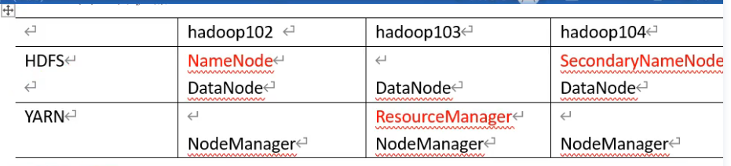
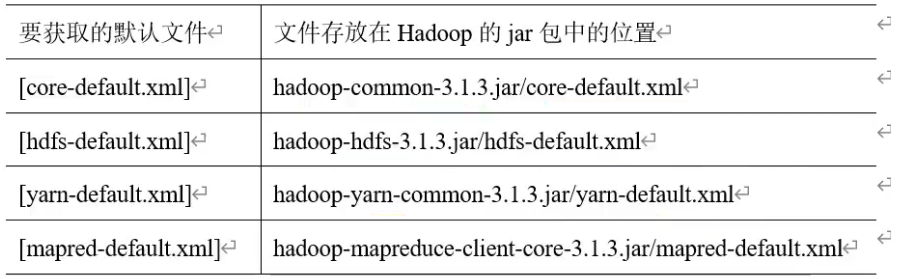

---

title: Hadoop

date: 2021-11-14 09:34:40

---


## 第1章 大数据简介

### 1.1 大数据概念


### 1.2 hadoop概念


### 1.3 hadoop对比spark

Hadoop适合处理离线的静态的大数据；

Spark适合处理离线的流式的大数据；


## 第2章 Hadoop入门


### 2.1 windows 单节点 


### 2.1 ubuntu 单节点 


### 2.1 ubuntu 完全分布式

1. 硬件安装

查看是否开启vt虚拟化

安装vmware ， 下载ubnutu

推荐虚拟机配置

最小内存2GB ，最小磁盘30GB ，CPU 2x2 ， 单文件形式安装，NAT网络模式


2. 配置IP地址

VM虚拟网卡IP配置

打开vmware 编辑 虚拟网络配置，找到vmnet8 点击更改配置 

会重新载入，再进入vmnet8 

更改子网ip 192.168.10.0， 更改NAT设置192.168.10.2，应用并确认


宿主机win10系统IP配置

打开网络连接设置，找到vmware8，右键属性，双击ipv4协议

更改默认网关192.168.10.2

更改DNS服务器地址192.168.10.2，备用8.8.8.8


虚拟机内部Linux系统IP配置

切换到root  `su root` ，打开网络配置文件

- ubnutu20 在 /etc/netplan/01-netork-manager-all.yaml 

```sh
# Let NetworkManager manage all devices on this system
network:
  version: 2
  renderer: NetworkManager
  ethernets:
    ens33:
      dhcp4: no      
      addresses: [192.168.10.100/24] # ip
      gateway4: 192.168.10.2  
      nameservers:
        addresses: [192.168.10.2,8.8.8.8] #dns

# 保存退出
:wq

# 重启网络服务
netplan apply    
```


- ubnutu16 在 /etc/network/interfaces

- centos 在 /etc/sysconfig/network-scripts/ifcfg-ens33


3. 配置主机名和host文件

vim /etc/hostname

hadoop100


vim /etc/hosts

192.168.10.100 hadoop100

192.168.10.101 hadoop101

192.168.10.102 hadoop102

192.168.10.103 hadoop103

192.168.10.104 hadoop104


4. 重启查看配置是否成功

reboot  # 重启

ifconfig  # 查看配置是否成功

ping www.baidu.com # 查看网络是否通常

hostname # 查看主机名是否成功


5. 使用shell远程连接

安装必需工具

apt-get install net-tools

apt-get install vim


安装ssh服务

apt-get install ssh

启动服务

/etc/init.d/ssh start

修改可用root登录

vim /etc/ssh/sshd_config

permitrootlogin yes

重启服务

service ssh restart


关闭防火墙


6. ssh无密登录

先在一台虚拟机生成密钥对

ssh-keygen -t rsa

把公钥给到103服务器上，只能使用非root用户

ssh-copy-id hadoop103

连接103 ，只有第一次会输入密码，只能使用非root用户

ssh hadoop103 


之后在每台服务器上都生成密钥对，并分发公钥给其他服务器


7. 卸载自带jdk

ubuntu20没有自带jdk


8. 克隆三台虚拟机

完全克隆，修改主机名和ip地址


9. 写一个分发文件的脚本

脚本( 有一点bug 直接用复制命令)

```sh
#!/bin/bash

if [ $# -lt 1]
then 
	echo Not Enough Arguement!
	exit;
	
fi

for host in hadoop102 hadoop103 hadoop104
do
	echo ======== $host ========
	
	for file in $@
	do

		if [ -e $file]
			then
				pdir=$(cd -P $(dirname $file); pwd)
				fname=$(basename $file)
				ssh $host "mkdir -p $pdir"
				rsync -av $pdir/$fname $host:$pdir
				echo $file success!
			else 
				echo $file does not exists!
				
		fi
	done
done

```


安装需要的jdk

```
tar -zxvf jdk1.8.0_202.tar.gz -C /opt/module/
```


安装hadoop

```
tar -zxvf hadoop-3.1.3.tar.gz -C /opt/module/
```


配置环境变量

```sh
//vim /etc/profile.d/my_env
# JAVA_HOME
export JAVA_HOME=/opt/module/jdk1.8.0_202

export PATH=$PATH:$JAVA_HOME/bin


# HADOOP_HOME 
export HADOOP_HOME=/opt/module/hadoop-3.1.3 

export PATH=$PATH:$HADOOP_HOME/bin 
export PATH=$PATH:$HADOOP_HOME/sbin


```


检查是否安装成功

```sh
# 更新配置文件
source /etc/profile.d/my_env

hadoop version  # 注意这个不是 -version

java -version

```


分发给三台虚拟机

```
# 仅示范 102克隆到103
scp -r /opt/ root@192.168.10.103:/
scp /etc/profile.d/my_env.sh root@192.168.10.103:/etc/profile.d/my_env.sh
source /etc/profile
```


scp完全复制 - 方法详解

```sh
# 处于A主机，把文件从A主机拷贝到B主机
//目前我们处在IP为“192.168.60.133”，
//将系统下的/home/ixdba/etc.tar.gz 文件
//拷贝到IP为 192.168.60.168主机的/tmp目录下

scp -r /home/ixdba/etc.tar.gz root@192.168.60.168:/tmp

# 处于B主机，把文件从A主机拷贝到B主机
//如果我们处在“192.168.60.168”服务器上，也可以使用下面的命令传输数据：

scp -r root@192.168.60.133:/home/ixdba/etc.tar.gz /tmp
```


### 2.2 配置集群

#### 2.2.1 集群规划




#### 2.2.2 四大配置文件

默认配置文件




自定义配置文件

$HADOOP_HOME/etc/hadoop/core-site.xml

```xml
<?xml version="1.0" encoding="UTF-8"?>
<?xml-stylesheet type="text/xsl" href="configuration.xsl"?>
<configuration>
	//指定namenode内部端口8020
    <property>
        <name>fs.defaultFS</name>
        <value>hdfs://hadoop102:8020</value>
    </property>
    
    //配置数据存储的目录
    <property>
    	<name>hadoop.tmp.dir</name>
        <value>/opt/module/hadoop-3.1.3/data</value>
    </property>	
    
    //配置web页面有操作权限的用户
    <property>
    	<name>hadoop.http.staticuser.user</name>
        <value>wangle</value>
    </property>	
</configuration>

```


$HADOOP_HOME/etc/hadoop/hdfs-site.xml

```xml
<?xml version="1.0" encoding="UTF-8"?>
<?xml-stylesheet type="text/xsl" href="configuration.xsl"?>
<configuration>
	//指定nn外部端口9870
    <property>
        <name>dfs.namenode.http-address</name>
        <value>hadoop102:9870</value>
    </property>
    //指定2nn外部端口9870
    <property>
        <name>dfs.namenode.secondary.http-address</name>
        <value>hadoop104:9868</value>
    </property>
</configuration>
```


$HADOOP_HOME/etc/hadoop/mapred-site.xml


```xml
<?xml version="1.0" encoding="UTF-8"?>
<?xml-stylesheet type="text/xsl" href="configuration.xsl"?>
<configuration>
	//指定mapreduce运行在yarn上
    <property>
        <name>mapreduce.framework.name</name>
        <value>yarn</value>
    </property>
</configuration>
```


$HADOOP_HOME/etc/hadoop/yarn-site.xml


```xml
<?xml version="1.0" encoding="UTF-8"?>
<?xml-stylesheet type="text/xsl" href="configuration.xsl"?>
<configuration>
	//指定mr走shuffle
    <property>
        <name>yarn.nodemanager.aux-services</name>
        <value>mapreduce_shuffle</value>
    </property>
    
    //指定resourceManager的地址
    <property>
        <name>yarn.resourcemanager.hostname</name>
        <value>hadoop103</value>
    </property>
    
     //环境变量的继承
    <property>
        <name>yarn.nodemanager.env-whitelist</name>				<value>JAVA_HOME,HADOOP_COMMON_HOME,HADOOP_HDFS_HOME,HADOOP_CONF_DIR,CLASSPATH_PREPEND_DISTCACHE,HADOOP_YARN_HOME,HADOOP_MAPRED_HOME</value>
    </property>
</configuration>
```


$HADOOP_HOME/etc/hadoop/workers

不允许有任何空格和空行

```sh
hadoop102
hadoop103
hadoop104
```


#### 2.2.3 rsync方法详解

scp差异复制 - 方法详解


#### 2.2.4 分发集群配置


#### 2.2.5 初始化集群

首次需要初始化，会在根目录下创建 data 和 logs 文件夹

在102服务器下操作

```sh
cd /opt/module/hadoop-3.1.3
hdfs namenode -format
```


在102服务器下操作启动集群

```sh
cd /opt/module/hadoop-3.1.3/sbin/
sh start-dfs.sh
jps
```


宿主机浏览器访问 hdfs 页面

http://hadoop102:9870


在103服务器上启动 yarn

```sh
cd /opt/module/hadoop-3.1.3/sbin/
sh start-yarn.sh
jps
```


访问 yarn 页面

http://hadoop103:8088


配置历史服务器

```sh
# 在102服务器的mapred-site.xml追加以下配置
//历史服务器内部地址
<property>
	<name>mapreduce.jobhistory.address</name>
	<value>hadoop102:10020</value>
</property>

//历史服务器外部地址
<property>
	<name>mapreduce.jobhistory.webapp.address</name>
	<value>hadoop102:19888</value>
</property>


# 分发102的配置
rsync $HADOOP_HOME/etc/hadoop/mapred-site.xml $HADOOP_HOME/etc/hadoop/mapred-site.xml 


# 在102 启动历史服务器
mapred --daemon start historyserver

# 使用jds查看是否启动成功
jps
```


日志聚集功能配置


```sh
# 在102服务器的yarn-site.xml追加以下配置
//开启日志聚集功能
<property>
	<name>yarn.log-aggregation-enable</name>
	<value>true</value>
</property>

//设置日志聚集服务器地址
<property>
	<name>yarn.log.server.url</name>
	<value>http://hadoop102:19888/jobhistory/logs</value>
</property>

//设置日志b保留时间为7天
<property>
	<name>yarn.log.aggregation.retain-seconds</name>
	<value>604800</value>
</property>


# 分发102的配置
rsync $HADOOP_HOME/etc/hadoop/yarn-site.xml $HADOOP_HOME/etc/hadoop/yarn-site.xml 

# 在103重启yarn和历史服务器
mapred --daemon stop historyserver
mapred --daemon start historyserver


sh $HADOOP_HOME/sbin/stop-yarn.sh
sh $HADOOP_HOME/sbin/start-yarn.sh

# 使用jds查看是否启动成功
jps
```


上传测试数据

```sh
# 在集群服务器根目录下创建文件夹/input
hadoop fs -mkdir /input

# 上传一个txt文本到hadoop集群下的/input
hadoop fs -put /home/wangle/a.txt /input

# 集群中存放文件的位置,每个服务器保存一份数据副本
$HADOOP_HOME/data/dfs/data/current/BP/current/finalized/subdir0/subdir0/blk...

# 测试wordcount程序
hadoop jar $HADOOP_HOME/share/hadoop/mapreduce/hadoop-mapreduce-examples-3.1.3.jar wordcount /input /output

```

​	


### 2.3 集群崩溃办法

停止服务器 

```sh
# 在102服务器上停止dfs
sh $HADOOP_HOME/sbin/stop-dfs.sh

# 在103服务器上停止yarn 
sh $HADOOP_HOME/sbin/stop-yarn.sh
```


删除三台f服务器的 data logs

```sh
rm -rf  $HADOOP_HOME/data/  $HADOOP_HOME/logs/
```


格式化

```sh
hdfs namenode -format
```


启动集群

```sh
# 102服务器dfs
sh $HADOOP_HOME/sbin/start-dfs.sh

# 103服务器yarn
sh $HADOOP_HOME/sbin/start-yarn.sh
```


在102服务器下操作启动集群

```sh
cd /opt/module/hadoop-3.1.3/sbin/
sh start-dfs.sh
jps
```


### 2.4 编写集群停启脚本

hdfs 和 yarn 停起

```sh
sh $HADOOP_HOME/sbin/start-dfs.sh
sh $HADOOP_HOME/sbin/stop-dfs.sh
sh $HADOOP_HOME/sbin/start-yarn.sh
sh $HADOOP_HOME/sbin/stop-yarn.sh
```


单独服务的停起

```sh
hdfs --daemon start/stop namenode/datanode/secondarynamenode
yarn --daemon start/stop resourcemanager/nodemanager
```


编写集群停起脚本

```sh
#!/bin/bash
if [ $# -lt 1]
then 
	echo "no args input"
	exit ;
fi

case $1 in 
"start")
	echo "======启动hadoop集群======"
	ssh hadoop102 "opt/module/hadoop-3.1.3/sbin/start-dfs.sh"
	echo "======dfs启动======"
	ssh hadoop103 "opt/module/hadoop-3.1.3/sbin/start-yarn.sh"
	echo "======yarn启动======"
	ssh hadoop102 "opt/module/hadoop-3.1.3/bin/mapred --daemon start historyserver"
	echo "======history启动======"
;;
"stop")
	ssh hadoop102 "opt/module/hadoop-3.1.3/bin/mapred --daemon stop historyserver"
	echo "======history关闭======"
	
	ssh hadoop103 "opt/module/hadoop-3.1.3/sbin/stop-yarn.sh"
	echo "======yarn关闭======"
	ssh hadoop102 "opt/module/hadoop-3.1.3/sbin/stop-dfs.sh"
	echo "======dfs关闭======"
;;
*)
	echo "input args error"
;;
esac
```


### 2.5 常用配置文件和端口总结

```
一、常用端口号
hadoop 3.x
	HDFS NameNode 内部端口号 8020 9000 9820
	HDFS NameNode 外部端口号 9870
	Yank 外部端口号 8088
	历史服务器 19888

hadoop 2.x	
	HDFS NameNode 内部端口号 8020 9000 
	HDFS NameNode 外部端口号 80070
	Yank 外部端口号 8088
	历史服务器 19888
	
二、常用配置文件
hadoop 3.x	
	core-site.xml 
	hdfs-site.xml 
	yarn-site.xml 
	mapred-site.xml 
	workers
	
hadoop 2.x	
	slaves(workers)
```


### 2.6 集群时间同步

有外网的情况不需要时间同步

局域网的情况下，无互联网，需要配置时间同步


查看 ntpd 服务

```sh
status ntpd
start ntpd
is-enabled ntpd
```


修改102服务器上的 /etc/ntp.conf 文件

```sh
# 解开原有注释
restrict 192.168.10.0 mask 255.255.255.0 nomodify notrap

# 添加注释
# server 0 ...
# server 1 ...
...

# 追加内容
server 127.127.1.0
fudge 127.127.1.0 stratum 10
```


修改 /etc/sysconfig/ntpd

```sh
# 追加下面内容
SYNC_HWCLOCK=yes
```


102 的 ntpd

```sh
# 重启ntpd服务

# 开启自启动ntpd服务

```


其他服务器的 ntpd 

```sh
# 停止ntpd服务

# 禁用开机自启动ntpd服务

# 编写定时任务
sudo crontab -e
*/1 * * * * /usr/sbin/ntpdate hadoop102
```


验证是否成功

```sh
# 修改103服务器时间
sudo data -s "2021-9-11 11:11:11"

# 1分钟后查看是否同步
sudo data
```


## 第3章 HDFS 存储

### 3.1 概述


### 3.2 常用命令


### 3.3 客户端api


### 3.4 读写流程


### 3.5 NN和2NN

生产环境使用NN的高可用，不会使用2NN


### 3.6 DataNode工作机制


## 第4章 MapReduce 计算

### 4.1 概述

分布式运算程序的编程框架。


优点

-   易于编程
-   高容错
-   适合海量数据


缺点

-   不擅长实时计算
-   不擅长流式计算
-   不擅长Dag有向无环图


### 4.2 序列化


### 4.3 核心原理


### 4.4 压缩


## 第5章 Yarn 资源调度

### 5.1 基础架构

### 5.2 工作机制

### 5.3 调度器和调度算法

### 5.4 命令行操作

### 5.5 生产环境参数配置

### 5.6 容量调度器生产环境配置

### 5.7 公平调度器生产环境配置

### 5.8 yarn的tool接口
