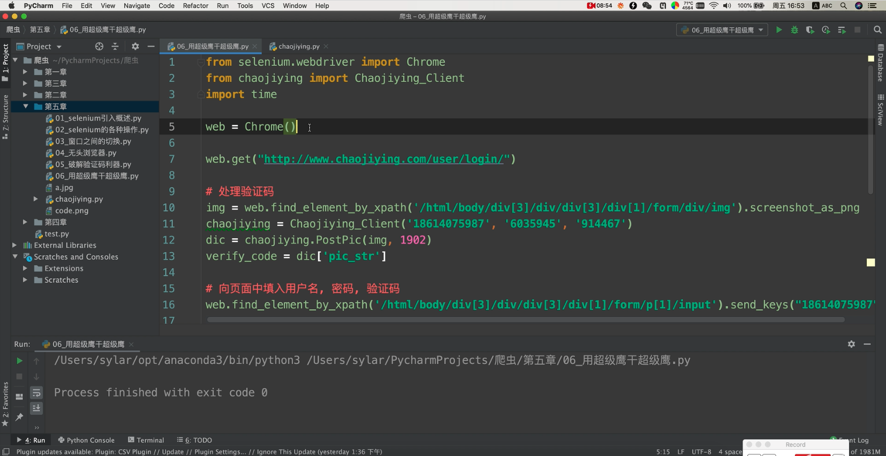

---

title: selenium

date: 2021-11-14 09:34:26

---

## 第1章 selenuim介绍

### 1.1 简介

教程网站 http://www.python3.vip/  

浏览器驱动网址：https://chromedriver.storage.googleapis.com/index.html


### 1.2 安装

pip install selenium

下载浏览器驱动


## 第2章 selenium语法


### 2.1 完整案例

```python
from selenium import webdriver  # 导入自动化模块  
import time  # 时间模块  
import requests  # 导入网络模块  
import os  # 导入文件模块  
import re  # 导入正则模块  
from lxml import etree  # 导入xpath模块  
import json  # json模块  
import pandas as pd # 数据存储模块  


from selenium import webdriver # 导入自动化模块  
import time  
bro = webdriver.Chrome(executable_path='./chromedriver.exe')  # 加载驱动  
time.sleeep(2)    # 显式等待,有时候必须用显示等待，当需要连续选择两个下拉框的时候可能会找不到。  
bro.implicitly_wait(5)    # 隐式等待  
bro.get('https://www.baidu.com')  # 访问网址  
response = bro.page_source  # 返回页面数据  
tree = etree.HTML(response)  # 创建xpath实例并解析  
```


### 2.2 win带插件的谷歌浏览器方法  

```python
from selenium import webdriver   

import selenium.common.exceptions   

options = webdriver.ChromeOptions()  

options.add_argument("--user-data-dir="+r"C:/Users/197355/AppData/Local/Google/Chrome/User Data/")  

path = r'F:\IDE\selenium\chromedriver.exe'  

browser = webdriver.Chrome(chrome_options=options, executable_path=path)  

browser.get('https://www.bilibili.com/video/BV1R54y117MD')  

配置文件路径查看方法如下：  
地址栏输入chrome://version/查看浏览器信息。  
注：到User Data就结束了，还有斜杠要反过来。  
```


### 2.3 设置代理ip   

```python
from selenium import webdriver  
options = webdriver.ChromeOptions()  
options.add_argument("--proxy-server=http://110.73.2.248:8123")  
driver_path = r"D:\ProgramApp\chromedriver\chromedriver.exe"  
driver = webdriver.Chrome(executable_path=driver_path,chrome_options=options)  
```


### 2.4 模拟等待时间

```python
浏览器等待随机时间  
import time  
import random  
time.sleep(random.randint(0,3))  
```


### 2.5 元素选择

将程序定位到标签id为q的输入框   

element = bro.find_element_by_id('q')   


将程序定位到第一个classname为adj的搜索按钮 , 找不到则报错  

element = bro.find_element_by_class_name('adj')


将程序定位到所有classname为adj的搜索按钮  找不到则返回空列表  

element = bro.find_elements_by_class_name('adj')


### 2.6 操作元素  

模拟鼠标点击    

element.click()  


模拟键盘点击

from selenium.webdriver.common.keys import Keys

```python
Keys.BACK_SPACE 	# 回退键(BackSpace)

Keys.TAB	# 制表键(Tab)
Keys.ENTER		# 回车键(Enter)
Keys.SHIFT		# 大小写转换键(Shift)
Keys.CONTROL	# Control键(Ctrl)
Keys.ALT	# ALT键(Alt)
Keys.ESCAPE 	# 返回键(Esc)
Keys.SPACE 		# 空格键(Space)
Keys.PAGE_UP		# 翻页键上(Page Up)
Keys.PAGE_DOWN 		# 翻页键下(Page Down)
Keys.END		# 行尾键(End)
Keys.HOME		# 行首键(Home)
Keys.LEFT		# 方向键左(Left)
Keys.UP		# 方向键上(Up)
Keys.RIGHT		# 方向键右(Right)
Keys.DOWN		# 方向键下(Down)
Keys.INSERT		# 插入键(Insert)
DELETE		# 删除键(Delete)
NUMPAD0 ~ NUMPAD9		# 数字键1-9
Keys.F5		# 刷新键
F1 ~ F12		# F1 - F12键
(Keys.CONTROL, 'a')		# 组合键Control+a，全选
(Keys.CONTROL, 'c')		# 组合键Control+c，复制
(Keys.CONTROL, 'x')		# 组合键Control+x，剪切
(Keys.CONTROL, 'v')		# 组合键Control+v，粘贴
```


输入字符串  

调用WebElement对象的send_keys方法  

element.send_keys('iphone\n')  


获取元素文本内容  

通过WebElement对象的text属性  

print(element.text)  

或者   

element.get_attribute('innerText')  

或者  

element.get_attribute('textContent')

  

获取元素的属性  

调用WebElement对象的get_attribute方法  

print(element.get_attribute('class'))  


获取整个元素对应的HTML  

element.get_attribute('outerHTML')  


获取某个元素内部的HTML文本内容  

element.get_attribute('innerHTML')  


获取输入框里面的文字   

对于input输入框，不能使用text属性  


element.get_attribute('value')


### 2.7 CSS语法选择元素   


将程序定位到类名为q的输入框  

element = bro.find_element_by_css_selector('.q')


将程序定位到div标签  

element = bro.find_elements_by_css_selector('div')  


将程序定位到id为ori的标签  

element = bro.find_elements_by_css_selector('#ori')


获取所有有herf属性的标签元素  

element = bro.find_elements_by_css_selector('[href]')  


根据标签的其他属性获取元素  

element = bro.find_elements_by_css_selector('[href="http://www.baidu.com"]')  


在极为复杂的混合css选择公式中，通过谷歌浏览器的右键检查中，ctrl+f 可以在线验证css选择器书写是否正确


### 2.8 复习css基本语法  

获取e1的所有子元素e2  

e1 > e2  


获取e1的所有后代元素e2  

e1 e2  


h3的所有兄弟元素  

h3 ~ span  


h3的紧跟着的兄弟元素  

h3 + span  


满足e1 或 e2 其中一种  

e1 , e2  


注意，逗号优先级较低  

如果想要选择#ad中的所有p和a标签  

错误写法是 #ad > p,a  

正确写法是 #ad > p , #ad > a  


按次序选择子节点  

span:nth-child(2)  

span:nth-child(even)  

span:nth-child(odd)  

span:nth-last-child(2)  

span:nth-of-type(2)  

span:nth-last-of-type(2)


### 2.9 操作单选框和多选框

获取当前选中的元素  

element = wd.find_element_by_css_selector(  
'#s_radio input[checked="checked"]'    
)  

print('当前选中的是' + element.get_attribute('value'))  


选中其他选项  

wd.find_element_by_css_selector('#s_radio input[value="数学"]' ).click()  


操作checkbox多选框  

获取所有已经被选中的选项  

elements = wd.find_elements_by_css_selector(  '#s_checkbox input[checked="checked"]' )  


反选所有被选中的选项  

for element in elements:  

element.click()  


再选中需要选择的选项  

wd.find_elements_by_css_selector( '#s_checkbox input[value="英语"]' ).click()  


### 2.10 操作下拉选择框  

单选框  导入路径  

from selenium.webdriver.support.ui import Select   


创建select对象  

s1 = Select(wd.find_element_by_id("ss_singgle"))  


通过可视文本进行单选  

s1.select_by_visivle_text("数学")  

s1.selectByVisibleText(“”);  

s1.selectByValue(“”);  

s1.selectByIndex(“”);  


如果使用select无法满足需要,那就完全模拟鼠标点击  

driver.findElement(By.xpath(“//select[@id=’AAA’]/option[@value=’BBB’]”).click();  

driver.findElement（By.id(“AAA”)）.click();  


多选框  

导入路径   

from selenium.webdriver.support.ui import Select  

创建select对象  

s1 = Select(wd.find_element_by_id("ss_singgle"))  

清楚所有选中  

select.deselect_all()  


通过可视文本进行多选  

s1.select_by_visivle_text("数学")  

s1.select_by_visivle_text("英语")  


### 2.11 弹出框处理  

alert = wd.wd.switch_to.alert  # 获取alert对象  

print(alert.text)  #获取提示框的文本内容  

alert.accept()   #点击ok按钮  

alert.dismiss()  #点击取消按钮  


confirm  

alert = wd.wd.switch_to.alert  

alert.send_keys()   # 输入信息  

alert.accept()  


### 2.12 iframe内嵌页面  

如果定位的标签是在iframe子框架中，则无法通过selenium直接找到，需要切换作用域 


将作用域切换到id属性值为iframeResule的子框架中  

iframeResule = bro.find...

bro.switch_to.frame('iframeResule')  


切回到外层的frame中  

bro.switch_to.default_content()  


### 2.13 动作链  

导包  
from selenium.webdriver import ActionChains  

生成动作链对象  
action = ActionChains(bro)  

点击长按指定的标签  
action.click_and_hold(div)  

偏移    
action.move_by_offset(17,0).perform()  
perform()是立即执行  
最好写成for循环,表示慢慢拖到指定的位置  

释放动作链  
action.release()  


特殊操作  

导包  from selenium.webdriver.common.action_chains import ActionChains  

实例化ActionChains对象  

ac = ActionChains(wd)  


鼠标移动到元素上  

ac.move_to_element(  wd.find_element_by_id("ss_singgle")  ).perform()  


冻结界面  

在谷歌控制台输入  

setTimeout(function({debugger},5000))  


### 2.14 浏览器操作  

让程序执行一组js代码  

bro.execute_script('window.scrollTo(0,document.body.srcollHeight)')  


后退  

bro.back()  


前进  

bro.forward()  


关闭浏览器  

bro.quit()  


切换标签页  

```python
# 简单版 适合就一两个标签 切换到最后一个标签
web.switch_to.window(web.window_handles[-1])

# 切换后还需要切回来
web.close() 关闭当前标签,但视角还在新标签上
web.switch_to.window(web.window_handles[0])


# 复杂版 依次获取所有标签页的句柄  如果标签标题中有Bing关键字就退出循环  
for handle in wd.window_handles  
	wd.switch_to.window(handle)  
	if 'Bing' in wd.title:  	
		break 
```


如果需要经常切换得到个窗口，可为其保存变量 


mainWindow = wd.current_window_handle  

wd.switch_to.window(mainWindow)  


### 2.15 无头浏览器模式

```python
from selenium import webdriver  # 导入自动化模块
from selenium.webdriver.chrome.options import Options
opt = Options()
opt.add_argument("--headless")  # 无头浏览器
opt.add_argument("--disbale-gpu")  # 无头浏览器
path = r'../chromedriver'  # 驱动路径
bro = webdriver.Chrome(executable_path=path, options=opt)
```


## 第3章 xpath解析

模块的引入  

```python
from lxml import etree  # 导入xpath模块  
driver = webdriver.Chrome(executable_path='./chromedriver') 
driver.get(url)  
response = driver.page_source  
tree = etree.HTML(response)  
text = tree.xpath('/html/body/div[5]/div/div[1]/div[2]/div[1]//text()')
```


  

处理编码问题 爬下来的数据有u/3000等乱码  

```python
context.replace(u'\xa0', u'').encode('utf-8')  

# \xa0 是不间断空白符  
str.replace(u'\xa0', u'')  


# \u3000 是全角的空白符  
str.replace(u'\u3000',u'')  
str.strip('\r\n').replace(u'\u3000', u'').replace(u'\xa0', u'')  
str.strip('').strip('\r\n').replace(u'\u3000', u'').replace(u'\xa0', u'')  
```


获取标签内文本或全部子标签文本  

```python
/text() 获取该标签内的文本  
//text()  获取该标签下的所有文本  
```


## 第4章 自动化测试

```python
import pytest
@pytest.fixture()
def one():
    print("我是一个fixture函数")

@pytest.mark.usefixtures('one')
def test_one_fixture():
    print("测试用例一")
    assert 1==1
```


## 第5章 调用第三方接口


### 5.1 接入语音识别 地图poi orc oss 翻译等


### 5.2 超级鹰 自动打验证码 

超级鹰 http://www.chaojiying.com/




### 5.3 讯代理 更换代理ip

讯代理 http://www.xdaili.cn/


