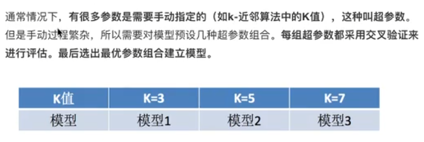

## 第1章 机器学习简介

### 1.1 人工智能概述

达特茅斯会议 人工智能的起点

机器学习是人工智能的一个实现途径

深度学习是机器学习的一个方向发展而来


### 1.2 机器学习概述

**解决问题**

传统预测 图像识别 自然语言处理


**整体流程**

数据 -> 建模 -> 训练 -> 预测


**数据集**

特征值 + 目标值


### 1.3 机器学习算法

**分类**

目前机器学习主流分为三大类：监督学习，无监督学习，强化学习


**监督学习**

分类问题 : k近邻算法, 贝叶斯, 决策树与随机森林, 逻辑回归

回归问题 : 线性回归, 岭回归


**无监督学习**

聚类问题 : k-means


**强化学习**

强化学习是一种学习模型，它不会直接给你解决方案，需要通过试错的方式去寻找。


**迁移学习**

迁移学习专注于存储已有问题的解决模型，并将其利用在其他不同但相关问题上。

比如说，用来辨识汽车的知识（或者是模型）也可以被用来提升识别卡车的能力。

计算机领域的迁移学习和心理学常常提到的学习迁移在概念上有一定关系，但是两个领域在学术上的关系非常有限。


**生成对抗网络**

GAN是两个网络的的组合， 一个网络生成模拟数据， 另一个网络判断生成的数据是真实的还是模拟的。

生成模拟数据的网络要不断优化自己让判别的网络判断不出来， 判别的网络也要优化自己让自己判断得更准确。 

二者关系形成对抗博弈，因此叫对抗神经网络（生成对抗网络）。


### 1.4 机器学习开发流程

-> 获取并处理数据

-> 特征工程

-> 模型训练

-> 模型评估

-> 应用 


### 1.5 机器学习框架

**前置知识**

基础算法 , 高数 , 线代 , 概率 , 离散

 

**书籍推荐**


**框架**

pytorch ,  tensorflow , opencv , yolov5


## 第2章 特征工程

### 2.1 数据集

#### 2.1.1 可用数据集网站

sklearn

UCI

kaggle


#### 2.1.2 sklearn数据集

获取内置的数据集

sklearn.datasets.load_iris()


获取网络的数据集

sklearn.datasets.fetch_20newsgroups()


数据集的返回值

dataset.base.Bunch


数据集的划分

训练集占75%  , 测试集占25%

训练集特征值 x_train

测试集特征值 x_test

训练集目标值 y_train

测试集目标值 y_test


```python
# 获取莺尾花数据集
iris = load_iris() 

# 数据集查看
print("莺尾花数据集: \n", iris)
print("查看数据集描述: \n", iris["DESCR"])
print("查看特征值的名字: \n", iris.feature_names)
print("查看特征值: \n", iris.data,iris.data.shape)

# 数据集划分
x_train,x_test,y_train,y_test = train_test_spilt(iris.data,iris.target,test_size=0.2,random_state=22)
print("查看训练集特征值: \n", x_train,x_train.shape)

```


### 2.2 特征工程介绍

处理特征, 帮助算法更好发挥性能


### 2.3 特征抽取

#### 2.3.1 字典特征抽取

将任意数据如文本或图像, 转换为可用于机器学习的数字特征


sklearn.feature_extraction.DictVectorizer()


one-hot编码

几个类别就是几列矩阵,用 0和1表示


sparse 稀疏矩阵

类别特征特别多时, 为减少0的存储, 提高效率


实例

```python
data = [{"city":"北京","tem":100},
        {"city":"上海","tem":60},
        {"city":"深圳","tem":30}]
transfer = DictVectorizer(sparse=False)
data_new = transfer.fit_transform(data)
print("新数据集: \n", data_new)
print("特征名: \n" , transfer.feature_names())
```


#### 2.3.2 文本特征抽取

**CountVectorizer**

统计每个样本特征词出现的个数

sklearn.feature_extraction.CountVectorizer()

该方法没有 sparse 指定参数

但可以使用toarray方法打印


**停用词 stop_words**

不统计参数里面的词


**英文文本抽取**

```python
data = ["life is short, i like python","life is too long , i like java"]

# 初始化文本计数器
transfer = CountVectorizer()

# 调用方法生成新数据
data_new = transfer.fit_transform(data)

# toarray方法把稀疏矩阵转为完整矩阵
print("新数据集: \n", data_new.toarray())

# 特征名
print("特征名: \n" , transfer.feature_names())
```


**中文文本处理**

不支持单个字, 需要用空格隔开


**免费分词处理库 jieba**

jieba.cut(text)

注意 text不能是列表, 如果是列表需要在循环里调用cut方法


**Tfidf特征抽取**

idf即逆向文档频率(Inverse Document Frequency)，用来衡量一个词的普遍重要性，一般通过文档总数/包含该词汇的文档数，再取对数得到的值


### 2.4 特征预处理


#### 2.4.1 数值型数据的无量纲化

特征预处理概念 : 通过一些转换函数将特征数据转换成更加合适算法模型的特征数据的过程

无量纲化概念 : 使不同规格的数据转同一规格 , 

无量纲化方法 : 归一化 , 标准化 


#### 2.4.2 归一化

一般将原始数据映射在 [0,1] 之间

 

公式


缺点 : 在最大值,最小值处会可能会出现异常值 


#### 2.4.3 标准化

标准化概念 :  对原始数据变换到均值为0 , 标准差为1的范围内


公式


### 2.5 特征降维

概念 : 降维指在某些限定条件下, 降低特征变量的个数, 得到一组不相关的主变量的过程


### 2.6 主成分分析


## 第3章 分类算法

### 3.1 sklearn转换器和估计器


### 3.2 KNN算法

#### 3.2.1 KNN概念

K近邻算法 根据最近的邻居的类别 , 来推断出你的类别

无需训练, 简单

懒惰算法, 适合较小的数据集, 因为会计算所有距离

受k的取值影响, 既不能大也不能小


#### 3.2.2 距离公式

欧氏距离


曼哈顿距离


明可夫斯基距离


#### 3.2.3 具体应用

电影分析

预测未知电影的类型, 通过knn算法找到离他最近的距离是 `He's not Really into dues` , 所以判断他是爱情片


### 3.3 模型选择与调优

**交叉验证**

四折交叉验证

训练集 : 训练集 + 验证集

测试集 : 测试集


**超参数网格搜索**




**联合API**


**鸢尾花案例**

```python
import torch
import tensorflow as tf
from sklearn.model_selection import train_test_split, GridSearchCV
from sklearn.neighbors import KNeighborsClassifier
from sklearn.preprocessing import StandardScaler
from sklearn.datasets import load_iris


def hello():
    print("tf_version:", tf.__version__)
    print(tf.config.list_physical_devices('GPU'))
    print("torch_GPU:", torch.cuda.is_available())


# 用knn算法对鸢尾花进行分类
def knn_iris():
    # 获取数据
    iris = load_iris()

    # 划分数据集, 随机数种子(计算机是伪随机的)
    x_train, x_test, y_train, y_test = train_test_split(iris.data, iris.target, random_state=6)

    # 特征工程 : 标准化
    transfer = StandardScaler()
    x_train = transfer.fit_transform(x_train)
    x_test = transfer.transform(x_test)

    # knn算法预估器
    estimator = KNeighborsClassifier()

    # 交叉验证和网格搜索
    param_dict = {"n_neighbors": [1, 3, 5, 7, 9, 11]}
    estimator = GridSearchCV(estimator, param_grid=param_dict, cv=10)
    estimator.fit(x_train, y_train)

    # 模型评估
    y_predict = estimator.predict(x_test)
    print("y_predict:\n", y_predict)
    print("真实值对比:\n", y_test == y_predict)
    score = estimator.score(x_test, y_test)
    print("准确率为:\n", score)

    # 模型调优后的评估
    print("最佳参数: \n", estimator.best_params_)
    print("最佳结果: \n", estimator.best_score_)
    print("最佳估计器: \n", estimator.best_estimator_)
    print("交叉验证结果: \n", estimator.cv_results_)

    return None


if __name__ == "__main__":
    hello()
    knn_iris()

```


**facebook签到位置预测案例**


### 3.4 朴素贝叶斯算法

3.4.1 朴素贝叶斯算法概念

3.4.2 概率基础

3.4.3 联合概率, 条件概率与相互独立

3.4.4 贝叶斯公式

3.4.5 API

3.4.6 新闻分类案例


### 3.5 决策树


信息论基础

信息概念 : 消除随机不定性的东西

信息熵 : 


### 3.6 随机森林


## 第4章 回归与聚类算法

### 4.1 线性回归

线性关系 : 都是一次

线性模型 : 线性关系(自变量一次) + 非线性关系(参数一次)


损失函数 (成本函数 目标函数)

优化损失 : 缩小损失

优化方法 : 正规方程 + 梯度下降


正规方程 : 可以直接求解w 的值 , 不通用 , 适合小数据量


梯度下降 :  不断迭代求导 找到区域的最小值


### 4.2 欠拟合与过拟合

欠拟合 : 学习到的特征太小 , 在训练集上表现就不好

解决方案 : 增加特征值


过拟合 : 学习到的特征太多 , 在测试集上表现不好

解决方案 :  正则化


### 4.3 岭回归


### 4.4 分类算法 逻辑回归与二分类

逻辑回归的输入就是线性回归的输出

调用激活函数 sigmoid


 

### 4.5 模型的保存和加载


### 4.6 无监督学习 kmeans算法

