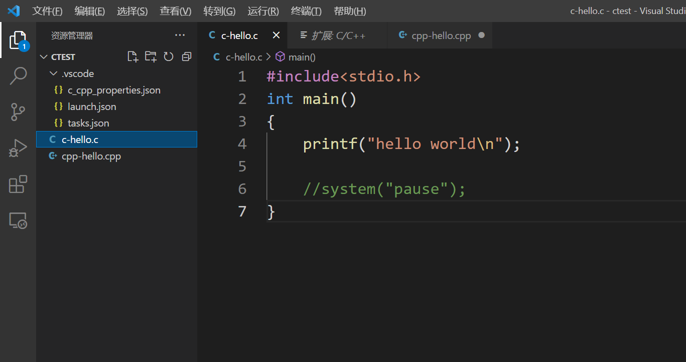

## 第1章 anaconda

### 1.1 conda 介绍


### 1.2 conda 指令


环境基本命令

```sh
# 建立名为learn的conda环境
conda create --name learn 

# 建立名为learn的conda环境并指定python版本
conda create --name learn python=3.7 

# 激活learn环境
conda activate learn 

# 退出当前环境
conda deactivate 

# 删除名为learn的conda环境和其下所有包
conda remove -n learn --all

# 列出所有的conda虚拟环境
conda env list 

# 列出当前环境下已安装的所有包
conda list
```


包管理基本命令

```sh
# 安装名为re的包
conda install re

# 安装名为re的包并制定版本3.1
conda install re=3.1

# 更新名为re的包
conda update re

# 删除名为re的包
conda remove re

# 列出名为re的包在conda源中的所有可用版本
conda search re
```

 

### 1.3 conda 配置

**展示可用的频道**

conda config --show channels


**删除所有的镜像源，恢复到默认**

conda config --remove-key channels 


**配置清华源**

conda config --add channels https://mirrors.tuna.tsinghua.edu.cn/anaconda/pkgs/free/

conda config --add channels http://mirrors.tuna.tsinghua.edu.cn/anaconda/pkgs/main/

conda config --add channels http://mirrors.tuna.tsinghua.edu.cn/anaconda/cloud/fastai/

conda config --add channels https://mirrors.tuna.tsinghua.edu.cn/anaconda/cloud/conda-forge

conda config --set show_channel_urls yes


### 1.4 jupyter notebook

**启动** 

基于conda 的 base环境

`$ jupyter notebook`


**指定环境启动**

切换到要使用的conda环境 安装 ipykernel

`$ conda install ipykernel`


mypytorch 对应在笔记中的环境名称

`$ python -m ipykernel install --name mypytorch`


**代码补全功能**

进入 conda 环境的命令行

`$ conda install jupyter_contrib_nbextensions`

`$ jupyter contrib nbextension install --user --skip-running-check`

`$ jupyter notebook`

启动Jupyter Notebook，上面选项栏会出现 Nbextensions , 勾选 Hinterland

写代码的时候按 Tab 键即可使用


**使用技巧**

在小括号内按住 `shift+tab+tab` 可以提示参数类型

`shift+enter` 运行当前行并新建下一行

`%pwd` 显示当前路径

`%matplotlib inline` 把结果画成图像输出


## 第2章 CUDA 

### 2.1 安装 cuda 

下载cuda 11.3.0

https://developer.nvidia.cn/cuda-toolkit-archive


安装 cudnn 8.2.1  ( 适用于cuda 11.x ) 右键复制链接下载
https://developer.nvidia.com/rdp/cudnn-archive#a-collapse51b


把cudnn目录移动到cuda-development目录下,把bin配到环境变量后重启


## 第3章 TensorFlow2

### 3.1 版本对应

python3.7.0+CUDA11.6.0+cuDNN8.3.2+tensorflow2.7.0+Keras2.7.0

python3.7.0+CUDA11.3.1+cuDNN8.2.1+tensorflow2.7.0+Keras2.7.0

python3.7.0+CUDA10.1.2+cuDNN7.6.5+tensorflow2.2.0+keras 2.3.1


### 3.2 安装 TensorFlow cpu版 

conda 安装 (conda 最高2.6.0)

`conda install tensorflow=2.6.0 `

`conda install keras=2.6.0`


pip 安装 

`pip install tensorflow==2.7.0`

`pip install keras==2.7.0`


测试

`import tensorflow as tf`

`print(tf.__version__)`


### 3.3 安装 TensorFlow gpu版

`conda install tensorflow-gpu=2.6.0`


测试

`import tensorflow as tf`

`print(tf.test.is_gpu_available())`


## 第4章 Pytorch

### 4.1 版本对应

pytorch 版本 

python-3.7.0 + CUDA-11.3 + cuDNN + pytorch-1.11.0


### 4.2 安装 Pytorch cpu版 

`conda install pytorch torchvision torchaudio cpuonly -c pytorch`


测试 是否安装成功

`print(torch.empty(0,2))`


### 4.3 安装 Pytorch gpu版 

安装 pytorch

`conda install pytorch torchvision torchaudio cudatoolkit=11.3 -c pytorch`


测试 cuda是否可用

`print(torch.cuda.is_available())`


## 第5章 常用库安装

### 5.1 opencv - python集成环境

`conda install opencv`


测试

import cv2 as cv


### 5.2 opencv - c++集成环境

#### 5.2.1 配置gcc

**mac版本** 

安装brew

/bin/zsh -c "$(curl -fsSL https://gitee.com/cunkai/HomebrewCN/raw/master/Homebrew.sh)"

brew -v


安装gcc

brew install gcc

gcc -v


**win版本**

下载安装编译器（MinGW-W64 GCC）

https://sourceforge.net/projects/mingw-w64/files/mingw-w64/mingw-w64-release/


配置bin目录到系统变量


测试

gcc -v


#### 5.2.2 配置vscode

vscode 安装 c/c++ 插件


编写 .vscode




tasks.json

```json

{
    "version": "2.0.0",
    "tasks": [
        {
            "label": "echo",
            "type": "shell",
            "command": "D:\\Environment\\mingw64\\bin\\gcc",   //改为自己的目录
            "args": [
                "-g", 
                "${file}", 
                "-o", 
                "${fileBasenameNoExtension}.exe",
                "-fexec-charset=GBK"    //解决中文乱码
            ]
        }
    ],
    "presentation": {
        "echo": true,
        "reveal": "always",
        "focus": false,
        "panel": "shared", 
        "showReuseMessage": true,
        "clear": false
    }
}
```


launch.json

```json

{
    "version": "0.2.0",
    "configurations": [
        {
            "name": "(Windows) Launch",
            "type": "cppvsdbg",
            "request": "launch",
            "program": "cmd",
            "preLaunchTask": "echo",
            "args": [
                "/C",
                "${fileDirname}\\${fileBasenameNoExtension}.exe",
                "&",
                "echo.",
                "&",
                "pause"
            ],
            "stopAtEntry": false,
            "cwd": "${workspaceFolder}",
            "environment": [],
            "externalConsole":true
        },
        {
            "name": "(gdb) Launch",
            "type": "cppdbg",
            "request": "launch",
            "program": "${workspaceFolder}/${fileBasenameNoExtension}.exe",
            "args": [],
            "stopAtEntry": false,
            "cwd": "${workspaceFolder}",
            "environment": [],
            "externalConsole": true,
            "MIMode": "gdb",
            "miDebuggerPath": "D:\\Environment\\mingw64\\bin\\gdb.exe", // 改为自己的路径
            "preLaunchTask": "echo",//这里和task.json的label相对应
            "setupCommands": [
                {
                    "description": "Enable pretty-printing for gdb",
                    "text": "-enable-pretty-printing",
                    "ignoreFailures": true
                }
            ]
 
        }
    ]
}
```


c_cpp_properties.json

```json

{
    "configurations": [
        {
            "name": "Win32",
            "includePath": [
                "${workspaceRoot}",
                "D:/Environment/mingw64/include/**",   //改为自己的路径
                "D:/Environment/mingw64/bin/../lib/gcc/x86_64-w64-mingw32/8.1.0/include/c++",
                "D:/Environment/mingw64/bin/../lib/gcc/x86_64-w64-mingw32/8.1.0/include/c++/x86_64-w64-mingw32",
                "D:/Environment/mingw64/bin/../lib/gcc/x86_64-w64-mingw32/8.1.0/include/c++/backward",
                "D:/Environment/mingw64/bin/../lib/gcc/x86_64-w64-mingw32/8.1.0/include",
                "D:/Environment/mingw64/bin/../lib/gcc/x86_64-w64-mingw32/8.1.0/include-fixed",
                "D:/Environment/mingw64/bin/../lib/gcc/x86_64-w64-mingw32/8.1.0/../../../../x86_64-w64-mingw32/include"
            ],
            "defines": [
                "_DEBUG",
                "UNICODE",
                "__GNUC__=6",
                "__cdecl=__attribute__((__cdecl__))"
            ],
            "intelliSenseMode": "msvc-x64",
            "browse": {
                "limitSymbolsToIncludedHeaders": true,
                "databaseFilename": "",
                "path": [
                    "${workspaceRoot}",
                    "D:/Environment/mingw64/include/**", //改为自己的路径
                    "D:/Environment/mingw64/bin/../lib/gcc/x86_64-w64-mingw32/8.1.0/include/c++",
                    "D:/Environment/mingw64/bin/../lib/gcc/x86_64-w64-mingw32/8.1.0/include/c++/x86_64-w64-mingw32",
                    "D:/Environment/mingw64/bin/../lib/gcc/x86_64-w64-mingw32/8.1.0/include/c++/backward",
                    "D:/Environment/mingw64/bin/../lib/gcc/x86_64-w64-mingw32/8.1.0/include",
                    "D:/Environment/mingw64/bin/../lib/gcc/x86_64-w64-mingw32/8.1.0/include-fixed",
                    "D:/Environment/mingw64/bin/../lib/gcc/x86_64-w64-mingw32/8.1.0/../../../../x86_64-w64-mingw32/include"
                ]
            }
        }
    ],
    "version": 4
}
```


测试 c-hello.c

```c
#include<stdio.h>
int main()
{
    printf("hello world\n");
   
    system("pause");
}
```


测试 cpp-hello.cpp

```cpp
// 需要先把task.json文件中的gcc改为g++

#include <iostream>
using namespace std;
int main()
{
    using namespace std;
    cout << "HelloWorld\n";
    cout << endl;
    return 0;
}
```


#### 5.2.3 安装cmake

待完善


#### 5.2.4 安装 opencv 

待完善


### 5.3 sklearn库

`conda install scikit-learn`


### 5.4 jieba库


### 5.5 matlab


### 5.6 pandas


### 5.7 numpy
