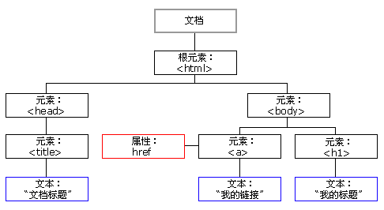
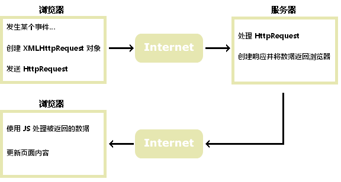

## 第1章 js简介

### 1.1 js简介

js是脚本语言，是解释性语言，不需要编译，内嵌在网页中


js特点

解释性，基于对象，事件驱动，跨平台，安全性


js应用

验证内容 动画效果


### 1.2 js使用

在页面中直接嵌入JavaScript代码

```html
<script type = "text/javascript">
  document.write("我喜欢学习javascript")
</script>
```


链接外部JavaScript文件

```html
<script type = "text/javascript" src="index.js"></script>
```


作为标记的属性值使用

```html
<a href="javascript:alert('点我干啥')">点我</a>
```


与事件结合调用

```html
<input type="button" value="点我" onclick="alert('点我干啥')"/>
```


## 第2章 基本语法

### 2.1 语法

1. 执行顺序

从上到下逐行执行


2. 大小写敏感

在输入语言的关键字，函数名，变量时，区分大小写，只有在html中不区分


3. 空格与换行

在JavaScript中会忽略程序中的空格，换行，制表符

但是一个分号语句内不能换行


4. 每行结尾的分号可有可无


虽然可以去掉分号，但是建议加上，方便阅读


5. 注释

单行注释 ```//```  ，   多行注释 ```/*     */```


### 2.2 输出

JavaScript 能够以不同方式“显示”数据：

使用 ```window.alert()``` 写入警告框

使用 ```document.write()``` 写入 HTML 输出

使用 ```innerHTML 写入 HTML``` 元素

使用 ```console.log()``` 写入浏览器控制台


### 2.3 变量

ES2015 引入了两个重要的 JavaScript 新关键词：```let``` 和 ```const```

全局作用域:

全局（在函数之外）声明的变量拥有全局作用域。

局部变量只能在它们被声明的函数内访问。

通过 var 关键词声明的变量没有块作用域。

在 HTML 中，全局作用域是 window 对象。

在 HTML 中，全局作用域是 window 对象。

通过 ```var``` 关键词定义的全局变量属于 window 对象。

通过 ```let``` 关键词定义的全局变量不属于 window 对象。


### 2.4 常量

关键字 ```const``` 有一定的误导性。

它没有定义常量值。它定义了对值的常量引用。

因此，我们不能更改常量原始值，但我们可以更改常量对象的属性。


### 2.5 数据类型

数值

```js
var length = 7;                             // 数字
```


字符串值

```js
var lastName = "Gates";                      // 字符串
```


布尔值

```js
var hasbol = true;     
```


数组

```js
var cars = ["Porsche"， "Volvo"， "BMW"];         // 数组
```


对象

```js
var x = {firstName:"Bill"， lastName:"Gates"};    // 对象
```


函数

```js
function test(){
    //一些代码
}
```


### 2.6 事件

HTML 事件可以是浏览器或用户做的某些事情。


    例如 :  
    
    HTML 网页完成加载  
    
    HTML 输入字段被修改  
    
    HTML 按钮被点击  

```html
<button onclick='document.getElementById("demo").innerHTML=Date()'>
    现在的时间是？</button>
```


常见的HTML事件

| 事件        | 描述                         |
| ----------- | ---------------------------- |
| onchange    | HTML 元素已被改变            |
| onclick     | 用户点击了 HTML 元素         |
| onmouseover | 用户把鼠标移动到 HTML 元素上 |
| onmouseout  | 用户把鼠标移开 HTML 元素     |
| onkeydown   | 用户按下键盘按键             |
| onload      | 浏览器已经完成页面加载       |


### 2.7 字符串方法

字符串长度

length 属性返回字符串的长度

```js
var txt = "ABCDEFGHIJKLMNOPQRSTUVWXYZ";
var sln = txt.length;
```


查找字符串中的字符串

indexOf() 方法返回字符串中指定文本首次出现的索引（位置）

```js
var str = "The full name of China is the People's Republic of China.";
var pos = str.indexOf("China");
```


检索字符串中的字符串

```js
var str = "The full name of China is the People's Republic of China.";
var pos = str.search("locate");
```


截取字符串 slice() 方法

该方法设置两个参数：起始索引（开始位置），终止索引（结束位置）。

```js
var str = "Apple,Banana,Mango";
var res = str.slice(7,13);

$ res = Banana
```


截取字符串 substr() 方法

parm1起始索引，parm2规定被提取部分的长度。

```js
var str = "Apple,Banana,Mango";
var res = str.substr(7,6);
```


替换字符串内容

replace() 方法用另一个值替换在字符串中指定的值

```js
str = "Please visit Microsoft!";
var n = str.replace("Microsoft", "W3School");
```


默认地，replace() 只替换首个匹配

如需替换所有匹配，请使用正则表达式的 g 标志

```js
str = "Please visit Microsoft and Microsoft!";
var n = str.replace(/Microsoft/g, "W3School");
```


把字符串转换为数组

可以通过 split() 将字符串转换为数组

```js
var txt = "a,b,c,d,e";   // 字符串
txt.split(",");          // 用逗号分隔
```


字符串模板

```js
let price = 10;
let VAT = 0.25;

let total = `Total: ${(price * (1 + VAT)).toFixed(2)}`;
```

```js
let header = "Templates Literals";
let tags = ["template literals", "javascript","es6"];

let html = `<h2>${header}</h2><ul>`;
for (const x of tags) {
  html += `<li>${x}</li>`;
}

html += `</ul>`;
```


### 2.8 数字方法

toString() 方法

以字符串返回数值。

```js
var x = 123;
x.toString();            // 从变量 x 返回 123
```


四舍五入 toFixed() 方法

返回字符串值，它包含了指定位数小数的数字

```js
var x = 9.656;
x.toFixed(0);           // 返回 10
x.toFixed(2);           // 返回 9.66
x.toFixed(4);           // 返回 9.6560
x.toFixed(6);           // 返回 9.656000
```


valueOf() 方法

valueOf() 以数值返回数值

```js
var x = 123;
x.valueOf();            // 从变量 x 返回 123
```


### 2.9 数组方法

添加数组元素

```js
var fruits = ["Banana"， "Orange"， "Apple"， "Mango"];
fruits.push("Lemon");                // 向 fruits 添加一个新元素 (Lemon)
fruits[fruits.length] = "Lemon";     // 向 fruits 添加一个新元素 (Lemon)
```


判断是否为数组`isArray()`

```js
Array.isArray(fruits);     // 返回 true
```


把数组转换为字符串

join() 方法也可将所有数组元素结合为一个字符串。

它的行为类似 toString()，但是您还可以规定分隔符

```js
var fruits = ["Banana","Orange","Apple","Mango"];
document.getElementById("demo").innerHTML = fruits.join(" * ");
 
//结果 : Banana * Orange * Apple * Mango
```


删除数组元素

pop() 方法从数组中删除最后一个元素，方法返回“被弹出”的值

```js
var fruits = ["Banana"， "Orange"， "Apple"， "Mango"];
fruits.pop();        // 从 fruits 删除最后一个元素（"Mango"）
```


拼接数组

splice() 方法可用于向数组添加新项

第一个参数（2）定义了应添加新元素的位置（拼接）

第二个参数（2）定义应删除多少元素

其余参数（“Lemon”，“Kiwi”）定义要添加的新元素

方法返回一个包含已删除项的数组

```js
var fruits = ["Banana","Orange","Apple","Mango"];
fruits.splice(2,2,"Lemon","Kiwi");
```


### 2.10 日期

var d = new Date();


### 2.11 数学

Math 对象允许您对数字执行数学任务。

Math.pow(x， y) 的返回值是 x 的 y 次幂

```js
Math.pow(8,2); // 返回 64
```


Math.sqrt(x) 返回 x 的平方根

```js
Math.sqrt(64);      // 返回 8
```


Math.round(x) 的返回值是 x 四舍五入为最接近的整数

```js
Math.round(6.8);    // 返回 7
Math.round(2.3);    // 返回 2
```


Math.abs(x) 返回 x 的绝对值

```js
Math.abs(-4.7);     // 返回 4.7
```


Math.min() 和 Math.max() 可用于查找参数列表中的最低或最高值：

```js
Math.min(0,450,35,10,-8,-300,-78);  // 返回 -300
Math.max(0,450,35,10,-8,-300,-78);  // 返回 450
```


Math.random() 返回介于 0（包括） 与 1（不包括） 之间的随机数

```js
Math.random();     // 返回随机数
```


### 2.13 比较

与或非

三元运算符

```js
var voteable = (age < 18) ? "太年轻":"足够成熟";

// 如果变量 age 的值小于 18，变量 voteable 的值将是 "太年轻"，
// 否则变量值将是 "足够成熟"。
```


## 第3章 流程控制

### 3.1 if条件

使用 if 来规定要执行的代码块，如果指定条件为 true

使用 else 来规定要执行的代码块，如果相同的条件为 false

使用 else if 来规定要测试的新条件，如果第一个条件为 false

```js
if (time < 10) {
    greeting = "Good morning";
 } else if (time < 18) {
    greeting = "Good day";
 } else {
    greeting = "Good evening";
 } 
```


### 3.2 switch

```js
var x = "0";

switch (x) {
  case 0:
    text = "Off";
    break;
  case 1:
    text = "On";
    break;
  default:
    text = "No value found";
}
```


### 3.3 for循环

```js
for (i = 0; i < 5; i++) {
     text = "数字是: " + i ;
     console.log(text)
}
```


`for/in` 语句遍历对象的属性

```js
var person = {fname:"Bill",lname:"Gates",age:62}; 

var text = "";
var x;
for (x in person) {
    text += person[x];
}
```


`for in` 语句也可以遍历数组的属性

```js
const numbers = [45,4,9,16,25];

let txt = "";
for (let x in numbers) {
  txt += numbers[x];
}
```


`forEach()` 方法为每个数组元素调用一次函数（回调函数）

```js
const numbers = [45， 4， 9， 16， 25];

let txt = "";
numbers.forEach(myFunction);

function myFunction(value,index,array) {
  txt += value;
}
```


### 3.4 while循环

while 循环会一直循环代码块，只要指定的条件为 true。

```js
while (i < 10) {
    text += "数字是 " + i;
    i++;
}
```


do/while 循环是 while 循环的变体。

在检查条件是否为真之前，这种循环会执行一次代码块，然后只要条件为真就会重复循环。

```js
do {
    text += "The number is " + i;
    i++;
 }
while (i < 10);
```


### 3.5 异常

try 语句使您能够测试代码块中的错误。

catch 语句允许您处理错误。

throw 语句允许您创建自定义错误。

finally 使您能够执行代码，在 try 和 catch 之后，无论结果如何。

```js
try {
     供测试的代码块
}
 catch(err) {
     处理错误的代码块
} 
finally {
     无论结果如何都执行的代码块
}
```


### 3.6 作用域

自动全局

```js
myFunction();

// 此处的代码能够使用 carName 变量
function myFunction() {
    carName = "porsche";
}
```


## 第4章 面向对象

### 4.1 类

JavaScript 类不是对象。

它只是 JavaScript 对象的模板。

如需创建类继承，请使用 extends 关键字。

通过 super() 方法，我们调用了父级的构造方法，获得了父级的属性和方法的访问权限。


```js
class Car {
  constructor(name， year) {
    this.name = name;
    this.year = year;
  }
}

class Model extends Car {
   constructor(brand， mod) {
      super(brand);
      this.model = mod;
   }
   show() {
      return this.present() + '， it is a ' + this.model;
   }
}

let myCar1 = new Car("Ford"， 2014);
let myCar = new Model("Ford"， "Mustang");
```


### 4.2 对象

对象是包含变量的变量

对象属性，对象中的命名值，被称为属性。

对象方法，对象方法是包含函数定义的对象属性。

```js
var person = {
    firstName: "Bill",
    lastName: "Gates",
    age: 62,
    eyeColor: "blue"
};
```


## 第5章 Dom

### 5.1 DOM简介

通过 HTML DOM，JS 能够访问和改变 HTML 文档的所有元素。

对象的 HTML DOM 树




下面的例子改变了 `id="demo"` 的 `<p>` 元素的内容

```html
<html lang="">
   <body>
      <p id="demo"></p>
   <script>
   document.getElementById("demo").innerHTML = "Hello World!";
   </script>
   </body>
</html>
```


查找 HTML 元素

| 方法                                  | 描述                   |
| ------------------------------------- | ---------------------- |
| document.getElementById(id)           | 通过元素 id 来查找元素 |
| document.getElementsByTagName(name)   | 通过标签名来查找元素   |
| document.getElementsByClassName(name) | 通过类名来查找元素     |

---


改变 HTML 元素

| 方法                                    | 描述                   |
| --------------------------------------- | ---------------------- |
| element.innerHTML = new html content    | 改变元素的 inner HTML  |
| element.attribute = new value           | 改变 HTML 元素的属性值 |
| element.setAttribute(attribute， value) | 改变 HTML 元素的属性值 |
| element.style.property = new style      | 改变 HTML 元素的样式   |

---


添加和删除元素

| 方法                            | 描述             |
| ------------------------------- | ---------------- |
| document.createElement(element) | 创建 HTML 元素   |
| document.removeChild(element)   | 删除 HTML 元素   |
| document.appendChild(element)   | 添加 HTML 元素   |
| document.replaceChild(element)  | 替换 HTML 元素   |
| document.write(text)            | 写入 HTML 输出流 |

---


添加事件处理程序

| 方法                                                   | 描述                            |
| ------------------------------------------------------ | ------------------------------- |
| document.getElementById(id).onclick = function(){code} | 向 onclick 事件添加事件处理程序 |

---


改变 HTML 样式

```js
document.getElementById(id).style.property = new style
```


### 5.2 DOM 表单

```js
<form action="/action_page.php" method="post">
  <input type="text" name="fname" required/>
  <input type="submit" value="Submit"/>
</form>
```


### 5.3 DOM CSS

```js
<html>
   <body>
      <p id="p2">Hello World!</p>
   <script>
   document.getElementById("p2").style.color = "blue";
   </script>
      <p>上面的段落已被脚本改变。</p>
   </body>
</html>
```


### 5.4 DOM 事件

| 事件        | 描述                     |
| ----------- | ------------------------ |
| onabort     | 图像的加载被中断         |
| onblur      | 元素失去焦点             |
| onchange    | 域的内容被改变           |
| onclick     | 单击事件                 |
| ondblclick  | 双击事件                 |
| onerror     | 加载文档或图片时发生错误 |
| onfocus     | 元素获得焦点             |
| onkeydown   | 键盘被按下               |
| onkeypress  | 键盘被按下松开           |
| onkeyup     | 键盘被松开               |
| onload      | 页面或图片完成加载       |
| onmousedown | 鼠标按钮被按下           |
| onmousemove | 鼠标被移动               |
| onmouseout  | 鼠标移出                 |
| onmouseever | 鼠标移入                 |
| onmouseup   | 鼠标按钮被松开           |
| onreset     | 重置按钮被点击           |
| onresize    | 窗口大小改变             |
| onselect    | 文本被选中               |
| onsubmit    | 提交按钮被点击           |
| onunload    | 用户退出页面             |


```js
<h1 onclick="this.innerHTML = 'Hello!'">点击此文本！</h1>
```


### 5.5 DOM 事件监听

向元素添加事件处理程序

当用户点击某个元素时提示 "Hello World!"：

```js
element.addEventListener("click"， function(){ 
    alert("Hello World!"); 
});
```


## 第6章 BOM


### 6.1 浏览器对象模型 (BOM)

所有浏览器都支持 window 对象。它代表浏览器的窗口。

所有全局 JavaScript 对象，函数和变量自动成为 window 对象的成员。

全局变量是 window 对象的属性。

全局函数是 window 对象的方法。

```js
window.document.getElementById("header");
  //等同于
document.getElementById("header");
```


### 6.2 BOM Location

- window.location.href 返回当前页面的 href (URL)
- window.location.hostname 返回 web 主机的域名
- window.location.pathname 返回当前页面的路径或文件名
- window.location.protocol 返回使用的 web 协议（http: 或 https:）
- window.location.assign 加载新文档


### 6.3 BOM Screen

- screen.width  显示以像素计的屏幕宽度
- screen.height  显示以像素计的屏幕高度
- screen.availWidth  显示以像素计的屏幕可用宽度
- screen.availHeight 显示以像素计的屏幕可用高度
- screen.colorDepth  显示以位计的屏幕色彩深度
- screen.pixelDepth  显示以位计的屏幕像素深度


### 6.4 BOM History

window.history 对象包含浏览器历史。

history.back() - 等同于在浏览器点击后退按钮

history.forward() - 等同于在浏览器中点击前进按钮


### 6.5 BOM Navigator

window.navigator 对象包含有关访问者的信息。

navigator.appName - 属性返回浏览器的应用程序名称

navigator.appCodeName - 属性返回浏览器的应用程序代码名称

navigator.platform - 属性返回浏览器平台（操作系统）

navigator.product - 属性返回浏览器引擎的产品名称


### 6.6 BOM 弹出框

JavaScript 有三种类型的弹出框：警告框、确认框和提示框。


**警告框**
如果要确保信息传递给用户，通常会使用警告框。

当警告框弹出时，用户将需要单击“确定”来继续。

`window.alert("sometext");`


**确认框**

如果您希望用户验证或接受某个东西，则通常使用“确认”框。

当确认框弹出时，用户将不得不单击“确定”或“取消”来继续进行。

如果用户单击“确定”，该框返回 true。如果用户单击“取消”，该框返回 false。

`window.confirm("sometext");`


**提示框**

如果您希望用户在进入页面前输入值，通常会使用提示框。

当提示框弹出时，用户将不得不输入值后单击“确定”或点击“取消”来继续进行。

如果用户单击“确定”，该框返回输入值。如果用户单击“取消”，该框返回 NULL。

`window.prompt("sometext"，"defaultText");`


### 6.7 BOM Timing

JavaScript 可以在时间间隔内执行。

这就是所谓的定时事件（ Timing Events）。

单击按钮。等待 3 秒，然后页面会提示 "Hello"

```js
<button onclick="myVar = setTimeout(myFunction， 3000)">试一试</button>
<button onclick="clearTimeout(myVar)">停止执行</button>
<script>
function myFunction() {
    alert('Hello')
 }
</script>
```


### 6.8 BOM Cookie

Cookie 让您在网页中存储用户信息。


CookieUtil 工具简化 cookie 的存储

```js
 var CookieUtil = {

        get: function (name) {
            var cookieName = encodeURIComponent(name) + '=',
                cookieStart = document.cookie.indexOf(cookieName),
                cookieValue = null;

            if (cookieStart > -1) {
                var cookieEnd = document.cookie.indexOf(';', cookieStart);
                if (cookieEnd == -1) {
                    cookieEnd = document.cookie.length;
                }
                cookieValue = decodeURIComponent(document.cookie.substring(cookieStart + cookieName.length, cookieEnd));
            }

            return cookieValue;
        },

        set: function (name, value, expires, path, domain, secure) {    // name和value是必须，其他参数可以不设
            var cookieText = encodeURIComponent(name) + '=' + encodeURIComponent(value);

            if (expires instanceof Date) {
                cookieText += '; expires=' + expires.toGMTString();
            }

            if (path) {
                cookieText += '; path=' + path;
            }

            if (domain) {
                cookieText += '; domain=' + domain;
            }

            if (secure) {
                cookieText += '; secure';
            }

            document.cookie = cookieText;
        },

        unset: function (name, path, domain, secure) {    // 删除，name必须
            this.set(name, '', new Date(0), path, domain, secure);
        }

    };

```


```js
//新增cookie
CookieUtil.set('book', 'Javascript')

//获取cookie
CookieUtil.get('book')

//删除cookie
CookieUtil.unset('book')
```


### 6.9 BOM Session

让您在网页中存储用户信息。

sessionStorage

localStorage

```js
sessionStorage.setItem('name', 'TanXiao');
sessionStorage.getItem('name');
sessionStorage.removeItem('name');

localStorage.setItem("name"， "Bill Gates");
localStorage.getItem('name');
localStorage.removeItem('name');
```


## 第7章 Json

### 7.1 Json 简介

JSON: JavaScript Object Notation（JavaScript 对象标记法）。

JSON 是一种存储和交换数据的语法。

JSON 是通过 JavaScript 对象标记法书写的文本。

```js
//存储数据：
myObj = { name:"Bill Gates"，  age:62， city:"Seattle" };
myJSON =  JSON.stringify(myObj);
localStorage.setItem("testJSON"， myJSON);

//接收数据：
text = localStorage.getItem("testJSON");
obj =  JSON.parse(text);
document.getElementById("demo").innerHTML = obj.name;
```


### 7.2 Json 语法

```json
 { "name":"Bill Gates" }
```


### 7.3 Json 对比 XML

**相似点** :

JSON 和 XML 都是“自描述的”（人类可读的）

JSON 和 XML 都是分级的（值中有值）

JSON 和 XML 都能被大量编程语言解析和使用

JSON 和 XML 都能被 XMLHttpRequest 读取


**不同点 :**

JSON 不使用标签

JSON 更短

JSON 的读写速度更快

JSON 可使用数组

XML 必须使用 XML 解析器进行解析

JSON 可通过标准的 JavaScript 函数进行解析


JSON 实例

```json
{"employees":[
    { "firstName":"Bill"， "lastName":"Gates" }，
    { "firstName":"Steve"， "lastName":"Jobs" }，
    { "firstName":"Elon"， "lastName":"Musk" }
]}
```


XML 实例

```xml
<employees>
   <employee>
      <firstName>Bill</firstName>
      <lastName>Gates</lastName>
   </employee>
   <employee>
      <firstName>Steve</firstName>
      <lastName>Jobs</lastName>
   </employee>
   <employee>
      <firstName>Elon</firstName>
      <lastName>Musk</lastName>
   </employee>
</employees>
```


### 7.4 Json 数据类型

允许的类型: 字符串 数字 对象 数组 布尔 Null

不允许的类型: 函数 日期 undefined

数字
`{ "age":30 }`

字符串
`{ "name":"John" }`

对象
`{
"employee":{ "name":"Bill Gates"， "age":62， "city":"Seattle" }
}`

数组
`{
"employees":[ "Bill"， "Steve"， "David" ]
}`

布尔
`{ "sale":true }`

null
`{ "middlename":null }`


7.5 Json 解析


## 第8章 Ajax

### 8.1 Ajax 简介

不刷新页面更新网页

在页面加载后从服务器请求数据

在页面加载后从服务器接收数据

在后台向服务器发送数据




AJAX 如何工作

网页中发生一个事件（页面加载、按钮点击）

由 JavaScript 创建 XMLHttpRequest 对象

XMLHttpRequest 对象向 web 服务器发送请求

服务器处理该请求

服务器将响应发送回网页

由 JavaScript 读取响应

由 JavaScript 执行正确的动作（比如更新页面)


### 8.2 XMLHttpRequest对象

Ajax 的核心是 XMLHttpRequest 对象。

`variable = new XMLHttpRequest();`


### 8.3 Ajax 请求

```js
var xhttp;
if (window.XMLHttpRequest) {
    xhttp = new XMLHttpRequest();
    } else {
    // code for IE6， IE5
     xhttp = new ActiveXObject("Microsoft.XMLHTTP");
}
```


### 8.4 Ajax 响应

```js
function loadDoc() {
    var xhttp = new XMLHttpRequest();
    xhttp.onreadystatechange = function() {
        if (this.readyState == 4 && this.status == 200) {
            document.getElementById("demo").innerHTML =
            this.responseText;
       }
    };
    xhttp.open("GET"， "ajax_info.txt"， true);
    xhttp.send(); 
} 
```


## 第9章 JQuery

### 9.1 简介

jQuery 是一个 JavaScript 函数库。

jQuery 是一个轻量级的"写的少，做的多"的 JavaScript 库。

jQuery 库包含以下功能：

-   HTML 元素选取
-   HTML 元素操作
-   CSS 操作
-   HTML 事件函数
-   JavaScript 特效和动画
-   HTML DOM 遍历和修改
-   AJAX
-   Utilities


**jQuery 安装**

```sh
cnpm install jquery 
```


**jQuery 引入**

```html
# 普通项目
 <script src="node_modules/jquery/dist/jquery.js"></script>

# vue项目
```


**`$` 符号的由来**

jQuery.js 就是一个自执行函数

给 `window` 添加了两个变量

```js
window.jQuery = window.$ = jQuery 
```


**jquery 对象**

jquery对象 就是用 jquery选择器获取到的对象

JS的dom对象不能调用jquery对象的方法，同理 jquery对象也不能调用 dom对象的方法

 jquery对象是一个伪数组，jquery对象就是dom对象的一个包装集


**jquery 对象和 dom对象的转化**

```js
//dom 2 jquery
var div1 = ducument.getElementById("one")
var $div1 = $(div1)

// jquery 2 dom
var $divs = $('div')
var div1 = $divs[0] 
var div1 = $divs.get(1)  
```


### 9.2 Jquery事件

**js所有事件**

| 鼠标事件                                                     | 键盘事件                                                     | 表单事件                                                  | 文档/窗口事件                                             |
| :----------------------------------------------------------- | :----------------------------------------------------------- | :-------------------------------------------------------- | :-------------------------------------------------------- |
| [click](https://www.runoob.com/jquery/event-click.html)      | [keypress](https://www.runoob.com/jquery/event-keypress.html) | [submit](https://www.runoob.com/jquery/event-submit.html) | [load](https://www.runoob.com/jquery/event-load.html)     |
| [dblclick](https://www.runoob.com/jquery/event-dblclick.html) | [keydown](https://www.runoob.com/jquery/event-keydown.html)  | [change](https://www.runoob.com/jquery/event-change.html) | [resize](https://www.runoob.com/jquery/event-resize.html) |
| [mouseenter](https://www.runoob.com/jquery/event-mouseenter.html) | [keyup](https://www.runoob.com/jquery/event-keyup.html)      | [focus](https://www.runoob.com/jquery/event-focus.html)   | [scroll](https://www.runoob.com/jquery/event-scroll.html) |
| [mouseleave](https://www.runoob.com/jquery/event-mouseleave.html) |                                                              | [blur](https://www.runoob.com/jquery/event-blur.html)     | [unload](https://www.runoob.com/jquery/event-unload.html) |
| [hover](https://www.runoob.com/jquery/event-hover.html)      |                                                              |                                                           |                                                           |


**注册事件**

on注册简单事件

```javascript
    // 表示给$(selector)绑定事件，并且由自己触发，不支持动态绑定。
    $(selector).on( "click", function() {});
```


on注册委托事件

```javascript
    // 表示给$(selector)绑定代理事件，当必须是它的内部元素span才能触发这个事件，支持动态绑定
    $(selector).on( "click",'span', function() {});
```


on注册事件的语法：

```javascript
    // 第一个参数：events，绑定事件的名称可以是由空格分隔的多个事件（标准事件或者自定义事件）
    // 第二个参数：selector, 执行事件的后代元素（可选），如果没有后代元素，那么事件将有自己执行。
    // 第三个参数：data，传递给处理函数的数据，事件触发的时候通过event.data来使用（不常使用）
    // 第四个参数：handler，事件处理函数
    $(selector).on(events,[selector],[data],handler);
```


**事件解绑**

```javascript
    // 解绑匹配元素的所有事件
    $(selector).off();
    // 解绑匹配元素的所有click事件
    $(selector).off("click");
```


**触发事件**

```javascript
    $(selector).click(); //触发 click事件
    $(selector).trigger("click");
```


### 9.3 jquery 选择器

jquery 基本选择器

| 名称       | 用法          | 描述                          |
| ---------- | ------------- | ----------------------------- |
| ID选择器   | $("#id")      | 获取指定ID的元素              |
| 类选择器   | $(".class")   | 获取同一类class的元素         |
| 标签选择器 | $("div")      | 获取同一类标签的所有元素      |
| 并集选择器 | $("div,p,li") | 使用逗号分隔,符合条件之一即可 |
| 交集选择器 | $("div.red")  | 获取class为red的div元素       |


层级选择器

| 名称       | 用法        | 描述                                                        |
| ---------- | ----------- | :---------------------------------------------------------- |
| 子代选择器 | $(“ul>li”); | 使用>号，获取儿子层级的元素，注意，并不会获取孙子层级的元素 |
| 后代选择器 | $(“ul li”); | 使用空格，代表后代选择器，获取ul下的所有li元素，包括孙子等  |


过滤选择器

| 名称         | 用法                               | 描述                                                        |
| ------------ | ---------------------------------- | :---------------------------------------------------------- |
| :eq（index） | $(“li:eq(2)”).css(“color”, ”red”); | 获取到的li元素中，选择索引号为2的元素，索引号index从0开始。 |
| :odd         | $(“li:odd”).css(“color”, ”red”);   | 获取到的li元素中，选择索引号为奇数的元素                    |
| :even        | $(“li:even”).css(“color”, ”red”);  | 获取到的li元素中，选择索引号为偶数的元素                    |


筛选选择器(方法)

| 名称               | 用法                        | 描述                             |
| ------------------ | --------------------------- | -------------------------------- |
| children(selector) | $(“ul”).children(“li”)      | 相当于$(“ul>li”)，子类选择器     |
| find(selector)     | $(“ul”).find(“li”);         | 相当于$(“ul li”),后代选择器      |
| siblings(selector) | $(“#first”).siblings(“li”); | 查找兄弟节点，不包括自己本身。   |
| parent()           | $(“#first”).parent();       | 查找父亲                         |
| eq(index)          | $(“li”).eq(2);              | 相当于$(“li:eq(2)”),index从0开始 |
| next()             | $(“li”).next()              | 找下一个兄弟                     |
| prev()             | $(“li”).prev()              | 找上一次兄弟                     |


html 相关操作

```js
//获取被选元素的文本
var str = $("p").text()

//覆盖被选元素的文本
$("p").text("设置文本")

//在被选元素的结尾插入内容（仍然在该元素的内部）
$("p").append("追加文本");

//在被选元素的开头插入内容（仍然在该元素的内部）
$("p").prepend("在开头追加文本");

//在被选元素之后插入内容（在该元素的外部）
$("img").after("在后面添加文本");
 
//在被选元素之前插入内容（在该元素的外部）
$("img").before("在前面添加文本");

//删除被选元素及其子元素。
$("#div1").remove();

//删除被选元素的子元素。
$("#div1").empty();

//删除 class="italic" 的所有 <p> 元素
$("p").remove(".italic");
```


css相关操作

```js
//移除class
$("button").click(function(){
  $("h1,h2,p").removeClass("blue");
});

//添加class
$("button").click(function(){
  $("h1,h2,p").addClass("blue");
  $("div").addClass("important");
});

//返回 style 属性
$("p").css("background-color");

//设置 style 属性
$("p").css({"background-color":"yellow","font-size":"200%"});

//设置宽高
$("#div1").height(100).width("200px")
```


属性设置

```javascript
    /*1.获取属性*/
    $('li').attr('name');
    /*2.设置属性*/
    $('li').attr('name','tom');
    /*3.设置多个属性*/
    $('li').attr({
        'name':'tom',
        'age':'18'
    });
    /*4.删除属性*/
    $('li').removeAttr('name');
```


prop方法

```javascript
    /*对于布尔类型的属性，不要attr方法，应该用prop方法 prop用法跟attr方法一样。*/
    $("#checkbox").prop("checked");
    $("#checkbox").prop("checked", true);
    $("#checkbox").prop("checked", false);
    $("#checkbox").removeProp("checked");
```


### 9.4 jquery ajax

```js
// get方法
$("button").click(function(){
  $.get("demo_test.php",function(data,status){
    alert("数据: " + data + "\n状态: " + status);
  });
});

// post方法
$("button").click(function(){
    $.post("/try/ajax/demo_test_post.php",
    {
        name:"菜鸟教程",
        url:"http://www.runoob.com"
    },
    function(data,status){
        alert("数据: \n" + data + "\n状态: " + status);
    });
});
```


### 9.5 动画

基本动画

```javascript
    /*注意：动画的本质是改变容器的大小和透明度*/
    /*注意：如果不传参数是看不到动画*/
    /*注意：可传入特殊的字符  fast normal slow*/
    /*注意：可传入数字 单位毫秒*/
    /*1.展示动画*/
    $('li').show();
    /*2.隐藏动画*/
    $('li').hide();
    /*3.切换展示和隐藏*/
    $('li').toggle();
```


滑入滑出

```javascript
    /*注意：动画的本质是改变容器的高度*/
    /*1.滑入动画*/
    $('li').slideDown();
    /*2.滑出动画*/
    $('li').slideUp();
    /*3.切换滑入滑出*/
    $('li').slideToggle();
```


淡入淡出

```javascript
    /*注意：动画的本质是改变容器的透明度*/
    /*1.淡入动画*/
    $('li').fadeIn();
    /*2.淡出动画*/
    $('li').fadeOut();
    /*3.切换淡入淡出*/
    $('li').fadeToggle();
    $('li').fadeTo('speed','opacity');
```


自定义动画

```javascript
    /*
    * 自定义动画
    * 参数1：需要做动画的属性
    * 参数2：需要执行动画的总时长
    * 参数3：执行动画的时候的速度
    * 参数4：执行动画完成之后的回调函数
    * */
    $('#box1').animate({left:800},5000);
    $('#box2').animate({left:800},5000,'linear');
    $('#box3').animate({left:800},5000,'swing',function () {
        console.log('动画执行完成');
    });
```


动画队列  

```javascript
    /*
    jQuery中有个动画队列的机制。
    当我们对一个对象添加多次动画效果时后添加的动作就会被放入这个动画队列中，  
    等前面的动画完成后再开始执行。
    可是用户的操作往往都比动画快，  
    如果用户对一个对象频繁操作时不处理动画队列就会造成队列堆积，
    影响到效果。
    */
```


stop使用

```javascript
    /*1.停止当前动画  如果动画队列当中还有动画立即执行*/
    //$('div').stop();
    /*2.和stop()效果一致  说明这是默认设置*/
    //$('div').stop(false,false);
    /*3.停止当前动画  清除动画队列*/
    //$('div').stop(true,false);
    /*4.停止当前动画并且到结束位置  清除了动画队列*/
    //$('div').stop(true,true);
    /*5.停止当前动画并且到结束位置  如果动画队列当中还有动画立即执行*/
    $('div').stop(false,true);
```


### 9.6 节点操作

创建节点

```javascript
    /*创建节点*/
    var $a = $('<a href="http://www.baidu.com" target="_blank">百度1</a>');
```


克隆节点

```javascript
    /*如果想克隆事件  false  true克隆事件*/
    var $cloneP = $('p').clone(true);
```


添加&移动节点

```javascript
    /*追加自身的最后面  传对象和html格式代码*/
    $('#box').append('<a href="http://www.baidu.com" target="_blank"><b>百度3</b></a>');
    $('#box').append($('a'));
    /*追加到目标元素最后面  传目标元素的选择器或者对象*/
    $('<a href="http://www.baidu.com" target="_blank"><b>百度3</b></a>').appendTo($('#box'));
    $('a').appendTo('#box');
    
    prepend();
    prependTo();
    after();
    before();
```


删除节点&清空节点

```javascript
    /*1.清空box里面的元素*/
    /* 清理门户 */
    $('#box').empty();
    /*2.删除某个元素*/
    /* 自杀 */
    $('#box').remove();
```


### 9.7 高级特性

链式编程

隐式迭代

多库共存


### 9.8 jquery插件

操作cookie 插件


```html
引入依赖
<script src="https://cdn.staticfile.org/jquery/3.4.0/jquery.min.js"></script>
<script src="https://cdn.staticfile.org/jquery-cookie/1.4.1/jquery.cookie.min.js"></script>
```


```js
// 读取 cookie
$.cookie('name');     

//创建
$.cookie('name', 'value');

//删除
$.removeCookie('name')

//创建 cookie，并设置 7 天后过期：
$.cookie('name', 'value', { expires: 7 });

//创建 cookie，并设置 cookie 的有效路径，路径为网站的根目录
$.cookie('name', 'value', { path: '/' });

//删除cookie,带路径的
$.removeCookie('name', { path: '/' }); 
```


懒加载插件

jquery.lazyload.js 


ui 插件

jquery.ui.js插件


## 第10章 高级用法

### 10.1 高阶函数

-   介绍

一个函数就可以接收另一个函数作为参数，这种函数就称之为高阶函数。


-   map

```js
let newnums = [ 100, 200, 300 ];
let new2num = newnums.map( (v, index) => {
   return v * 2;
});
console.log(new2num); //[ 200, 400, 600 ]
```


-   filter

```js
const nums = [10, 20, 30, 40, 50, 100, 200, 300];
let newnums = nums.filter( (v , index) => {
   return n >= 100;
});
console.log(newnums); //[ 100, 200, 300 ]
```


-   reduce

```js
let newnums = [ 200, 400, 600 ];
let total = new2num.reduce(function (preValue, n) {
   return preValue + n;
}, 0);
console.log(total); //1200

// 第一次:preValue 0 n 200
// 第二次:preValue 200 n 400
// 第三次:preValue 600 n 600
// 1200
```


-   链式调用和箭头语法

```js
total = nums.filter(n => n >= 100)
    	.map(n => n * 2)
    	.reduce((pre,n) => pre + n);
```


### 10.2 闭包

```js
var add = (function () {
    var counter = 0;
    return function () {return counter += 1;}
})();

add();
```


