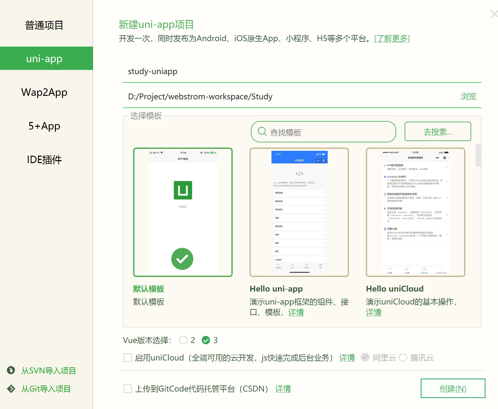

## 第一章 简介

### 1.1 初体验

**用 HbuildX 创建项目**




-   创建vue2项目

`vue create -p dcloudio/uni-preset-vue uniapp-study`


-   创建vue3项目 暂时不好用

`vue create -p dcloudio/uni-preset-vue#vue3 uni-name`


-   创建vue3的vite项目 

`npx degit dcloudio/uni-preset-vue#vite my-vue3-project`

如果连接超时可直接下载模板

https://gitee.com/dcloud/uni-preset-vue/repository/archive/vite.zip


**运行项目**

```sh
npm run dev:mp-weixin
```


**微信开发者工具导入项目**

导入 `dist/dev/mp_weixin` 目录


### 1.2 项目结构

App.vue  应用配置

main.js   vue入口文件

manifest.json  配置应用 appid logo 版本等打包信息

pages.json  配置路由 导航 选项卡等

uni.scss 内置的scss变量

pages-index-index.vue  页面组件

static-logo.png  静态资源


### 1.3 pages.json

路由 

```json
{
    //配置页面
    "pages": [
        //首页页面 谁在第一个谁就是首页
        {
            //路由地址
            "path": "pages/index/index"
            //样式
        	"style": {
            	// 顶部导航栏文字
            	"navigationBarTitleText": "首页",
            	//顶部导航栏背景色
            	"navigationBarBackgroundColor": "#ff5566",
            	//顶部导航栏文字颜色
            	"navigationBarTextStyle": "white",
            	//启用自定义导航栏,关闭原生导航栏
            	"navigationStyle": "custom"
        	}
        },
        
        // 其他页面	
        {
         //路由地址
            "path": "pages/index/index"
            //样式
        	"style": {
        
        	}
        }
    ],
	
	//全局样式, 如果配置了局部样式优先局部,没配局部用全局
	"globalStyle": {
        //关闭小程序原生导航栏
        "navigationStyle": "custom"
    },

	//底部菜单栏
	"tabBar":  {
		"color": "#d8d8d8",
        "selectedColor": "#444",
        "list": [
            //配置项1
            {
                //文字
                "text": "首页",
                //路由
                "pagePath": "pages/index/index",
                //未选中图标
                "iconPath": "static/tab/1.png",
                //选中后图标
                "selectedIconPath": ""
            },
            
            //配置项2
            {
                ...
            }
            
            
        ]

    }
}
```


### 1.4 单位

rpx 小程序单位  750rpx 等于屏幕宽度


vm  H5单位 100vm 等于屏幕的宽和高


### 1.5 全局样式

安装scss依赖

cnpm install --save-dev sass


编写 uni.scss

```scss
//配置类
.fs-14{
    font-size: 14rpx!important;
}

//配置值
$uni-color-primary: #007aff!important;
```


引入 uni.scss

```js
// main.js
import "./uni.scss"
```


组件中启用 scss

```vue
<style lang="scss" scoped>
</style
```


 


### 1.6 标签

`<div>` 改成 `<view>`  

 `<span>` 改成 `<text>` 

`<a>` 改成 `<navigator>`

`` 改成 `<image>`

`<iframe>` 改成 `<web-view>`

audio 不再推荐使用，改成api方式，背景音频api文档
其实老的HTML标签也可以在uni-app里使用，uni-app编译器会在编译时把老标签转为新标签。但不推荐这种用法，调试H5端时容易混乱，基于元素的选择器也会出问题。


## 第2章  基本语法

### 2.1 数据的展示

通过在data里定义 , 在标签里用 双大括号展示


还可以用在标签上绑定属性 , `<view :data-color="color"/>`


### 2.2 数据的循环

```js
<view v-for="(item,index) in list" :key="item.id">
    {{item.text}}
</view>
```


### 2.3 条件编译

v-if  不适合做频繁切换

v-show   适合频繁切换


### 2.4 计算属性


```js
<view>{{cvMoney}}</view>
```

```js
computed:{
    cvMoney(){
        //计算属性的加工功能
        return "$" + this.money
    }
    filtList(){
        //计算属性的过滤功能
        //过滤掉id小于0的对象
        return this.list.filter(v => v.id <= 0)
    }
}
```


### 2.5 判断微信程序和app

使用魔法注释 判断当前为微信小程序的时候才显示该内容

```js
<!-- #ifdef MP-WEIXIN -->
	<view> 显示内容</view>
<!-- #endif -->
```


## 第3章 事件和组件

### 3.1 事件的使用

注册事件

```js
<view @click="handleClick"></view>
```


定义函数

```js
methods:{
    handleClick(){
        console.log("这里是函数内容")
    }

}
```


### 3.2 事件的传参

普通传参


```js
<view @click="handleClick('abc')"></view>
```


$event 把整个对象传入

```js
<view @click="handleClick($event)"></view>
```


### 3.3 组件使用

创建组件

src/components/img-border.vue


引入组件

src/pages/index/index.vue

import imgBorder from "@/components/img-border";


注册组件

```js
components:{
    imgBorder
}
```

使用组件

```js
</img-border>
```


### 3.4 组件传参

#### 3.4.1 父传子

父组件内标签上 绑定属性

```js
</img-border>
```


子组件在props属性里接受

声明传递内容的类型

```js
props:{
    list: Array
},

```


#### 3.4.2 子传父

子组件触发事件传递数据

```js
<view @click="clickHandler></view>

methods:{
    clickHandler(){
        this.$emit("srcChange","内容")
    }
}
```


父组件监听接收数据

e形参就是子组件传过来的参数

```js
<view @srcChange="HandlerSrcChange></view>

methods:{
    HandlersrcChange(e){
        console.log(e)
    }
}
```


### 3.5 全局共享数据

#### 3.5.1 通过Vue原型共享数据

在 src/main.js

`Vue.prototype.baseurl="www.baidu.com"`


在某个组件里的 onLoad 函数内

`console.log(this.baseurl)`


#### 3.5.2 通过小程序特性 globalData 共享数据

在 src/App.vue

```js
globalData:{
    base:"www.badiu.com"
}
```


在某个组件里的 onLoad 函数内

`e = getApp().globalData.base`

`console.log(e)`


#### 3.5.3 vuex


#### 3.5.4 本地存储


### 3.6 组件插槽

插槽可以实现动态给子组件传递标签


创建子组件 `<tab-Bar>`  在需要插入的地方使用 `<slot></slot>`占位


父组件引入子组件 并在内部写入标签 即可插入到子组件内

```js
<tab-Bar>
    <view>要插入的标签内容</view>
</tab-Bar>
```


### 3.7 常用组件库

-   ColorUI

下载官方压缩包 解压到项目的 plugins文件夹下

在 main.js 中引入

```js
//引入colorui
import "./plugins/colorui/main.css";
import "./plugins/colorui/icon.css";
import "./plugins/colorui/animation.css";
```


-   Vant

1.在项目根目录下新建 wxcomponents 目录 ，此目录应该与src 目录同级。

2.直接通过 git 下载 vant-weapp 最新源代码，并将dist目录拷贝到新建的wxcomponents目录下，并重命名dist为vant

3.在pages.json中新增两个一级配置

```json
"autoscan": true,
"custom": {
   "^van-(.*)": "@/wxcomponents/vant/$1/index.vue"
   // 匹配wxcomponents目录内的vue文件
}
```


-   Vuetify 


-   Nutui


## 第4章 生命周期

### 4.1 应用级

onLaunch 当uniapp应用启动完成时触发，全局只触发一次

onShow 当uniapp应用启动，或从后台进入前台显示

onHide 当uniapp应用从前台进入后台

onUniNViewMessage 对nvue页面发送的数据进行监听


::: info
应用级别生命周期仅在App.vue中监听，在其他页面无效
:::


### 4.2 **页面级**

onLoad 页面初始化 执行一次

onReady 页面加载完毕 执行一次

onShow 页面进入时 执行多次

onHide 页面离开时 执行多次

onPullDownRefresh 页面下拉时 需要在pages.json中开启配置


### 4.3 **组件级**

组件内使用 mounted 组件挂载完毕时

组件内的生命周期就是vue生命周期


## 第5章 路由

### 5.1 路由导航

- uni.navigateTo

保留当前页面，跳转到应用内的某个页面，使用uni.navigateBack可以返回到原页面。


-   uni.redirectTo

关闭当前页面，跳转到应用内的某个页面。


-   uni.reLaunch

关闭所有页面，打开到应用内的某个页面。


-   uni.switchTab

如果页面需要跳转到 tabBar 页面使用uni.switchTab，此方法会关闭其他所有非 tabBar 页面。


-   uni.navigateBack

关闭当前页面，返回上一页面或多级页面。

-   uni.preloadPage

预加载页面，是一种性能优化技术。被预载的页面，在打开时速度更快。


### 5.2 获取路由

```js
// 获取当前打开过的页面路由数组
let routes = getCurrentPages();

// 获取当前页面路由，也就是最后一个打开的页面路由
let curRoute = routes[routes.length - 1].route
```


 

## 第6章 常用功能总结

### 6.1 静音功能

video 标签上 muted 属性 : 设置为 true 或 false


### 6.2 下载功能


### 6.3 触控功能

滑动

长按

点击

多指


### 6.4 分享功能


### 6.5 轮播图

swiper标签

scrollview标签

双联动


### 6.4  


## 第7章 开发实战 

### 5.1 项目介绍

懂你找图


### 5.2 项目搭建

#### 5.2.1 环境准备

-   创建vue2项目

`vue create -p dcloudio/uni-preset-vue uniapp-study`


-   创建vue3项目 暂时不好用

`vue create -p dcloudio/uni-preset-vue#vue3 uni-name`


-   创建vue3的vite项目 

`npx degit dcloudio/uni-preset-vue#vite my-vue3-project`

如果连接超时可直接下载模板

https://gitee.com/dcloud/uni-preset-vue/repository/archive/vite.zip


安装样式依赖

`npm i sass -D`

`npm i sass-loader@10.1.1 -D `


打开webstrom运行项目

`npm run dev:mp-weixin`


打开微信开发工具导入dist/weixin目录


