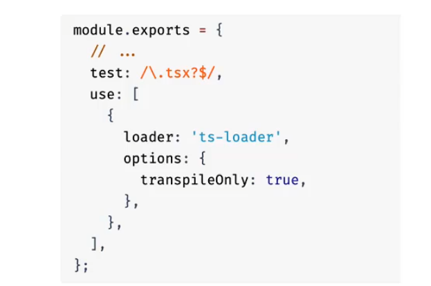

## 第1章 webpack简介

### 1.1 前端打包工具的进化

**解决作用域问题**

早期 gruf 和 sss 的接打包方案 

使用函数立即调用的方法 (复杂 效率低, 修改一行代码一个js文件就要重新打包)


**解决打代码拆分问题**

nodejs 基于 commonjs 模块化 (需要第三方工具编译 浏览器才能运行)


**解决浏览器不支持node模块化问题**

使用第三方工具browserify和requirejs


**解决使用node模块化后程序变复杂的问题**

es 模块化 ( 浏览器支持不完整)


**webpack的出现**

支持 commonjs ESmodule 两种方案，并且能打包静态资源


**webpack 竞品**   

parcel rollup vite


### 1.2 webpack 概念

webpack是一种前端资源构建工具，一个静态模块打包器

在Webpack看来，前端的所有资源文件（js/json/css/img/less/…）都会作为模块处理

它将根据模块的依赖关系进行静态分析，打包生成对应的静态资源bundle


### 1.3 webpack 安装

首先需要准备node环境

```sh
$ node -v  //推荐使用LTS版本
$ cnpm -v  //国内镜像源
```


创建npm项目

```sh
npm init -y
```


安装 webpack

```sh
cnpm install webpack webpack-cli --save-dev  //开发依赖
```


::: info

不推荐全局安装webpack，不同项目之间使用的版本不同，全局安装后可能会出现一些错误

:::


### 1.4 自定义 webpack 配置

项目根目录下创建 `webpack.config.js`  (必须) 

```js
const path = require('path')

module.exports = {
    //入口文件
    entry: './src/index.js',
    
    
    //输出文件
    output: {
        filename: 'bundle.js',
        path: path.resolve(__dirname,'./dist')
    },
    
    //模式
    mode: 'none'
}
```


运行webpack打包 

`npx webpack` 


会再 `./dist` 目录下生成一个js文件

在项目的 `index.html` 文件中引入该 js 文件即可


但每次都需要手动引入比较麻烦

使用插件可以根据模板自动生成一个 index.html 并且引入 打包后的js文件


### 1.5 Webpack 五个核心概念

1.  Entry
    入口（Entry）指示Webpack以哪个文件为入口起点开始打包，分析构建内部依赖图。
2.  Output
    输出（Output）指示Webpack打包后的资源bundles输出到哪里去，以及如何命名。
3.  Loader
    Loader让Webpack能够去处理那些非JavaScript文件（Webpack自身只理解JavaScript）
4.  Plugins
    插件（Plugins）可以用于执行范围更广的任务。插件的范围包括，从打包优化和压缩，一直到重新定义环境中的变量等。
5.  Mode
    模式（Mode）指示Webpack使用相应模式的配置。


### 1.6 常用命令行指令


## 第2章 plugins插件

### 2.1 插件概念


### 2.2 使用html插件

安装插件

```sh
cnpm install html-webpack-plugin -D
```


配置文件 webpack.config.js

```js
const path = require('path')
const HtmlWebpackPlugin = require('html-webpack-plugin')

module.exports = {
    //入口文件
    entry: './src/index.js',
    
    //输出文件
    output: {
        //打包后的js文件名
        filename: 'bundle.js',
        //打包后输出的文件夹,必须为绝对路径
        path: path.resolve(__dirname,'./dist'),
        //自动清理上一次打包文件
        clean: true
    },
    
    //插件
    plugins: [
        //自动生成index.html插件
        new HtmlWebpackPlugin({
            //模板,自己项目中的index.html文件
            template: './index.html',
            //打包后的文件名
            filename: 'index.html',
            //js引入的位置 默认head 可选body
            inject: 'head',
        })
    ],
    
    //自动刷新浏览器服务
    devServer: {
        static: './dist'
    },
    
    //开发工具  精准定位代码行数
    devtool: 'inline-source-map',
    
    //模式 可选none development开发模式
    mode: 'development'
}
```


### 1.3 热更新 

实时监听，当代码更新会自动打包，但需要手动刷新浏览器 **(不推荐)**

`npx webpack --watch` 


使用webpack热更新服务，可以自动刷新浏览器 **(推荐)**


安装依赖

```sh
cnpm install webpack-dev-server -D 
```


配置文件新增一项

```js
module.exports = {
    ...
    
	devServer: {
        static: './dist'
	}
}
```


启动指令

```sh
npx webpack-dev-serve --open   
```


## 第3章 Resource资源 

### 3.1 资源简介


### 3.2 asset/resource 类型的资源

index.js文件

```js
//引入一张图片 模块形式
import imgsrc from './assets/img/img1.png'

//创建一个img的DOM
const img = document.createElement('img')

//把图片的src属性设置为imgsrc
img.src = imgsrc

//追加元素
document.body.appendChild(img)
```


配置文件新增

```js
//大功能: 输出
output: {
    filename: 'bundle.js',
    path: path.resolve(__dirname,'./dist'),
    clean: true,
            
    // 有2种打包目录配置,
    // 一个是generator,优先级最高
    // 一个是output,优先级最低
    assetModulefilename: 'images/[contenthash][ext]'

}


//大功能: 模块
module: {
    //规则
    rules: [
        {
            // 匹配到所有的png文件
            test: /\.png$/,
            // 设置资源类型,再生成一份原文件到指定目录
            type: 'asset/resource',
            
            // 有2种资源打包目录配置,
            // 一个是generator,优先级最高
            // 一个是output,优先级最低
            
            // 打包到images文件夹下,
            // 文件名根据文件内容的hash命名,
            // 拓展名使用原文件的拓展名
            generator: {
                filename: 'images/[contenthash][ext]'
            }
        }
    ]
}
```


### 3.3 asset/inline 类型的资源

index.js文件

```js
//引入一张图片 模块形式
import imgsrc from './assets/img/svg1.png'

//创建一个img的DOM
const img = document.createElement('img')

//把图片的src属性设置为imgsrc
img.src = imgsrc

//追加元素
document.body.appendChild(img)
```


配置文件新增

```js
module: {
    rules: [
        {
            test: /\.svg$/,
            // inline类型不会生成新文件
            // 而是生成文件的 base64
            type: 'asset/inline'     
        }
    ]
}
```


### 3.4 asset/source 类型的资源

index.js文件

```js
// 引入一个txt文件
imporp eText from './assets/text/text1.txt'

//创建一个div标签
const block = document.createElement('div')

//把div的textContent属性设置为eText
block.textContent = eText

//追加元素
document.body.appendChild(block)
```


配置文件新增

```js
module: {
    rules: [
        {
            test: /\.txt$/,
            // source类型不会生成新文件
            type: 'asset/source'      
        }
    ]
}
```


### 3.5 自动选择类型

index.js文件

```js
// 引入一个txt文件
imporp jpgMap from './assets/img/jpg1.jpg'

//创建一个div标签
const img1 = document.createElement('img')

//把div的textContent属性设置为eText
img1.src = jpgMap

//追加元素
document.body.appendChild(img1)
```


配置文件新增

```js
module: {
    rules: [
        {
            test: /\.jpg$/,
            // 自动选择类型
            type: 'asset'
            // 自动选择类型,范围在resource和inline
            parser: {
            	// 设置临界值
            	// 大于该值则使用resource类型
            	// 小于该值则使用inline类型
            	dataUrlCondition: {
            		maxSize : 4 * 1024 * 1024 //4mb
        		}
        	}
        }
    ]
}
```


## 第4章 loader加载器

### 4.1 css-loader

**css-loader**

安装解析器

```sh
cnpm install css-loader style-loader -D  //css相关
cnpm install less-loader less -D  // less相关

```


配置规则

```js
 rules: [
     {
         test: /\.(css|less)$/,
         // 顺序必须这样,执行顺序是从后到前 
         // 最先使用less-loader将less文件转为css文件
         // 先使用css-loader加载所有css文件,
         // 再使用style-loader把所有css放到页面上
         use: ['style-loader','css-loader','less-loader']
     }
 ]
```


抽离css

安装插件

```sh
cnpm install mini-css-extract-plugin -D
```


**生产环境压缩css**

::: info

添加该配置后，默认的代码压缩将被取消，需要使用terser插件。

:::


安装插件

```sh
cnpm install css-minimizer-webpack-plugin -D
```


添加配置

```js
const CssMinimizerPlugin = require('css-minimizer-webpack-plugin')

...
optimization:{
    minimizer: [
        new CssMinimizerPlugin(),
       
    ]
         
}
```


### 4.2 加载字体

配置规则

```js
rules: [
    {
        test: /\.(woff|woff2|eot|ttf|otf)$/,
        type: 'asset/resource'
    }
]
```


### 4.3 xml csv tsv加载


安装解析器

```sh
cnpm install csv-loader xml-loader -D
```

配置规则

```js
rules: [
    {
        // csv转译后会变成数组
        test: /\.(csv|tsv)$/,
        type: 'csv-loader'
    },
    {
         // xml转译后会变成对象
        test: /\.xml$/,
        use: 'xml-loader'
    }
]
```


### 4.4 json5 yaml toml 加载

安装依赖

```sh
cnpm install toml yaml json5 -D
```


配置文件

```js
const toml = require('toml')
const yaml = require('yaml')
const json5 = require('json5')

rules: [
     {
        test: /\.toml$/,
        type: 'json',
        parser: {
            parse: toml.parse
        }
    },
    {
        test: /\.yaml$/,
        type: 'json',
        parser: {
            parse: yaml.parse
        }
    },
     {
        test: /\.json5$/,
        type: 'json',
        parser: {
            parse: json5.parse
        }
    }
]


```


### 4.5 babel-loader

安装依赖

```sh
cnpm install -D babel-loader @babel/core @babel/preset-env
cnpm install -D @babel/runtime 
cnpm install -D @babel/plugin-transform-runtime 
```


配置规则

```js
rules: [
    {
        test: /\.js$/,
        exclude: /node_modules/,
        use: {
            loader: 'babel-loader',
            options: {
                presets: ['@babel/preset-env'],
                plugins: [
                    [
                        '@babel/plugin-transform-runtime'
                    ]
                ]
            }
        }
    }
},
```


## 第5章 代码分离

### 5.1 常见代码分离

目的是减少入口 js 的大小


1.   更改入口起点

缺点 对多个入口的依赖重复打包

```js
module.exports = {
    //入口文件 配多个js
    entry: {
        index: './src/index.js',
        another: './src/another.js'        
    },
    
    //输出文件
    output: {
        //打包后的js文件名 使用name变量防止重命名
        filename: '[name].bundle.js',
        path: path.resolve(__dirname,'./dist'),
        clean: true
    },
}    
```


2.   防止重复

使用 dependOn 选项

```js
module.exports = {
    //入口文件 配多个js
    entry: {
        index: {
            import: './src/index.js',
            //开启共享依赖
            dependOn: 'shared',
        },
        another: {
            import: './src/another.js',
            //开启共享依赖
            dependOn: 'shared',
        },
        // 配置要共享的依赖,单独对lodash打包
        shared: 'lodash'
    },
    
    //输出文件
    output: {
        //打包后的js文件名 使用name变量防止重命名
        filename: '[name].bundle.js',
        path: path.resolve(__dirname,'./dist'),
        clean: true
    },
}    
```


或者使用 splitChunks 选项

```js
module.exports = {
    //入口文件 配多个js
    entry: {
        index: './src/index.js',
        another: './src/another.js'        
    },
    
    //输出文件
    output: {
        //打包后的js文件名 使用name变量防止重命名
        filename: '[name].bundle.js',
        path: path.resolve(__dirname,'./dist'),
        clean: true
    },
    
    //优化
    optimization:{
        splitChunks: {
            chunks: 'all'
        }
    }
}    
```


3.   动态导入

待整理

```js
module.exports = {
    //入口文件 配多个js
    entry: {
        index: './src/index.js',     
    },
    
    //输出文件
    output: {
        //打包后的js文件名 使用name变量防止重命名
        filename: '[name].bundle.js',
        path: path.resolve(__dirname,'./dist'),
        clean: true
    },
}    
```


### 5.2 懒加载 待整理


懒加载


预加载


### 5.3 缓存

服务器上的js 随时后更新, 但引入了第三方的js库, 例如 jquery 等 , 基本不会更新, 在浏览上缓存长期缓存下来, 以减少对服务器的请求

```js
module.exports = {
    entry: {
        index: './src/index.js',     
    },
    output: {
        // 可替换模板字符串 [name] [contenthash]
        // 打包后的js文件名 使用内容hash防止浏览器缓存
        filename: 'js/[name].[contenthash].js',
        path: path.resolve(__dirname,'./dist'),
        clean: true
    },
     optimization:{
         //缓存组
        cacheGroups: {
            vendor: {
                //对node_modules的进行缓存
                test: /[\\/]node_modules[\\/]/,
                name: 'vendors',
                chunks: 'all'
            }
        }
    }
}    
```


### 5.4 拆分开发环境和生产环境配置

1.   **公共路径**

```js
output: {
    //所有资源链接都加上该前缀
	publicPath: 'http://localhost:8080/'
},
```


2.   **使用环境变量**

```js
module.exports = (env) => {
	return   {
    	entry: {
        	index: './src/index.js',     
    	},
        
    	output: {
        	filename: 'js/[name].[contenthash].js',
        	path: path.resolve(__dirname,'./dist'),
        	clean: true
    	},
        //判断启动模式 
        mode: env.production? 'production': 'development'
   
	}    
}
```


配置代码压缩

启用css压缩后, 其他代码压缩会失效

安装 压缩插件

```sh
cnpm install terseer-webpack-plugin -D
```

配置文件

```js
const CssMinimizerPlugin = require('css-minimizer-webpack-plugin')
const TerserPlugin = require('terser-webpack-plugin')
...
optimization:{
    minimizer: [
        new CssMinimizerPlugin(),
        new TerserPlugin()
    ]
         
}
```


使用命令行启动

```sh
npx webpack --env production
```


3.   **拆分配置文件**

开发环境启动

```sh
npx webpack -c ./config/webpack.config.dev.js #打包
npx webpack serve -c ./config/webpack.config.dev.js #服务
```


开发环境配置

`/config/webpack.config.dev.js`

```js
module.exports = {
    output: {
        filename: 'scripts/[name].js',
    },
    mode: 'development',
    devtool: 'inline-source-map',
    devServer: {
        static: '../dist'
    },
    optimization: {
        splitChunks: {
            chunks: 'all'
        }
    }
}
```


生产环境启动

```sh
npx webpack -c ./config/webpack.config.prod.js #打包
npx webpack serve -c ./config/webpack.config.prod.js #服务
```


生产环境配置

`/config/webpack.config.prod.js`

```js
const CssMinimizerPlugin = require('mini-css-extract-plugin')
const TerserPlugin = require('terser-webpack-plugin')


module.exports = {
    output: {
        filename: 'scripts/[name].[contenthash].js',
        publicPath: 'http://localhost:8080/'
    },
    mode: 'production',
    optimization:{
       	minimizer: [
            //css压缩
            new CssMinimizerPlugin(),
            // 配置压缩后 自带压缩功能失效 
            // 需要重新配置js的压缩
            new TerserPlugin({ test: /\.js$/})
        ],
     	//开发环境不需要配置缓存
        splitChunks: {
            cacheGroups: {
            	vendor: {
                	test: /[\\/]node_modules[\\/]/,
                	name: 'vendors',
                	chunks: 'all'
            	}
        	}
        },
    },
    performance: {
        hints: false
    },
   
}
```


4.   npm启动脚本

```json
"scripts": {
	"serve": "webpack serve -c ./config/webpack.config.dev.js",
    "build": "webpack -c ./config/webpack.config.dev.js"
    
}
```


::: info

在脚本中不需要使用 `npx` 前缀

:::


5.   提取公共配置

/ config / webpack.config.conmon.js

```js
const path = require('path')
const HtmlWebpackPlugin = require('html-webpack-plugin')
const MiniCssExtractPlugin = require('mini-css-extract-plugin')

const toml = require('toml')
const yaml = require('yaml')
const json5 = require('json5')

module.exports = {
    entry: {
        index: './src/index.js',
        another: './src/another.js'        
    },
    
    output: {
        path: path.resolve(__dirname,'../dist'),
        clean: true,
        assetModuleFilename: 'images/[contenthash][ext]'
    },
    
    optimization:{
    }
    
    plugins: [
        new HtmlWebpackPlugin({
            template: '../index.html',
            filename: 'index.html',
            inject: 'head',
        }),
        new MiniCssExtractPlugin({
            filename: 'styles/[contenthash].css'
        })
    ],
 
    module: {
    	rules: [
        	{
            	test: /\.png$/,
            	type: 'asset/resource',
            	generator: {
                	filename: 'images/[contenthash][ext]'
            	}
        	},
            {
            	test: /\.svg$/,
            	type: 'asset/inline'     
        	},
            {
            	test: /\.txt$/,
            	type: 'asset/source'      
       	 	},
            {
            	test: /\.jpg$/,
            	type: 'asset',
            	parser: {
            		dataUrlCondition: {
            			maxSize : 4 * 1024 * 1024 //4mb
        			}
        		}
       	 	},
            {
         		test: /\.(css|less)$/,
         		use: ['style-loader','css-loader','less-loader']
     		},
            {
        		test: /\.(woff|woff2|eot|ttf|otf)$/,
        		type: 'asset/resource'
    		},
            {
        		test: /\.(csv|tsv)$/,
        		type: 'csv-loader'
    		},
    		{
        		test: /\.xml$/,
        		use: 'xml-loader'
    		},
            {
        		test: /\.toml$/,
        		type: 'json',
        		parser: {
            		parse: toml.parse
        		}
    		},
    		{
        		test: /\.yaml$/,
        		type: 'json',
        		parser: {
            		parse: yaml.parse
        		}
    		},
     		{
        		test: /\.json5$/,
        		type: 'json',
        		parser: {
            		parse: json5.parse
        		}
    		},
            {
        		test: /\.js$/,
        		exclude: /node_modules/,
        		use: {
            		loader: 'babel-loader',
            		options: {
                		presets: ['@babel/preset-env'],
                		plugins: [
                    		[
                        		'@babel/plugin-transform-runtime'
                    		]
                		]
            		}
       	 		}
    		}
    	]
	}
}
```


6.   合并配置文件

安装深合并的依赖

```sh
cnpm install webpack-merge -D
```


创建文件

/ config / webpack.config.js

```js
const {merge} = require('webpack-merge')

const commonConfig = require('./webpack.config.common')
const prodConfig = require('./webpack.config.prod')
const devConfig = require('./webpack.config.dev')

module.exports = (env) => {
    switch(true){
        case env.development:
            return merge(commonConfig,devConfig)
        case env.production:
            return merge(commonConfig,prodConfig)
        default: 
            return new Error("没有找到匹配的配置")
    }
}
```


配置脚本 package.json

```json
"scripts": {
	"serve": "webpack serve -c ./config/webpack.config.js --env development",
    "build": "webpack -c ./config/webpack.config.js --env production"
    
}
```


## 第6章 webpack高级 效率篇

### 6.1 source-map


默认为`eval`模式

```js
devtool: 'eval'  //默认为eval ,可以精准定位到原js的行数
```


推荐使用`cheap-module-source-map`模式

```js
devtool: 'cheap-module-source-map' 
```


生产环境必须关闭该功能

```js
devtool: false  // 防止打包体积过大 和反编译出源码
```


### 6.2 resolve


### 6.3 devServer

使用webpack热更新服务，可以自动刷新浏览器 **(推荐)**


安装依赖

```sh
cnpm install webpack-dev-server -D 
```


配置文件新增一项

```js
module.exports = {
    ...
    
	devServer: {
        static: path.resolve(__dirname,'./dist'),
        //压缩传输文件
        compress: false,
        //启动端口
        port: 3000,
        //内网访问地址
        host: '0.0.0.0',
        //添加一个头信息
        headers: {
            'X-assces-token': '123'
        },
        //启动跨域代理
        proxy: {
            '/api': 'http://localhost:9000'
        },
        // 使用http2 包括https服务
        http2: true,
        //历史路由模式
        historyApiFallback: true,
        //热替换
        hot: true,  //webpack5开箱即用
        //自动刷新
        liveReload: true
	}
}
```


启动指令

```sh
npx webpack-dev-serve --open   
```


### 6.4 模块热替换

开启 hot 配置


项目文件增加 if 判断


### 6.5 eslint

安装依赖

```
cnpm install eslint -D
npx eslint --init
```


### 6.6 husky

每次提交代码的时候 执行的钩子

git-hocks


## 第7章 webpack高级 模块篇

### 7.1 模块解析

底层使用 enhance_resolve 

```js
module.exports = {
    resolve: {
        //配置别名
        alias: {
            '@': path.resolve(__dirname, './src')
        },
        // 导入是可以省略js后缀的,但文件名相同时候,优先导入js
        //例如同一文件夹内有两个文件 name.js ,name.json
        extensions: ['.js','.json']
    },
    
    //外部拓展 使用cdn的方式
    externals: {
        jquery: [
            //cdn地址, 不再需要手动引入cdn标签了
            'https://cdn.jquery/3.6.0./jquery.js'
            //别名
            'JQuery',
        ],
    },
 	// 启用cdn后 需要配置该项
    externalsType: 'script'
}
```


### 7.2 可视化依赖图

安装

```sh
cnpm install --save-dev webpack-bundle-analyzer
```

配置

```js
const {BundleAnalyzerPlugin} = require('webpack-bundle-analyzer').BundleAnalyzerplugin;

...

plugins: [
    new BundleAnalyzerPlugin()
]
```


### 7.3 拓展功能

#### 7.3.1 **postcss 与 css模块**

安装

```
cnpm i -D autoprefixer postcss-nested
```


配置 webpack.config.js

```js
module: {
    rules: [
        // 可以使用正则来区分模块化css和全局css
        // 例如
        // test: new RegExp(`^(?!.*\\.global).*\\.css`)
        test: /\.css$/,
        exclude: /node_modules/,
        use: [
        	{
        		loader: 'style-loader',
        	},
            {
                loader: 'css-loader',
                options: {
                    modules: true,
                }
            },
            {
                loader: 'postcss-loader'
            }
    	]
    ]
}
```


配置 postcss.config.js

```js
module.exports = {
    plugins: [
        //转化为兼容版本css语法
        require('autoprefixer'),
        //支持css嵌套语法
        require('postcss-nested')
    ]
}
```


配置 package.json

```json
{
	...
	
	"browserslist": [
		"> 1%",
		"last 2 versions"
	]
}
```


#### 7.3.2 web works


#### 7.3.3 typescript

安装

```
cnpm i -D typescript ts-loader
```


初始化

```sh
npx tsc --init
```


配置 tsconfig.json

```js
"rootDir": "./src"
"outDir": "./dist"
```


配置 webpack.config.js

```js
module: {
    rules: [
        {
            test: /\.ts$/,
            use: 'ts-loader',
            exclude: /node_modules/
        }
    ]
},
resolve: {
    extensions: ['.ts','js']
}
```


### 7.4 多页面环境搭建

配置 webpack.config

```js
entry: {
    main: {
        import: ['./src/app2.js','./src/app.js'],
        dependOn: 'lodash',
        filename: 'chanel1/[name].js'
    },
    main2: {
        import: './src/app3.js',
        dependOn: 'lodash',
        filename: 'chanel2/[name].js'
    },
    lodash: {
        import: 'lodash',
        filename: 'common/[name].js'
    }
},
    
plugins: [
    new HtmlwebpackPlugin({
        template: './index2.html',
        inject: 'body',
        filename: 'index2.html',
        chunks: ['main2','lodash'],
        publicPath: 'http://www.a.com/'
    }),
        new HtmlwebpackPlugin({
        template: './index.html',
        inject: 'body',
        filename: 'index.html',
        chunks: ['main','lodash'],
        publicPath: 'http://www.b.com/'
    }),
]
```


## 第8章 webpack高级 优化篇

### 8.1 摇树 tree-shaking

配置

```js
optimization: {
    usedExports: true
}
```


### 8.2 副作用 sideEffects

配置 package.json

```json
{
    //webpack4默认所有文件都有"影响"
    //有"影响"的文件,导入后即便未使用,打包也不会删除该模块
    //没有"影响"的文件 导入后未使用,打包时则会删除
    
    "sideEffects": true  //所有文件都有"影响",不能删除
    "sideEffects": true  //所有文件都没有"影响",不能删除
    
    //数组配置哪些文件有"影响"
    "sideEffects": ["*.css","*.global.js"]  
}

```


### 8.3 渐进式网络应用程序 PWA

安装

```sh
cnpm i -D workbox-webpack-plugin
```

配置 webpack

```js
const WorkboxPlugin = require('workbox-webpack-plugin')
plugins: [
    new WorkboxPlugin.GenerateSW({
        clientsClaim: true,
        skipWaiting: true
    })
]
```


index.js


package.json

```json
"scripts": {
	"start": "http-server dist"
}
```


原理是使用了浏览器缓存了该页面

可以查看在谷歌浏览器地址输入

```
chrome://serviceworker-internals
```


### 8.4 预置依赖 shimming 

安装依赖

```
cnpm i -D imports-loader
```


配置 webpack.config.js

```js
//webpack为内置模块
const webpack = require('webpack')
//配置全局引入 单文件用到的地方不需要单独引入了
plugins: [
    new webpack.ProvidePlugin({ 
        _: 'lodash'
    })
]

module: {
    //在commonjs中 模块中的this指向不是window
     //使用imports-loader 覆盖this指向,
    rules: [
        {
            test: require.resolve('./src/index.js'),
            use: 'imports-loader?wrapper=window'
        }
    ]
}
```


### 8.5 全局导出 exports

安装依赖

```
cnpm i -D exports-loader
```


配置 webpack

```js
module: {
    rules: [
        {
            test: require.resolve('./src/globals.js'),
            use: 'exports-loader?type=commonjs&exports=file,multiple|helpers.parse|parse'  
        }
    ]
}
```


其他文件中使用

```js
const {file,parse} = require("./globals")
```


### 8.6 垫片 polyfills

安装

```
cnpm i -D @babel/polyfill 
cnpm i -S core-js@3
```


配置 webpack

```js
module: {
    rules: [
    {
     test: /\.js$/,
     exclude: /node_modules/,
     use: {
     loader: 'babel-loader',
     options: {
     presets: [
     [
     	'@babel/preset-env',
            {
                targets: [
                    'last 1 version',
                    '> 1%'
            ],
                useBuiltIns: 'usage',
                corejs: 3
                                
            }
            ]
            ]
            }
            }
        }
    ]
}
```


### 8.7 构建library

构建轮子


配置 webpack.config.js

```js
output: {
    library:{
        name: 'mylib',
        type: 'umd'
    },
    globalObject: 'globalThis'
},
externals: {
    lodash: {
        commonjs: 'lodash',
        commonjs2: 'lodash',
        amd: 'lodash',
        root: '_'    
    }
}
```


配置 package.json


发布npm包

```
npm config get registry   //判断是不是 npmjs.org

npm adduser  //登录

npm publish //发布该包 
```


安装

```
npm i xxx -D  //你发布的包的名字
```


### 8.8 模块联邦


### 8.9 通用构建优化方法

1.   更新到最新版本 webpack 和 nodejs
2.   将 loader 应用于必须的模块
3.    少使用 loader 和plugin
4.   减少 resolve 配置
5.   保持 chunk 体积最小
6.   持久化缓存
7.   分析自定义plugin 
8.   不使用progress plugin 
9.   使用 DllPlugin
10.   使用 thread-loader


### 8.10 开发和生产环境优化方法

开发环境

1.   增量编译 监听模式
2.   内存中编译  webpack-dev-server
3.   stats.toJson 加速
4.   使用 devtools eval-cheap-module-source-map
5.   区别开发和生产依赖
6.   最小化 entry chunk
7.   避免额外的优化 
8.   输出结果不带路径信息
9.   使用10版本以上node
10.   ts-loader 配置


 

生产环境

1.   不启用 sorce-map


## 第9章 webpack5 新特性

### 9.1 持久化缓存

缓存在webpack5中默认开启，缓存默认是在内存里,但可以对cache进行设置


### 9.2 资源模块

资源模块是一种模块类型，它允许使用资源文件（字体，图标等）而无需配置额外 loader

-   raw-loader => asset/source 导出资源的源代码
-   file-loader => asset/resource 发送一个单独的文件并导出 URL
-   url-loader => asset/inline 导出一个资源的 data URI
-   asset 在导出一个 data URI 和发送一个单独的文件之间自动选择。之前通过使用 url-loader，并且配置资源体积限制实现


### 9.3 URIs （会用的比较少）

Webpack 5 支持在请求中处理协议
 支持data 支持 Base64 或原始编码,MimeType可以在module.rule中被映射到加载器和模块类型


### 9.4 moduleIds & chunkIds的优化

-   在webpack5之前，没有从entry打包的chunk文件，都会以1、2、3...的文件命名方式输出,删除某些些文件可能会导致缓存失效
-   在生产模式下，默认启用这些功能chunkIds: "deterministic", moduleIds: "deterministic"，此算法采用确定性的方式将短数字 ID(3 或 4 个字符)短hash值分配给 modules 和 chunks
     chunkId设置为deterministic，则output中chunkFilename里的[name]会被替换成确定性短数字ID


### 9.5 移除Node.js的polyfill

webpack4带了许多Node.js核心模块的polyfill,一旦模块中使用了任何核心模块(如crypto)，这些模块就会被自动启用
 webpack5不再自动引入这些polyfill
如果要引入加上


```js
reslove:{
	fallback:{
		"crypto":require.resolve("crypto-browerify")
		//...包括stream buffer
	}
}
```


### 9.6 更强大的tree-shaking

tree-shaking就在打包的时候剔除没有用到的代码

-   webpack4 本身的 tree shaking 比较简单（直接import整个文件或者对象内部未使用的不能被剔除；commonJs模式不支持）,主要是找一个 import 进来的变量是否在这个模块内出现过
-   webpack5可以进行根据作用域之间的关系来进行优化,开始支持
     会分析模块的引用关系

webpack.config.js:配置：optimization:true 会给没使用的文件进行标记:
 unused harmony export nums ,在prodction模式中会被删除

------

webpack4:在编写支持 tree-shaking 的代码时，导入方式非常重要。你应该避免将整个库导入到单个 JavaScript 对象中。当你这样做时，你是在告诉 Webpack 你需要整个库， Webpack 就不会摇它。


```js
// 全部导入 (不支持 tree-shaking)
import _ from 'lodash';
// 具名导入(支持 tree-shaking)
import { debounce } from 'lodash';
```

modudleId

-   开发环境下 模块ID是相对于根目录的相对路径，上线不行


### 9.7 sideEffects

>   函数副作用指当调用函数时，除了返回函数值之外，还产生了附加的影响,例如修改全局变量
>    严格的函数式语言要求函数必须无副作用


## 第10章 反编译js

使用 reverse-sourcemap

npm install --global reverse-sourcemap

reverse-sourcemap --output-dir 导出路径 app.1111111.js.map
