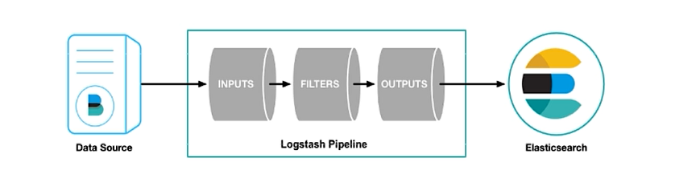

## 第1章 ELK 概述

### 1.1 ELK介绍

Elasticsearch是个开源分布式搜索引擎，基于Lucene构建, 提供搜集、分析、存储数据三大功能。它的特点有：分布式，零配置，自动发现，索引自动分片，索引副本机制，restful风格接口，多数据源，自动搜索负载等。

Logstash 主要是用来日志的搜集、分析、过滤日志的工具，支持大量的数据获取方式。一般工作方式为c/s架构，client端安装在需要收集日志的主机上，server端负责将收到的各节点日志进行过滤、修改等操作在一并发往elasticsearch上去。

Kibana 也是一个开源和免费的工具，Kibana可以为 Logstash 和 ElasticSearch 提供的日志分析友好的 Web 界面，可以帮助汇总、分析和搜索重要数据日志。


### 1.2 搜索引擎

-   全文搜索引擎

如百度 谷歌 搜狗等


-   垂直所有引擎

如电商网站 oa系统 等


### 1.3 应用场景

维基百科 : 全文检索 高亮显示 搜索推荐

the guardian : 对用户行为进行收集

github : 在千亿级别的代码行中搜索信息


### 1.4 原理


## 第2章  ES入门

### 2.1 软件安装


注意 8.0版本以上默认开启ssl , 需要关闭该设置

```yml
# /config/elasticsearch.yml
xpack.security.enabled: false
```


linux配置

```
# 修改最大文件创建数限制 线程开启限制
vim /etc/security/limits.conf

* soft nofile 65536
* hard nofile 65536
* soft nproc 4096
root soft nproc unlimited


# 修改系统控制权限
vim /etc/sysctl.d/99-sysctl.conf

vm.max_map_count=655360


# 使修改生效 
sysctl -p
```


es安装

```
# 拉取镜像
docker pull elasticsearch

# 运行容器
docker run -d --name elasticsearch -p 9200:9200 -p 9300:9300 -e "discovery.type=single-node" elasticsearch:8.4.3

# 查找容器信息
docker ps 
docker logs -f elasticsearch

# 以root身份进入
docker exec -it -u root 3718f73b385e bash

# 更新软件源
apt-get update

# 安装vim
apt-get install vim

# 访问
localhost:9200
```


安装elasticsearch-head可视化

谷歌插件商店搜索


### 2.2 索引 index

默认创建 一个主分片 一个副本分片

```sh
# 默认创建索引
put index_test

# 指定创建索引
put index_test2  # 注意大括号必须要单换行
{
	"settings": {
		"number_of_shards":2,
		"number_of_replicas":2  
	}
}

# 索引一旦创建 主分片不能修改 只能增加副本分片
put index_test2/_settings
{
	"number_of_replicas":1  
}

# 删除索引
delete index_test2

# 查看所有索引
get _cat/indices?v
```


### 2.3 分片 shards

主分片


### 2.4 副本 replicas

副本分片


### 2.5 type

新版本已删除


### 2.6 document

文档 最小的数据单元 , 一个文档就是一条数据, 一般用json结构表示, 

一个文档中可以定义多个field , field就是数据字段


在索引中新增文档 , 会自动判断是否有该索引 , 没有则自动创建


```sh
_doc 和 _create 的区别 , create规定必须是新增 如果存在则报错

# 新增,全量替换
put index_test3/_doc/1
{
	"name":"bjsxt",
	"age":12
}

# 新增,若已存在则报错
put index_test3/_create/1
{
	"name":"bjsxt",
	"age":12
}

# 新增 自动生成主键
post index_test3/_doc
{
	"name":"bjsxt",
	"age":16
}

# 查询所有文档
get index_test3/_search

# 根据id查询
get index_test3/_doc/1

# 批量查询 id为1和2
get index_test3/_mget
{
	"docs":[
		{
			"_id":1
		},
		{
			"_id":2
		}
	]
}

# 局部更新文档
post index_test3/_update/3
{
	"doc":{
		"count":0
	}
}

# 删除文档 不会真的删除,只是标记为delete,当空间不足的时候才会自动清理
delete test_index3/_doc/1

# 批量增删改查
post _bulk # 注意单个大括号不能换行
{"create":{"_index":"index_test3","_id":5}}
{"name":"name-value","age":123}
{"index":{"_index":"index_test3","_id":5}}
{"name":"bzjxt","age":123}
{"update":{"_index":"index_test3","_id":5}}
{"doc":{"age":123}}
{"delete":{"_index":"index_test3","_id":5}}
```


### 2.7 元数据

以 `_` 开头的属性都是元数据, 都有自己特定的含义

如 `_index` 表示索引


### 2.8 倒排索引 

对数据进行分析, 抽取数据中的词条作为key , 对应数据的存储位置为value


### 2.9 分词器

standard analyzer 默认分词器 处理英语语法 对中文不识别

```sh
get _analyze
{
	"text":"I am a chinese",
	"analyzer":"standard"
}
```


simple analyzer 简单分词器 只会拆分单词

whitespace analyzer 空格符分词器 碰到空格就会拆分

language analyzer 语言分词器


安装中文分词器 IK

```
docker exec -it es /bin/bash
./bin/elasticsearch-plugin install https://github.com.medcl/elasticsearch-analysis-ik/releases/download/v7.6.2/elasticsearch-analysis-ik-7.6.2.zip
exit
docker restart es
```


IK的两个分词器

```sh
get _analyze
{
	"text":"中华人民共和国国歌",
	"analyzer":"ik_max_word"  # 重复分词器
	"analyzer":"ik_smart"  # 智能分词器
}
```


新增词条

```
```


### 2.10 mapping

mapping 决定了一个index 中的field 用什么类型存储

没有写分词器 默认是 标准分词器


- 所有类型

文本 : text

整数 : byte short integer long

浮点 : float double

布尔 : boolean

日期 : date

数组 : array

 对象 : object

关键字 : keyword 


- mapping生效后的类型不许修改

```sh
put index_test4
{
	"mappings":{
		"properties":{
      "name":{
        "type":"keyword"
      },
      "age":{
        "type":"integer"
      },
      "desc":{
        "type":"text",
        "analyzer":"ik_max_word"
      }
		}
	}
}
```


- text和keyword区别

keyword 不允许分词


## 第3章  ES 查询

### 3.1 query


### 3.2  range

```sh
get test_search/_search
{
	"query": { # 查询
    "range": {  # 范围查询
      "eage":{  # 字段名
        "gte": 10,  # gte大于等于  gt是大于
        "lte": 20  # lte小于等于  lt是等于
      }
    }
  }
}
```


### 3.3  bool

```sh
get test_search/_search
{
	"query": { # 查询
    "bool": {  # 多条件逻辑查询
      "must":[  # 逻辑且
      	"range": {  # 范围查询
          "eage":{  # 字段名
            "gte": 10,  # gte大于等于  gt是大于
            "lte": 20  # lte小于等于  lt是等于
          }
        }
      ],
      
      "must_not":[ # 逻辑必须非
      
      ]
      
      "should":[  # 逻辑或
      	{},
      	{}
      ]
    }
  }
}
```


多重嵌套

```sh
# 需求: 查找 必须是29岁的张三 或者 必须是24岁的韩梅梅
get test_search/_search
{
	"query": {
		"bool": {
			"should": [
			# should里第1个条件
				{
					"bool": {
						"must":[
						{
							"match": {
								"ename": "张三"
							}
						},
						{
							"match": {
							 "eage": 29
							}
						}
							
						]
					}
				},
				
				# should里第2个条件
				{
					"bool": {
						"must": [
							{
								"match": {
									"ename": "韩梅梅"
								}
							},
							{
								"match": {
									"eage": "24"
								}
							}
						]
					}
				}
			]
		}
	}
}
```


### 3.4  排序和分页

```sh
get test_search/_search
{
	"query":{
		"match_all": {}
	},
	
	# 排序 与query同级
	"sort":{
		"eage": {
			"order": "desc"
		}
	},
	
	# 分页
	"from":2, # 起始下标
	"size":2  # 查询记录数
}
```


### 3.5  高亮显示

```sh
"highlight": {
	"fields": {
		"test":{
			"fragment_size":5,
			"number_of_fragments":1
		}
	},
	"pre_tags":"<span style='color:red'>",
	"post_tags":"<span/>"
}
```


## 第4章 ES 增删改


## 第5章 集成springboot

### 5.1  spring data

依赖

```xml
<dependency>
	<groupId>org.springframework.boot</groupId>	
  <artifactId>spring-boot-starter-data-elasticsearch</artifactId>
</dependency>
```


配置

```properties
elasticsearch.host=127.0.0.1
elasticsearch.port=9200	
```


实体类

```java
@Data
@Document(indexName="index_item",shards=1,replicas=1)
public class Item {
  @Id
  private String id;
  @Field(name="title",type=FieldType.Text,analyzer="ik_max_word")
  private String title;
  @Field(tpe=FieldTYpe.Long)
  private Long price;
  @Field(type=FieldType.Keyword)
  private String catName;
}
```


操作

```java
@SpringBootTest
class SpringdataesApplicationTests {
	
  @Autowired
  private ElasticsearchRestTemplate elasticsearchRestTemplate;
  
  //初始化索引
  @Test
  void contextLoads(){
    IndexOperations indexOperations = elasticsearchRestTemplate.indexOps(Item.class);
    
    //创建索引 默认配置 没有mapping
    boolean result = indexOperations.create();
    
    //根据注解产生mapping
    Document doc = indexOperations.createMapping(Item.class);
    boolean result2 = indexOperations.putMapping(doc);
    
  }
  
  
  //删除索引
  @Test
  void deleteIndex(){
   IndexOperations indexOperations = elasticsearchRestTemplate.indexOps(Item.class);
    indexOperations.delete();
  }
  
  
  //新增文档
  @Test
  void save(){
    Item item = new Item(null,"华为","手机");
    Item result = elasticsearchRestTemplate.save(item)
  }
  
  
  //批量新增
  @Test
  void saves(){
    Item item1 = new Item(null,"华为","手机");
    Item item2 = new Item(null,"小米","手机");
    List<Item> list = new ArrayList<>();
    list.add(item1);
    list.add(item2);
    elasticsearchRestTemplate.save(list);
  }
  
  
  //删除
  @Test
  void delete(){
    //根据字符串id删除 返回删除的id
    Stirng id = elasticsearchRestTemplate.detele("asdoKJH12",Item.class);
    
    //根据对象的id删除,其他属性是什么都无所谓,只关注id
    Item item = new Item("asldjjlak","标题");
    Stirng id = elasticsearchRestTemplate.detele(item);
      
  }
  
  //修改 全量替换
  @Test
  void update(){
    Item item = new Item(1,"华为","手机");
    Item result = elasticsearchRestTemplate.save(item)
  }
  
  
  //查询
  @Test
  void search(){
    //根据主键查询
  	Item item = elasticsearchRestTemplate.get("id",Item.class);
    
    //模糊查询
    Query query = new NativeSearchQuery(QueryBuilders.queryStringQuery("手机"));
    SearchHits<Item> search = elasticsearchRestTemplate.search(query,Item.class);
    List<SearchHits<Item>> list = search.getSearchHits();
    for(SearchHit<Item> searchHit : list) {
      System.out.printIn(searchHit.getContent());  
    }
  }
  
  
  //match 查询
  @Test
  void search_match(){
    Query query = new NativeSearchQuery(QueryBuilders.matchQuery("title","手机"));
    SearchHits<Item> search = elasticsearchRestTemplate.search(query,Item.class);
    List<SearchHits<Item>> list = search.getSearchHits();
    for(SearchHit<Item> searchHit : list) {
      System.out.printIn(searchHit.getContent());  
    }
  }
  
  
  //range 查询
  @Test
  void search_range(){
    Query query = new NativeSearchQuery(QueryBuilders.rangeQuery("price").gte(200).lte(3000));
    SearchHits<Item> search = elasticsearchRestTemplate.search(query,Item.class);
    List<SearchHits<Item>> list = search.getSearchHits();
    for(SearchHit<Item> searchHit : list) {
      System.out.printIn(searchHit.getContent());  
    }
  }
  
  
  //分页排序
  @Test
  void sortPage(){
    Query query = new NativeSearchQuery(QueryBuilders.matchAllQuery());
    query.addSort(Sort.by(Sort.Direction.DESC,"price"));
    query.setPageable(PageRequest.of(0,2));
    SearchHits<Item> search = elasticsearchRestTemplate.search(query,Item.class);
    List<SearchHits<Item>> list = search.getSearchHits();
    for(SearchHit<Item> searchHit : list) {
      System.out.printIn(searchHit.getContent());  
    }
  }  
  
  
  //高亮查询
  @Test
  void highlight(){
    Query query = new NativeSearchQuery(QueryBuilders.matchQuery("title","手机"));
    HighlightBuilder builder = new HighlightBuilder();
    
    builder.preTags("<span style='color:red;'>");
    builder.postTags("</span>");
    builder.field("title");
    
    HighlightQuery highlightQuery = new HighlightQuery(builder);
    query.setHighlightQuery(highlightQuery);
    
    SearchHits<Item> search = elasticsearchRestTemplate.search(query,Item.class);
    List<SearchHits<Item>> list = search.getSearchHits();
    for(SearchHit<Item> searchHit : list) {
      Item item = searchHit.getContent();
      System.out.printIn("非高亮数据:" + item);
      List<String> li = searchHit.getHighlightField("title");
      
      if( li != null && li.size()>0){
        item.setTitle(list.get(0));
      }
      System.out.printIn("有高亮数据:" + item);
    }
  }
  
  
  
}
```


### 5.2 spark stream


### 5.3 flint


## 第6章 ES常用插件


## 第7章 kibana

### 7.1 kibana介绍


### 7.2 kibana安装


```sh
# 拉取镜像 运行
docker pull kibana
docker run -it -d --name kibana --restart=always --link es:es -p 5601:5601 kibana #单向连接

# 进入容器 修改配置
docker exec -it kibana /bin/bash
cd config
vi kibana.yml 
slasticsearch.hosts: ["http://43.12.33.8:9200"] # 修改为es的ip地址

# 重启
docker restart kibana

# 访问 
localhost:5601
```


### 7.3 使用

```sh
# 查看所有索引 带表头
get _cat/indices?v

# 查看分片信息
get _cat/shards

# 查看节点信息
get _cat/nodes

# 查看健康状态
get _cat/health
```


## 第8章 logstash

### 8.1 介绍

logstash是一款强大的数据收集和处理管道 , 常用于集中日志处理


### 8.2 原理




### 8.3 安装

```sh
docker pull logstash 
docker run -it -p 4560:4560 --name logstash -d logstash
# 进入容器
docker exec -it logstash /bin/bash
```


修改配置

```sh
vim /usr/share/logstash/config/logstash.yml

http.host:"0.0.0.0"
xpack.monitoring.elasticsearch.hosts:["http://192.178.1.1:9200"]
```


修改配置

```sh
vim /usr/share/logstash/pipeline/logstash.conf

input{
		tcp{
				node=>"server"
				port=>4560
		}
}
fliter {

}
output{
		elasticsearch{
				action=>"index"
				hosts=>"192.168.2.812:9200"
				index=>"test_log"
		}
}
```


重启

```
docker restart logstash
```


### 8.4 使用

pom依赖

```
web 
logstash-logback-encoder 
lombok
data-es
```


logback.xml

```
```


测试

```java
Logger logger = LoggerFactory.getLogger(LogstashApplication.class);
logger.info("手动测试")
```


LogModel.java

```java
public class LogModel {
  @Id
  private String id;
  @Field(type=FieldType.Integer)
  private Integer port;
  @Field(type=FieldType.Text)
  private String message;
  //名称不同的时候需要用name指定
  @Field(name="@version",type=FieldType.Keyword)
  private String version;
  //默认不具备转换能力,可以用string接受,如果date接受必要用format转换格式
  @Field(name="@timestamp",type=FieldType.Date,format=DateFormat.date_time)
  private Date timestamp;
  @Field(type=FieldType.Keyword)
  private String host;
  
  private MessageModel mp;
}
```


MessageModel

```java
@Data
public class MessageModel{
  @JsonProperty("@timestamp")
  private Date timestamp;
  @JsonProperty("@version")
  private String version;
  private String message;
  private String logger_name;
  private String thread_name;
  private String level;
  private Long lovel_value;
}
```


LogService

```java
public interface LogService {
	List<LogModel> selectPage (Integer page, Integer rows);
}
```


LogServiceImpl

```java
@Service
public class LogServiceImpl implements LogService {
	@Autowired
	private ElasticsearchRestTemplate elasticsearchRestTemplate;
	@Override
	public List<LogModel> selectPage(Integer page, Integer rows){
    //查询最近15分钟内的对象
    Calendar calendar = Calendar.getInstance();
    calendar.add(Calendar.MINUTE,-15);
    Query query = new NativeSearchQuery(QueryBuilders.rangeQuery("@timestamp").gte(calendar.getTime()));
    query.setPageable(PageRequest.of(page-1,rows));
    SearchHits<LogModel> search = elasticsearchRestTemplate.search(query,LogModel.class);
    List<LogModel> list = new ArrayList<>();
    for(SearchHit<LogModel> searchHit : search.getSearchHits()){
      LogModel logModel = searchHit.getContent();
      ObjectMapper objectMapper = new ObjectMapper();
      MessageModel messageModel = objectMapper.readValue(LogModel.getMessage(),MessageModel.class);
      logoModel.setMp(messageModel);
      list.add(logoModel);
    }
      
    return list;
  }
}
```


LogController

```java
@RestController
public class LogController {
  @Autowired
  private LogService logService;
 
  @RequestMapping("/")
  public List<LogModel> show(Integer page,Integer rows) {
    return logService.select(page,rows)
  }
}
```


浏览器

```
localhost:8090/?page=1&rows=10
```


### 8.5 加入mq缓存

logstach -> mq -> 脚本 / logstach  -> es
