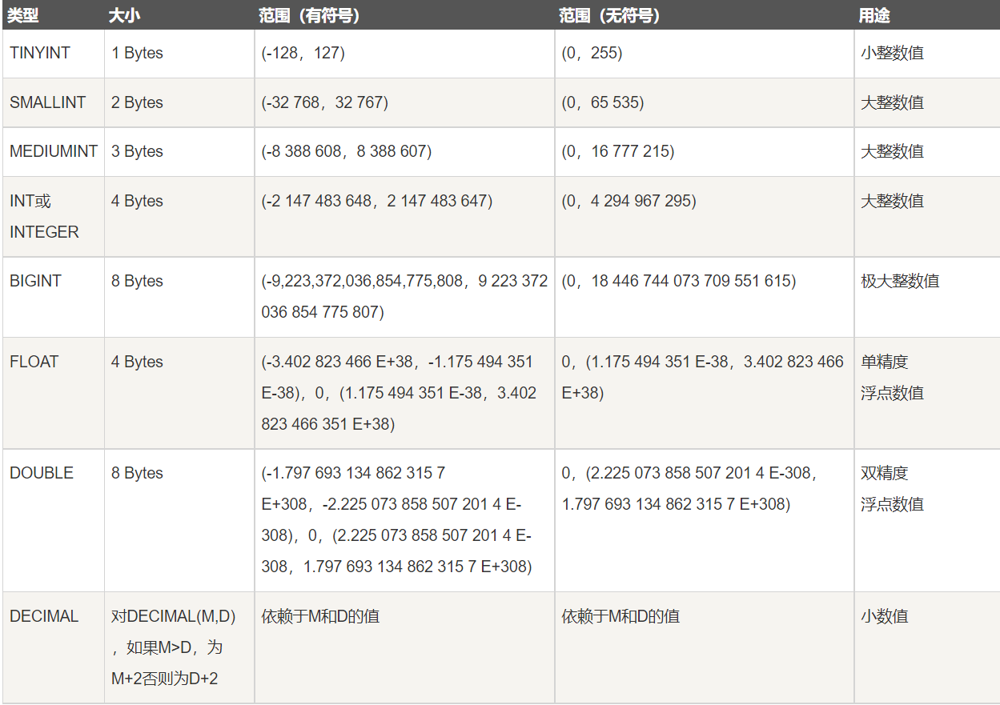
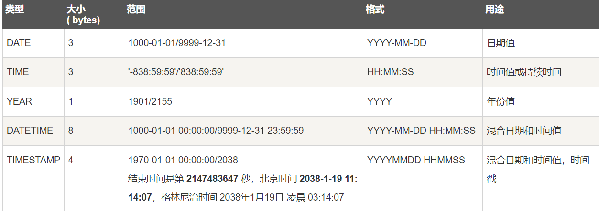
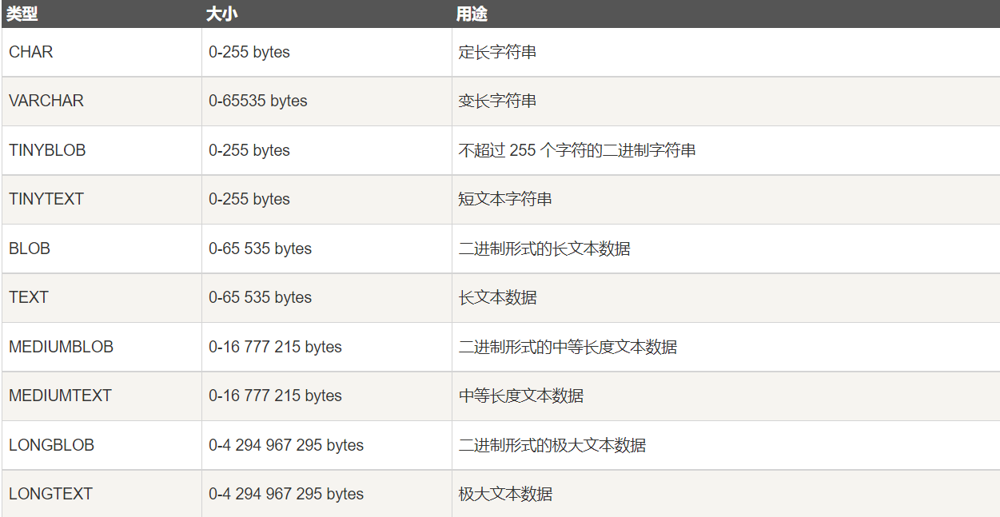

## 一. mysql简介

### 1.1 **mysql常用指令**

| 指令                 | 描述                 |
| -------------------- | -------------------- |
| show databases       | 展示所有数据库       |
| create database name | 创建数据库           |
| create table name    | 创建数据表           |
| ues dbtest           | 连接dbtest数据库     |
| show tables          | 展示当前库的所有表   |
| show tables from t1  | 展示t1库的所有表     |
| show warnings        | 查看警告             |
| desc t1              | 查看t1表的结构       |
| show create table t1 | 查看t1表的建表语句   |
| source 文件绝对路径  | 导入sql脚本          |
| select database();   | 查看当前所在的数据库 |
| select version();    | 查看当前数据库的版本 |
| drop database  name  | 删库                 |
| drop table  name     | 删表                 |
| \c                   | 结束指令             |
| \q                   | 退出                 |


严格模式

set sql_mode = "TRADITIONAL";    # 关闭

set sql_model= "";  # 开启


### 1.2 **数据类型**

#### 1.2.1 数值型

一般不用 浮点型, 会自动取舍 ,丢失精度

使用DECIMAL存储浮点型, 原理是以字符串形式表示浮点数




#### 1.2.2 日期时间型

一般存为时间戳 TIMESTAMP , 然后在程序内处理日期




#### 1.2.3 字符串型

char 比 varchar 查询效率高

BLOG 存储二进制大对象和文本串

EBUM 枚举

SET 集合




#### 1.2.4 JSON

JSON_ARRAY  # 创建json数组

JSON_OBJECT  # 创建json对象

JSON_ARRAY_INSERT # 插入数据到json数组中,不替换现有值

JSON_SET  #  替换现有值, 并增加没有存储的值

JSON_REPLACE # 仅替换现有值


### 1.3 **表的设计三范式**

按照三范式设计的表不会出现数据冗余。
①任何一张表都应该有主键，并且每字段原子性不可再分。  
②在第一范式下，非主键字段完全依赖（所有）主键。  
③在第二范式下，非主键字段直接依赖主键，不能有传递依赖。

**表的经典设计方案**    
一对一：主键共享，外键唯一。  
一对多：两张表  
多对多：三张表，关系表两外键


### 1.4 **索引**

索引就是一本书的目录，通过目录可以快速找到对应的资源。  
检索方式：全盘扫描，根据索引搜索。  
索引原理：缩小了搜索范围，所以提高了效率

索引是给某些字段添加的，也需要被维护。  
经常修改的数据不适合添加索引，如果数据修改，就要重排索引。  
在数据量庞大，经常出现在where语句中，以及少量的DML操作时，才会添加索引。

主键和unique约束的字段会自动添加索引，所以根据主键查询效率较高。

查看sql执行语句的计划，在要执行的语句前面加上explain关键字即可。  
explain select * from emp;

创建索引对象  
create index 索引名称 on 表名（字段名）；

删除索引对象  
create index 索引名称 on 表名；

索引底层数据结构：B + Tree

### 1.5 **视图**

视图：同一张表的数据，站在不同的角度去看待。

创建视图  
create view myview as select empno,ename from emp;

删除视图  
drop view myview;

只有DQL语句才能创建视图。  
对视图的增删改查，会影响到原表数据。  
通过视图影响原表数据，不是原表的直接操作。

意义：有些机密信息包含在数据库中，将任务外包给程序员，只给视图即可。


### 1.6 存储引擎


默认 ENGINE= InnoDB default CHARSET=utf8


MyISAM引擎

三张表：格式，数据，索引

可以被压缩，转换为只读文件，不支持事物


InnoDB引擎

存储在表空间中，无法被压缩。

支持事物，行级锁，外键，崩溃后自动恢复


MEMORY引擎

查询速度最快

不支持事物，回滚，容易丢失数据


### 1.8 锁机制

表锁, 开销最小

行锁, 开销最大

乐观锁

悲观锁

自旋锁


## 二. mysql操作

### 2.1 建库相关


#### 2.1.1 建库语句

```sql
CREATE DATABASE IF NOT EXISTS dbname 
DEFAULT CHARACTER SET utf8mb4; 
```

#### 2.1.2 删库语句

```sql
DROP DATABASE IF EXISTS dbname 
```

#### 2.1.3 查看数据库建库的命令

```sql
SHOW CREATE DATABASE dbname; 
```

#### 2.1.4 切换数据库

```sql
USE dbname;
```

#### 2.1.5 查看当前所在的库

```sql
SELECT DATABASE();
```


### 2.2 建表相关


#### 2.2.1 查看所有表

```sql
SHOW TABLES;
SHOW TABLES FROM dbname;
```


#### 2.2.2 查看表结构

```sql
DESC tablename;
SHOW COLUMNS FROM tablename;
```


#### 2.2.3 建表语句

```sql
CREATE TABLE IF NOT EXISTS `runoob_tbl`(
`runoob_id` INT UNSIGNED AUTO_INCREMENT,
`runoob_title` VARCHAR(100) NOT NULL,
`runoob_author` VARCHAR(40) NOT NULL,
`submission_date` DATE,
PRIMARY KEY ( `runoob_id` )
)ENGINE=InnoDB DEFAULT CHARSET=utf8;
```


### 2.3 数据相关


#### 2.3.1 增加数据

字符数据必须要加引号


部分插入

```sql
INSERT INTO tablename ( field1, field2,...fieldN )
VALUES ( value1, value2,...valueN );
```

完整插入

```sql
insert into t_stu values
(1,'zhangsan','f','class3','1999-10-21'),
(2,'jack','f','class1','1999-11-21'),
(3,'lisi','m','class2','1999-12-21');
```


#### 2.3.2 修改数据

```sql
 UPDATE table1 SET field1 = new-value1, field2 = new-value
```


#### 2.3.3 删除数据

删除表的数据

```shell
delete from deptCopy where deptno = 10;
```

没有条件全部删除

```shell
delete from deptCopy;
```

注意：delete 不释放物理空间，可以回滚，效率慢。


不可恢复性删除，直接截断表中所有的数据，不可恢复

```shell
truncate table deptCopy;  
```

只是删除表的数据，并不是删除表


### 2.4 字段约束

#### 2.4.1 UNSIGNED

只能设置数值类型 , 不能存储负数

使用了无符号模式 , 可存储长度增加一倍


#### 2.4.2 ZEROFILL

只能设置数值类型

位数不足在左侧自动补零


#### 2.4.3 AUTO_INCREMENT

不能单独使用, 必须配合索引


#### 2.4.4 NULL 和 NOT NULL

没有插入的字段 自动为 NULL

设置了不能为空的字段 就必须要插入数据


#### 2.4.5 DEFAULT

如果没有添加值 , 则使用默认值


### 2.5 主键约束

#### 2.5.1 PRIMARY KEY

主键自动 NOT NULL

主键保证数据唯一性

自增必须是主键 , 主键不一定是自增

每张表只能存在一个主键 ( 复合主键 )


### 2.6 外键约束

**实际开发中不能使用!**


FOREIGN KEY (col) REFERENCES table (id)


父表和子表要使用 innodb

不能使用临时表

子表父表字段的约束必须相同

外键必须创建索引, 没有会自动创建


查看索引

```sql
SHOW INDEXES FROM tablename
```


### 2.7 唯一约束

UNIQUE KEY

唯一约束的字段不能有重复的数据

唯一约束可以为空

可以存在多个唯一约束


应用 : 该用户名已被注册


## 三. 查询操作

### 3.1 简单查询


```sql
select 字段 from 表名 where 条件;
```


#### 3.1.1 模糊查询 like

`%`  代表任意多个字符


`_`  代表任意一个字符

where name like '%o%'   找出名字中有o的

where name like 'o%'   找出o开头的

where name like 'o%'   找出o结尾的

where name like '_a%'  找出名字中第二个字符是a的_

`_a_`    //三位且中间字母是a的

`_a`     //两位且结尾字母是a的

`a_`     //两位且开头字母是a的


#### 3.1.2 **排序**

order by 字段; // 默认是升序排列

order by 字段 asc ; // 指定为升序排列

order by 字段 desc ; // 指定为降序排列


需求：按照工资降序排列？

select nama,sal from emp order by sal desc;


需求：按照工资降序排列，当工资相同按照姓名升序排列？

```sql
select nama,sal from emp order by sal desc, name asc;  
```


需求：找出销售员按照工资降序排列，当工资相同按照姓名升序排列？


```sql
select nama,sal,job
from emp
where job = 'SALESMAN'
order by sal desc, name asc;
```

逗号后面的规则可能根本用不上，只有当前面字段排序后出现相等情况，才会启用逗号后面的规则


#### 3.1.3 限制 limit

概念：mysql数据库中特有的属性  
作用：取结果集中的部分数据。  
周期：limit 是最后执行的部分  
语法：limit startIndex，length  
索引从0开始，length表示长度

需求：取出工资前五名的员工

```shell
select ename,sal from emp order by sal desc limit 0,5;
```

需求：找出工资在第4到9名的员工 ( 跳过前3条 ,  取6条数据 )

```shell
select ename,sal from emp order by sal desc limit 3,6;
```


实际开发的应用：数据分页展示


pageSize  pageNumber

int pageSize = 10; //每页显示10条数据

int pageNumber = 2 ; //页面是2

limit (pageNumber -1 )*pageSize,pageSize


#### 3.1.4 in 关键字

`in`

`not in`


```shell
select ename,job from emp  
where job in('MANAGER','SALESMAN');  
```


#### 3.1.5 逻辑运算符

where name like '%\_%'  找出名字中有下划线的

`and 并且`

`or 或者`

`is null   / not  is null`

`in(值1，值2，值3，值4...)  / not in`  查找的不是范围，是确定值

`<>`  不等于

`between 100 and 500`  查找100到500闭区间

`between 'A' and 'C'`  查找A到B闭区间


### 3.2 分组查询 group by

group by 和 having

group by：按照某个字段或者某些字段进行分组

having：having是对分组之后的数据进行再次过滤

group by 一般联合 分组函数使用，先进行分组，再执行函数。

如果没有group by进行分组，整张表自成一组。

分组函数不能出现在where子句中，因为group by是在where后面执行，没分组之前不能用分组函数。

分组的查询语句中，select后面跟未分组的字段或不是分组函数的字段毫无意义，标准sql直接报错，mysql能运行但数据也是乱的。


需求：找出每个工作岗位的最高薪资

select max(sal),job from emp group by job;


需求：找出所有高于平均工资的员工

select name,sal from emp where sal > ( select avg(sal) from emp)


需求：找出每个部门里每个工作岗位的最高薪资

select deptno,job,max(sal) from emp group by deptno,job;


having 和 where
完整的DQL语句执行顺序：

⑤select，①from，②where，③group by，④having，⑥order by


需求：找出每个部门的最高薪资，并且要大于2900

select max(sal),deptno from emp group by deptno having max(sal) > 2900;     // 效率较低

select max(sal),deptno from emp where sal > 2900 group by deptno;    // 效率较高


需求：找个每个部门的平均薪资，并且要大于2000

select deptno,avg(sal) from emp group by deptno having avg(sal) >2000;


### 3.3 连接查询

实际开发中，一般都是多表查询。

一般一个业务对应多张表，比如学生和班级，最少两张表。


#### 3.3.1 笛卡尔积现象

select e.ename, d.dname from emp as e,dept as d;

当两张表进行连接查询的时候，没有任何条件限制，最终的查询结果数就是两张表记录的乘积。


需求：找出每个员工的部门名称

```sql
select e.ename, d.dname
from emp  e,dept  d
where e.deptno = d.deptno;
```

#### 3.3.2 内连接


join on 等值连接：表连接条件是等量关系

```sql
select e.ename, d.dname
from emp as e join dept as d   
//  from A inner(可以省略) join B
on e.deptno = d.deptno  // on 表连接条件
where ...   // 过滤条件
```


join 非等值连接：表连接条件是非等量关系

```shell
select e.ename,e.sal,s.grade
from emp as e join salgrade as s
on e.sal between s.losal and s.hisal;
```


#### 3.3.3 inner join 自连接：

自己连接自己，一张表看做两张表

自连接的 inner 不可省略


需求：找出每个员工的上级领导

```shell
select a.ename as '员工', b.ename as '领导'
from emp a inner join emp b
on a.mgr = b.empno;
```


#### 3.3.4 外连接

内连接AB是平行的，只查AB匹配的数据，有些数据可能丢失。

外连接分主副表，主表数据完全查找，不会丢失数据，副表若没有匹配上，则显示NULL。

左连接有右连接的写法，右连接也有左连接的写法。

outer 可以省略


left join 左连接：表示左边的表是主表

```shell
select a.ename as '员工', b.ename as '领导'
from emp a left join emp b
on a.mgr = b.empno;
```


right join 右连接：表示右边的表示主表

```shell
select a.ename as '员工', b.ename as '领导'
from emp b right join emp a
on a.mgr = b.empno;
```


需求：查找没有员工的部门  
分析：有的部门没有员工，部门要显示完整，员工可能为NULL，所以主表为部门表，副表为员工表

```shell
select d.*
from dept d left join emp e
on d.deptno = e.deptno
where e.empno is null;
```


需求：找出每一个员工的部门名称和工资等级
分析：A join B join C ，A先和B连接的结果再和C连接

```shell
select e.ename,d.dname,s.grade
from emp e
join dept d
on e.deptno = d.deptno
join salgrade s
on e.sal between s.losal and s.hisal;
```


需求：找出每一个员工的部门名称和工资等级和上级领导
分析：上级领导需要用到外连接，有的员工没有领导，所以领导是副表

```shell
select e.ename '员工',d.dname '部门',s.grade '等级',m.ename '领导'
from emp e
join dept d
on e.deptno = d.deptno
join salgrade s
on e.sal between s.losal and s.hisal
left join emp m
on e.mgr = m.empno;  //员工的领导编号等于领导的员工编号
```


### 3.4 子查询

#### 3.4.1 where中嵌套子查询

需求：查找所有大于平均工资的员工数据

```shell
select * from emp where sal > (select avg(sal) from emp);  
```


#### 3.4.2 select中嵌套子查询

需求：找出每个员工名及其所在的部门名称

```shell
select e.ename,(
select d.dname
from dept d
where e.deptno = d.deptno
) as dname
from emp e;
```


#### 3.4.3 from中嵌套子查询

需求：找出每个部门平均薪水的薪资等级

```shell
select t.*,s.grade
from (select deptno,avg(sal) as avgsal from emp group by deptno) t
join salgrade s
on t.avgsal between s.losal and s.hisal;
```


#### 3.4.4 表的复制

将查询结构当做新表创建出来

create table 表名 as select语句;


将查询结构插入到一张表中

insert into 表名 select语句;


### 3.5 函数

#### 3.5.1 多行处理函数

所有分组函数都是对某一组数据进行操作的

分组函数自动忽略NULL


count 计数，sum 求和，avg 平均值，max 最大值，min 最小值

count(*) 是统计所有记录的条数，

count(name) 是统计所有name不为NULL的条数


需求：找出工资最大值和最小值

select max(sal),min(sal) from emp


需求：找出工资总和

select sum(sal) from emp


#### 3.5.2 单行处理函数

只要有NULL参与的运算，结果都是NULL

ifnull(可能为NULL的数据，当做什么来处理)


需求：计算员工的年薪

select name,(sal+ifnull(comm,0))*12 as yearsal from emp;


#### 3.5.3 字符函数

CONCAT()   # 字符连接

```sql
select CONCAT(id,"-",name) as idame from user
```


CONCAT_WS()  # 使用指定分隔符连接

```sql
select CONCAT_WS("/",id,name) from user
```


#### 3.5.4 字符串函数

LENGTH()  # 获取长度

TRIM()  # 去除前后空格

SUBSTRING()  # 字符串截取

REPLACE()  # 字符串替换


#### 3.5.5 数值函数

FOWER()  # 幂运算

ROUND()  # 四舍五入


#### 3.5.6 比较运算函数

in()  # 在列出值范围内

not in () # 不在列出值范围内


between and   # 在范围内

not betwwen and   # 不在范围内


is null  # 为空

is not null  # 不为空


#### 3.5.7 日期时间函数

now()  # 当前日期和时间

curdate  # 当前日期

curtime  # 当前时间


#### 3.5.8 信息函数

connection_id  # 连接id

user() # 当前用户

database() # 当前数据库

last_insert_id()  # 最后插入记录的id


#### 3.5.9 聚合函数

avg()  # 平均值

count()  # 计数

max()  # 最大值

min()  # 最小值

sum()  # 求和


#### 3.5.10 自定义函数


### 3.6 去重

查询结构集的去重

select distinct job from emp;


distinct 出现在所有字段前面，后面的字段联合去重

需求：查询去重后的岗位数量

select count(distinct job) from emp;


union 查询结果集取并集

两结果集的列的数量必须一致

需求：找出工作岗位是salesman和manager的员工

使用or关键字

```shell
select ename,job from emp
where job = 'MANAGER' or job = 'SALESMAN';
```


UNION 语句：用于将不同表中相同列中查询的数据展示出来；（不包括重复数据）  
UNION ALL 语句：用于将不同表中相同列中查询的数据展示出来；（包括重复数据）

```shell
select ename,job from emp where job = 'MANAGER'  
union 
select ename,job from emp where job = 'SALESMAN'
```


## 四. 高级

### 4.1 事物

事物：一个完整的业务逻辑单元，不能再分。  
案例：银行转账，两条语句必须同时成功或失败  
原理：开启事物机制后，执行DML只在缓存内，不修改数据库，提交事物或者回滚事物才会修改数据库。  
TCL：commit，rollback，savepoint  
特性：A原子性，C一致性，I隔离性，D持久性

和事物相关的只有DML语句（insert delete update）  
如果所有的业务都能使用1条DML语句，就不需要事物机制。

事物隔离  
设置隔离级别：  
set global transaction isolation level read uncommitted;

查看隔离级别：  
select @@global.tx_isolation;

第一级别：读未提交   
set global transaction isolation level read uncommitted;  
对方的事务还没有提交，但已经可以被我方读取到，  
存在脏读现象。

第二级别：读已提交    
set global transaction isolation level read committed;  
对方的事务提交之后，才能被我方读取到，解决了脏读，  
但不能重复读。

第三级别：可重复读   
set global transaction isolation level repeatable read;  
无论对方修改多少次，我方总是读去到第一次的数据，  
解决了不能重复读取，但读到的数据是幻象。

第四级别：串行化读  
set global transaction isolation level serializable;  
解决了所有问题，  
但是需要排队，效率低

mysql默认级别是三，可重复读。  
oracle默认级别是二，读已提交。

mysql默认开启事物，并且自动提交，每一条语句提交一次。  
start transaction 手动开启事物，可以关闭自动提交。  
提交后，就不能再回滚。


### 4.2 高并发解决方案

#### 4.2.1 缓存穿透

概念说明：指 cache 和 db 中都没有数据，读完 cache 没有，再读 db 还是没有，每次请求到 cache 和 db。


解决方法：

a).拦截非法请求，比如不正常的 id 请求直接拒绝。

b).没有数据时也 cache 下，过期时间可设置短点，不把过多请求打到 db 去。

c).使用 Write Behind Caching 模式，命中不了 cache 不读取 db。这时需要注意 cache 大小，此时的数据都存在了内容。

d).采用布隆过滤器，不存在的 key 直接过滤；布隆过滤器判断存在，则数据可能存在，如果判断不存在，则肯定不存在。

一般建议前两种，实现起来比较简单


#### 4.2.2 缓存击穿

概念说明：一般是少量热点数据过期(比如微博热搜)，导致大量请求查 cache 没有，又查 db。


解决方法：

a)热点 key 永不过期，异步更新。

b)更新热点 key 时加锁，同一个 key 最好只有一个请求打到 db。

c)接口限流，熔断、降级。


#### 4.2.3 缓存雪崩

概念说明：大量 cache 数据同时过期，导致大量请求打到 db。


解决方法：

a).热点 key 永不过期，异步更新。

b).防止同时大量数据过期，cache 过期时间随机抖动下。


### 4.3 集群


### 4.4 主从复制


#### 4.4.1 基于日志点复制


#### 4.4.2 基于GTID复制  (推荐)


### 4.5 数据备份

数据库的导入导出

导出整个库

mysqldump dbname>D:\dbname.sql -uroot -p...

导出指定表

mysqldump dbname tname>D:\dbname.sql -uroot -p...

导入数据

create database dbname;

use dbname;

source D:\dbname.sql


## 五. 索引优化


## 六. 多表查询


## 七. 主从复制


## 八. mysql锁机制

