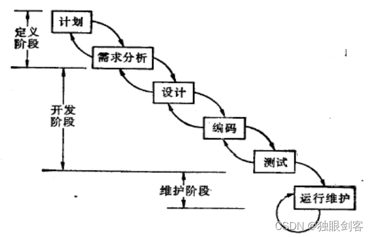
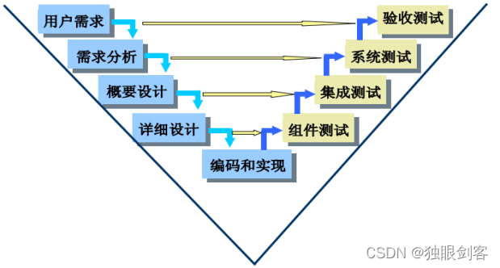
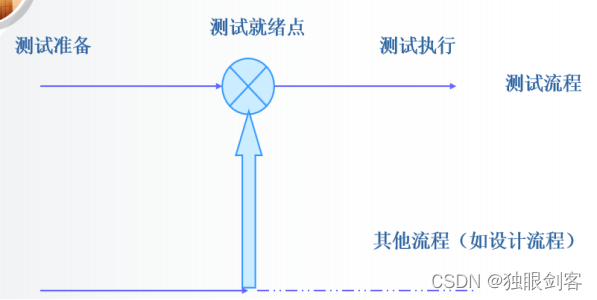
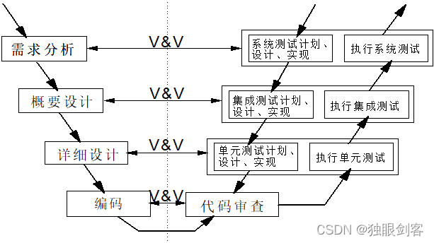

## 第1章 测试基础

### 1.1 软件测试的定义

（1）IEEE：通过人工或者自动化的手段执行某个程序或者运行某个系统的过程，其目的是为了验证符合规定的需求以及发现实际结果和预期结果之间的偏差。

（2）Glenford J.Mayer： 测试是为了发现缺陷，好的测试方案是发现了迄今为止未发现缺陷的方案，成功的测试是发现了迄今为止未发现的缺陷。

### 1.2 测试的目的

***\*（1）证明\****

①60年代

②证明软件可用，能够满足需求

③测试是不能穷尽的，不能百分之百证明软件没有问题

***\*（2）检测\****

①70年代

②发现软件系统的不足，除了功能方面，对其他方面比如性能；易用性可靠性提出更多的要求

③针对不足与问题要做分析

***\*（3）预防\****

①90年代~至今

②全面管理质量，做好预防

③测试工作要尽早

## 第2章 软件生命周期

**计划--》需求分析--》设计--》编码实现--》测试--》运行与维护--》评价**

## 第3章 软件的开发过程

### 3.1 软件开发模型

（1） 顺序开发模型

​    ①瀑布模型

​    ②V模型

（2）迭代-增量开发模型

   ①螺旋模型

   ②RUP模型

   ③IPPD模型

## 第4章 常用的测试术语

​    ①测试用例

​    ②缺陷

​    

## 第5章 软件测试流程

### 5.1 单元测试

（1）概念

针对组成软件系统的最基本的单位（**函数或者类**）进行测试，叫做单元测试，也称组件测试。

（2）测试依据

详细设计说明书（LLD）

（3）方法

白盒测试方法为主

（4）考察基准

逻辑覆盖率

（5）英文

Unit Testing（UT）或Component Testing（组件测试）

（6）补充

孤立的测试策略：自顶向下，自底向上

### 5.2 集成测试

（1）概念

将测试完成的单元进行组装，或者将组装好的模块集成为系统，叫做集成测试。

（2）测试依据

概要设计说明书（HLD）

（3）方法

灰盒（黑盒+白盒）测试方法为主

（4）考察基准

接口覆盖率

（5）英文

Integration Testing（IT）

（6）补充

大爆炸集成，自顶向下，自底向上，三明治集成

### 5.3 系统测试

（1）概念

将组装完成的软件系统作为一个元素和其他软件或者硬件系统集成在一起的测试，叫做系统测试。

（2）测试依据

软件需求规格说明书（SRS）

（3）方法

黑盒测试方法为主

（4）考察基准

需求覆盖率

（5）英文

System Testing（ST）

（6）补充

常见的系统测试类型：功能测试，性能测试，安全测试，易用性测试

### 5.4 验收测试

（1）概念

用户参与的测试叫做验收测试（验收合同或者潜在用户参与的测试）。

（2）依据

验收合同，用户的原始需求

（3）方法

黑盒测试方法

（4）考察基准

原始需求覆盖率

（5）英文

User Acceptance Testing（UAT）

（6）补充

Alpha测试（内测）

潜在用户在开发现场，有开发人员进行记录，整个测试过程可控。

Beta测试（公测）

直接发布到市场，没有开发人员记录，环境比较复杂多样，整个测试过程不可控。

### 5.5 回归测试

（1）概念

执行用例失败而提交了缺陷，针对缺陷修改后再次验证缺陷是否修改正确以及缺陷修改后受到影响的测试用例再次测试；回归测试发生在任何阶段。

（2）流程

①在测试方案中确定回归测试的版本

②等待回归测试版本发布

③回归测试版本发布

④回归测试（按照确定回归测试策略）

（3）策略

完全重复回归测试

选择重复回归测试（周边影响法；指标达成法；覆盖修改法）

## 第6章 软件测试模型

### 6.1 瀑布模型

### 6.2 V模型 

 

### 6.3 H模型 

### 6.4 双V模型（Verification and Validation）

## 第7章 测试活动与规范

### 7.1 测试计划

针对测试阶段做规划：

①时间的安排

②人员安排

③任务的分配

④测试目标的要求

⑤测试范围的划定

⑥测试计划文档（单元测试计划；系统测试计划；集成测试计划；验收测试计划）

### 7.2 测试设计

①针对测试计划给出时间要求，给定的人员要完成分配的测试任务进行各种策略（详细说明怎么做：具体的工具；方法；模板；任务的顺序）

②测试方案文档（单元测试方案；集成测试方案；系统测试方案；验收测试方案）

### 7.3 测试实现

①针对方案中给出如何编写测试用例，编写测试脚本完成测试用例；测试脚本以及测试规程

②测试用例（单元测试用例；集成测试用例；系统测试用例；验收测试用例）

③测试脚本（单元测试脚本；集成测试脚本；系统测试脚本；验收测试脚本）

④测试规程（单元测试规程；集成测试规程；系统测试规程；验收测试规程）

⑤测试规程（Test Procedure）：规定一组测试用例的执行顺序

### 7.4 测试执行

针对计划中安排的测试执行时间、人员、按照方案中给定的环境搭建数据选取等策略，对测试实现中的用例，脚本按照测试规程编排的顺序执行，具体的测试执行工作：

①搭建测试环境

②准备测试数据

③执行测试用例

④记录测试用例执行结果

⑤提交缺陷

⑥跟踪缺陷

⑦回归测试

⑧测试报告

## 第8章 测试方法及分类

### 8.1 黑盒测试和白盒测试

（1）白盒测试（White Box Testing）

①概念：针对软件系统的内部细节做测试，考察内部的逻辑结构，好比盒子是开发的或者透明的，所以叫做白盒测试。（Open Box Testing；Glass Box Testing；Logic Driven Testing）

②白盒的静态测试：控制流分析，数据流分析，信息流分析

③白盒的动态测试：程序插装与逻辑覆盖率

【解析】

程序插装：将测试代码插入到被测试代码，通过运行插入测试代码的程序得出测试结果，查出被测试代码中是否有问题。

逻辑覆盖率：语句覆盖率；判定覆盖率；条件覆盖率；路径覆盖率

④白盒测试特点

优点：问题发生容易定位

​      测试的比较彻底

​      解决问题的成本比较低

缺点：对测试人员的代码能力要求高

​      测试的工作的工作量大

​      测试的成本比较高

​      对规格问题不做验证

（2）黑盒测试（Black Box Testing）

①概念：

针对软件系统的整体规格做测试，看不到内部的细节结构，好比一个黑色的盒子，所以叫黑盒测试

②黑盒的方法

等价类划分法；边界值分析法；判定表法；因果图法；正交实验法；状态迁移图法；流程分析法

③常见的黑盒测试类型

功能测试；性能测试；负载测试；容量测试

④黑盒测试特点

优点：对代码能力要求低，只测试最终的贵，测试效率高，容易理解

缺点：解决问题的成本高，问题定位比较难，不测试软件系统内部细节逻辑结果，对软件需求规格说明书的要求比较高

（3）灰盒测试

①概念：综合运用黑盒测试与白盒测试，灰度取决于被测试对象的颗粒度

### 8.2 静态测试和动态测试

（1）静态测试

①概念

被测试对象没有被运行（比如代码的编译，文档的评审），主要是针对软件生产过程中的中间产品

②自动化手段（静态分析，语法分析，符号执行）

③人工手段（评审：代码走读；设计文档技术评审；需求规格说明书的正规检视）

④正规检视：必须严格遵守流程规范（角色分配；活动安排），目的是为了发现缺陷

⑤技术评审：对技术文档进行评估，选择方案

⑥走读：形式比较随意，作者自己讲解，目的是为了发现缺陷，同时可以交流学习

（2）动态测试

概念：被测试对象被运行

### 8.3 自动化测试和人工测试

（1）人工测试

需要智能的，执行一次的

（2）自动化测试

机械的重复的，不需要智能的，人工无法完成的（大并发量，查看微妙级的时间相应的）

## 第9章 软件质量

### 9.1 软件质量的概念

软件这类产品基于软件特性的满足条件（ISO9126）

### 9.2 软件质量铁三角

（1）流程

为生产某个产品而进行的一系列相关联的活动，将最终目标分解到各个活动使得整个生产过程可见

（2）技术

①技术本身

②技术人才

③工作经验

④专利

⑤案例库开发技术

⑥黑盒测试技术

⑦白盒测试技术

⑧自动化技术

⑨测试分析技术

⑩测试设计技术

（3）组织

间接影响软件质量

①对流程：引进流程；按照流程执行；监督流程；改进流程

②对技术：引进新技术；购买设备仪器；吸引技术人才；案例库；专利的申请

### 9.3 件质量模型

***\*（1）功能性\****

| 子特性     | 说明                                                         | 举例                                                         |

| ---------- | ------------------------------------------------------------ | ------------------------------------------------------------ |

| 适合性     | 软件系统应该具备的功能是否有缺失以及是否做了额外的实现（功能少了吗，多了吗（画蛇添足）） | ATM自动存取款机：存款；取款；转账；查询。缺失：只做了存款取款和查询。额外的实现：存款；取款；转账；查询；天气预报。 |

| 准确性     | 软件系统的功能对数据处理的精准能力（对不对）                 | ATM自动存取款机：存款（20,000RMB，每次最多100张面值100的RMB）；取款（20,000RMB，每次最多3,000RMB，每天最多8次）；转账（同行同地转账50,000RMB）；查询（每天查询8次）。存款（最多50张100RMB）；取款；转账；查询 |

| 互操作性   | 软件系统和其他软件硬件的交互能力。                           | 微信的聊天可以发送图片（相册）；饿了么点外卖支付（支付宝；微信）；图形处理软件中的图片传送到手机。 |

| 安全保密性 | 信息安全（1.防止未被授权用户访问到未被授权信息；2.保证被授权用户能够访问到授权的信息） | 微信付账指纹（你的指纹可以确认付款；防止其他人的指纹确认付款）；银行转账50万元RMB（允许本人当天转账50万元RMB；防止其他人转你银行的账） |

| 功能依从性 |                                                              |                                                              |

***\*（2）可靠性\**** 

| 子特性     | 说明                             | 举例                             |

| ---------- | -------------------------------- | -------------------------------- |

| 成熟性     | 内部存在的问题比较少             | 微信运行一年不闪退。             |

| 容错性     | 外部的异常操作，攻击的处理能力。 | 微信朋友圈每次试图添加十张图片。 |

| 易恢复性   | 对问题进行处理恢复正常的能力。   | 重启APP；重新启动操作系统。      |

| 可靠依从性 |                                  |                                  |

***\*（3）效率\**** 

| 子特性     | 说明                                     | 举例                        |

| ---------- | ---------------------------------------- | --------------------------- |

| 时间       | 软件系统的某个功能运行的响应时间。       | ATM机群看5，000RMB3秒吐出； |

| 资源       | 软件系统运行或者某个功能运行资源占有率。 |                             |

| 效率依从性 |                                          |                             |

 ***\*（4）易用性\****

| 子特性     | 说明                                     | 举例                                  |

| ---------- | ---------------------------------------- | ------------------------------------- |

| 易理解性   | 使用控件资源都一致，提示信息框没有误解。 | 快捷键；提示信息；Tooltip（工具贴士） |

| 易学性     | 提供软件系统学习的资料。                 | 帮助手册；用户手册；操作向导          |

| 易操作性   | 软件系统操作的步骤简单不繁琐。           | 苹果手机铃声设置                      |

| 易吸引性   | 吸引用户的能力                           | 标题党；                              |

| 易用依从性 |                                          |                                       |

 ***\*（5）可移植性\****

| 子特性       | 说明                                                         | 举例                                                         |

| ------------ | ------------------------------------------------------------ | ------------------------------------------------------------ |

| 适应性       | 软件系统对不同环境的适应能力，环境发生变化对软件的修改比较少。 | 微信可以Andriod系统；IOS；Windows都可用。可以在不同版本的Andriod；IOS；Windows下可用。 |

| 易安装性     | 软件系统的安装步骤简单，能够在不同环境下进行安装，不需要做过多的安装配置。（卸载） | 手机App。                                                    |

| 易替换性     | 软件系统的升级、更新和打补丁。                               | 手机APP。                                                    |

| 共存性       | 在同一个环境下，类似软件共存的能力不能相互影响和抵制。       | 360和腾讯浏览器。                                            |

| 可移植依从性 |                                                              |                                                              |

 ***\*（6）可维护性\****

| 子特性       | 说明                                                 | 举例                                                  |

| ------------ | ---------------------------------------------------- | ----------------------------------------------------- |

| 易分析性     | 出现缺陷或者bug，能够分析出来缺陷产生的原因。        | 注释行                                                |

| 易改变性     | 缺陷发生后有解决缺陷的方案。                         | 教学管理系统报表出错，找不到合适的解决方案。          |

| 稳定性       | 对缺陷修复之后造成的影响有多大。                     | 代码的耦合度要低                                      |

| 易测试性     | 能够被量化，能够编写测试用例，有能够确定的输入数据。 | ATM自动存取款机：存款一定金额；取款允许范围内的金额； |

| 可维护依从性 |                                                      |                                                       |

***\*（7）依从性\****

对国家法律、行业法规、企业内部规则的遵守

